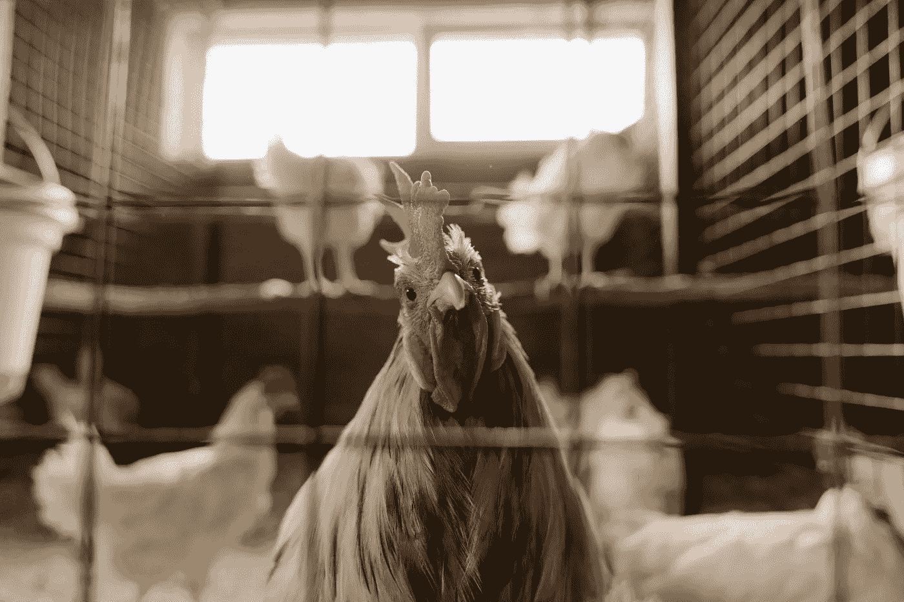

# 办公室往往是管理层的避风港

> 原文：<https://medium.com/codex/offices-are-too-often-a-safe-haven-for-management-6cd8a5f1e0d9?source=collection_archive---------3----------------------->

在潮湿黑暗的角落里，霉菌滋生并不知不觉地毒害着一切。

来自 [Pexels](https://www.pexels.com/photo/white-and-brown-rooster-in-cage-4911708/?utm_content=attributionCopyText&utm_medium=referral&utm_source=pexels) 的 [cottonbro](https://www.pexels.com/@cottonbro?utm_content=attributionCopyText&utm_medium=referral&utm_source=pexels) 摄影

# 灌输入门

随着[大辞职](https://en.wikipedia.org/wiki/Great_Resignation)继续在世界各地的工作场所上演，从零售到企业银行，是时候揭示一个与办公室工作有关的最隐蔽、最少被谈论的因素了。