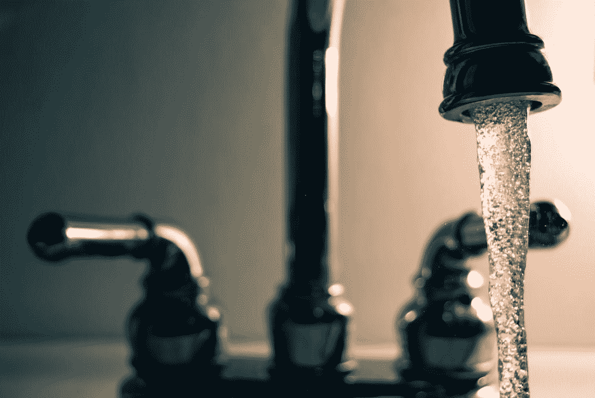

# 好吧，科特林流很酷

> 原文：<https://medium.com/codex/ok-kotlin-flows-are-cool-679cfa97a6ff?source=collection_archive---------0----------------------->

*免责声明:所有观点都是我自己的*

[照片](https://www.pexels.com/photo/stainless-faucet-861414/)来自 Pexels 的斯蒂夫·约翰森

完全透明我基本上是在浏览[科特林流程指南](https://kotlinlang.org/docs/flow.html#flows)，并添加我用来测试的模块。

如果你想亲自尝试这些，去科特林游乐场试试吧！

但是这些很酷！解锁我已经争论了一段时间的其他帖子，我认为这些帖子很酷。