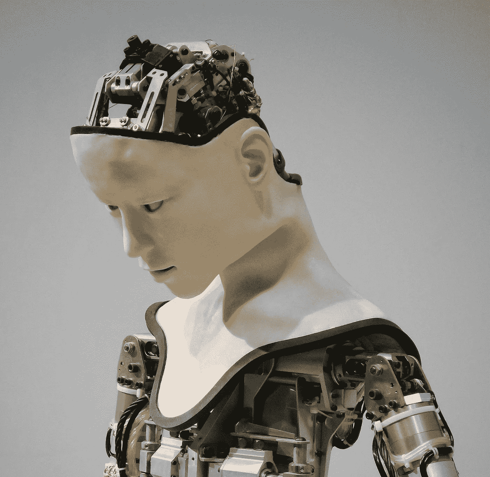

# AI 生成的内容会取代人类创造的内容吗？

> 原文：<https://medium.com/codex/on-ai-generated-content-eaf0dd9b382c?source=collection_archive---------29----------------------->

照片由 Unsplash 上的附身摄影提供

现在是 2036 年。我的客户让我写一篇关于仿生假肢的负面影响的博客。两天后就是最后期限了。但是我对这个话题一无所知。因此，我登录到我的人工智能内容生成器工具，并要求一篇 500 字的文章。

该工具总结了这个主题:什么是仿生假肢，它是如何使用的，以及它可能如何影响你的健康。现在，我有了我要写什么的想法。感谢最后提供的资料，我也可以开始自己的研究了。如今，内容生成器更像是一个搜索引擎。他们在互联网上搜索信息，以论文的形式总结他们对某个主题的发现。

当然，这是我对人工智能内容未来的预测。

我不认为人工智能会取代人类创造的内容。并不是说它不能这样做。我相信会有非常聪明的人工智能，它们可能会自己写小说或非小说类的书。但问题是我们不需要他们这么做。

当然，如果人工智能生成的内容为我的笔记本电脑上的软件问题提供了解决方案，或者根据统计数据策划了一份最佳 NBA 球员名单，我也不会介意。但我不想在旅游、食谱或关系博客上阅读人工智能生成的内容。

如果在人和计算机之间交谈，特定的话题是没有价值的。爱情、梦想、性、野心、友谊、创伤和抑郁，仅举几例。(这类话题我不要一个 AI 的建议)。

AI 不会取代人类内容创作者的其他原因。

# 人类创造；助理牧师

几天前，我读到了尤金·赫里格尔的故事，他是一位德国教授，在 20 世纪 20 年代移居日本。他的最终目标是加深对日本文化的理解。因此，他开始在 Kyudo 训练，这是一种射箭技术。但在最初的四年里，他的主人要求他向仅七英尺远的一卷稻草射击。据欧根说，这是一次令人沮丧的经历。

但他把这一点写进了一本引人入胜的书《射箭艺术中的禅》，解释了如何完善你的心态并专注于手头的任务会让你战无不胜。

人工智能也能做到吗？

当然，人工智能可以总结 20 世纪 20 年代在日本发生的事情，或者尤金·赫里格尔如何在多年的疲惫训练后掌握射箭艺术。但是它能创造出如此新颖的东西吗？我怀疑。人工智能策划内容；它并没有创造它。

# 人工智能很聪明，但人类是有创造力的

人工智能工具已经变得如此聪明，可以愚弄你。他们可以复制人类所谓的“创造力”但是人工智能不太可能作为意识的副产品实现创造力。

想想吧。你愿意为软件创作的数字艺术支付多少钱？被编程用来创造艺术的人工智能是真正的艺术家吗？你应该表扬这个工具还是它的开发者？

# 人类行动；人工智能反应

没有人告诉欧内斯特·海明威写一本关于一个被困在海里的老渔夫的书。但他还是做了。没有人强迫达芬奇画蒙娜丽莎。这个想法是他自己想出来的，也是他一个人做的。

但是对于人工智能，你必须给它编程来完成某些任务。假设你想创造一个独立思考的人工智能。好吧，你需要做的第一件事就是弄清楚如何以这种方式编程。换句话说，你必须告诉你的 AI 根据你写的代码独立思考。

当然，编程工具并没有什么特别的问题。但我不认为很多人会喜欢阅读由人工智能编写的浪漫小说——除非是出于好奇。整个想法听起来很天真。

# 人工智能生成的内容将继续存在

缺乏自由意志和创造力可能是人工智能的一些最重要的弱点，这些弱点阻止他们创造高质量的内容。但是，即使你将它们编程为具有创造性和独立性，它们仍然无法创造出可以取代人类作品的内容。

重点是人工智能试图复制人类的大脑；这不是人脑。

但我也相信，人工智能生成的内容将成为互联网的关键。它可以为我们提供高质量的精选内容，特别是以操作方法、列表和信息性文章的形式。

不过，你不必担心它会取代你作为作家的工作。这个世界永远需要你的创造力和独特性。