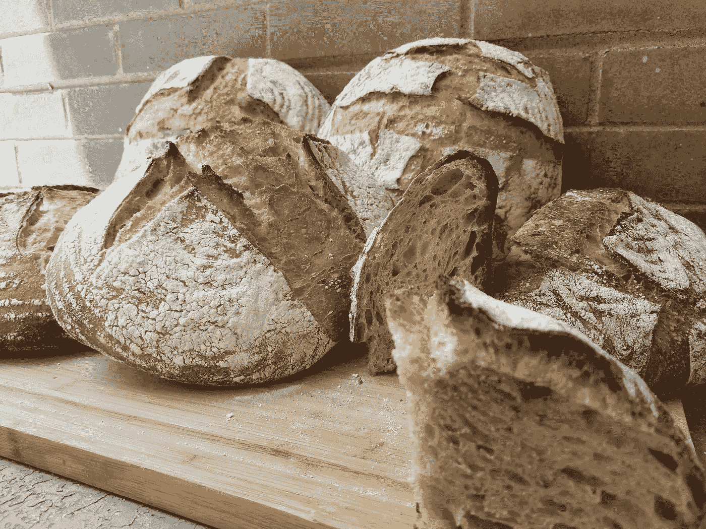
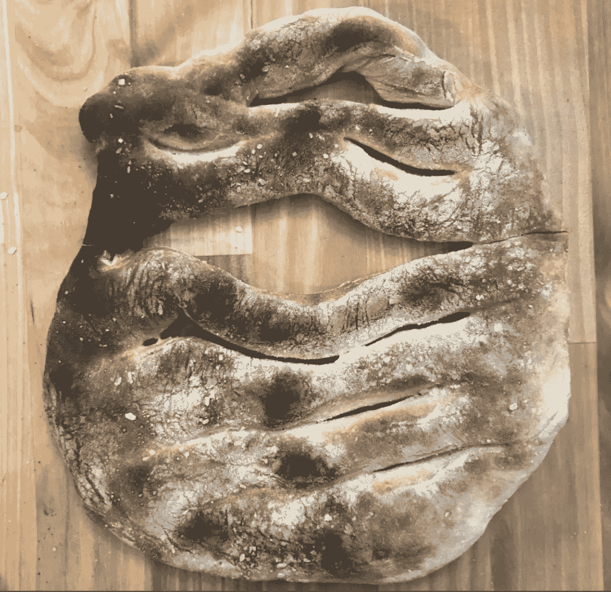
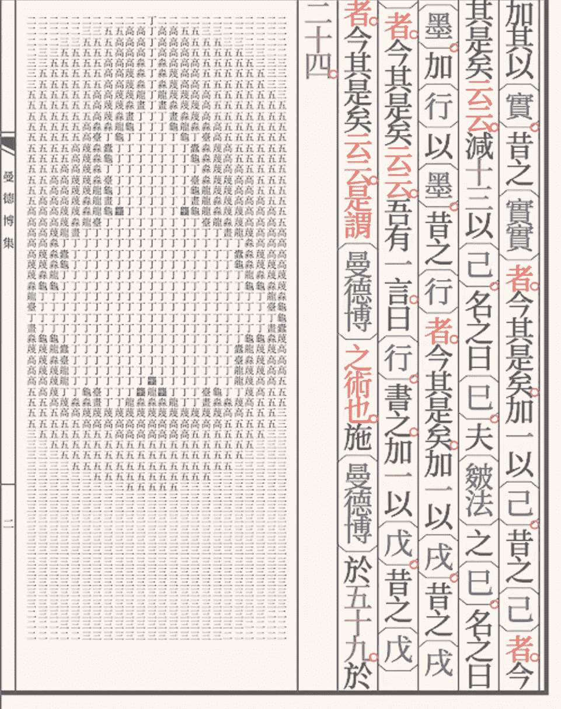
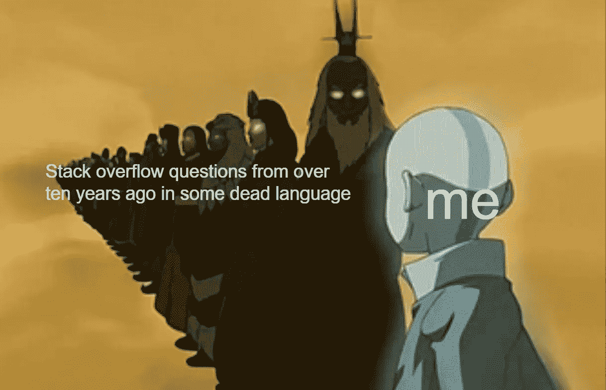
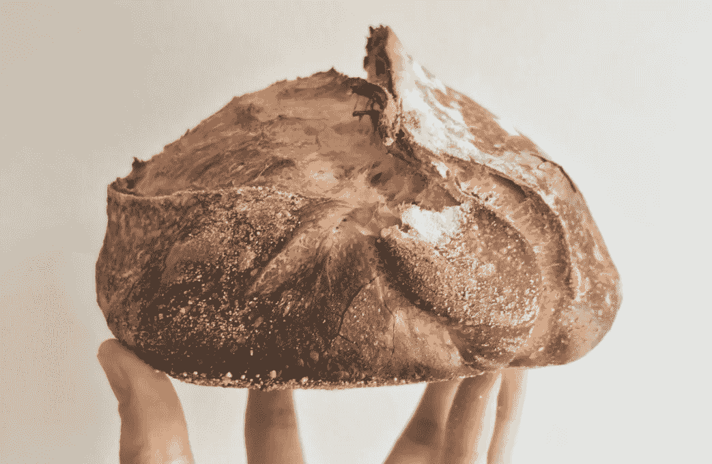

# 面包烘烤与代码制作

> 原文：<https://medium.com/codex/on-baking-bread-and-crafting-code-5db64bdd4f74?source=collection_archive---------2----------------------->

## 我的面包师与计算机对话的方法

面包师的手艺

# 揉捏代码

当我开始编码的时候，我可以读和写，但我不能用它来表达自己。忘记制作我喜欢的酷的艺术作品或电子游戏吧——我甚至不知道自己在做什么。我觉得自己被自己写的代码束缚住了。我在用数字画画。代码对我来说根本不是一种创造性的媒介。我认为代码是敷衍了事的:我是为了一个特定的目的而编码，如果代码不为这个目的服务，那么我就不会成功。代码语言不断地让我觉得它在把我推开。我需要改变，特别是因为我计划做更多的代码。

这种改变来自最意想不到的地方:我的烤面包爱好。我做烘焙已经十年了，对这门手艺有很深的了解。这是如此深刻地体现在我身上，以至于这些天我经常自由发挥我的面包，没有食谱，也没有测量。我只是凭直觉根据我的感觉判断面包应该是什么样的。我想在我的代码中感受那种程度的控制和表达:我想要揉面赋予我的那种控制感。所以有一天，我开始像做面包一样去研究代码。从那以后我再也没有回头。

这当然有助于我获得设计和技术学位所需的代码。

我将在这里与你分享的是我从把我的代码当作面包来对待中学到的三大经验。每当我坐下来写代码时，这些提示都会帮助我。他们让工作变得更加平易近人，易于管理，简而言之，从一开始就是可能的。我希望他们提供一些思考代码的新方法。

# 第一课:还是面包！

一个“失败”的面包，味道仍然很好，看起来也很可爱

烤面包是一种只有成功的实践。正如爱迪生说他学会了 700 种不做灯泡的方法，面包也是如此。除了做面包，我还能做面包。我不能失败。我确实总是在不同程度上成功。失败的自制面包仍然是自制面包，而且仍然比你可能买到的许多种类的面包要好。它是“静止的面包”而且它肯定比一个坏掉的灯泡更好吃。

当面包没有变成我想要的样子时，我必须做出调整。我学会更好地理解它。这总是一个胜利。实事求是地说，在面包方面，我总是在这里或那里做一些小的调整，以使最终结果变成我想要的样子。这里的面粉多，那里的盐少，那里的温度高，也许比例会降低一个百分点。当面包出乎意料时，我的努力让我发现面包应该如何表达。面包不会失败:我只是学习新的表达方式。

像面包师一样编码也意味着在代码中接受这个事实。编程中的错误消息坚持认为有一些代码是坏的或错误的。我写的东西不知何故破碎了，也许在某些方面是这样，但我忽略了这一点。我在代码中输入的每一行和每一个字母都是成功的，因为每一行和每一个字母都表达了我自己。重要的是，这让我将最终产品与对代码实践的奉献分开。作为一名面包师，我从事于制作面包，因此作为一名程序员，我致力于编写代码。不管我能写多长时间的代码，我都会成功地编码。一条错误消息不会抹去我的努力。

# 第二课:像面包一样，代码是有生命的

发酵剂中的酵母活性。

面包总是成功的，因为活酵母负责大部分工作。

混合物中的微生物，经过足够的时间，将原料转化成面团，制成面包。酵母自然消耗淀粉，将面粉转化成富含面筋的混合物。这需要时间和细心，但实际上是一个自然的过程。当面粉、水、盐和酵母接触时，酵母和其他微生物开始制作面包。酵母是一种在面包中生长和进化的生物。转变面团是他们应该做的，他们比我更应该对面包的质量负责。

那么，我的角色就是引导这个过程。我确保温度和纹理是正确的，我推推搡搡，以确保事情处于正确的平衡，我做出上述调整。这是一个“共同设计”的过程。我不是自己做，我是在做一件有意图的活的东西。我用酵母做面包。

中文编程语言燕文·朗【https://wy-lang.org/ 

在编程语言中，没有微生物。然而，我仍然发现这种合作设计的观点是无价的。代码和语言不是由化学连锁反应驱动的。然而，这并不意味着代码没有意图。像酵母一样，代码中充满了它们。

这些意图影响了我的代码。它们是代码中语言、上下文、词汇和语法的选择。他们塑造了它的外观和它能生产什么。了解和承认这些意图有助于我解决编码时出现的问题。我拒绝问“我在编码什么？”而是认识到“我的代码想做什么？我能帮它做到吗？我想吗？”我的代码是所有代码项目中被选中的合作伙伴。我的电子游戏是由我、C#和 Unity 制作的。我的视觉作品是 Javascript 和处理的我。正如我的面包承载着酵母和我的工作，我的代码承载着它自己和我。

充满创意，永不中断，我们可以理解代码总是在工作。即使它说它不是。所有那些错误和异常，那些让我们呆在电脑前的事情，都是代码在向我们反馈我们的工作。它们是地下生活沸腾的证据，暗示我们应该如何调整。当代码还活着的时候，学会倾听代码是如何说话的使我们能够前进。

# 第三课:你并不孤单

感谢所有在我之前奋斗的编码人。来自《最后的气宗》的原始图像

比我烘烤时酵母陪伴我更多。在我之前来的面包师指导我的手，创造技术，使我能够在我面前制作面包，最终，我把我自己的想法和技术传递给下一个面包师。这是一种文化实践，意味着我通过它与文化联系在一起。这些过去和未来的面包师都体现在我的烘焙中。

知道烘焙是一种悠久的文化习俗让我放心，我不必独自从事我的手艺。我所面临的问题是许多在我之前的人所共有的。因为，从根本上说，没有人在发明“新”面包。我们所做的是用新的方法制作面包。因此，虽然做面包的挑战和以前一样，但我烘焙面包的环境和多年前的法国人不一样了。如果我接受他们的背景不同并适应它，他们的工作和方法可能对我有用。这种适应是面包师的工作:面对今天制作面包的挑战。这是我看待代码的最重要的变化——不是作为一种制作软件程序的手段，而是作为一种用代码创造的文化实践。

我要写的代码不是新的。以前做过的事情变成了我们的优势。这意味着我利用旧的解决方案，并对它们进行调整，就像我今天做面包一样。

视频游戏编程中最常见的挑战之一是冲突处理。某物在另一物之上吗？我的鼠标光标是否在按钮上对齐？我的目标就位了吗？这是一个非常常见的问题，在我之前，很多人都曾提出过这个问题。有完整的库被设计来处理这个主题，但是我经常发现自己需要一个定制的解决方案。我的角色不是变出一套全新的解决方案，而是构建一套适合我需求的解决方案。我研究可用的解决方案，并综合我自己的解决方案。我会为自己借鉴过去和其他人的代码，这是有道理的。共同的问题意味着我有共同的解决方案。

我的代码受过去的程序员的启发，并在现在实现，以处理我版本的问题。我的代码实践被加了回来，成为将来一些其他程序员的过去的解决方案。

我从不独自编码。代码的全部历史就在我的背后，等待探索。

# 手工代码

一块精心制作的面包，就像代码一样的文化产品

这些教训来自于我加入面包制作社团的积极经历。面包制作工艺的文化是由吃、制作和谈论面包的生活实践定义的。我们面对挑战的方式将我们团结在一起，共同探索创造美味的面包。我们对共同目标的努力定义了我们的社区。

那么，编码社区的共同目标是什么呢？是做软件产品吗？生成艺术？我认为它比那更简单。共同的目标仅仅是向计算机表达我们自己的挑战。

代码世界充满了试图将他们的想法转化成数据库、可执行程序、函数、变量甚至整个计算语言的人。他们为实现这一目标所做的努力为社区讨论创造了空间。通过分享他们的实践，社区得到了体现和加强。

通过分享我的经验，我希望能增加代码的实用性。我对计算机科学和软件产品的编码方法感到厌烦。我拒绝了它，并找到了我的面包启发方法作为回应。通过将我自己的个人经验应用到代码中，我发现了一种方法，这种方法使我能够整合编码的历史和文化。现在，你也可以试试这个。

除了分享我自己在代码方面的经验和观点之外，我希望这个讨论能够激发你开始思考用新的方式编码的想法。虽然对我来说，把代码想象成面包是一种生产方式，但我感觉到的授权证明了对其他方法的需求。

如果你和我一样，对感觉不可避免的代码风格感到厌恶，也许你会喜欢我的面包启发方法。又或许你会带来自己的视角，创造出自己的风格。你们这些新的程序员将会在代码社区中发现自己的代码和手艺。

就像任何一条面包一样，一定要分享。

> 这篇文章最初写于 2021 年 4 月，是为帕森斯设计学院辛欣和肖内·米凯莱恩·霍洛威教授的*代码，非殖民化*课程而写的

# 阅读更多

[深奥的代码](http://esoteric.codes)一个在代码文本中涵盖自我表达的网站
代码的艺术 Dylan Beattie(摇滚明星语言的创造者)的演讲
[10 印刷](https://10print.org/)一本关于单行代码的书
[教导超越](https://www.amazon.com/Teaching-Transgress-Education-Practice-Translation/dp/0415908086)一本关于用铃铛钩子实践自由的书