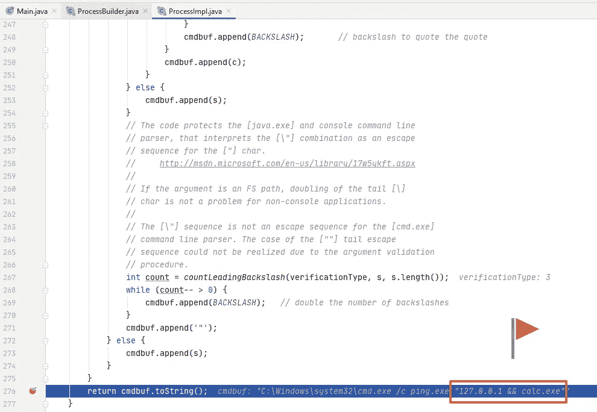

# 基于 Java process builder 的命令注入研究

> 原文：<https://medium.com/codex/on-command-injection-over-javas-processbuilder-8d9f833c808c?source=collection_archive---------1----------------------->

## 一个示例代码的安全性分析

ProcessBuilder 是一个用于创建操作系统进程的 Java 类。因此，不用说，如果编码不安全，就会导致严重的安全风险。在本帖中，我们将回顾一个利用 ProcessBuilder 的示例代码块，并通过分析揭示一些安全代码的最佳和不良实践。


API 为开发人员提供了巨大的力量。但是，很容易毁了一切。*

所以，事不宜迟，下面是代码块；

```
String path = "C:\\Windows\\system32\\cmd.exe";ProcessBuilder pb = new ProcessBuilder(path);
pb.command().add("/c");
pb.command().add("ping.exe");
pb.command().add(**userInput**);Process pingProcess = pb.start();
```

让我们阅读并评论这段简单的代码。它将用户输入(user input)作为参数，并使用它执行 ping 命令。

让我们看看 Windows 帮助文档是如何讲述给予 cmd.exe 的 **/c** 选项的；

> 执行字符串指定的命令，然后终止。

太酷了。在 JDK 5.0 之前，同样的东西，流行的编码方式是这样的；

```
process = Runtime.*getRuntime*().exec(path + " /c ping.exe " + userInput);
```

只看这两段代码，我们可以很容易地将第二段代码与内联 SQL 查询执行 API 相类似，而第一段代码更像是用 PreparedStatement 的方式来做同样的事情。

我们知道，与动态 SQL 构造和执行相比，预处理语句或绑定变量是执行 SQL 查询的安全方式。这是生死攸关的情况，尤其是涉及到用户输入时。

# 代码的安全性分析

那么，第一个代码安全吗？或者让我换个说法。如果一个恶意用户可以操纵 *userInput* 变量的内容，他有可能执行一个随机的操作系统命令吗？在可能的情况下，这被称为命令注入，这是一个流行且严重的安全弱点。

嗯，我喜欢动态测试的一点是，你总是可以向运行的目标代码块提供危险和智能的字符串，并检查响应。让我们列出一些测试人员可以使用的字符串，以便了解原始代码是否会导致运行 Windows calculator 可执行文件。

```
127.0.0.1 && calc.exe
127.0.0.1 & calc.exe
127.0.0.1 | calc.exe
127.0.0.1 || calc.exe
127.0.0.1 > calc.exe
```

但我不喜欢动态测试的是，当所有这些模糊不清的东西都毫无结果时，这真的意味着我们是安全的吗？

在大多数情况下，同样的问题对于静态测试也是有效的，但是这次不行，因为在构建要执行的命令时没有动态字符串连接。然而，这真的意味着我们是安全的吗？

我几乎不这么认为…

# 为什么我们的代码不受命令注入的影响？

我们先来看看为什么不能通过这段代码运行 Windows calculator。

为了理解为什么，我们不得不钻研 Java 的 ProcessBuilder 的源代码。这是一项有些乏味的工作，然而，它可以归结为以下几点:

```
for (int i = 1; i < cmd.length; ++i) {
    cmdbuf.append(' ');
    String s = cmd[i];
    if (*needsEscaping*(verificationType, s)) {
       **cmdbuf.append('"');
    ...**
```

这里，Java 代码将**双引号**附加到一个数组元素，如果它包含一个空格。我这里说的数组的元素是；

```
[0] -> C:\\Windows\\system32\\cmd.exe
[1] -> /c
[2] -> ping.exe
[3] -> userInput
```

当 *userInput* 包含空格时，代码将其用双引号括起来，有效地对其进行了转义，这样它就不会对 ping.exe 进行转义:)因此，最后一个数组项“127.0.0.1 & & calc.exe”将作为一个整体参数传递给 ping.exe。

下面是我们调试带有恶意输入的代码并查看数组的 toString 版本的值时的屏幕截图。



双引号用户输入，这意味着它将始终作为 ping.exe 的参数执行。

当然，ProcessBuilder 中应用的控件不止一个，但这一个就足够我们理解了。

虽然在这里不可能通过 cmd.exe 注入命令，但是仍然有可能通过 ping.exe 导致该代码恶意运行。例如，黑客可以提供像“-n 1000”这样的输入，以便命令运行相当长的时间，这可能会导致拒绝服务的情况。

顺便说一下，ping 的-n 参数是“要发送的回送请求的数量”。这里有一个模拟，当提供更高的 n 数时，显然需要相当长的时间才能完成。

```
C:\Users\CodeThreat>ping.exe -n 1000 127.0.0.1Pinging 127.0.0.1 with 32 bytes of data:
Reply from 127.0.0.1: bytes=32 time<1ms TTL=128
Reply from 127.0.0.1: bytes=32 time<1ms TTL=128
Reply from 127.0.0.1: bytes=32 time<1ms TTL=128
Reply from 127.0.0.1: bytes=32 time<1ms TTL=128
Reply from 127.0.0.1: bytes=32 time<1ms TTL=128
Reply from 127.0.0.1: bytes=32 time<1ms TTL=128
Reply from 127.0.0.1: bytes=32 time<1ms TTL=128
...
```

> 顺便提一下，即使我们在代码中将一些默认的硬编码参数传递给 ping.exe，恶意的用户输入也可能会覆盖这些参数并带来风险。这很像 HTTP 参数污染弱点。

# 那么 ProcessBuilder 是一个安全的 API 吗？

这是值得思考的问题。我们有没有可能用 ProcessBuilder 写一个不安全的代码？我总是惊讶于我们开发人员如何找到使用相当不错的 API 编写不安全代码的方法。

所以，我们当然可以！在这里。

```
String path = "C:\\Windows\\system32\\cmd.exe";pb = new ProcessBuilder(path, "/c", "ping.exe " + userInput);Process pingProcess = pb.start();
```

这一次，Windows 计算器开始工作，因为最后一个数组项变成了整个命令“ping.exe 127.0.0.1 && calc.exe”。上面显示的 Java 源代码会用双引号引起来，shell 会很好地解释它。

这不是唯一的方法。这里还有一个，但这次不那么明显；

```
String path = "C:\\Windows\\system32\\cmd.exe";ProcessBuilder pb = new ProcessBuilder(path);
pb.command().add("/c");
pb.command().add("ping.exe");
pb.command().addAll(Arrays.*asList*(userInput.split("\\s")));Process pingProcess = pb.start();
```

最后一个是杀手。我来让你分析一下为什么没有安全感。

# 那么，如何使用 ProcessBuilder 呢？

在提供 ProcessBuilder 或 Runtime.exec 时，最好不要使用任何 shell 支持，cmd 或 sh 或任何其他解释器。然而，随着应该运行的命令变得越来越复杂，我们倾向于选择复杂的 shell，而不是编写自己的解释器…

为此，ProcessBuilder 提供了一种更细粒度的方法来完成这项任务，然而，正如我们从上面给出的两个例子中可以看到的，编写易受攻击的代码是很容易的。最终，这意味着编写安全代码的责任仍然落在我们的肩上。看看这个[很棒所以回答](https://stackoverflow.com/a/31776547)来理解这个困境。

为了最小化这里的安全风险，我的建议是，一旦我们从信任边界之外获得用户输入，就使用白名单。我特别没有在这里使用“用户”这个词，因为发送这个输入的参与者可能是一个配置文件、一个数据库行或者甚至是一个 B2B web 服务调用的响应字段…

通过应用白名单，我们可以很容易地验证一个 IP 地址，并回避所有模糊的东西，我已经经历了以上！

*   图片由[史蒂夫·比辛尼](https://pixabay.com/users/stevepb-282134/?utm_source=link-attribution&amp;utm_medium=referral&amp;utm_campaign=image&amp;utm_content=583163)拍摄。