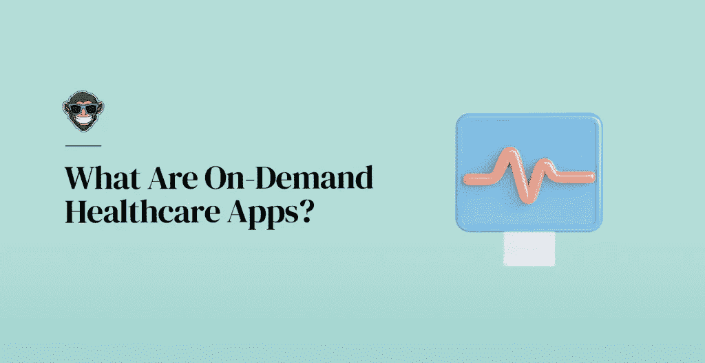
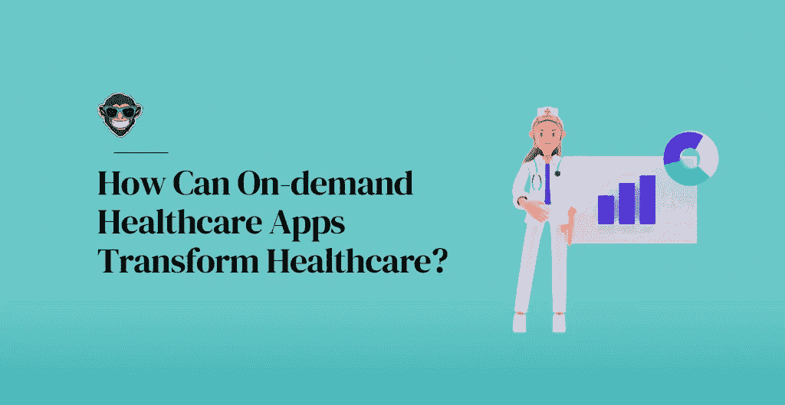
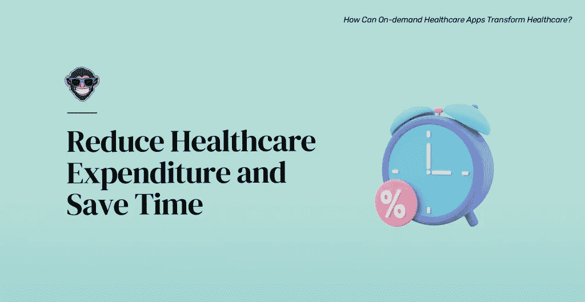
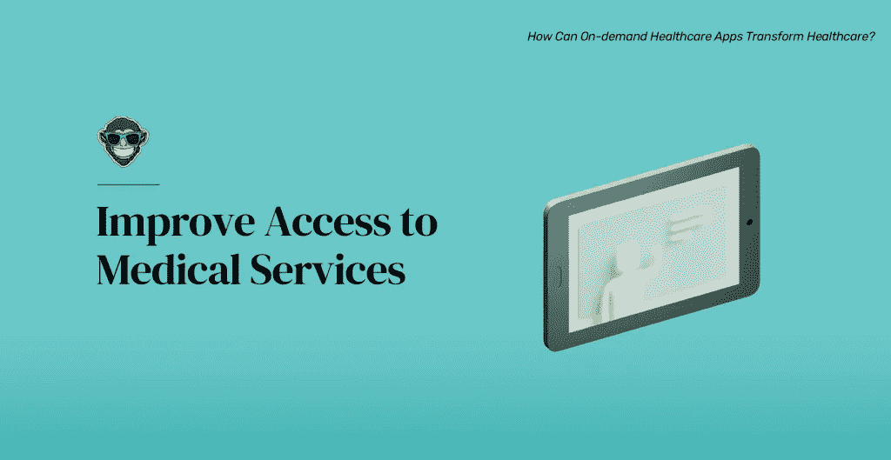
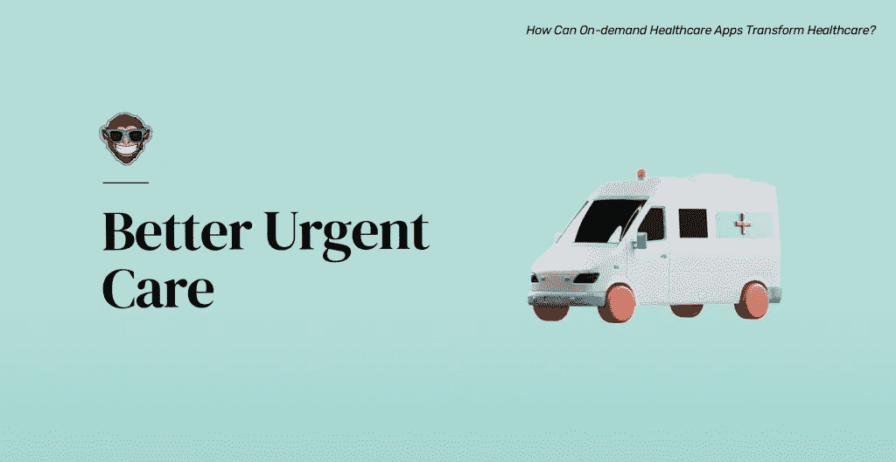
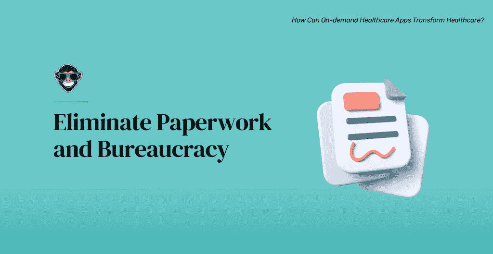
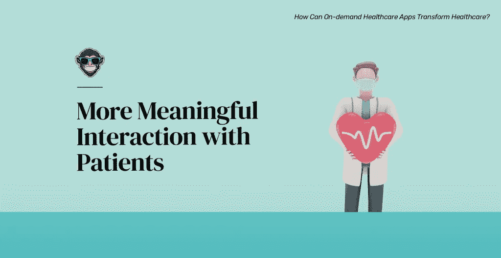
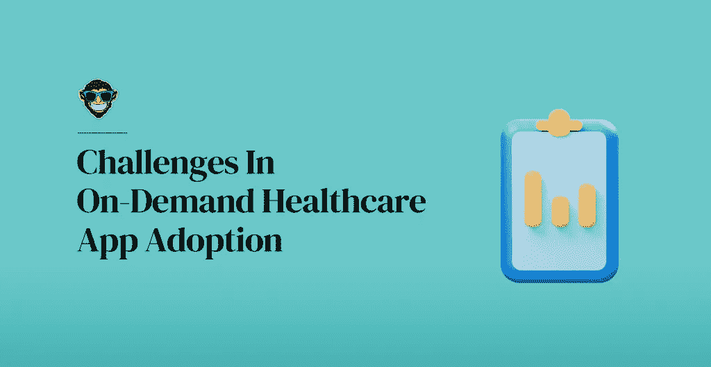
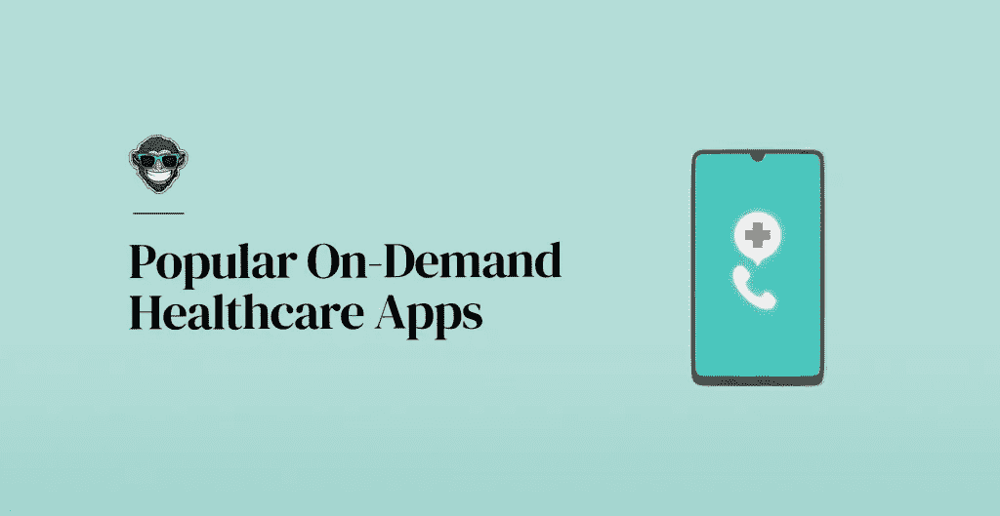
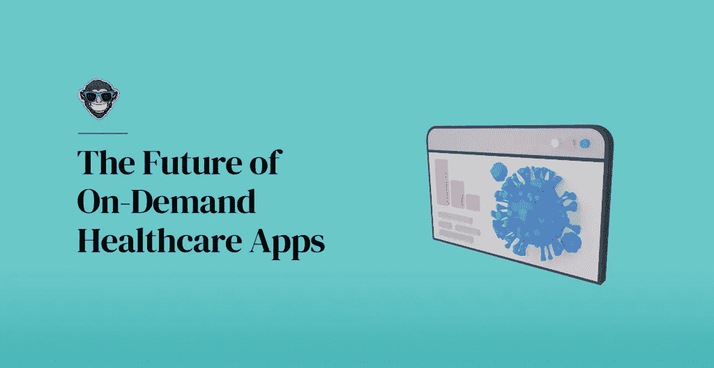

# 按需医疗保健应用:医疗保健革命

> 原文：<https://medium.com/codex/on-demand-healthcare-apps-revolutionizing-healthcare-ac1723f881cf?source=collection_archive---------9----------------------->

## 按需医疗保健应用是快速、高效、经济的医疗保健的新门户。它们正在慢慢扰乱全球医疗保健系统，并推动人们寻求更普遍、更便捷的医疗保健服务。

随着现代移动技术的诞生及其在世界范围内的可用性，全球消费趋势点燃了对商品和服务交付即时性的新需求。用户对他们访问某些服务或购买某些产品的速度和效率的要求越来越高；漫长的等待时间和排队不再是司空见惯的事情，也不再被容忍。因此，许多服务的按需移动应用正在成为创业领域的热门趋势。流行的移动点播应用，如[优步](https://www.uber.com/co/en/)、[邮局](https://postmates.com/)、 [Lyft](https://www.lyft.com/) 和 [Airbnb](https://www.airbnb.com/) 精明地利用了这种对速度的需求，并扰乱了全球市场。按需应用正在帮助各种形状和规模的公司提供更好的客户服务，提高覆盖率和产品可及性，并促进业务增长，所有这些都是以低运营成本实现的。尽管这些流行的点播应用正在扰乱移动市场，但有一个领域正在缓慢但肯定地收获这类应用的好处:医疗保健。按需医疗应用是新的热门应用，必将改变我们获取医疗服务的方式。

尽管尚未被广泛采用或全球可用，但按需医疗应用正在稳步增长，并以优步改变交通服务的方式彻底改变医疗保健。此外，Airbnb 改变了酒店模式。医疗保健行业正在见证按需应用如何帮助患者几乎立即获得医疗服务和临床护理。同样，医疗专业人员和医疗保健机构开始使用由[熟练的医疗保健应用程序开发人员](https://www.foonkiemonkey.co.uk/)开发的不同按需医疗保健应用程序来释放工作量，并为他们的患者提供最好的医疗保健服务。

让我们看看什么是按需医疗保健应用，它们的一些最重要的功能，以及它们如何破坏移动医疗保健生态系统。

# 什么是按需医疗保健应用？

虽然医疗保健是一个至关重要的行业，但当我们谈论采用和实施移动和远程服务时，它在过去几十年中的发展没有其他行业那么快。对于世界上大多数人来说，医疗保健仍然是一种亲临办公室的体验。无论是因为缺乏移动网络，没有在线咨询的可能性，还是仅仅因为对现代技术缺乏信任，大多数患者仍然亲自预约看病，并在办公室和医院等待很长时间才能获得医疗服务。当谈到信任和便利时，仍然有一种普遍的观念，即面对面的医疗保健是王道。然而，现代移动技术正在慢慢潜入人们的生活，并改变这种观念，有利于移动医疗服务。传统医疗正在经历的这种范式转变的副产品之一是按需医疗应用。

按需医疗保健应用程序是患者使用移动设备即时、实时访问在线医疗保健服务的医疗应用程序。这些医疗保健服务的范围从预约到随时随地与医生进行视频咨询。无论医疗保健应用的目的或类型是什么，所有按需医疗保健应用的主要目标都是相同的:帮助患者通过他们的移动设备随时随地快速高效地访问医疗服务。通过这种方式，按需医疗保健应用程序可以使医疗服务随时可用，这也是它们对全球现代医疗保健机构和系统如此有用和重要的原因。这种现象可能会导致患者在家找医生的速度比亲自去看医生更快，并且可以获得医生的评论和评级，所有这些在按需医疗应用程序出现之前都是闻所未闻的。再加上人们喜欢在想要的时候得到他们想要的东西，我们有了一个新的趋势。

按需应用的趋势来的正是时候。除了 covid 完全颠覆了全球医疗保健系统，慢性病也在增加，美国等国家增加了医疗支出，而医生的工作量也在增加。举例来说，截至目前，美国有 3 . 22 亿人口。[根据一项研究，](https://www.statista.com/statistics/209424/us-number-of-active-physicians-by-specialty-area/)目前全国有 552，310 名在职医生。如果我们考虑到 [84.9%的成年人](https://www.cdc.gov/nchs/fastats/physician-visits.htm)在过去的一年中至少看了一次医疗保健专家，我们可以有把握地得出结论，除非我们找到医疗保健服务的其他替代方案，否则医疗保健系统最终将会崩溃。这就是按需医疗应用变得如此重要的地方。现在，患者可以在家里立即看到医生，并有可能远程继续他们的治疗，而不是安排预约、等待空闲时间和亲自看医生。听起来像是祝福，不是吗？以下是按需医疗应用程序变革移动医疗的一些主要方式。

# 按需医疗保健应用如何改变医疗保健？

# 1.减少医疗支出并节省时间

按需医疗应用越来越受欢迎的主要原因是为所有参与者节省时间和金钱。和任何商业类型一样，时间和金钱是决定成功的两个最重要的因素。在医疗保健中，这没有什么不同，但是在医疗保健中，浪费时间会导致生命损失。出于这个原因，按需医疗应用对医疗系统和利益相关者来说都是天赐之物。一方面，对于医院和诊所来说，挤满病人的候诊室、长长的队伍和排满的医生时间表令人沮丧、麻烦、昂贵和耗时。在美国进行的一项调查显示，在大城市，患者平均需要 24 天才能预约到医生，在中小城镇则需要 32 天。

调查还显示，从 2014 年到 2018 年，预约的等待时间增加了 30%。这种现象是有问题的，特别是对于患有慢性疾病并且需要持续监测、紧急护理和立即关注的患者。按需医疗应用程序可以在很大程度上帮助消除这种挫折感，如果是强制性的亲自出诊，可以帮助患者快速预约，如果是远程医疗服务，几乎可以在瞬间看到医生，无需排队和等待时间。这样，患者可以立即高效地获得医疗护理，从而减轻诊所和医院的压力，减轻医生的工作量，并为那些必须亲自看医生的患者腾出时间。

另一方面，患者可以通过使用按需医疗应用程序在家中安排远程医疗预约，从而节省时间和金钱。他们不需要花一整个下午的时间，也不需要请假去看医生。他们也不必花时间去医院或诊所，并可以通过消除交通费用来节省宝贵的资源。因此，患者的整体体验得到了显著改善，特别是对于那些远离医生的患者，或者那些生活在无法获得医疗服务或缺乏医院基础设施的地区的患者。根据按需医疗应用的类型及其提供的服务，需要亲自出诊的患者甚至可以要求医生去他们家，这对医疗专业人员和患者都有好处。

对于医生来说，按需应用意味着能够更好、更快地与患者互动。他们不仅可以提供按需远程咨询服务，腾出时间，还可以使用按需医疗应用程序监控患者。此外，这些应用程序可以使用 [IoMT 设备](https://www.foonkiemonkey.co.uk/the-impact-of-iomt-in-the-mobile-healthcare-space/)或其他智能医疗设备来捕捉和分析患者数据，患者可以在家中使用这些设备，医生也可以查看这些设备。按需医疗保健应用提供的这些功能转化为更好的医疗保健服务。此外，它们可能意味着全球医疗系统目前面临的大部分压力有可能得到释放。

# 2.改善获得医疗服务的机会

按需医疗应用的本质是它们是移动的。这一重要方面使它们易于使用和访问，为任何拥有互联网连接设备的人带来好处。同样，截至 2021 年 6 月，全球有[52.8 亿](https://www.bankmycell.com/blog/how-many-phones-are-in-the-world)移动设备用户，这意味着全球近 70%的人口有可能访问按需医疗应用。此外，大约[地球上 60%的人](https://www.statista.com/statistics/617136/digital-population-worldwide/#:~:text=How%20many%20people%20use%20the,the%20internet%20via%20mobile%20devices.)可以持续访问活跃的互联网连接。相比之下，不到一半的世界人口可以获得基本的医疗服务，这让我们认为更多的人可以访问按需医疗应用程序，而不是面对面的医疗服务。

即使人们生活在没有像样的医疗基础设施或医生的国家，他们仍然可以使用按需医疗应用程序在线访问医疗服务。比如，美国的医生可以为坦桑尼亚的患者进行实时在线咨询，监控他们的健康状况，开出药物处方，并建议治疗途径，否则这些治疗途径是不可能——或更难——亲自获得的。这将显著改善医疗系统不完善地区的医疗服务可及性，并改善全球患者的结果，无论他们居住在哪里。

此外，按需医疗保健应用程序可以支持扩大医疗专业产品的范围，这有助于解决世界许多地区的医疗服务提供商短缺问题。例如，56%的美国县缺乏心理健康专家，大约 70%的县缺乏儿童精神病医生。按需医疗保健应用程序可以让患者在家中随时随地访问在线咨询，而不管提供商或患者的位置如何，从而帮助解决医疗专业的稀缺问题。这一好处有助于解决短缺问题并扩大医疗保健覆盖面，而无需改造基础设施或进行任何形式的资金投资，特别是在农村地区，甚至是在许多重要专科并不总是可用的第三世界国家。

# 3.更好的紧急护理

急诊室是世界上最拥挤的医疗机构之一。根据疾病预防控制中心的数据，仅在美国，每年就有近 1 . 36 亿患者去急诊室就诊。此外，几乎 50%的患者是因为非紧急、非危及生命的原因来急诊室就诊的。这种现象令人担忧，因为这意味着大量的人在没有必要的情况下参加急诊，使系统不堪重负，增加了公共医疗费用，增加了医生的工作量，占用了需要紧急医疗护理的病人的时间。在这个问题上，[研究显示](https://www.debt.org/medical/emergency-room-urgent-care-costs/)如果那些非急症患者避免依赖急诊室来解决他们的医疗需求，美国每年可以节省超过 180 亿美元。

幸运的是，按需医疗应用的快速、实时特性使其成为这些紧急医疗情况的理想选择。首先，如果患者出现急性症状或任何其他威胁生命的情况，如严重事故或心脏病发作，他们可以使用按需医疗应用程序快速安排急诊室，并在到达时立即得到治疗。此外，他们或家属也可以请求救护车，在前往急诊室的途中与医生交谈，并开始对患者进行分类，以加快医疗护理过程。最后，他们还可以根据自己的具体情况安排出诊或远程健康咨询，以获得即时支持。

另一方面，如果患者认为他们需要紧急医疗护理，但并不需要(例如，头痛或流感症状)并请求急诊室就诊，医生或应用程序可以阻止患者前往急诊室，并在没有急诊室就诊的情况下照顾他们。按需医疗应用程序的这些功能可以显著改善急诊室过度拥挤的状况，减少医生的倦怠，降低医疗支出，并改善患者的治疗效果。

此外，医院和急诊室医生也从按需医疗应用中受益匪浅。[研究显示](https://www.truthdig.com/articles/emergency-room-doctors-are-especially-overworked/)在所有经历过职业倦怠的医生中，急诊室医生的职业倦怠率最高，超过 60%的医生表示他们感觉到了或者在过去曾经感觉到。借助按需医疗保健应用，他们可以通过过滤掉非急诊患者、通过应用进行分诊、远程监控患者，甚至在情况需要时上门探访患者，来快速释放一些工作负载。当应用程序与 IoMT 设备配对时，他们还可以监控生命体征，他们可以将这些应用程序连接到急诊室的医疗设备，甚至可以在病人的病情需要他们入院时关注他们的病人。

# 4.消除文书工作和官僚作风

众所周知，全世界的医疗系统都依赖于文书工作。即使在现代技术时代，大部分数据、账单和归档系统都已数字化，但仍然存在官僚流程，尤其是与保险相关的流程，需要利益相关者处理大量的文书工作。这些不必要的官僚程序以及医生和患者永无止境的文书工作造成了医疗保健交付流程的碎片化，增加了医疗保健成本，并妨碍了系统的效率。例如，在美国，[超过三分之一的医疗费用是由于保险公司的文书工作和医生花费太多时间在文件和账单上。事实上，](https://www.reuters.com/article/us-health-costs-administration-idUSKBN1Z5261)[一项研究](https://www.wbur.org/news/2016/01/13/opinion-doctor-patients-notes)发现，医生花在文件上的时间比照顾病人的时间还多:几乎 70%的受访医生每天花在文书工作上的时间超过 4 个小时。此外，所有这些文书工作都有丢失、放错位置、错放或错误填写的风险，从而在系统的工作流程中产生冲突，带来患者数据泄露的风险，并增加整个医疗保健提供流程中的摩擦。此外，它会增加医生的倦怠率，并阻碍患者的满意度。

幸运的是，这些问题中的大部分都可以通过按需医疗应用来解决。由于移动应用的主要优势之一是便携性，通过移动数字工具收集和交流信息更加直接、安全和高效。在按需医疗应用程序的情况下，通常通过文书工作记录和共享的所有信息都可以使用[电子健康记录](https://www.cms.gov/Medicare/E-Health/EHealthRecords) (EHRs)轻松存储、访问和传输。电子病历是患者健康数据的电子版本，是纸质病历的数字等价物。除了病史和其他健康相关数据，电子病历通常包含患者的人口统计、保险、账单和个人信息。

按需医疗应用还可以以电子病历(EMRs)的形式存储患者信息，这是一种记录个人健康相关数据的更简单的方式。电子病历倾向于提供患者健康和个人历史的更全面的视图，这就是它们如此敏感的原因，存储它们的应用程序——以及电子病历——必须符合[HIPAA](https://www.foonkiemonkey.co.uk/hipaa-compliance-the-cost-of-ignoring-it/)。尽管如此，即使有法规要求，电子病历和其他记录和共享患者数据的数字手段也比书面工作更有效。平均来说，医生只花 16 分钟更新每个病人的电子病历，这比手动归档文件所花的 4 个小时有了很大的改进。

此外，由于患者数据是医疗保健机构最重要的事情之一，因此这些数据的安全性和保密性至关重要。填表中的一个小小的错误、一张放错地方的纸，或者关键患者数据的丢失，都可能导致数百万美元的损失和患者的信任。通过这种方式，按需医疗保健应用为所有利益相关者提供了显著的优势；它们通常具有几个功能，除了有助于消除文书工作之外，还有助于保持患者数据的高度安全性和可管理性。它们还具有允许医疗专业人员和保险公司(如果适用)通过他们自己的设备访问所述数据的功能，从而消除了手动归档和大量文书工作的需要。

最后，有了按需医疗保健应用程序，患者将不再需要每次就诊都重复填写永无止境的表格，并填写多个实体。相反，他们可以简单地将所有需要的信息上传到他们在应用程序中的个人资料中，并在适当的时候与利益相关者分享。关于 IoMT 或其他智能医疗设备，生命体征和其他健康数据可以即时记录并上传到应用程序中，供医生实时访问并在必要时采取行动。该应用程序将这些信息存储在其数据库中，只需点击几下或手指滑动，医务人员就可以访问这些信息。此外，他们可以使用它自动生成账单、医疗证明、健康报告和保险索赔文件，所有这些都不需要一张纸。

# 5.与患者更有意义的互动

医生和患者之间清晰及时的沟通对于提供高质量的医疗服务至关重要。据观察，由于医生和患者之间的沟通效率低下，美国医院每年损失约 120 亿美元。研究还表明，良好的沟通和治疗依从性、较低的入院率和再入院率、较低的死亡率和较低的患者人均费用之间存在密切联系。然而，在传统的医疗保健场景中，沟通渠道往往是分散的，医生平均花费在每个病人身上的时间从 [15 到 20 分钟](https://www.fshealth.com/blog/29-statistics-about-telemedicine-healthcare)。在堆积如山的文书工作和无人照看的病人的长时间等待的负担下，他们倾向于加快预约以快速到达下一个病人，并避免等待时间变长。这种现象导致医生没有足够的时间与病人建立融洽的关系，也没有足够长的时间与他们交流，以彻底讨论他们的病情。此外，患者不参与他们的医生或他们的治疗，导致不遵守，这增加了慢性病恶化的风险。

与源于办公室环境的沟通问题不同，由按需医疗保健应用程序提供支持的在线医疗咨询可以让医生花更多时间与每位患者相处。因此，当医生没有精疲力竭或时间紧迫时，他们可以利用自己的技能为患者提供最好的医疗护理，确保正确的诊断和治疗。此外，虚拟咨询和按需家访有助于消除面对面跟进、文书工作、等待时间和疲劳。在语音、视频、音频通话和聊天等功能的帮助下，患者可以平静而高效地向医生传达他们的医疗问题。如此一来，医生就能理解他们，感同身受，最终有助于提高医疗质量，加强医患关系。

# 按需医疗应用采用中的挑战

尽管按需医疗保健应用听起来像是医疗保健生态系统的天赐之物，但它们并非没有挑战。不幸的是，其中一些挑战可能会阻止该行业全力以赴地开发按需医疗应用，并达到完全数字化的状态。然而，我们相信行业的利益相关者和应用程序开发者与我们一样，正在采取必要的措施来解决这些问题，并推动按需医疗向前发展。

# 合规和法规问题

尽管按需医疗保健应用对医疗保健生态系统的好处显而易见，但事实仍然是医疗保健是一个高度监管的行业。当患者健康和个人数据被存储并在双方之间共享时，存在相当大的泄露和黑客攻击的风险，这些数据可能被窃贼非法使用。因此，世界各地的政府和实体已经建立了一套监管措施，适用于处理和共享这些数据的任何时候。美国的 HIPAA 法规、欧洲的 [GDPR](https://gdpr-info.eu/) 法规和加拿大的 [PIPEDA](https://www.priv.gc.ca/en/privacy-topics/privacy-laws-in-canada/the-personal-information-protection-and-electronic-documents-act-pipeda/pipeda_brief/) 法规是政府为保护医疗和个人数据的完整性而实施的一些法规。因此，如果希望这些应用成为医院、诊所和患者的便捷工具，提供按需医疗应用的应用开发者必须满足适用于其产品使用地区的任何法规。

# 安全和隐私

如上所述，每当移动产品存储和共享敏感信息时，都要采取全面的安全措施。按需医疗应用程序用户希望他们的数据像金融科技或银行应用程序一样安全。尽管如此，医疗应用的安全性始终是一个挑战。关于数据泄露和患者信息被盗的恐怖故事数不胜数，这让我们想知道为什么应用程序开发人员会对他们产品的安全协议放松警惕。幸运的是，我们在上面提到的合规性要求解决了按需医疗保健应用的大多数安全问题。然而，应用程序的安全性总是归结于开发团队在整个开发过程中采取的步骤，以及他们是否拥有——或缺乏——安全第一的工作模式。

此外，还有关于设备本身的安全问题。医生很容易丢失他们的智能手机，或者在咖啡店忘记锁电脑。患者的手机可能被盗，或者无意中在安装了该应用程序的同一台计算机上下载了病毒。在这些情况下，挑战甚至更大。为了最大限度地降低安全风险，应用程序应该始终对其信息进行加密，并在每次有人试图访问它或其中的任何文件时请求访问令牌。

# 多个设备

移动医疗领域有多种设备选项，要让按需医疗应用发挥全部潜力，它们必须在所有设备上无缝工作。尽管如此，即使今天大多数利益相关者都使用移动设备，互操作性的复杂性仍然是一个挑战。患者和医生与越来越多的不同设备和操作系统进行交互，这使得确保所有可用平台之间的无缝互操作性和集成变得非常困难，但却至关重要。按需医疗保健应用必须能够轻松地与 IoMT 和其他医疗设备集成，并在所有平台和系统上无缝工作，以适当地提供其优势。此外，很难与医院和实践中的现有系统集成的按需医疗保健应用程序违背了效率的目的，并最终使应用程序无用。病人也是如此。如果一个应用程序在他们的 iPhone 上很容易使用，但在他们的 Android 平板电脑上很难使用，他们可能会卸载它。

# 流行的按需医疗保健应用

*   [随需应变医生](https://www.doctorondemand.com/):随需应变医生是一款基于美国的随需应变医疗保健应用程序，可提供对认证医疗专业人员的全天候即时访问。报名是免费的，费用根据保险范围不同而不同。
*   [Teladoc](https://www.teladoc.com/) : Teladoc 是一种按需远程医疗服务，为患者提供即时的虚拟医疗服务。他们专门治疗非致命疾病和伤害，并提供视频聊天或电话咨询，起价为 75 美元或更低，具体价格取决于保险范围。
*   [Amwell:](http://v/) Amwell 是一项在线医疗保健服务，通过他们的移动应用程序和网站提供按需虚拟医生咨询。他们的应用程序可以免费下载，并根据患者的医疗保险范围收取咨询费。
*   [Heal](https://heal.com/) : Heal 是一款按需医疗保健应用，帮助患者快速、轻松、经济地安排出诊。通过 Heal 应用程序，患者可以立即获得医疗服务，每次花费 159 美元或更少，具体取决于保险范围。

# 按需医疗应用的未来

在一个健康就是财富的社会中，为需要的人提供快速高效的医疗服务是任何医疗系统成功的关键。拥有一个可访问的、可负担的、高效的医疗保健生态系统对患者、医生、政府和机构都非常有益。对于医疗保健开发商和初创公司来说，2021 年是按需交付医疗保健应用和扰乱全球医疗系统的成败机会。随着 Covid 进入竞争领域，这些应用程序可以对我们的星球产生巨大而持久的影响，并帮助世界实现迫切需要的医疗保健覆盖面和可及性。而且，在我们目前的情况下，按需医疗应用和虚拟医疗服务正在成为新常态，这意味着移动医疗产品席卷全球的机会之窗已经打开。

如果您有任何问题，对按需医疗保健应用有任何想法，或者希望将按需功能融入您现有的应用，[请告诉我们！](https://www.foonkiemonkey.co.uk/contacto/)我们可以让你的梦想成真！