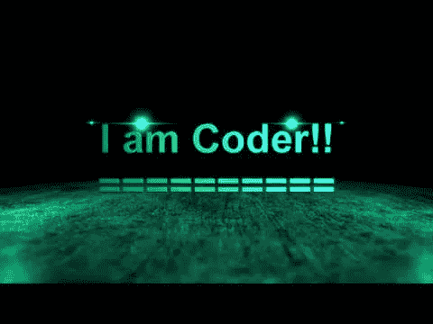

# 从训练营毕业并成为一名程序员

> 原文：<https://medium.com/codex/on-graduating-bootcamp-and-being-a-coder-ffe574f18439?source=collection_archive---------10----------------------->

我昨天从软件工程训练营毕业了。现在我有几件事:我筋疲力尽。我非常为自己骄傲。我想，我是一名软件工程师。

这次毕业和我经历过的其他毕业不一样。在疫情的这个时代，真的没有。当叫到你的名字时，看到一张你的脸的照片的幻灯片，感觉远没有站着、走着、拿到一份你的文凭那么重要。

但是这次毕业在一个更基本的方面也是不同的——这种方式表明了关于编码的一些重要的东西。

其他毕业之后，你就正式成为*的东西:*学士、硕士、博士。你被认证了。如果你愿意，你甚至可以在你的名字后面加上一些字母。编码训练营毕业后的我是什么？

嗯，我是个程序员。我是一名软件工程师。

不过，在某种程度上，我已经是了。在过去的一个月左右的时间里，Flatiron 的老师一直在告诉我和我的同学，要在 LinkedIn 上把自己列为软件工程师，而不是软件工程专业的学生。

作为一名 13 年的教师，同时也是我生命中大部分时间的学生，我对学术形式有一种近乎迷信的敬畏，所以我还没有。

但我明白他们的意思。做一名编码员就是要编码。要成为软件工程师，你的名字后面不一定要有字母。你必须知道如何编码。

没有什么比最近和我一起参加这个项目的计算机科学毕业生更能说明问题了。

不，事实上。有更多的事情说明了这一点:毕业后的第一天，我和我的第一批训练营朋友为我们的队列制作的 Slack workspace 已经充满了关于 Codewars 和 LeetCode 上的 algo 问题的信息。

现在是毕业后的第二天，我已经开始做第一次技术考核的练习题了。

我们是程序员，因为我们编码。不是因为我们有资格证书，而是因为我们投入工作，我们不断学习，我们编码。

我要去更新[我的 LinkedIn](https://www.linkedin.com/in/alec-magnet/) 上的标题。