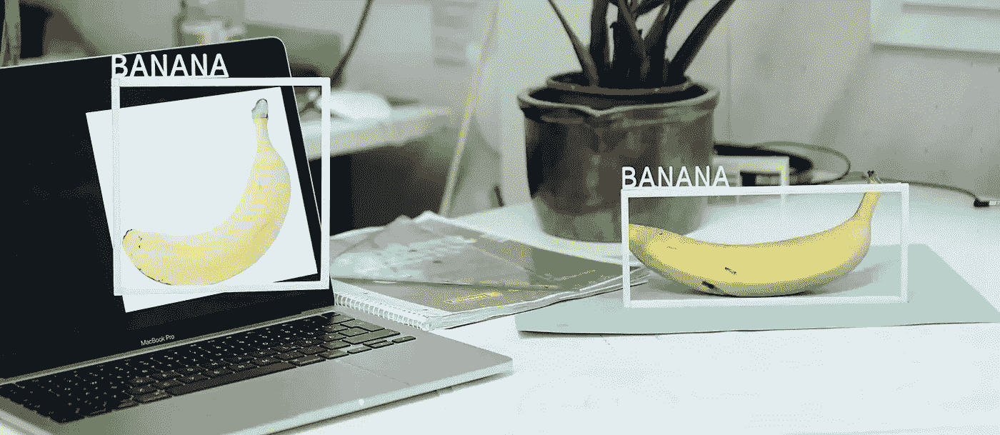

# 寻找隐藏的模式

> 原文：<https://medium.com/codex/on-the-hunt-for-hidden-patterns-1bda632d43ad?source=collection_archive---------39----------------------->

## 新闻业中的人工智能

AI 辅助新闻业就是这个样子吗？是也不是:人工智能可以自动识别物体和文本之类的东西。例如，记者可以用这种方法进行调查研究。典型的“物体识别”是所谓的“边界框”，马克斯·格鲁伯在这里艺术而幽默地描绘了它。照片(截图):马克斯格鲁伯更好的图像艾/颜后君不是一个香蕉/CC-由 4.0

即使在今天，人工智能(AI)已经在新闻业中发挥了关键作用:算法在大型数据集中找到故事，并自动生成成千上万的文本。很快，人工智能可能会成为媒体制作的关键基础设施。

*丽贝卡·西泽尔斯基*

“我会不懈地努力通知你”是中国新闻主播在 2018 年世界互联网大会上说的第一句话。在这种情况下，“不知疲倦地”可以从字面上理解，因为说话者不是人，而是人工智能生成的视频帧和音频文件的集合。

听起来像科幻小说的东西不仅在中国[测试，欧洲的媒体和公司也在研究自动审核人员。路透社与总部位于伦敦的初创公司 Synthesia 合作，开发了一种人工智能体育主播的原型。主持人将提供比赛摘要，而无需人工编写演示文本或在摄像机前演示。](https://www.bbc.com/news/av-embeds/46136504/vpid/p06r4jfy)

那么，记者会很快被 AI 算法取代吗？几乎没有。2021 年 12 月初，在伦敦政治经济学院(LSE)举办的 JournalismAI Festival 上，印度 HT Media Group 的阿比谢克·普拉萨德(Abishek Prasad)在一个名为*人工智能在新闻业的未来*的小组讨论会上说，你能想到的最好和最糟糕的事情就是人工智能系统写文章。

这是业内许多人的共同看法。媒体专业人员的工作是多样化的，通常需要同理心、自发性和创造力——人工智能系统在可预见的未来将不会或仅在非常有限的程度上拥有这些技能。尽管如此，人工智能在新闻业发挥着越来越大的作用。它不是取代媒体专业人员，而是支持和加速媒体内容的研究、制作和分发，接管单调、重复的任务，从而为编辑创造创造空间。此外，人工智能有可能用数据彻底改变新闻工作。

# 人工智能可以帮助发现有新闻价值的故事

通常，“数据新闻”被认为是对较大或较小的电子表格的分析。数据记者最耗时的任务之一是以这样一种方式构建数据集，以便从中发现有价值的相关性。人工智能补充了这一工作流程，识别数据集中的模式，并可以直接从数据中生成文本。汤森路透(Thomson Reuters)、彭博和美联社(AP)等主要新闻机构都有算法来梳理庞大的数据集，寻找任何似乎有新闻价值的东西:显著变化的股价、其他市场动向，甚至是社交媒体上的重要评论。彭博使用一整套人工智能工具来自动创作关于金融话题的新闻故事。所谓的命名实体识别(NER)算法可以识别文本中的人、公司和组织，自动情感分析可以评估新闻事实对公司的正面或负面影响。

这种人工智能工具可以帮助记者掌握新闻，并在早期阶段发现重要事件。

# 人工智能显示监视飞行，太阳能电池和非真实的推文

AI 模式识别还可以帮助调查记者根据假设分析大型复杂的数据集: [*Buzzfeed News*](https://www.buzzfeednews.com/article/peteraldhous/hidden-spy-planes) 利用 AI 发现了美国秘密侦察机的飞行路线，[*La NaCIón Argentina*](https://www.lanacion.com.ar/tecnologia/inteligencia-artificial-mapear-parques-solares-argentina-nid2370879/)在卫星图像中统计了阿根廷的太阳能农场。《大西洋月刊》编写了一个推特机器人，使用机器学习和自然语言处理来确定哪些推文是唐纳德·特朗普本人写的，哪些是他的员工写的。

人工智能对大型图像数据集的研究特别有用:来自 Bayerischer Rundfunk (BR)、Norddeutscher Rundfunk (NDR)和 Westdeutscher Rundfunk (WDR)的记者使用[图像识别人工智能](https://interaktiv.br.de/hassmaschine/english.html)来寻找仇恨符号，如脸书上的党卫军符文和希特勒图像。巴拿马论文研究团队同样使用[光学字符识别](https://panamapapers.sueddeutsche.de/articles/56febff0a1bb8d3c3495adf4/) (OCR)将扫描的 id 和合同转换成机器可读的文本数据。

# 体育、股票市场、犯罪——算法每天已经在编写成千上万的文本

在这个过程中，人工智能算法不仅改变了分析，也改变了基于数据的故事创作。英国公司 [RADAR](https://pa.media/radar/)) 在其网站上宣称:“我们建立了世界上唯一的自动化通讯社。”。任何在英国消费当地新闻的人很可能已经读过该公司的人工智能自动创建的文章，因为它每天为全国数百家新闻网站、报纸和广播电台提供服务。根据该公司自己的信息，6 名员工每周制作约 3000 篇人工智能支持的文章。这相当于每人每天发 70 条短信。

为了能够保证这一巨大的产出，雷达依赖于可以按区域细分的数据新闻。这样，几个故事一眨眼就变成了几百个。

# 人工智能节省了“人在回路中”的时间和压力

这不仅仅适用于本地新闻:我们在巴伐利亚 Rundfunk (BR)的 AI +自动化实验室，与 BR 的体育编辑团队和慕尼黑工业大学一起开发了一个[系统](https://www.br.de/nachrichten/sport/wie-textautomatisierung-br-sport-unterstuetzt,SIl2t2b)，为预赛篮球比赛生成新闻报道。该应用程序自动从结果数据、比赛日程、联赛排名和球员投掷统计数据中生成文本，这些文本可以在发布前由体育编辑进行检查和编辑(如有必要)。这节省了编辑的时间，并且仍然确保——事实上要求——编辑的事实检查由人工进行。
这种文本自动化无法取代人类，因为它只在定期提供可预测、结构清晰的数据的情况下有效:例如，在商业、体育或犯罪报道中。

# 数据也会带来风险

人工智能算法支持记者的工作，并创造没有它们就不会存在的机会，但这些系统并非没有风险。这是因为 AI 会做所有算法都会做的事情:分类、排序、打分。在这种情况下，系统并不总是正确的。在研究的情况下，这通常不是一个问题，因为人工智能被用于特别是在一些错误分类的图像、推文或文件是可以容忍的，并且可以在单独检查时被检测到的情况下。

危险潜伏在人们的数据被评估的地方。《华尔街日报》的付费墙使用机器学习算法，记录访问频率、使用的设备和消费的内容等变量，对它们进行评分，然后计算读者的订阅概率。这个概率分数影响每个读者被允许查看的免费文本的数量。虽然在大多数情况下，歧视的风险(如本例所示)应该是可控的，但许多媒体对自己的人工智能系统持特别批判的态度:Bayerischer Rundfunk 为自己制定了[道德准则](https://www.br.de/extra/ai-automation-lab/ki-ethik-100.html)，每个人工智能都将根据这些准则进行评估。评估标准包括负责任地使用资源，节俭地收集数据，安全地存储数据，以及对系统的编辑控制:“即使有了自动化新闻和数据新闻，新闻工作的责任也在于编辑委员会”。他们应该检查自动生成的媒体内容，并严格评估数据结构和数据源的合理性。

# 一些人工智能模型形成了环境负担

荷兰 Schibsted 集团也为自己的人工智能系统开发了一个风险评估框架: [FAST](https://schibsted.com/news/introducing-the-schibsted-fast-framework/) ，代表公平、问责、可持续和透明，其中“可持续”意味着社会和生态的可持续发展。因此，新的人工智能模型也要评估其碳足迹。这种考虑有很好的理由:训练一些人工智能模型在整个生命周期中消耗的能量相当于几辆汽车。

Schibsted 的数据和人工智能专家 Agnes Stenbom 在 12 月的 JournalismAI Festival 上表示，人工智能将对新闻业产生巨大影响:“我相信我们会把它作为基础设施来讨论。”电发明以后，也有类似的情况。起初，它引发了许多人的广泛焦虑。但是今天，我们走进一个房间，按下一个按钮，如果那个按钮不起作用，我们就会感到沮丧。人工智能很可能会以类似的方式融入记者的日常工作中。

# 内部人工智能团队将变得越来越重要

很快就会清楚这种基础设施将来自何方。中国初创企业新华智云不仅在尝试人工智能新闻主播，其产品组合还包括机器人，该公司声称这些机器人可以完全独立地拍摄和编辑短视频剪辑。此外，该公司的另一个人工智能——所谓的媒体大脑——仅在 2018 年国际足联世界杯期间就制作了超过 3.7 万条新闻剪辑，被点击了数百万次。这表明欧洲媒体也建立自己的人工智能团队和能力是多么重要——在编程和软件方面，以及在人工智能的新闻、道德和法律评估方面。

## **相关链接**

*   [伦敦政治经济学院的记者节](https://www.journalismaifestival.com/)
*   [AI 在彭博的使用](https://www.techatbloomberg.com/ai/)
*   [《仇恨机器:脸书如何未能解决仇恨言论》(www.br.de)](https://interaktiv.br.de/hassmaschine/english.html)

## 作者

Rebecca Ciesielski 是 Bayerischer Rundfunk 的一名记者，专门研究算法问责制，她在人工智能+自动化实验室工作。

感谢 Uli Kö ppen 对撰写本文的支持。

翻译:彼得·贾明

版权所有:正文:[歌德学院，丽贝卡·西泽尔斯基](https://www.goethe.de/de/index.html?wt_ca=22cc)。本作品根据[知识共享署名-相似分享 3.0 德国许可证](https://creativecommons.org/licenses/by-sa/3.0/de/deed.en)进行许可。

2022 年 2 月

*原发布于*[*https://www . Goethe . de*](https://www.goethe.de/prj/one/en/aco/art/22739137.html)*。*