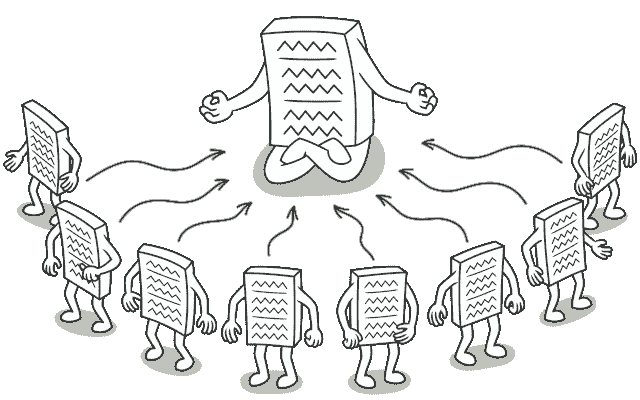
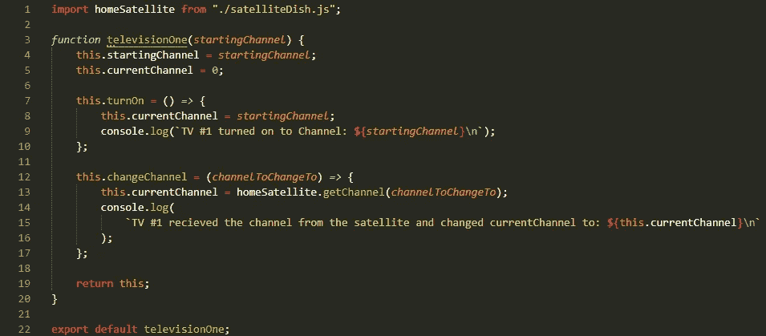
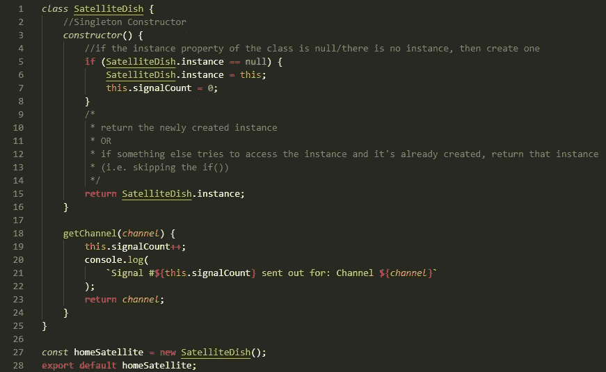
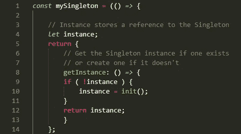
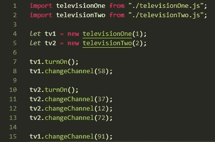
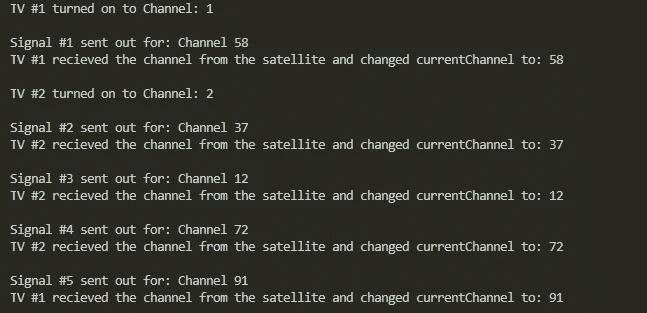

# 单一模式的一步到位(在 JavaScript 中)

> 原文：<https://medium.com/codex/one-and-done-with-the-singleton-pattern-in-javascript-d3075ee4631e?source=collection_archive---------17----------------------->

一个卫星天线可以接收多个信号，然后这些信号依靠卫星天线返回信息(图片来自 [**《全球贸易评论》**](https://www.gtreview.com/a-satellite-dish-in-twilight-scene/) )

正如我在上一篇文章中提到的，在[工厂模式](/@alexdel/efficient-object-creation-with-the-factory-design-pattern-in-javascript-e99e86b89d9f)中，设计模式是开发软件的可靠方法，可以在解决问题时重用，以改进代码结构。因此，当作为开发人员面临大量问题时，最好知道不止一个问题——那么，还有什么比单例模式更好的方式来继续这个系列呢！现在，你要么在读完这篇文章后退缩了，要么在想为什么有人会在想到单胞胎时退缩——好吧，不管怎样，我希望我能提供一些关于它的用法的信息，所以让我们从一个例子开始。

*为什么用碟形卫星天线作为文章照片？一颗卫星支撑在一户人家的身上，它是一个单独的部件，为房子里的其他电视提供它们需要/请求的信号。这使得多台电视无需各自的接入点就可以获取信号。
虽然这很好，但肯定有一些负面影响，比如如果天线发生故障，服务中断，电视只会说“*没有信号*”，没有任何信息或解决问题的能力。*

## 什么是单例模式，它是如何工作的？

单例类是代码中使用的唯一实例(图 via[**refactoring . guru**](https://refactoring.guru/design-patterns/singleton)**在他们的 [**深入研究设计模式**](https://refactoring.guru/design-patterns/book) 一书中)**

**简单地说，Singleton 是一个只有一个带有全局访问点的实例的类。它通过将类的实例化限制到单个对象来实现这一点。该单个对象通常为该类的单个实例创建并存储一个属性，如果该实例属性已经存在，则返回该现有实例。**

## **为什么会有争议？**

**虽然单例模式被认为是一种设计模式，但是其他人认为它可以是一种反模式。一个主要原因是因为它是一个可以“全局”访问的单个实例，类似于全局范围。这带来了很多问题的可能性:**

*   ****如果单例实例**出现任何错误或问题，那些依赖它的实例将没有任何信息，如果某些东西失败了，它们的状态将被蒙在鼓里**
*   **由于对单例对象有一种**全局范围的感觉**，如果代码中的一个区域对单例实例做了任何更改，如果其他区域依赖于更改的信息，它们可能会受到影响**
*   ****为单例代码编写测试**很困难，因为它通常与单例实例紧密耦合**

**考虑到这些因素，您应该确保单例模式确实适合您的场景。**

## **JavaScript 中单例模式的基本实现**

**使用简介部分的示例——家用卫星天线——编写一些代码的时间到了:**

****1st** — **问题:**一个家庭中有两台电视，需要一个卫星天线来获取信号，以检索它们请求的频道。每台电视不能有独一无二的卫星，否则就需要额外的卫星电视合同(*)，谁想处理更多这样的合同？*)**

****第二个** — **对象:**对象所需要的是将使用从**卫星**发出的信号的电视，卫星被导入并利用电视 changeChannel 方法中的 **getChannel 方法来更新电视的 currentChannel 属性**。**

***( *注意:注意我们是如何导入 satelliteDish 类的，但是不需要调用"****new****"***——这在下一步*中会有意义)***

*****( *还有***television two**—***与 televisionOne 代码相同但登录为“TV #2”而非*)*****

**********

*****televisionOne.js/televisionTwo.js*****

*******第三个** — **单例类:**现在我们到达这个设计模式中的主要组件。如前所述，**这个类应该返回一个实例**供代码的其他部分使用(在本例中，是 TVs)。为了确保这种行为，所有的动作都发生在构造函数中的**和导出**之前。*****

**********

*****satelliteDish.js —实例化自身并导出该类的唯一实例化的单例类*****

*****在进入单例类本身之前，先看看它是如何导出的。有一个 SatelliteDish 类的实例被创建并设置为 homeSatellite，然后被导出供使用。*****

*****现在，注意赋予 SatelliteDish 类本身的**实例属性**,以及它在构造函数中是如何处理的。在第一次调用构造函数的**时，实例属性将为*null*(因为它还不作为属性存在)。知道这是对构造函数的第一次调用，它会将初始属性:**一个名为“instance”的类属性设置为 *this*** 和**this 上的“signalCount”设置为 0** 。*然后*在初始调用之后，每次调用构造函数都会检查该类的实例属性，看它是否为空并返回现有的 satellite dish . instance .
(*肯定是* [***温习一下“this”***](https://www.youtube.com/watch?v=YOlr79NaAtQ)*如果对实例属性的设置不清楚的话)********

*******提示:如果您希望您的单例提供信息，并取消代码对其进行更改的能力—在您创建实例之后和导出之前(就在上面的第 27 行之后)—添加*[***object . freeze(singletonObj)***](https://developer.mozilla.org/en-US/docs/Web/JavaScript/Reference/Global_Objects/Object/freeze)*****

*****(*下面是一种使用相同的实例属性逻辑而不使用类语法来创建单例的方法——如果你喜欢*)*****

**********

*****没有使用类语法创建的单例*****

*******第四个** — **使用 Singleton 实例:**记住，从第二步开始，当调用 changeChannel 方法时，TV 对象导入并使用/调用卫星 Singleton 的 getChannel 方法。因此，在 index.js 文件中，我们将用起始频道号实例化两个电视对象，打开它们，并开始切换频道。*****

**********

*****索引. js*****

*****我们的产出是:*****

**********

*****运行 index.js 的控制台输出*****

*****“Signal #”(在 singleton 类中称为 signalCount)保持跟踪，并在每次任何电视对象从卫星 singleton 请求信号并返回所请求的频道时递增。因此，我们的 singleton 像预期的那样工作，并使用同一个实例服务于代码的每一部分！*****

******(你可以在我的 Github* [***这里找到示例代码的链接***](https://github.com/AlexDeL8/singleton-pattern-example) *)******

## *****抛开争议——单例模式什么时候有用？*****

*****单一模式在很多情况下都不是一个可接受的解决方案，但是有几个常见的例子:*****

*   *****读取只应在启动时读取的配置/设置文件*****
*   *****记录器是用于单例模式的经典例子，因为它不仅可以在代码中的任何地方被访问，而且如果记录器被禁用或关闭，也不会影响主代码的执行*****
*   *****我个人有一个开发聊天机器人的单例用例。chatbot 客户端应该只有一个实例连接到聊天室，监听请求，并发回响应/消息。*****

## *****总结和资源*****

*****在我看来，单例模式可以是一个有用的设计模式*，如果*它被用在一个合适的场景中，并且考虑到它的全局范围感觉而小心处理。否则，它会很快变得一团糟，并且您可能会发现自己处于那些认为它更像是反模式的人的圈子中。*****

******如果你想继续尝试单例模式，你可以参考以下资源:*
📖本文受到了《学习 JavaScript 设计模式的**书**的影响，由**[**Addy Osmani**](https://addyosmani.com/)**(以及 [**Lydia Hallie**](https://www.lydiahallie.io/) )。你可以在这里 找到单例模式部分 [**。*我强烈建议先去参观这个！* 🎥**](https://www.patterns.dev/posts/singleton-pattern/)**[**视频由克里斯托弗·奥克拉维**](https://www.youtube.com/watch?v=hUE_j6q0LTQ) (一个更长的深潜模式)🎥 [**视频由 Web Dev 简化**](https://www.youtube.com/watch?v=sJ-c3BA-Ypo) (一个较短的编码视频)***********