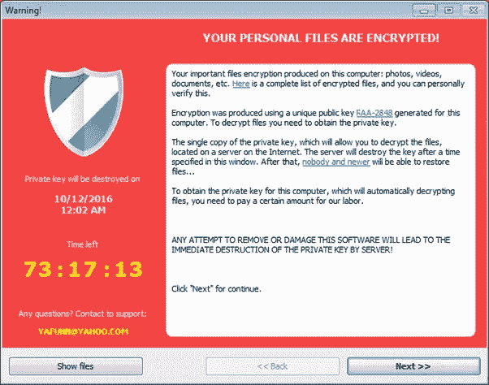
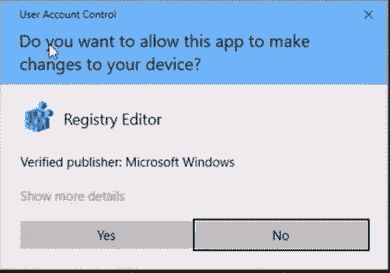

# 为什么微软在勒索软件乱象十年后依然不堪一击。

> 原文：<https://medium.com/codex/one-click-and-youre-dead-81d33fbc629e?source=collection_archive---------13----------------------->

## 勒索软件在首次出现近十年后仍在肆虐。

图片由 [Kelly Sikkema](https://unsplash.com/@kellysikkema?utm_source=unsplash&utm_medium=referral&utm_content=creditCopyText) 在 [Unsplash](https://unsplash.com/s/photos/computer-mouse?utm_source=unsplash&utm_medium=referral&utm_content=creditCopyText) 上拍摄

2021 年 3 月的一个星期五下午。员工“X”收到一封电子邮件通知。在 X 的收件箱里有一封标题为“未付发票加急！”。下午晚些时候，“X”已经处理了一整天的发票，所以“X”本能地点击电子邮件，在查看窗格中打开它。邮件正文是措辞强烈的付款要求和一个到发票 PDF 副本的链接。同样，在没有详细阅读正文的情况下，“X”单击蓝色突出显示的 PDF 文档链接，毕竟，一旦它打开，“X”将能够看到该业务是谁，并在回家之前将它排序。只不过不是 PDF。“X”没有发现电子邮件中的语法和拼写错误，也没有注意到电子邮件应用程序中显示链接完整内容的显示屏。“X”刚刚执行的一次点击产生了一种病毒，这种病毒即将摧毁雇佣它们的企业的信息技术基础设施。

被释放出来的是“勒索软件”，也称为“加密柜”。该软件从一个名为“AppData”的隐藏文件夹中启动，每个使用 Windows PC 的人都有一个作为他们用户配置文件的一部分。这个可执行文件加载了一个防止计算机抛出任何许可或警告对话框的脚本，它刚刚把自己写入了“X”电脑的“注册表”中。接下来，它会以一个非常随机的名称安装另一个应用程序，如果该应用程序被关闭，它会重新启动勒索应用程序。最后，勒索软件应用程序通过互联网向远程服务器发送消息，提醒服务器的所有者他们有一个受害者，并存放一个加密密钥。所有这些活动都在几秒钟内发生，被感染电脑的所有者完全看不到。接下来发生的是病毒的真正目的。

为什么这些病毒被称为“加密柜”？原因很简单，因为他们开始通过加密来改变用户机器上的文件。病毒打开并重新保存文件，对其加密并更改其扩展名，例如 CryptXXX 病毒会将“client_list.docx”的名称更改为“client_list.crypt1”。即使用户将文件名改回”。docx "该文件已使用一种称为“公钥加密”的常用方法加密，将无法打开。实际上，病毒现在拥有受害者的所有目标文件。病毒的目标文件主要与商业软件相关，如 Microsoft Office。Doc，docx，xls，xlsx，但它也寻找 jpg，avi 和数据库文件。想法是尽可能给受害者造成最大的痛苦。对于许多用户来说，丢失业务文件是件坏事，但丢失个人文件会带来更大的伤害。

加密过程一旦开始，将会撕裂与用户 PC 共享的所有文件夹和驱动器。同样，用户看不到它，除非他们注意到他们的硬盘驱动器指示灯基本上卡住了，当用户在机器上执行某种正常操作后，它通常会闪烁几秒钟。使用驱动器号(如“Z:”或“J:”等)映射到 PC 的外部或远程驱动器不在备用之列。加密柜也能撕开这些。

这种攻击的后果对企业来说可能是毁灭性的。一击之下，它的整个 it 系统可能会变得毫无用处。多年的销售数据和客户信息现在都无法获取。关键系统都死了，没有工资单，没有销售预订系统，没有电子邮件存档。病毒完成大屠杀后，它可能会向员工“X”闪现这样一条消息…

这是病毒拥有者的回报。倒计时通知受害者，他们只有有限的时间支付赎金并收到解密密钥。解密密钥将反转该过程，并允许他们访问他们的文件。点击“下一步”将把用户带到一个链接，在那里他们可以支付赎金，并且*有希望*收到解密密钥。如果交易得以进行，通常会涉及几乎无法追踪的比特币支付。因此，病毒所有者匿名获得赎金，然后像蜘蛛一样坐着，等待下一个昏昏欲睡的会计。

这种类型的网络攻击的第一个实例记录在 2013 年 9 月。它被称为“Cryptolocker”，随后成为描述这种类型的恶意软件的通用术语之一。由于显而易见的原因，“勒索软件”一词也成为了一个常见的指代。现在有些人感兴趣的是，为什么在 2021 年，这仍然是商业和个人计算机系统的一个主要威胁。

Windows 8.1 于 2013 年 8 月推出，取代了 Windows 7。像往常一样，新的“安全”功能和其他无数的差异将有利于最新的微软操作系统的采用者。然而，在引擎盖下，它与 10 年前于 1993 年 7 月发布的 Windows NT 并没有太大的区别。微软在这里走的是一条老路，当然有新的鳍和灯，但下面是与上一款相同的底盘和传动装置。这是自 Windows NT 以来的商业计划。借助于计算机速度和能力的抛物线增长，MS 刚刚能够向 WinNT 的旧机箱添加更多鳍和灯，物理计算能力的平流层增长使其重新设计的操作系统看起来比实际情况好得多。虽然每一次迭代看起来都是全新的，但 Windows 操作系统中有一些不可或缺的基本组件。其中一个组件是“命令提示符”，或者像老前辈可能称之为“DOS 终端”，另一个是“注册表”。这两个组件的继续存在，形成了一个巨大的安全威胁，它一直存在于自 NT 以来的每个 Windows 版本中。

为什么“DOS”终端很重要？简而言之，代表“磁盘操作系统”的 DOS 从一开始就是微软产品的基本组成部分。第一个正式版本，是 1981 年 8 月发布的，哇，40 年前！对于我们这些五六十岁的人来说，我们会记得一些命令。要查看磁盘上的所有目录，您可以在“C:>”提示符下键入“dir/w”。这将以宽格式显示所有目录，因此命令中有“/w”。还有许多其他的命令形成了微软独有的语言，在早期的微软个人电脑上导航的任务需要对神秘的命令有一定程度的熟悉。2021 年，你可以打开 Windows 10 的开始菜单，输入“cmd”，得到熟悉的黑色窗口，然后继续使用 DOS 的古老语言访问计算机，这一事实表明，Windows 10 仍然保留了与其原始机箱的链接，这是一个根本的弱点。

使 DOS 问题复杂化的是“注册表”。注册表是包含大量参考数据的计算机特定信息的表格。这些数据与您安装的每一个软件相关。注册表控制着软件的每一个细微差别，让你的电脑看起来和做起来都像它一样，老实说，它类似于人的大脑皮层。进出 Windows PC 的所有东西都会在某种程度上通过注册表。这种数据吞吐量需要在没有用户许可的情况下进行，因为如果寻求许可，运营商将花费过多的时间来允许对注册表的读/写访问。想象一下，每当你点击“保存”或“发送”或任何东西时，都会弹出一个许可窗口……你明白了。

图片由本·罗伯茨拍摄

随后，所有这些活动对用户是隐藏的，更重要的是，允许在后台对计算机基础系统进行关键的更改，不受限制。

令人惊讶的是，这些更改是与用户的权限状态无关的。为了限制用户手动更改其 PC 的能力，特别是在商业/公司环境中，微软创建了用户层次结构。最高一级是“管理者”，赋予受膏者神一般的权力。他们可以在机器上创建、编辑、重命名、删除、安装任何东西。其次是“超级用户”,他们拥有许多权力，但不包括管理员的一些权力。在图腾柱的底部是“用户”,他们可以做所有他们需要做的事情，但是只能控制他们自己的、自己生成的数据。其他任何事情都是禁止的，不要安装软件，不要修改系统，不要乱搞别人的东西，什么都不要。从表面上看，这看起来是防弹的。排除笨蛋安装任何未经授权的东西，甚至改变他们的壁纸和 PRESTO！安全系统！是的…不…问题是，不管用户权限如何，系统仍然需要访问注册表。这就是 DOS 的用武之地。

设计病毒的聪明人知道，访问注册表是一个永不关闭的商店。注册表对读和写是开放的，这是必须的，因为没有它操作系统就不能工作。因此，病毒的作者只需要创建一个“脚本”,这是一组 DOS 级别的命令，用户只需点击一下就可以执行，并且不会被检测到。这实际上很容易，这就是为什么在痛苦的八年后，Windows 仍然非常容易受到勒索软件的攻击。现在，我确信我会收到来自 IT 群体的许多评论，说有许多保护措施可以阻止或限制 crypto locker 病毒的破坏，这是真的。我的研究发现了一系列工具，这些工具可以检测正在运行的勒索软件，并在注意到文件重命名的异常活动时，将违规计算机踢出网络，以限制损害。这种反病毒软件的工作方式类似于银行用来检测信用卡异常活动的系统。如果你平时在波士顿生活和工作，你不太可能在周三去都灵买一副雷朋太阳镜。像这样的事件会触发算法中的阈值，不断扫描帐户活动，并将冻结帐户和交易，直到所有者确认或否认交易的真实性。Windows 操作系统没有这样的机制，因此，我们不得不问一个问题，为什么？

任何使用微软 Windows PC 的人都敏锐地意识到这样一个事实，即不断有包含“安全补丁”的更新。如果你有足够的好奇心通读更新公告，你会看到这些安全漏洞几乎总是包括围绕攻击者远程控制 PC 的能力的补丁，这绝对是一个威胁，但我还没有看到一个补丁写着“防止病毒或恶意软件通过注册表在计算机上安装自己”。这才是重点。微软无法在机器变得基本不可用的情况下创建这个补丁。

我写这篇文章是因为我所从事的业务正处于从勒索软件攻击中恢复的漫长道路上。对业务的损害是巨大的，尽管它被淡化了，但许多围绕管理和数据处理的关键系统已经受到致命伤害。恢复将是缓慢的，并会遇到许多问题，因为没有一个业务系统是按照受损系统必须修复的方式构建的。随后，大量的数据将会丢失，因为不能相信备份是从加密柜或潜在的另一种病毒中释放出来的，而这种病毒是原始有效载荷的一部分。有趣的是，这是一个几乎全新的系统，拥有最新的防病毒软件和网络基础设施。可悲的是，它无法承受这种攻击，这直接落在了微软的肩上，他们从未表现出必要的勇气或领导力来消除他们软件的深层和根本缺陷。

附录:最近对 JBS 食品公司和殖民管道公司的袭击成为最近几个月的头条新闻。在这种情况下，病毒拥有者从受害者身上总共捞取了大约 1600 万美元。然而，联邦调查局通过与比特币转账相关的公共注册表跟踪比特币，成功追回了 Colonial Pipeline 支付的部分款项。据我所知，这是第一次完成这样的壮举。这不是真正的胜利，因为它基本上涉及到跟踪和黑客攻击病毒所有者用来接收付款的比特币钱包。联邦调查局可能不得不“暴力破解”钱包上的密码，但我敢说，他们有获得这种结果所需的计算能力。