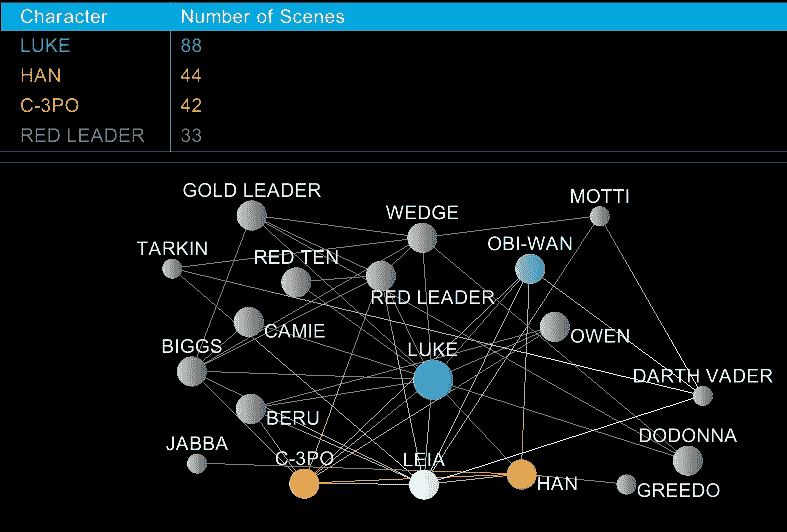

# 统治计算机科学的一种数据结构

> 原文：<https://medium.com/codex/one-data-structure-to-rule-computer-science-bad3fe1cf74b?source=collection_archive---------16----------------------->

## 用图表来说

图表由作者提供。

当我在印第安纳大学读本科计算机科学(CS)课程时，我决定在一个夏天呆在校园里，做兼职，上一门课。出于某种原因，我当时选择了数据结构。哇，那是个大错误。

不是因为数据结构没有用或者不值得研究。恰恰相反的是…