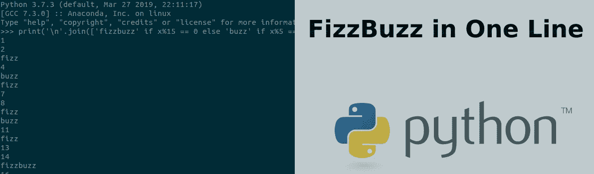

# Python 3 中的单行 FizzBuzz 解决方案

> 原文：<https://medium.com/codex/one-line-fizzbuzz-solution-in-python-3-9aff0cd98a69?source=collection_archive---------0----------------------->



# 介绍

FizzBuzz 问题是你在求职面试中可能会遇到的一个常见问题，我自己在求职面试中也给过潜在的应聘者这个问题。在本文中，我给出了用 Python 解决这个问题的一行解决方案。一行解决方案是我在六年前遇到 FizzBuzz 问题时给我同事的解决方案之一。单行解决方案是 Python 中可能的内联功能的一个很好的例子，我将一步一步地分解单行解决方案。首先我来说明一下问题。除了这一行的解决方案，我将提出一个替代的解决方案。尽管备选解释不是一行，但为了便于比较，它更具可读性。

# 嘶嘶声问题

本文解决的问题如下。对于从 1 到 100 的整数，每行打印以下内容之一。对于能被 3 整除的整数，打印单词“fizz”对于能被 5 整除的整数，打印单词“buzz”对于能被 3 和 5 整除的整数，打印单词“fizzbuzz”对于所有其他的，打印实际的整数。

## 打印输出示例

```
1
2
fizz
4
buzz
fizz
7
8
fizz
buzz
11
fizz
13
14
fizzbuzz
16
…
98
fizz
buzz
```

# 多线解决方案

在我解释单行解决方案之前，我想介绍一个针对 FizzBuzz 问题的多行解决方案。下面的解决方案是 FizzBuzz 问题的一个可读性更强的解决方案。

```
for x in range(1, 101):
    if x%15 == 0:
        print('fizzbuzz')
    elif x%5 == 0:
        print('buzz')
    elif x%3 == 0:
        print('fizz')
    else:
        print(x)
```

# 单行 FizzBuzz 示例

下面的代码行将打印从 1 到 100 的 FizzBuzz 值。将下面一行复制并粘贴到 Python 3 解释器中，查看解决方案。我将分解代码行中的组件。

```
print('\n'.join(['fizzbuzz' if x%15 == 0 else 'buzz' if x%5 == 0 else 'fizz' if x%3 == 0 else str(x) for x in range(1,101)]))
```

在我的解决方案中，我从 Python 列表理解开始。下面的行将创建一个从 1 到 100 的整数列表。

```
[x for x in range(1, 101)]
```

现在我们有了从 1 到 100 的列表，用“fizzbuzz”交换能被 3 和 5 整除的值。添加一个条件表达式，用“fizzbuzz”替换可被 3 和 5 整除的值。

```
['fizzbuzz' if x%15==0 else x for x in range(1, 101)]
```

通过添加附加的“else”和“if”条件表达式，继续用“fizz”交换可被 3 整除的值，用“buzz”交换可被 5 整除的值。

```
['fizzbuzz' if x%15==0 else "buzz" if x%5 == 0 else "fizz" if x%3 == 0 else x for x in range(1, 101)]
```

现在我们有了解决问题的正确值列表。但是，该列表是混合类型的“str”和“int”类型值。为了一致性，将最后的“else x”值包装在“str”中，以确保生成的列表中的所有值都是“str”类型。

```
['fizzbuzz' if x%15==0 else "buzz" if x%5 == 0 else "fizz" if x%3 == 0 else str(x) for x in range(1, 101)]
```

列表中的每个值都必须在一行上，行尾字符“\n”可以做到这一点。在“\n”上使用“join”字符串运算符方法可以确保每个列表值只在一行上。

```
'\n'.join(['fizzbuzz' if x%15==0 else "buzz" if x%5 == 0 else "fizz" if x%3 == 0 else str(x) for x in range(1, 101)])
```

最后，将打印函数绕过上面的行，并在解释器中查看解决方案。

```
print('\n'.join(['fizzbuzz' if x%15==0 else "buzz" if x%5 == 0 else "fizz" if x%3 == 0 else str(x) for x in range(1, 101)]))
```

# 结论

下次面试官问你这个问题的时候，提出这个解决方案。这一行解决方案是一个很好的学习练习，可以让你在 Python 3 中做很酷的内联工作。