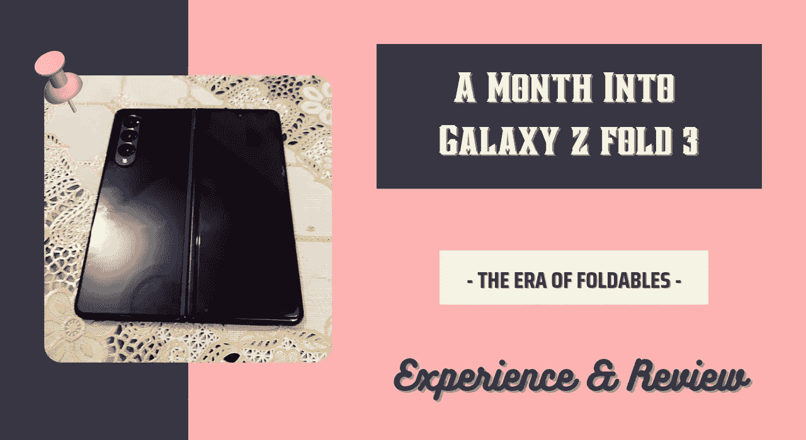
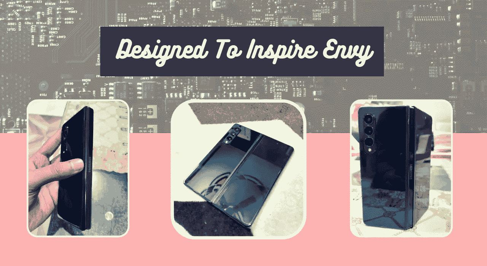
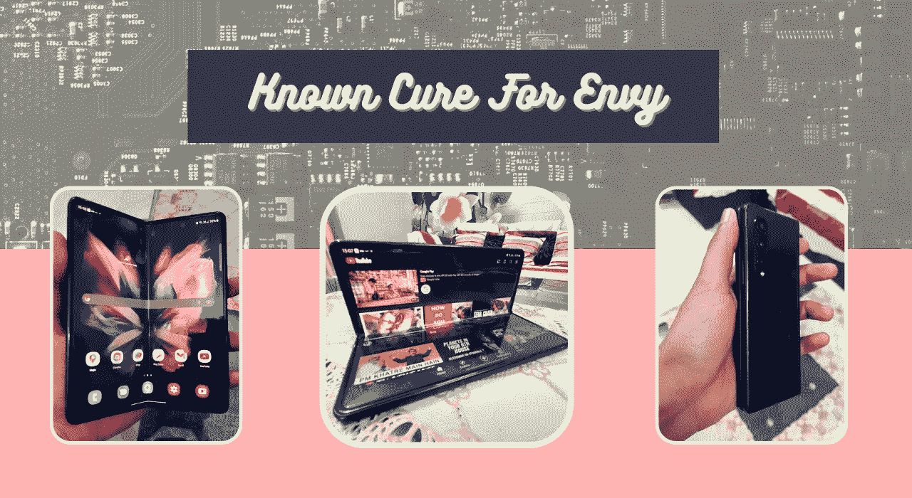

# Galaxy Z Fold 3 上市一个月——可折叠手机是未来的趋势吗？值这个价吗？

> 原文：<https://medium.com/codex/one-month-into-galaxy-z-fold-3-are-foldables-the-future-and-worth-the-price-10bb09568ec7?source=collection_archive---------3----------------------->

## 探索多任务怪物

我觉得有必要升级我的设备。但这款智能手机并没有升级的计划。我想换我的笔记本电脑。

去年 2 月，我将自己的智能手机从使用了两年半的 oneplus 6T 升级到了 IPhone 11。我计划在接下来的两年里吮吸它。但是后来，事情发生了。

首先，就价格而言，IPhone 11 是一款非常棒的设备。这是市场上最便宜的 IPhone，拥有大显示屏和充足的电量，平均使用不到一天。

基于 7 纳米架构，A13 bionic 毫不逊色，可以在未来几年内处理你扔给它的任何东西，前提是你至少有一个 128GB 的变种。

如果你想在预算内升级到 IOS。这是目前市场上最物有所值的精选包装。

# 但是为什么要改变呢？

嗯，我的手很大。

我不是外星人。Lol。但事实就是如此。

虽然它们看起来并不特别，但是它们比平常更长更大。

说到在虚拟键盘上打字，我已经是一只蜗牛了。

我的长手指挤在一个小空间里，这种组合既不舒服又低效。

就像他们被单独监禁一样。然后被迫去了萨默索。

所以我想换一个更大更宽的屏幕。

说到更宽，对于苹果智能手机，你看的是 Pro Maxes。这也将花费你 1500 美元或更多。

我没有任何心情去摆脱这么多。但是，也许有些事情是命中注定的。😅

# 选择 Z Fold 3 的原因

有些事情会吸引你的注意力，让你无法移开视线。

去年就想到买 Z Fold 2 了。但如果你愿意提取并随身携带现金。然后试着消费，你会意识到 2000 美元实际上是多少。

给你提供一些视角，2000 美元的投资可以让你每个月赚 30-40 美元，没有太大的风险和麻烦。购买价值如此的贬值资产至少应该经历一定程度的延迟满足。

这只是我。但是如果你的盆里有成堆的美元。你可以自由地购买 10 个并点燃它们。

就像今年在寻找智能手机时，我不能错过 Fold 3。

比之前的褶皱更加精致耐用。我会称之为第一次真正实现可折叠外形，同时便宜 200 美元(纸面上)。由于三星已经将充电砖和耳塞排除在包装盒之外。

此外，我觉得这是我效率低下的灵丹妙药。我做这个选择是为了更好地装备自己。或者你可以说，这个论点是试图证明$2k 的流失。

但任何士兵都只能像他的兵工厂一样强大。事实证明，这确实具有破坏性。幸好。

# 一个月后—体验和回顾

我从 12 月初开始使用它，我更倾向于智能手机的重度用户。在 days，我的大部分工作都需要操作手机 8 个多小时。

我觉得没有必要再看一遍规格了。这个美人有一流的硬件。12 GB 的内存加上顶级的 snapdragon 888 芯片组，使其成为一个强大的处理能力。

即使是最繁重的游戏和多任务处理，它也不会出现延迟。你可以放心，它不会喘息，不管你会扔给它什么样的任务。

120 赫兹的显示器值得一提。如果这是你第一次使用 60 赫兹以上的显示器，你会感觉到响应速度的不同。这种经历需要几天时间才能内化并消失。

但是闪电般的刷新速度和过大的内存容量并不新鲜。让我们抓住公牛的角。看看你们是否是天生一对。或者它是否能成为你永远封闭的前任。

# 我喜欢什么——拥有它的理由

**手感**

对逻辑决策的情感辩护。Lol。是啊，我知道。但事实就是如此。毫不夸张地说。

你会爱上的东西。这确实让人感觉你手里握着一些珍贵的东西。是的，当放在餐桌上时，它散发出奢华的气息。吸引眼球。你不会错过的。

**更多屏幕空间——不用动脑筋**

更好的多媒体体验和多任务处理。更好的网上购物体验和内容创作。比其他一切都好。

**可折叠铰链，可任意锁定，UPTO 180 度**

这就把你的折叠变成了一个迷你笔记本电脑，有一个底座可以放在任何平面上。你可以一边用双手拿着汉堡包一边消费媒体。您可以在桌子上使用 Z fold 参加 zoom 会议，而无需将它拿在手中，或者将其放在外部支架上。

它成为你独自旅行时点击图片的完美伙伴。你可以把它放在一边，用手势来抓拍。通常我展示我的手掌，它就会变魔术。我喜欢它。

这就是你能得到的一切。它能够在一个便携式包装中携带旗舰智能手机和旗舰平板电脑，屏幕可以在 0 至 180°之间折叠和锁定。这就是你所付出的代价。

# 不拥有它的理由

**重**

当你使用它一天时，你可能会感到一些不适，因为该设备重 250 克。虽然放在口袋里感觉不会特别重，但拿在手里绝对不会。如果你有一双小巧精致、可以亲吻的手，它们会相对容易疲劳。尤其是在放下和使用它的时候。

此外，你可能会发现一开始操作起来有点奇怪。但是经过试验并找到舒适的姿势后。这是可以控制的。也很有趣。

**摄像机**

相机没什么好抱怨的。你会得到一个精致、功能齐全但被广泛过度使用的相机设置——三个 1200 万像素的相机。

这些相机在一定条件下可以拍出很好的照片。并有幸拍摄原始和手动模式。但它仍然不是三星包里最好的。

总而言之，它不是一个以相机为中心的设备。即使在这个价位，它也没有市场上最好的相机。

**需要小心处理**

它已经通过了我预定的大多数耐久性测试。Lol。它很坚固，而且感觉不到它会在短时间内崩溃。

它可以轻松承受正常的磨损和偶尔的突然掉落。

但是你需要在展开的时候小心处理它。因为内部屏幕没有大猩猩玻璃或任何其他类似的保护。

尽管三星声称其比 Z Fold 2 强 80%。但它仍然是塑料的。

如果它会面朝下展开，你可以期待一些花卉图案。糟糕的一天。

**PRICY**

不是最实惠最物有所值的。

# 恐惧被揭穿——电池

具有两个 120 Hz 显示器，并且一个明显大于另一个。fold 3 仍然只有 4400 毫安时电池。

小于现在大多数设备中可用的普遍标准容量。

这让我在购买之前感到困扰，因为评论褒贬不一。但三星在 Z Fold 3 中优化了电池寿命，值得一片掌声。

一旦你让它们闲置，两个屏幕的刷新率都会降到 60 赫兹。还有许多其他设置来进一步调整电池性能。

我一直保持省电模式。我在黑暗模式下运行我所有的应用程序，并在设备界面的其余部分加上黑色背景。

这就是如何利用高能效 AMOLED 的优势。这些显示器关闭其像素以呈现“黑色”。与 LCD 相反，它们不需要使用电源来呈现“黑色”。

通过这些小调整，我能够提取一个像样的备用电池。但不是没有妥协，你可以说。

它没有电池可夸，我同意。但也不可悲。如果你还没有准备好让你的虚拟世界充满黑暗，那也是正常的。

但这不是一个大问题。今天的设备充电速度足够快，你可以在 10-15 分钟内获得充足的待机时间，如果它成为一个小时的需要。

# 需要考虑的事项

**不针对普通用户**

是的，你没听错。这是 foldable 最初的几个实现之一。如果你是一个普通用户，这可能对你来说有点过了。

大多数时候，你会把它折叠起来使用。唯一不同的是在使用多媒体和网上购物的时候。

如果你依靠你的笔记本电脑来完成大部分任务，它只会把你的裤子拉下来。

**最适合内容创作者**

这无疑提高了我的工作效率。我能够创造更多，而不总是渴望打开我的笔记本电脑。

事实上，我在我的 Z 文件夹 3 中写了整篇文章。更大的屏幕是写作、设计、编辑和阅读的救命稻草。它极大地改善了为我创建内容的体验和功能。

# Z Fold 3 值得买吗？

如果能让你的汉堡不至于变成一团乱，那就值了。

可能不是，lol。

这是有争议的，主观的，很难回答的。

如果你特别想要一个可折叠的，没有太多的选择，Z Fold 3 是你的最佳选择。

Rest 归结为你在一个设备中寻找什么，以及你能在多大程度上扩展你的口袋。

在多种情况下，通过翻转来扩大屏幕尺寸会很有帮助。比如分析电子表格、回复成堆的电子邮件、快速阅读文档等等。

此外，Z 形折叠 3 包含了折叠 2 缺少的内容。IPX 68 防水性能使其在暴雨期间和水体周围都很可靠。它比它的对手更薄，更光滑，更坚固，更强大。我有没有提到它也支持 S-pen。

尽管仍有很大的改进空间。这只会发生在进步的一代。所以你要么等到更精致的时候。

但是，如果可折叠产品让你着迷，并且你不介意为早期采用支付额外费用。拿起这个杰作不会错的。

# 可折叠是未来吗？

毫无疑问。

Z fold 3 是让可折叠手机成为主流的第一次真正尝试。Oppo 也推出了其首款可折叠设备。苹果公司正在推出一款可折叠的 IPhone，但预计它的价格会比肝脏移植高。

可折叠是未来。五年后在大多数人手中看到它们也不会令人惊讶。

削弱更大的便携式显示器的力量是愚蠢的。在你觉得有必要启动你的笔记本电脑之前，你可以完成更多的事情。你甚至可能不需要去任何地方都带着它。

与此同时，它将推动平板设备软件市场的饱和。我已经可以预见到很多网络应用和软件会专门针对平板电脑屏幕进行优化。

不管你是喜欢还是害怕拥有它们，可折叠的东西都会存在。

你怎么想呢?

