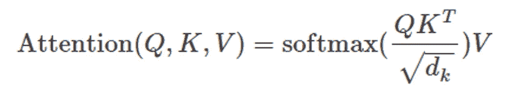
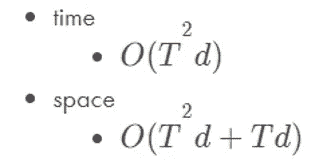
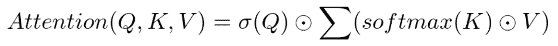
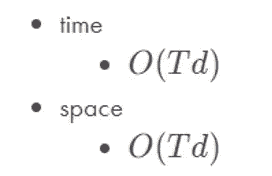
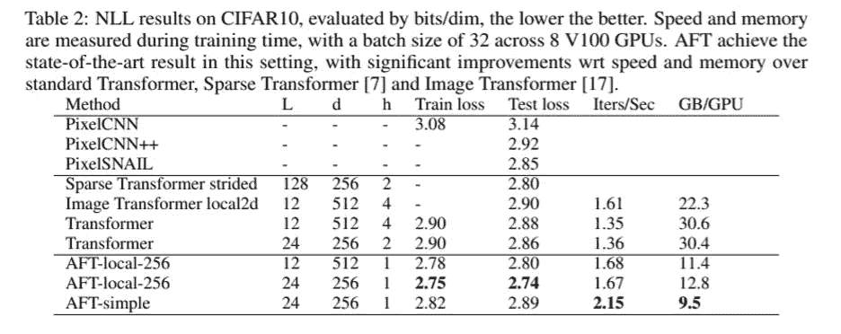
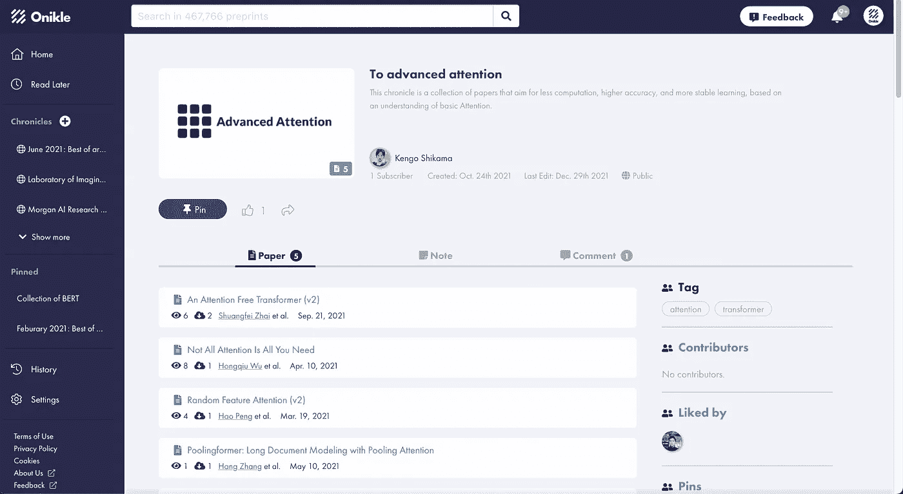

# Onikle 论文摘要:无人注意的变压器

> 原文：<https://medium.com/codex/onikle-paper-summary-an-attention-free-transformer-22fc65b4490e?source=collection_archive---------8----------------------->

图片作者:Atsutaka Odaira

*原文:*【https://onikle.com/articles/435319】T2

## **简介**

Transformer 自论文《注意力就是你所需要的》提出以来，已经为 NLP 领域做出了重大贡献。此外，在 NLP 之外，它也开始广泛应用于计算机视觉。转换器的核心是自我注意力对注意力的矩阵映射。这次我要介绍一篇论文，叫《变形金刚》，注意力自由变形金刚，几乎不需要注意力。

变换器的自我关注部分在时间和空间上都是非常计算密集的，例如，使用变换器的典型模型 BERT 需要超过 3 天来学习。注意力自由变压器是搜索注意力架构的结果，该架构以高速学习和预测变压器，同时将变压器的精度保持在相同水平或更高水平。

## **建议型号**

注意力自由转换器用另一种计算方法代替点积计算，因为点积计算在注意力中花费的时间最长。原来的注意力算法如下:

## **原创关注**

注意力由三个向量组成:查询、键和值。它从查询和关键字中计算关注分数，并根据该值对分数进行加权，您将从关注中获得单词嵌入。

查询和键的维度相等，值有不同的维度。

相关度由查询和键的点积计算，降维，应用 softmax 函数。之后再按价值加权。

原始注意力有以下时间复杂度和空间复杂度。

## **免关注变压器**

注意力自由转换器通过用逐元素乘积计算代替点积计算来减少计算量。下面是算法:

对每个目标位置的值执行加权平均，并将结果作为查询和基于元素的乘积。该算法的时间复杂度和空间复杂度如下:

元素式乘积消除了平方计算。一个很简单的改变，就可以减少 1 / T 倍的计算量。

## **结果**

表中与典型方法进行了比较。该表指的是纸无注意变压器(AFT)。可以观察到，AFT 可以更快地迭代，同时保持低测试损失。此外，通过降低空间复杂度，GPU 使用率也显著降低。

## **测试实施**

虽然它是计算机视觉领域的一篇论文，但注意力自由转换器，可以应用于 NLP 的算法。我在 NLP 的情感分析任务中实现了这段代码。结果，学习速度和收敛速度增加了一倍，总速度提高了 4 倍。此外，精度等同于原始变压器。稍后我会在 google colab 网址上分享代码

## **结论**

查看 Onikle，了解你接下来应该阅读的其他论文的摘要。你也可以在这里看到会议论文和其他研究人员汇编的论文:

 [## 引起高度重视

### 这个编年史是一个论文集，旨在减少计算，提高准确性，更稳定的学习…

onikle.com](https://onikle.com/chronicle/910) 

*如果您对我们的服务感兴趣，请在以下链接中注册您的电子邮件地址，以便尽早访问和测试我们全新的预印本平台，该平台通过人工智能引擎提供无压力的搜索体验。*

 [## 奥尼克尔

### 预印本搜索平台为有志于计算机科学的研究人员提供了一个简单的方法来找到论文与…

onikle.com](https://onikle.com/) 

摘要由 Kengo Shikama
撰写，翻译:Wanonno Iqtyider