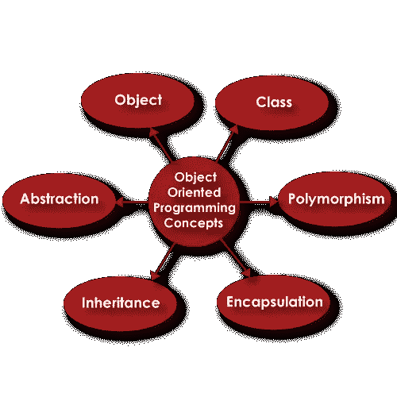
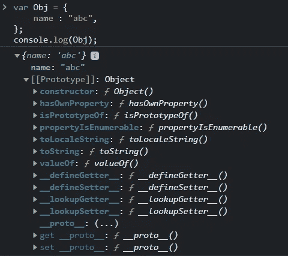

# JavaScript 中的 OOP:封装、继承、多态、抽象和关联

> 原文：<https://medium.com/codex/oop-in-javascript-encapsulation-inheritance-polymorphism-abstraction-and-association-2cbcd93bbb4f?source=collection_archive---------2----------------------->



面向对象编程是一种常用的软件设计模式，是一种非常流行的编程范式。它用于以可重用、易读和可伸缩的方式构建代码。它涉及到类和对象的使用，几乎所有的编程语言都支持这种模式。

在 JavaScript 中，函数是对象。所以我们可以在不使用类的情况下实现 OOP 模式。

让我们学习 OOP 的基础知识，并使用 JavaScript 实现它。

**类别和对象:**

类是创建对象/变量的蓝图。它是包含属性和方法的自定义数据类型。对象是使用类的方法和属性的类的实例。让我们通过 javascript 来理解和实现这一点:

```
class Animal{
    constructor(name){
        this.name = name;
    }
}// Let's create Object from the class Animal
var animal = new Animal("Dog");
```

*A* ***构造函数*** 是一个特殊的关键字，用来创建一个构造函数。在创建一个类的对象/实例时，总是自动调用构造函数。它隐式返回新创建的对象的实例。默认的构造函数内置于类中，我们通过实现自己的来覆盖它。 ***new*** 关键字对于对象创建是必要的，因为它将告诉编译器调用构造函数。

在 Javascript 中，我们可以使用函数创建对象，而不使用 class 关键字。

```
function Animal(name){
    this.name = name;
}var animal = new Animal("Dog");
```

这就是我们如何在 javascript 中从函数和类创建对象。现在我们知道了类和对象，让我们学习更多的 OOP 概念。

**封装:**

封装是隐藏和保护对象属性的过程。直接访问封装的属性是不可能的，我们必须提供其他机制来操作/读取这些数据。通常，这是通过将类变量属性设为私有并提供公共类方法来访问必要的数据来实现的。

```
function Animal(val){
    var name = val;
    var publicApi = {
        setName: function (val){
            name = val;
        },
        getName: function (){
            return name;
        }
    }

    return publicApi;
}var animal = new Animal("DOG");
animal.setName("CAT");
console.log(animal.getName());   output: CAT
console.log(animal.name);        output: undefined
```

在上面的代码中，动物的 ***name*** 属性不能直接访问，只能通过 ***publicApi*** 方法访问。这是因为我们返回的 publicApi 对象没有 name 属性。它的属性(setName 和 getName)利用其词法范围中的 Name 属性。

通过 class，这可以通过在变量名称前使用#使类变量私有来实现。

```
class Animal{
    #name;
    constructor(name){
        this.#name = name;
    }

    setName(val){
        this.#name = val;
    }

    getName(){
        return this.#name;
    }
}
var animal = new Animal("DOG");
animal.setName("CAT");
console.log(animal.getName());    output: CAT
console.log(animal.name);         output: undefined
```

> 封装也可以通过用代码制作模块来完成

**摘要:**

抽象意味着隐藏实现细节，只显示行为。它是在设计级别完成的，而不是在应用程序级别实现的封装。通过抽象，只向用户显示必要的细节。

考虑以下代码片段:

```
class Employee{
    #name;
    #baseSalary;

    setName(val){
        this.#name = val;
    }
    setBaseSalary(val){
        this.#baseSalary = val;
    }

    getName(){
        return this.#name;
    }

    getSalary(){
        let bonus = 1000;
        return this.#baseSalary + bonus;
    }
}
var emp = new Employee();
emp.setName("abc");
emp.setBaseSalary(100);
console.log(emp.getName());
console.log(emp.getSalary());
```

注意 ***getSalary*** 方法是如何在最终用户不知道的后端更新薪水的。在实际应用中，可以从一些数据库中提取奖金，并将其添加到基本工资中。

通过函数，这可以使用以下代码来完成:

```
function Employee(){
    let name;
    let baseSalary;

    var publicApi = {};

    publicApi.setName = function (val){
        name = val;
    }
    publicApi.setBaseSalary = function (val){
        baseSalary = val;
    }

    publicApi.getName = function (){
        return name;
    }

    publicApi.getSalary = function (){
        let bonus = 1000;
        return baseSalary + bonus;
    }
    return publicApi;
}
var emp = new Employee();
emp.setName("abc");
emp.setBaseSalary(100);
console.log(emp.getName());
console.log(emp.getSalary());
console.log(emp.name);
```

**传承:**

继承是面向对象编程范式中的一个重要概念。这是一个子对象继承父对象属性的过程。在 javascript 中，继承内置于对象中，每个对象都有一个称为 prototype 的属性，该属性引用该对象的父对象，这一链一直向上，直到 prototype 指向 null。



正如您在上面看到的，Obj 有一个默认的 prototype 属性，它引用了 Object，这是一个内置的数据类型。

现在让我们通过类和对象实现继承:

```
class Person{
    constructor(name){
        this.name = name;
    }
    sayName(){
        console.log(this.name);
    }
}class Student extends Person{
    constructor(name, rollNumber){
        super(name);
        this.rollNumber = rollNumber;
    }
    logDetails(){
        console.log(`Name: ${this.name}, Roll number: ${this.rollNumber}`)
    }
}
var student = new Student("Heisenberg", 1);
student.logDetails();    // Name: Heisenberg, Roll number:1
student.sayName();       // Heisenberg
```

学生类可以访问 person 类的所有属性。

**多态性:**

多态是以共享和覆盖父对象行为的方式设计对象的实践。

当一个属性被一个对象(无论是方法还是变量)引用时，该对象首先在自己的作用域中查找它，如果找不到，则向上一级，在父作用域中查找它。它会一直继续下去，直到找到那个属性，或者返回未定义的属性。javascript 对象的这种行为可以以这样的方式被利用，即子对象可以在需要时覆盖它们的父对象的功能，而无需修改父对象。

在上面继承的代码中，student 对象调用了 ***sayName*** 函数，该函数不在 Student 类中，但在它的父类中，但它是可调用的。我们可以在学生类中覆盖这个函数，并定制它的行为。

```
class Person{
    constructor(name){
        this.name = name;
    }
    sayName(){
        console.log(this.name);
    }
}class Student extends Person{
    constructor(name, rollNumber){
        super(name);
        this.rollNumber = rollNumber;
    }
    logDetails(){
        console.log(`Name: ${this.name}, Roll number: ${this.rollNumber}`)
    }
    sayName(){
        // do stuff
        console.log("From Student");
        super.sayName();
    }
}
var student = new Student("Heisenberg", 1);
student.logDetails();
student.sayName();      // From Student   Heisenberg
```

***super*** 关键字用于引用父对象并调用其方法。在这里，我们可以在 **Student.sayName** 方法中执行特定于学生的操作，然后可以将学生和 Person 类的其他子类的通用操作抽象为 **Person.sayName** 方法。

**联想:**

关联是一种设计原则，通过这种原则，不同的对象可以相互关联以执行某些任务。它有两种类型:

**1-聚合:**

在聚合中，对象是松散耦合的，可以独立存在。这意味着一个对象即使在它的关联对象被销毁后也可以存在。

让我们通过 javascript 来实现它:

```
class Wall{
    constructor(width, height){
        this.width= width;
        this.height = height;
    }
}
class Room{
    constructor(wall){
        this.wall = wall;
    }
    print(){
        console.log(this.wall);
    }
}var wall = new Wall(1,1);
var room = new Room(wall);
wall = null;
room.print();
```

在这里，墙和房间对象独立存在。

> 聚集也称为弱关联。

**2-构成:**

在构图中，对象是紧密耦合的，不能独立存在。

下面是组合的 javascript 实现:

```
class Wall{
    constructor(width, height){
        this.width= width;
        this.height = height;
    }
}
class Room{
    constructor(width, height){
        this.wall = new Wall(width,height);
    }
    print(){
        console.log(this.wall);
    }
}var room = new Room(1,1);
room.print();
```

如果我们破坏房间对象，墙也会被破坏，因为它被包围在房间对象内。

> **构图**也叫强联想。

面向对象的应用非常广泛，所有现代软件都是基于面向对象架构的设计模式构建的。因此，要构建软件应用程序，必须对上述 OOP 概念有坚实的理解。