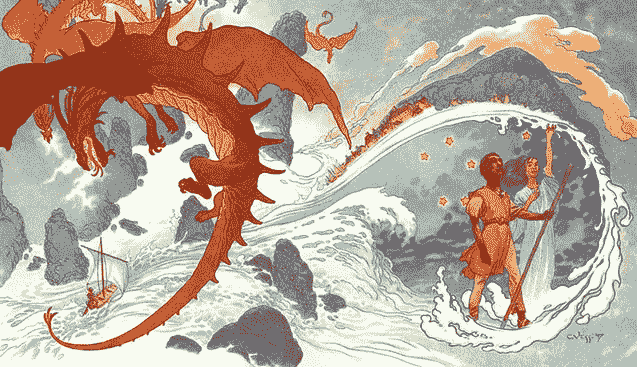
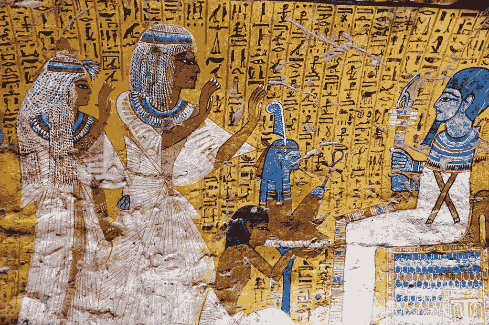
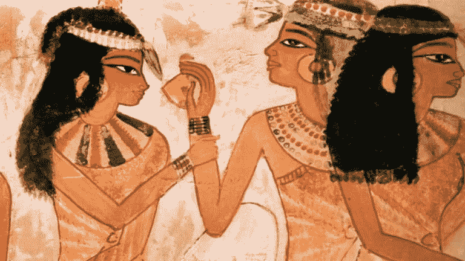
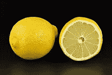
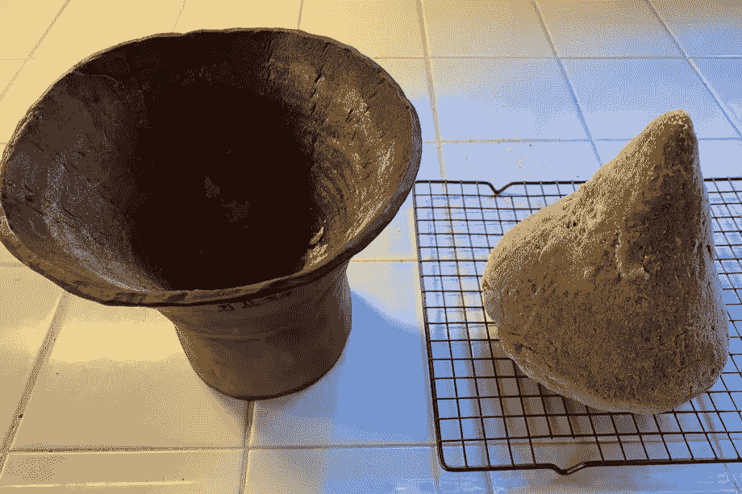
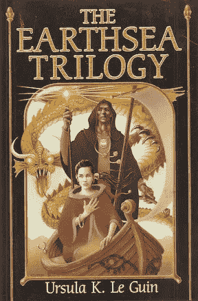
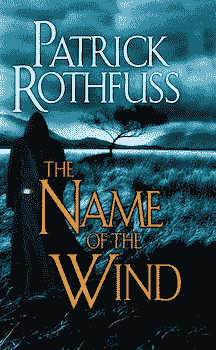

# 作为巫术的编码:OOP 和真名的魔力

> 原文：<https://medium.com/codex/oop-magic-systems-and-the-allegory-of-the-cave-bf891c4cdf0e?source=collection_archive---------19----------------------->

软件编码很像巫术。你把神秘而强大的单词和符号串在一起，然后世界——或者至少是你的网络应用——就改变了。新元素在页面上出现或消失。表单和输入会改变显示的内容和数据库中的内容。

当你第一次开始学习时，你的代码感觉很像*哈利波特*魔法——只是一些听起来像胡言乱语的官样文章，让事情出于不明原因发生(可能因为它看起来像拉丁文)。

但是，随着你对编码越来越深入，你开始理解——一点一点地——更多地了解魔术是如何以及为什么会这样。

总有一天，我会更深入地研究各种编程语言如何与不同幻想属性的魔法系统相比较。不过，我刚刚在训练营中学习了 Ruby，所以今天我将专注于一个特别的比较——[面向对象编程](https://en.wikipedia.org/wiki/Object-oriented_programming)和[真名](https://en.wikipedia.org/wiki/True_name)的概念。

# **什么是 OOP？**

面向对象是一种抽象数据的方式，因此每个示例不仅将数据内容分组，还将您可以做的事情列表分组—您可以用它执行的操作、它关联的其他数据等等。

在 Ruby 中，每个对象都是一个**类**的实例，每个类都定义了一组可以在每个实例上调用的方法，以及每个方法可能具有的一组关系。

例如，您可以定义一个 Broom 类并创建一个名为 fly 的方法:

```
class Broom 
  def fly
     puts "Up! This broom is flying!"
  end
end$ nimbus_2000 = Broom.new
$ nimbus_2000
*#=> #<Broom:0x007fc52c2cc588>*$ nimbus_2000.fly
*#=> "Up! This broom is flying!"*
```

调用**。类 **Broom** 上的 new** 实例化一个新对象 **nimbus_2000** ，Broom 类的一个新实例。这个新实例有关于它的数据——我们至少知道它在内存中的存储位置(这是我们的终端返回的字母和数字串告诉我们的)。我们还可以用扫帚做些事情——在扫帚上叫苍蝇。

# 每样东西的名字

这样,《面向对象》与其说像《哈利·波特》中的魔法，还不如说更像厄休拉·K·勒·古恩的《地海循环》或帕特里克·罗斯富斯的《弑君者编年史》中的至少一种魔法。在这些故事中，如果一个角色知道风的真实名称，他们可以召唤、转化并控制它，就像知道**光轮 _2000** 是**扫帚**的实例让我们知道我们可以调用**。在上面飞**。



来自*地海*的 Ged 和 Tenar 由 Charles Vess 绘制

实名魔法不仅在小说中，在神话和宗教中也有着悠久的历史[。例如，想想在格林童话*中通过知道侏儒怪的名字而赋予他的力量。想想犹太人禁止擦除或污损上帝的名字。*](https://en.wikipedia.org/wiki/True_name)

事实上，它可以追溯到更远。有一个来自中王国时期的古埃及故事，讲述了伊希斯诱骗 Ra 向她透露了他的秘密名字——没有什么比这更强大的力量来中和她毒害他的毒液。Ra 非常担心一旦她知道了他的真实姓名，Isis 将会对他产生什么样的影响，所以他只有在她答应除了她的儿子荷鲁斯之外不告诉任何人的情况下才会同意以这种方式得救——而且只有荷鲁斯自己发誓保守秘密。



普塔接受了来自第 19 王朝[伊勒尼费尔墓](https://egypte-eternelle.org/index.php?option=com_content&view=article&id=184&Itemid=685&lang=en)的敬意

事实上，在埃及创世故事的 [Memphite 版本](https://en.wikipedia.org/wiki/Ancient_Egyptian_creation_myths#Memphis)中，根据[沙巴卡石碑](https://web.archive.org/web/20110211013949/http://www.reshafim.org.il/ad/egypt/texts/shabaka_stone.htm)记载，当神普塔“宣布万物的名称”时，创造了世界——包括其他神、他们的神殿、埃及的城市、食物和“所有美好的事物”

# 一个类是一个类的实例

当我说这个故事提供了一个很好的类比来帮助理解 OOP 中的类继承概念时，我希望没有人会认为我对一个古代文化的神话油嘴滑舌。

让我们想象 Ptah 创造了一种新的美味食物——比如这块水果或面包:



谢赫·阿卜德·古尔奈墓地纳赫特墓(公元前 16-14 年)壁画的细节

假设它是一种水果。(更新:是[面包](https://www.history.com/news/eat-like-an-egyptian)。)在 Ruby 中，这种创建类似于[实例化](/@lainakarosic/instantiating-and-initializing-an-object-in-ruby-8b22f55f67d2)。在面向对象的术语中，这个特殊的水果可以被认为是任何类型水果的一个实例(一个褪色的石榴？无花果？？):

```
$ this_particular_fruit = Pomegranate.new
$ this_particular_fruit
*#=> #<**Pomegranate**:0x007fc52c2d7d20>*
```

**石榴**是类，而**this _ special _ fruit**是对象——这个类的一个实例。然而，**石榴**本身是一个更大类的实例，**水果**一般来说，它*继承了*其父类的一些属性。它是有机的，有种子，是它赖以生长的树木或植物的生殖周期的一部分。

在 Ruby 中，我们可以如下表示这种关系:

```
class Fruit
  def seeds
    "I have seeds!"
  end
endclass Pomegranate < Fruit
  def seeds
    super
    "My seeds are edible and delicious!"
  end
end$ that_fruit_in_the_picture = Pomegranate.new
$ that_fruit_in_the_picture.seeds
*#=> "I have seeds!"
"My seeds are edible and delicious!"*
```

**<** 语法确定**石榴**是**水果**的一种类型，因此继承了它的方法。关键字 **super** 允许我们通过在超类中包含方法所做的一切来构建方法，然后在子类中添加新功能——这就是为什么**that _ fruit _ in _ the _ picture . seeds**返回“我有种子！”还有“我的种子可以吃，很好吃！”



来自维基媒体的柠檬。面包来自 X-Box 的共同创造者谢默斯·布莱克利，他用传统工具和从古埃及烘焙器皿中取样的发酵剂来烘焙它。

**更新:**不知道为什么看到了一颗石榴。如果是水果，那显然是柠檬。但事实并非如此。是[面包](https://www.theverge.com/tldr/2020/3/30/21199544/seamus-blackley-xbox-creator-ancient-egyptian-bread-4000-year-old-yeast-culture)。但是，如果它是一个柠檬，如果你调用**，你会期望看到不同的回报。种子**在上面:

```
class Lemon < Fruit
  def seeds
    super
    "My seeds are not the part of me that's good to eat!"
  end
end$ actually_a_lemon = Lemon.new
$ actually_a_lemon.seeds
*#=> "I have seeds!"
"My seeds are not the part of me that's good to eat!"*
```

**水果**本身可能是**食物**或**植物**的实例，而后者又可能是**生物**的实例，以此类推，直到**万物**。

Ruby 也是如此。正如在另一个宗教传统中，从[龟一直到](https://en.wikipedia.org/wiki/Turtles_all_the_way_down)，在 Ruby 中，从对象一直到[主对象](https://codequizzes.wordpress.com/2014/04/23/rubys-main-object-top-level-context/)。这是 Ruby 程序的顶级作用域。在另一个类或模块之外定义的方法属于这个对象，Ruby 称之为“main”



# 扰乱现实的结构

因为在 Ruby 中，对象一直是向上的，你可以在你的 Ruby 应用中扰乱现实的结构。您可以定义新方法——甚至劫持现有方法——这些方法属于 Ruby 本身内置的核心类。这种形式的傲慢被称为*猴子补丁*，它可以完全破坏你的代码——或者，显然，非常方便。

要劫持一个属于核心类的方法，只需在该类中重新定义该方法:

```
class String
  def upcase
    self.reverse
  end
end
```

现在，当您在 string 的实例上调用#upcase 时，您的程序不会将所有字母都大写，而是以相反的顺序返回它们:

```
$ 'hello world'.upcase
*# => "dlrow olleh"*
```

这样看来，Ruby 可能比 Rothfuss 的 *Kingkiller 更接近 Le Guin 的*地海*书中真实姓名的魔力。(很难确定，因为罗斯富斯似乎在模仿乔治·r·r·马丁，谁知道我们是否会看到他三部曲的最后一部。)但罗斯富斯的克沃斯似乎只能用它的真名来召唤风。相比之下，勒奎恩笔下的人物在使用真实的词语来操纵他们的世界时，必须深思熟虑，谨慎小心，因为每次使用魔法都会从根本上改变和重新排列事物。就像猴子修补可以打破一切一样，地海的巫师也可以。*


来自海岸的[巫师](https://company.wizards.com/en/news/wizards-celebrates-pride-2021)的艺术

# **法师会议**

请告诉我你的想法！我很乐意听到更多关于编程和各种魔法系统或神话信仰之间的重叠和类比的想法。在 Medium 上给我写个回复，或者通过 LinkedIn 联系我，让对话继续下去。