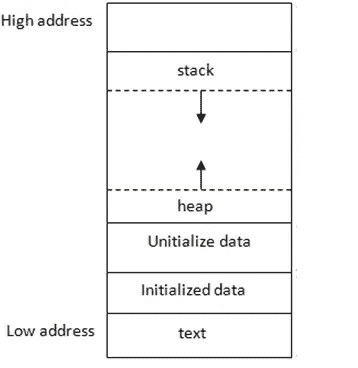
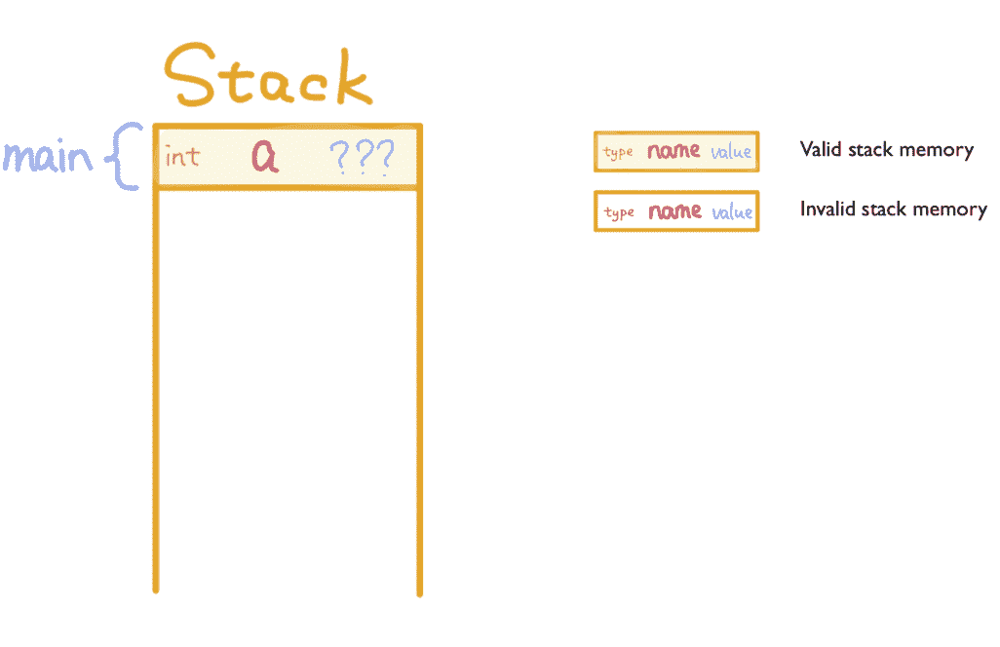
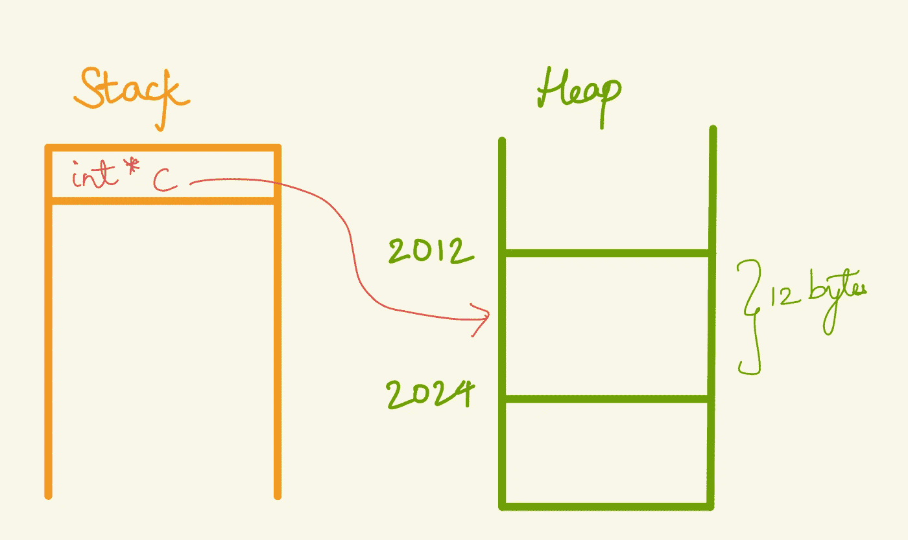
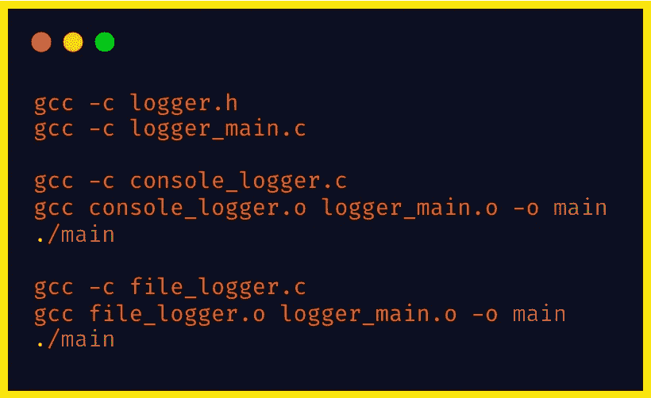
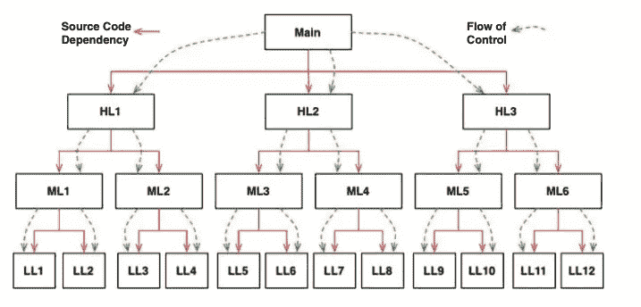
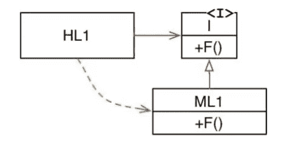
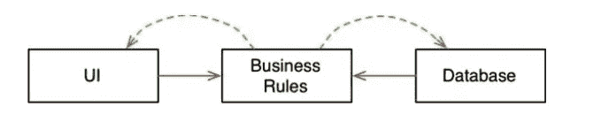

# 哎呀引擎盖下

> 原文：<https://medium.com/codex/oops-under-the-hood-5297561619a5?source=collection_archive---------10----------------------->

这种新的编程范式可以用编程风格的变化来解释。这就要求我们重新审视程序执行过程中的内存分配过程。

正在运行的程序的典型内存布局可以分为四个部分。

*   `**Text**`:存储正在执行的代码
*   `**Data**`:包含全局变量，分为初始化的和未初始化的。
*   `**Stack**`:存储局部变量。
*   `**Heap**`:程序员分配的动态内存

# 堆栈:

堆栈段靠近内存顶部，地址高。每当调用一个函数时，都会为该函数分配一些堆栈内存来存储变量。这种分配使堆栈向下增长。

当函数返回时，它的堆栈内存被释放，因此存储在那里的值可能不会保持不变。堆栈帧内存的分配和释放是在运行时自动完成的。

**一个常见的错误是返回与局部变量相关的堆栈内存的地址。**调用者得到这个指针后，无效的堆栈内存随时可以被新的函数调用覆盖。

在上面的程序中，变量 d 保存了一个对已经释放的堆栈内存位置的引用。每当从主函数中再次调用其他函数时，主函数中变量 d 所指向的内存位置就会被覆盖，从而产生一个垃圾值。

# 堆:

与堆栈内存不同，堆内存是显式分配的，只有在显式释放后才能释放。malloc 函数或 new 关键字可用于在 C/C++或 Java 中的堆区域中分配内存。它们返回指向堆中某处的第一个字节的地址作为返回值。

通过将函数调用堆栈框架移动到堆中，由函数声明的局部变量甚至可以在函数返回后继续存在。

这导致函数的名称被重命名为构造函数，因为它们的核心目的是将动态内存分配到堆中，局部变量成为实例变量，而嵌套函数成为方法。

这导致了多态性的发现，多态性只不过是指向函数的**指针的应用。**

# 那么 OO 到底是什么？

*   “**数据和函数的结合**”经常被引用作为答案，但它并不令人满意，因为它暗示了 o.f()在某种程度上不同于 f(o)。
*   这个问题的另一个常见答案是"**面向对象编程是一种编程方式，它使程序员能够像对待现实生活中的实体一样进行思考**"，这对于我们理解 OO 是什么毫无帮助。
*   最后但同样重要的是，常见的答案是"**OO 范式支持** *封装* **，** *继承* **，以及** *多态*"

让我们依次检查每一个概念，看看对于 OO 世界来说是否有什么新的东西。

# 封装:

封装被认为是 OO 定义的一部分，因为 OO 语言提供了简单有效的数据和方法封装。因此，可以在数据和功能之间划一条线。在这条线之外，数据是隐藏的，只有一些函数是已知的。我们将这一概念视为一个类的私有数据成员和公共方法。

这不是面向对象所独有的，在 C 或 C++这样的结构化语言中也可以实现。

这里有一个例子:

不可能在上面示例的 main 函数中访问 struct Pair 的成员。可以调用 **make_pair** 和 **distance** 函数，但是我们不知道 pair 数据结构或函数是如何实现的。在非 OO 语言中，这是一种完美的封装。

# 继承:

面向对象语言中的封装并不新鲜，所以继承肯定是，对吧？嗯，**没有**。

在上面的程序中，我们声明了一个称为元组的新数据结构，它有一个额外的成员字段，即名称。**元组**数据结构充当**对**数据结构的超集。

它可以伪装成 Pair 数据结构，因为它维护了对应于 Pair 的成员的顺序。我们可以轻松地将元组指针类型转换为对指针类型，并可以使用距离和 toString 函数。因此，我们可以说，即使在非面向对象语言中，我们也有一种继承。

# 多态性:

我们在非面向对象语言中也有多态行为吗？是的，我们已经有了。

在上面的示例中，我们有两个记录器，一个将数据记录到文件，另一个将数据记录到控制台。我们使用相同的函数名，即 **log** 输出两种不同的行为。这被称为多态代码。

多态性只不过是指向函数的**指针的应用。这是面向对象中多态性的基础。**

> OO 语言可能没有给我们带来什么新的东西，但是它们让一些事情变得微不足道。至少是继承和多态性部分。使用指针需要记住一系列标准和约定。面向对象语言试图消除这些约定。

# 多态性的力量:

多态性的使用支持基于插件的架构。在我们的代码库中，我们可以改变底层日志记录器的行为，而无需任何代码更改。我们甚至不需要重新编译现有的或主程序。为什么？因为主程序的源代码不依赖于 logger 实现的源代码。

通用日志数据结构，包含对不同记录器的引用

文件记录器实现

控制台记录器实现

主程序

这里的**文件记录器**和**控制台记录器**可以互换使用，作为我们主程序的插件。

# 依赖性倒置:

如果没有多态性，在典型的调用树中，主函数调用高级函数，高级函数调用中级函数，以此类推。为了调用我们的依赖项，现在每个调用者都必须提到包含被调用者的模块的名称。

这里，系统的行为决定了控制流，而控制流决定了源代码的依赖性。

当我们使用多态性时，会发生一些不同的事情。

依赖性颠倒了

这里，模块 HL1 调用模块 ML1 中的 F()函数。使用多态性，我们可以在运行时注入不同的 F()实现。源代码依赖 ML1 和函数声明指向与控制流相反的**方向。这就叫 ***依存倒置*** 。**

通过使用这种方法，程序员可以完全控制所有的源代码依赖关系。依赖性不再受控制流的限制。无论哪个模块进行调用，哪个模块被调用，程序员都可以将源代码依赖指向任一方向。**这就是 OO 提供的力量。**

# 依赖性反转的用例:

例如，在典型的 web 服务中，我们可以重新安排系统的源代码依赖关系，以便数据库和 UI 层依赖于业务规则，而不是相反。

换句话说，UI 和数据库可以是业务规则的插件。对用户界面或数据库的更改不需要影响业务规则。

# 结论

OO 是通过使用多态来获得对系统中每个源代码依赖的完全控制的能力。这样，可以设计一个基于插件的系统。

我很想收到你的来信。如有任何疑问、反馈或只是想进行讨论，您可以通过以下渠道联系我:*在*[*Linkedin*](https://www.linkedin.com/in/akash6019/)*上给我留言，或在 akash.codingforliving@gmail.com 给我发邮件*