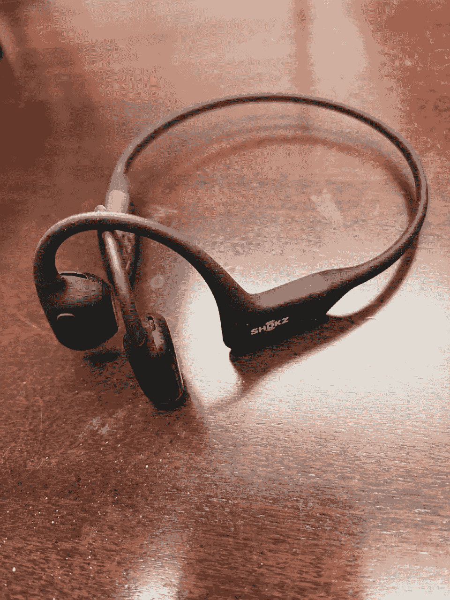

# 开耳(骨传导)耳机-“我的体验”

> 原文：<https://medium.com/codex/open-ear-bone-conduction-headphones-my-experience-8ee724bac234?source=collection_archive---------0----------------------->

## 需要听到外界的声音——有时候！

[Shokz open run Pro(JC 媒体)](https://amzn.to/3f8QpUG)

我有一双苹果的 Airpod Pros，我仍然惊叹于降噪功能。对于飞机旅行，做庭院工作(淹没割草机的声音)，或者只是关闭日常生活的烦恼，这是一个很好的功能。有时候他们工作得太好了…