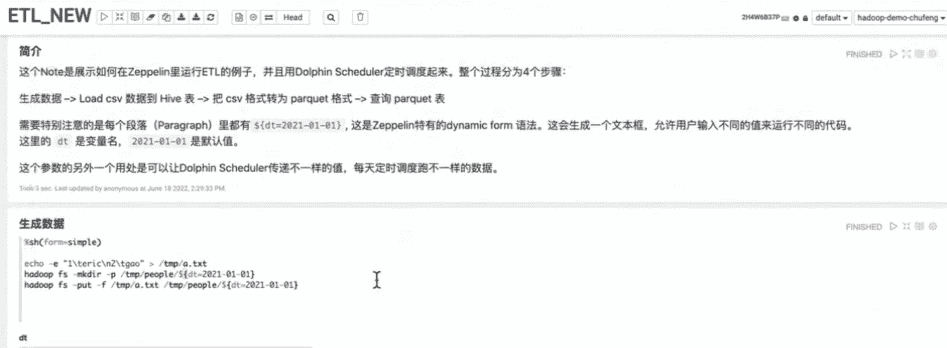

# 开源大数据工作室应用开发:Apache dolphin scheduler+Notebook

> 原文：<https://medium.com/codex/open-source-big-data-studio-application-development-apache-dolphinscheduler-notebook-101bbe2e952e?source=collection_archive---------9----------------------->

> 我今天分享的话题是如何搭建一个 ***大数据开发工作室。*** 我们将使用***Apache dolphin scheduler***和两款开源的交互笔记本 ***Apache Zeppelin*** 和 ***Jupyter*** 组装成一个*大数据开发工作室，提供在线开发/调试能力，避免因开发环境不一致而导致的不可预知问题，提升效率，显著改善大数据任务开发和调度的体验。*

**

*高楚锋*

*Github ID: EricGao888*

***阿里云基础平台开发工程师***

*我获得了上海交通大学信息工程学士学位，普渡大学 MSCS 学位，目前在阿里云 EMR 数据开发团队工作。作为 Apache Dolphin Scheduler、Apache Zeppelin 和 Apache Airflow 的撰稿人，我对提高大数据开发的效率有着浓厚的兴趣。非常欢迎您在[**https://github.com/EricGao888**](https://github.com/EricGao888)的 **GitHub 上关注我***

*今天的演示将重点关注大数据开发的用户体验，包括以下主题:*

*   *大数据开发中的难题*
*   *DS+Zeppelin & Jupyter 笔记本*
*   *Studio 的云部署解决方案和体验优化*
*   *演示*

# *大数据开发中的 01 个难题*

*对于大数据开发工程师来说，开发过程中有很多硬骨头要啃。我们不想浪费太多时间来配置环境。我们的理想环境是 DevOps 团队搭建了一个准备好的平台，大数据工程师可以直接使用编辑器或笔记本开发大数据任务，比如 Hive、Spark、Flink 等。目前，许多大数据工程师更喜欢使用本地 IDE 进行开发和调试，这可能导致开发环境与在线环境不一致，损害开发效率。此外，如果调度的工作流在 prod 环境下运行时不一致导致一些 bug，将会给公司带来巨大的损失。*

*针对开发环境不一致、作业配置复杂繁琐、开发效率低、代码迭代慢、在线行为不可预测等问题，我们提出了相应的解决方案。那就是用两个或两个以上的大数据开源工具组装一个大数据开发工作室。我们使用 Apache DolphinScheduler，它为调度提供了一个方便的 Web UI，两个交互式笔记本——Apache Zeppelin 和 Jupyter 用于任务开发和调试。Zeppelin 广泛用于开发大数据任务，Jupyter 非常适合人工智能或其他 python 相关的任务。*

*这个解决方案是完全开源的，自然是松耦合的。我们通过任务插件将 DolphinScheduler 与笔记本整合，构建了大数据开发工作室。*

**

*DS 任务插件，连接 DS 和笔记本的桥梁*

# *02 DS+Zeppelin & Jupyter 笔记本*

## *01 齐柏林飞艇简介*

*接下来我简单介绍一下齐柏林和朱庇特。Zeppelin 是一款面向大数据开发的笔记本，可以提供良好的交互开发体验，以及快速反馈的在线调试能力。Zeppelin 拥有丰富的引擎支持，包括 Hive、Spark、Flink 等。当在 Zeppelin 中运行交互式流 Flink 作业时，用户可以动态地看到数据流。稍后，我会给出一些关于 DS Zeppelin 任务插件的详细信息，包括它是如何实现的，以及它如何简化我们的工作。*

****

*上图左侧是 Zeppelin 接口。最小的执行单位是段落，也叫单元。每个单元都可以交互调试，并输出相应的结果。同时，Zeppelin 还将提供强大的 BI 功能，即大数据开发完成后，可以使用 BI 功能生成各种类型的图表。*

# *02 齐柏林建筑*

**

*我们可以看到在前端，有一个笔记本向 Zeppelin 服务器发送请求，Zeppelin 服务器和解释器之间会有一个双向的交互。此外，Zeppelin 的解释器是可扩展的。*

## *丰富的引擎支持*

*Zeppelin 拥有丰富的引擎支持，包括 Spark、JDBC (PostgreSQL、MYSQL、MariaDB、Hive)、Flink、Python、Shell、HDFS、Hbase 等。如果你是一个 Zeppelin 用户，你只需要开发自己的 Zeppelin 作业，然后使用 DolphinScheduler Zeppelin 插件一键调度它们，这将大大降低开发成本。*

## *03 DS 齐柏林飞船任务插件*

**

*这是 DS Zeppelin 的网页界面。在工作流定义页面中，我们可以拖动 Zeppelin 任务插件缩略图来创建一个 Zeppelin 任务实例。我们只需要填写齐柏林音符 ID 和齐柏林休息端点。如果你想安排一个特定的段落而不是整个笔记，你可以填充 paragraphId，DS 只会触发那个段落。参数被映射到 Zeppelin 的 ***动态形式*** ，您可以使用它来传入动态参数。此外，还支持 DS 内置的时间相关参数。*

## *04 Jypyter 笔记本简介*

*开发者可能比 Zeppelin 更熟悉 Jypyter Notebook，它拥有非常丰富的开源生态系统和庞大的用户群，主要面向 AI 工程师、数据科学家和数据分析师。这个工具可能很多人都用过。下面是 Jupyter 注的截图:*

*通过 DS Jupyter 任务插件，我们在这两个开源项目之间架起了一座桥梁，加强了它们之间的联系。我还会介绍 DS Jupyter 任务插件(papermill)的一些实现，配置，参数化，分布式环境下的 python 依赖管理等。*

## *05 Jupyter 建筑和造纸厂*

**

*我们使用 DS Jupyter 任务插件中的 ***Papermill*** 来执行 ***Jypyter*** 注意。*

*架构方面，前端也是笔记本 UI，类似于 Zeppelin，后端是笔记本服务器，取这些笔记，传给内核执行，最后返回结果给用户。*

****Papermill*** 独立于 ***Jupyter Lab*** 或***Jupyter Notebook***，从而不需要依赖 ***Jupyter*** 服务器，即使你没有 ***Jupyter*** 服务器在后台运行。你可以扩展你的 ***Papermill*** 来执行位于你远程存储的笔记(比如 ***AWS S3、阿里云 OSS、Azure Blob 等)。*** )*

## *06 DS Jupyter 任务插件*

**

*如图，你需要填写的是 ***康达环境名称******笔记本输入路径******输出路径*** 。如果便笺位于您的本地系统中，只需填写本地路径。如果您的笔记位于像***【S3】***这样的远程存储器中，您需要填写相应的对象键。*

****Jupyter*** 任务插件支持参数化。您可以为 ***笔记本*** 中的 ***单元格*** 设置不同的输入参数，运行批量调度作业，并动态传入参数。它将使用您传入的不同参数评估源模板，并批量生成和执行多个目标注释。*

## *07 分布式环境中的 Python 依赖管理*

*为了在分布式环境中管理 ***Jupyter*** 任务的 python 依赖，DS ***Jupyter*** 任务插件为用户提供了几个选项:*

****第一种方法:*** 手动/通过 shell 任务安装 conda 环境，并在创建 jupyter 任务时切换相应的 conda 名称。*

****第二种方法:*** 使用打包的 conda 环境 tarball——使用 ***conda pack*** 生成虚拟环境 tarball，并将打包的环境上传到*资源中心，创建 jupyter 任务时切换打包的 conda 环境名称。**

*****第三种方法:*** 从***requirements . txt***—上传***requirements . txt***到**资源中心**，切换 ***需求*** 文件，在创建 ***jupyter*** 任务时构造不同的依赖关系。**

****

**上图显示了如何管理 ***jupyter*** 任务的 python 依赖关系。你可以选择这个 tarball 或者 requirements.txt 文件， ***jupyter*** 任务插件会根据后缀自动检测并处理你选择的依赖管理方式。它使您能够专注于任务，并将您从复杂的环境管理中解放出来。**

# **03 云解决方案和优化**

## **01 云之解 ***工作室*****

**因为 Studio 有两三个组件，DolphinScheduler 和两个笔记本，所以我们可以使用 LDAP & Apache Knox 组合进行身份验证和 SSO。**

**在云中部署 ***Studio*** 时，可能会遇到将任务调度到多个集群的场景。尽管 Dolphin Scheduler 本身能够进行环境管理，但是您仍然需要执行一些定制开发。您可以构建一个工具，将目标集群上的 libs/confs 与您的工作室所在的环境同步。另一种方法是为每个集群设置一个 Zeppelin 实例，并通过 Zeppelin 任务插件连接到不同的 Zeppelin 服务器。**

**对于元数据持久性，您可以使用本地 MySQL、PostgreSQL 或云中的一些分布式数据库。**

*****资源中心*** 可以连接到远程对象存储器。DolphinScheduler 自带对 HDFS 和一些实现 ***s3fs*** 的对象存储系统的支持，比如 ***AWS S3*** 和 ***阿里云 OSS*** ，这可以确保你所有的资源在云中都是可管理的，避免集群被拆除时的资源损失。**

**日志也可以存储在远程对象存储中，但是这个特性仍然在社区中讨论。目前还没有实现将接口抽象为连接到云中的远程对象存储(比如 s3 或 oss)。目前这个功能只能自己搭建。**

**对于监视和警戒来说，普罗米修斯和格拉夫纳是 ***工作室*** 的绝佳搭档。这两个组件都是开源工具。DS 社区目前正在制定指标，我们已经完成了基础工作。现在中英文文档都有了，查看这里:[https://dolphin scheduler . Apache . org/zh-cn/docs/dev/user _ doc/guide/metrics/metrics . html](https://dolphinscheduler.apache.org/zh-cn/docs/dev/user_doc/guide/metrics/metrics.html)了解更多详情。**

**当然，除了自己在集群模式下部署 ***Studio*** 之外，你也可以考虑使用云提供商的解决方案，比如 ***AWS*** 或者 ***阿里云的 EMR Studio*** 。**

**### 02 云解决方案架构 ***工作室*****

****

**您可以在集群中部署 DolphinScheduler 和 Zeppelin，仅用于数据开发和调度。然后，将工作流和任务调度到计算集群。那些集群应该和你的 ***工作室*** 集群部署在同一个 ***VPC*** 下。如果没有，就需要花额外的力气连接网络。**

**上图显示了 ***Zeppelin*** 中的一个定制功能，使用户能够选择和绑定不同的计算集群来执行笔记。**

## **03 优化**

**这种解决方案并不完美，还有改进的空间，因为 Apache Zeppelin 和 Jupyter 这两种笔记本最初都不是为生产中的大规模调度而设计的。因此，我们需要增加笔记本的稳定性。例如，一个潜在的改进是在 UI 上添加一个锁。如果某个便笺正在计划中，则应将其锁定，不允许用户对其进行修改。Zeppelin 任务插件的另一个改进是为执行生成目标笔记的副本，并在完成后删除副本。通过这种方式，我们可以避免在日程安排过程中由于修改注释而导致的不一致。**

**另一方面，我们可以降低从 DS 触发注释到解释器执行注释的复杂性，以减少意外的错误。**

**在 DS 方面，我们可以改进任务 UI 以获得更好的用户体验。例如，在用户填写了笔记本 ID 和段落 ID 之后，可以自动生成一个链接，一旦用户被点击，就可以将用户重定向到相应的笔记本页面。在这种情况下，当开发或调试任务时，用户在两个 ui 之间切换将更加方便。**

# **04 演示分享**

****

**首先，让我们来看看一个简单的齐柏林音符。这是一个 ETL 工作，第一段是一个 markdown，让我们运行它。**

****

**然后，我们生成一些数据，并将其传递到 Hive 表中。我们可以看到操作有求必应，交互方便，方便我们调试。**

****

**接下来，我们可以将生成的 ***CSV*** 转换成 ***拼花*** 格式。这一步可能不稳定，因为环境是为演示而临时构建的。**

****

**转换完成后，我们可以在这里查询新数据。它刺激了 ETL 工作的开发过程。**

**既然我们可以通过一个交互式的笔记本轻松地完成这个 ETL 任务的开发阶段，那么我们如何在 DolphinScheduler 中只需点击一下鼠标就可以安排它呢？**

**让我们在 DS 上创建一个演示项目。工作流定义—创建工作流。**

****

**这里我们拖动齐柏林飞艇任务。我们只需要从 Zeppelin 获取目标笔记 id，它是笔记页面 URL 的最后一段。**

********

**然后我们可以在 Zeppelin 和 DS 端查看任务的运行进度。**

********

**这里是 ***Jupyter 实验室*** 。启动后，我们可以看到一个笔记本用户界面。**

**在本笔记中，我们从远程服务器(https://openweathermap.org/)请求一些天气数据，对其进行分析，绘制温度和降水趋势图，最终生成天气预报报告。**

****

**在这里，我们可以定义一些参数。例如，如果我想同时生成多个城市的天气预报，我们可以从这里传入参数。当在 DS 上调度它时，我们可以在一个工作流中定义多个 Jupyter 任务，然后传入不同的参数。这样我们就可以同时批量生成不同城市的天气预报。**

****

**对于参数化，这个单元格用 ***参数*** 标记，我们可以通过 ***Papermill*** 将参数传入其中。**

****

**这是我们刚刚生成的 HTML 文件。对了， ***Jypyter*** 任务插件的一个好处就是，即使你本地的 jupyter-lab 死了，也不会影响调度，因为 ***papermill*** 在执行 notes 的时候并不依赖于 jupyter-lab。**

**感谢大家的聆听，今天的分享到此结束。**

# **加入社区**

**参与 DolphinScheduler 社区并为其做出贡献的方式有很多，包括:**

**文件、翻译、Q & A、测试、代码、文章、主题演讲等。**

**我们假设第一个 PR(文档、代码)是简单的，应该用来熟悉提交过程和社区协作风格。**

**所以社区整理了以下适合新手的问题列表:[https://github.com/apache/dolphinscheduler/issues/5689](https://github.com/apache/dolphinscheduler/issues/5689)**

**非新手问题列表:[https://github.com/apache/dolphinscheduler/issues?q = is % 3A open+is % 3A issue+label % 3A % 22 volunteer+wanted % 22](https://github.com/apache/dolphinscheduler/issues?q=is%3Aopen+is%3Aissue+label%3A%22volunteer+wanted%22)**

**如何参与投稿:[https://dolphin scheduler . Apache . org/en-us/community/development/contribute . html](https://dolphinscheduler.apache.org/en-us/community/development/contribute.html)**

****GitHub 代码库:**https://github.com/apache/dolphinscheduler**

****官网**:https://dolphin scheduler . Apache . org/**

**:dev@dolphinscheduler@apache.org 的邮件列表**

****推特**:@海豚时间表**

**https://www.youtube.com/channel/UCmrPmeE7dVqo8DYhSLHa0vA**

**松弛:https://s.apache.org/dolphinscheduler-slack**

****投稿指南:**https://dolphin scheduler . Apache . org/en-us/community/index . html**

**你的项目之星很重要，不要犹豫为 Apache DolphinScheduler 亮出一颗星:[https://github.com/apache/dolphinscheduler](https://github.com/apache/dolphinscheduler)❤️**