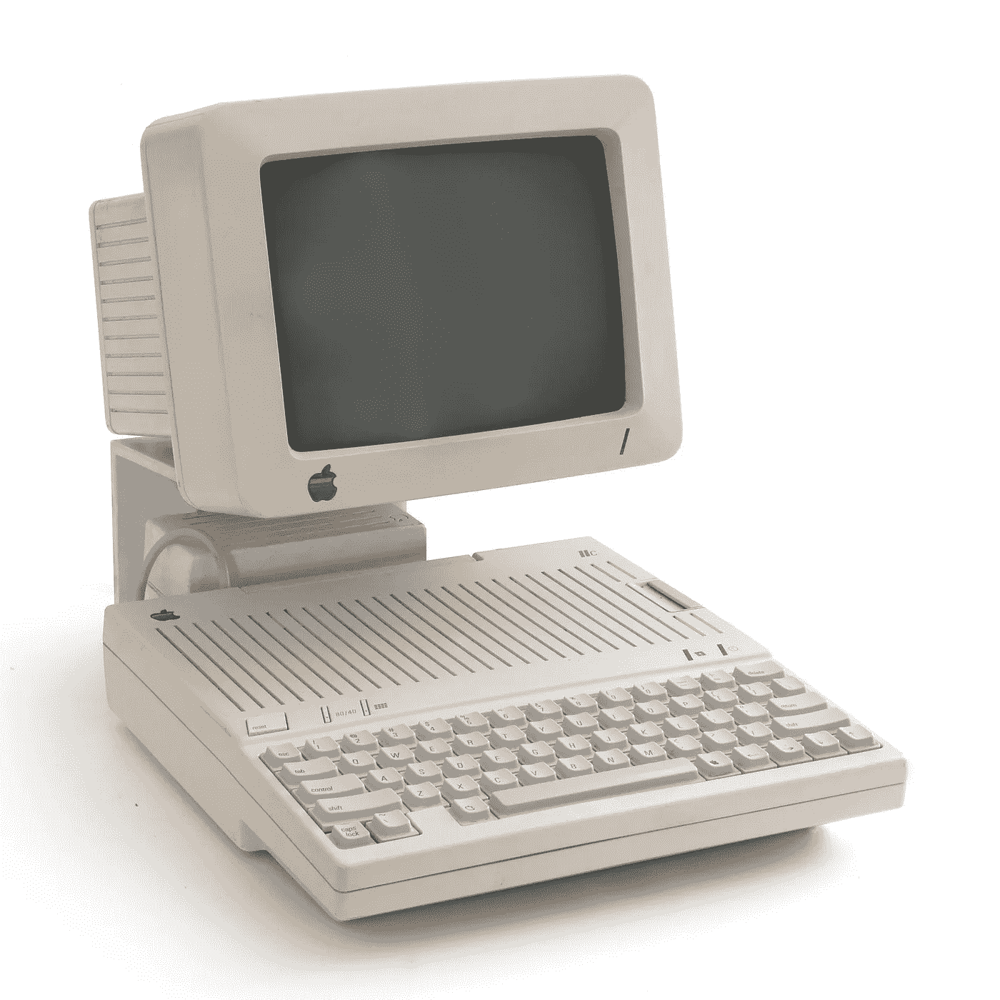

# 开源硬件为更好的未来服务

> 原文：<https://medium.com/codex/open-source-hardware-for-a-better-future-of-repair-international-repair-day-on-sat-15-october-2022-b0c28af169d6?source=collection_archive---------10----------------------->

> 在各大洲，维修延长了我们日常使用的物品的寿命。在这个过程中，它教授技能，加强社区，减少浪费，创造绿色就业机会和减少排放。你当然已经知道了。但是对于我们维修社区之外的许多人来说，这些联系并不明显。([权修欧，2022](https://repair.eu/) )

修理已经成为专家的任务——这不是用户和爱好者的错，而是行业和他们远离可修理的电子产品和 DIY 心态的错。我们可以重新获得丢失的修复知识，通过打开设备并开始拥抱“[制造和破坏硬件](http://Making and Breaking Hardware)的冒险”，更好地了解周围的技术。修理正在复兴，这不仅是经济危机的结果，也是因为[修理咖啡馆](https://www.mdpi.com/2071-1050/13/22/12351/pdf?version=1636452714)、[批判性制作](https://en.wikipedia.org/wiki/Critical_making)和更广泛的[创客革命](https://www.academia.edu/32600748/Artistic_Technology_Coded_Cultures_Making_and_Artistic_Research_2016_)的社会运动开始成为更广为人知的概念(另见 [Hertz，2012](https://www.academia.edu/3458190/Reclaiming_Repair_Maintenance_and_Mending_as_Methods_for_Design)； [Ratto & Ree，2012](https://journals.uic.edu/ojs/index.php/fm/article/view/3968) 。

然而，对于一个拥有开源硬件、可修复电子产品再次流行的世界来说，还有很长的路要走。首先要意识到你周围的电子设备，以及你如何与它们互动。

## 从微机革命到开箱即用的体验

在“家用电脑”的旧时代，设备被送出去由消费者组装和制造，这使他们更多地参与到过程中:工具的最初构造已经形成了这些个人与其组装的某种联系。

70 年代末开始的微型计算机革命已经开始在这些设备上运行，因为每个人都可以使用它们。苹果公司的 *Apple-1* 是世界上第一台带有显示器和键盘接入的 PC，但它只作为主板交付，外围设备(机箱、电源变压器、电源开关、ASCII 键盘和复合视频显示器)由用户提供。

**罕见的 Apple-1 合奏** (1976)，包括:哑光绿色 Apple-1 主板，带镀金白色陶瓷 6502 微处理器；装载 Apple-1 基本编程语言的原装盒式接口卡；定制编写的现代基础软件演示程序卡带；Datanetics 键盘；三洋 VM-4209 9 寸显示器；周期停止变压器；原版《Apple-1 操作手册》和《卡带接口手册》。它于 2013 年 5 月 25 日由拍卖团队 Breker 以 671，400 美元(世界纪录价格)售出。[https://www . first versions . com/2016/06/apple-personal-computer . html](https://www.firstversions.com/2016/06/apple-personal-computer.html)

Apple II 更成功(至少在数量上)，但除此之外还有一个很大的不同:它是完全组装的，因此人们会更关注软件，而不是修补电子产品。这开启了“开箱即用的体验文化”,并导致消费电子产品变得更难修复。

由比尔比—自己的作品，CC 由 3.0，[https://commons.wikimedia.org/w/index.php?curid=11118452](https://commons.wikimedia.org/w/index.php?curid=11118452)

## 互联网的未来以及如何阻止它

Jonathan Zittrain 在他的书“[互联网的未来和如何阻止它](https://en.wikipedia.org/wiki/The_Future_of_the_Internet_and_How_to_Stop_It)”中批评了智能设备的主导地位，将它们描述为“束缚的设备，一种将最终用户与制造商联系起来的方式”。定义这些系留设备的接近原则指的是硬件本身。它不能以设计之外的其他方式改变或使用(在某些情况下甚至不能修复),也不能达到新的前所未有的控制水平。Zittrain 以苹果 iPhone 为例解释了这一点，该设备的早期版本允许最终用户更换电池，而在后来的版本中，甚至连这种微小的维修都不再允许。像这样的设计选择实际上使用户失去了控制，并把他们“束缚”在制造商身上。

## 作为反运动的开源硬件

开源硬件是对系留设备和端到端硬件控制的反运动。免费和开源硬件(FOSH)是一个由工程师和爱好者开始的领域，截至 2022 年，这些项目与无数领域相关。有趣的兔子洞的例子是这些项目:

*   [MNT 改革开放硬件笔记本](https://mntre.com/)——MNT 改革是一种激进的、终极的开放硬件笔记本电脑，在柏林设计和组装。这种硬件是 100%可修复的，有记录的，背后有一个生动的社区。
*   [Pine64](https://www.pine64.org/) 是 *Pinebook* 、 *Pinephone* 以及许多其他好玩意的生产商。他们的网站展示了他们正在进行的大量项目。
*   Arduino 是一个你可能听说过的项目。但是在[嵌入式主板前端](https://en.wikipedia.org/wiki/Arduino)上还有许多其他有趣的发展，最引人注目的是 [RISC-V](https://en.wikipedia.org/wiki/RISC-V) 主板。SiFive 的 HiFive 板是第一批，其他的紧随其后。最近， *Pine64* 公布了 [Star64](https://www.pine64.org/2022/08/28/august-update-risc-and-reward/) ，还有很多公布的其他项目。
*   Tuxphones 是智能手机上 Linux 的一个极好的起点。值得注意的硬件项目是 [Purism 的 *Librem*](https://puri.sm/) 和[pine phone](https://www.pine64.org/pinephone/)。 [PostmarketOS](https://postmarketos.org/) 和 [Lineage](https://lineageos.org/) 是很好的固件发行版，可以使用带有最新固件的旧手机。

开源硬件协会有一份他们认证的所有项目的清单。你可以在那里找到一大堆有趣的 FOSH 项目:[https://certification.oshwa.org](https://certification.oshwa.org)

3D 可打印显微镜。来自:[开放主义——开放硬件中的对话](https://riat.at/openism-conversations-in-open-hardware/)(作者: [RIAT](https://riat.at) )。

## 从哪里入手，修什么？

看看你日常生活中的电子产品，你可能会发现科技和电子设备无处不在。大多数都是专利设计，没有文档记录，很难修复，甚至可能实施[计划淘汰](https://en.wikipedia.org/wiki/Planned_obsolescence)。以下是一些关于从哪里开始的建议:

*   用 [OpenWRT](https://openwrt.org/) 和 [LibreCMC](https://librecmc.org/) 固件修改你的路由器
*   在你的 *Google Pixel* 上安装 [CalyxOS](https://calyxos.org/) 或 [GrapheneOS](https://grapheneos.org/)
*   [改装您的旧 thinkpad](/@n4ru/the-definitive-t430-modding-guide-3dff3f6a8e2e) T440p、X220、X200 或在 [minifree](https://minifree.org/) 订购
*   买一台开源笔记本电脑，比如 MNT 改革或者 Linux 认证的笔记本电脑，比如联想 L14 。
*   通读 iFixIt 上的[可修复硬件列表](https://www.ifixit.com/Right-to-Repair/Repairable-Products)
*   打造自己的[定制机械键盘](https://switchandclick.com/how-to-build-a-keyboard/)

## **重述一切！**

那里的大多数电子设备并不是无法修复的，因为在很多情况下，它们可以通过[重新盖上](https://hackaday.com/tag/recapping/)来修复。你可以观看这个精彩的[重述教程](https://www.youtube.com/watch?v=SjgWo7mj8-w)以及[重述老式电子产品时的六个常见错误](https://www.youtube.com/watch?v=BeDKwi-GJRI&t=4s)。

**2022 年修复日大家快乐！**

*OpenGears 是*[*—RIAT 艺术与技术研究院*](https://riat.at/) *的研究人员。他们写作、评论和致力于所有开放的事物。Linux，Rust，开源，DIY，黑客和工程。* [*在 twitter 上关注他们*](https://twitter.com/audiores)*[*在 Medium 上订阅*](https://opengears.medium.com/subscribe)*[*在 Reddit 上关注*](https://www.reddit.com/user/Character_Infamous) *。***