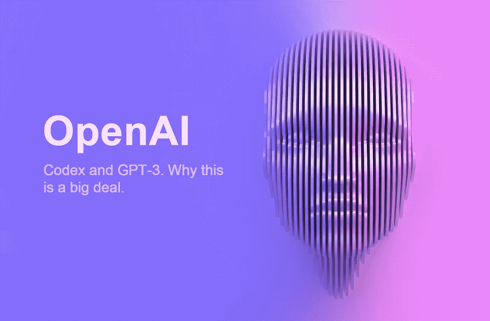

# 开放人工智能法典和 GPT-3

> 原文：<https://medium.com/codex/openai-codex-and-gpt-3-47ec3d384b80?source=collection_archive---------18----------------------->

## 今天 OpenAI 推出了 Codex。这就是为什么这是一件大事。

几个月前，山姆·奥特曼写了一篇名为 T2 摩尔定律的博客文章。在这篇文章中，他谈到了随着人工智能变得更加先进，世界会变成什么样子。在这里进行之前，请阅读该内容。

首先，什么是 API 和 GPT-3？我们将从一个 API 开始。

# 应用程序接口

应用编程接口(API)是允许计算机或计算机程序相互通信的连接。它是一种为其他程序提供服务的软件接口。API 通过抽象底层功能和只暴露开发人员需要的对象或动作来简化编程。虽然用于电子邮件客户端的图形界面可以提供执行获取和高亮显示新电子邮件的所有步骤的按钮，但是用于文件输入/输出的 API 可以向程序员提供将文件从一个位置复制到另一个位置的功能，而不需要开发者理解在幕后发生的文件系统操作。

# GPT-3

好吧，那么什么是 GPT-3 或预训练的变形金刚 3？根据 OpenAI 的说法，这是一种基于深度学习的自回归语言模型，可以生成类似人类的文本。它是 OpenAI 的 GPT-n 系列中的第三代语言预测模型。GPT 3 的整个版本可以存储 1750 亿个机器学习参数。GPT-3 由自然语言处理(NLP)系统组成，这些系统使用预先训练好的语言表示。在 GPT-3 推出之前，最大的语言模型是[微软的图灵 NLG](https://msturing.org/) ，它于 2020 年 2 月推出，拥有 170 亿个参数的容量，不到 GPT-3 的十分之一，GPT-3 创建的文本质量如此之好，以至于无法与一个人写的区分开来，这既有优点也有缺点。此后，微软向 OpenAI 投资了 10 亿美元，并于 2020 年 9 月 22 日[宣布](https://blogs.microsoft.com/blog/2020/09/22/microsoft-teams-up-with-openai-to-exclusively-license-gpt-3-language-model/)获得了 GPT-3 的“独占”使用许可；其他人仍然可以使用公共 API 来接收输出，但只有微软有权使用 GPT-3 的底层技术。

# 药典

今天 [OpenAI](https://openai.com/) 发布了 Codex，这是一个使用人工智能从自然语言编写代码的 API。今天展示的模型是可能性的一个非常基本的版本。[格雷格·布罗克曼](https://gregbrockman.com/)和[沃伊切赫·扎伦巴](https://wojzaremba.com/)向我们展示了迄今为止该模型如何以 37%的准确率完成一项功能。

我相信 Codex 引领了我们人类真正想从计算机中得到什么——我们说什么，计算机就做什么。演示开始时，他们只是键入命令，后来他们开始使用他们的声音，就像你和朋友说话一样。编程语言很棒，它们让我们走得很远，但我们需要能够与计算机交流，而不需要学习一门新语言来完成琐碎的任务，或者只是为了对编程不感兴趣的普通人。依靠通用语相互理解的人类和计算机很快将成为古抄本的遗物。随着模型的使用，神经网络会扩展并变得越来越精确，越来越多地实践我们想要的。这需要时间，但我相信很快我们就会忘记如何在电脑上手动输入信息。

演示进行到一半时，他们展示了如何使用自然文本创建一个视频游戏。如果这只是测试版，你可以做到这一点，接下来会发生什么？

随着更多 API 的创建，编写代码的 AI 系统可以轻松地开始创建产品，而不需要人类的输入。多年来，我一直在警告人们，人工智能会接管体力工作，比如亚马逊包装，而他们确实做到了。但这是一种认知和逻辑技术，完全违背了认知劳动将比体力劳动更快改变行业的趋势。

你是数据科学家吗？别担心，你也没有被遗漏。这是一个在旧金山计算天气数据集的 API 的演示。

这将迅速改变科技行业——未来的程序员和开发人员将更具生产力，并且能够在神经网络的合作下做更多的事情。对于不会编程的人来说，你可以耐心等待 Siri 采用这种新的 API，这样它实际上会很有用。别担心，我们离铁人的 J.A.R.V.I.S .又近了一步。

对 AI 感兴趣？查阅 OpenAI Codex [论文](https://arxiv.org/abs/2107.03374)或者阅读这些书籍 [Life 3.0](http://www.terrancemcarthur.com/books/life-3) 和 [Superintelligence](https://www.terrancemcarthur.com/books/superintelligence) 。