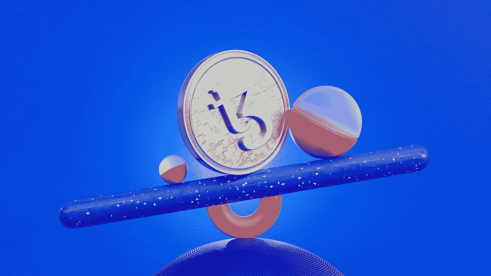

# 力争上游:开放的海洋对稀有的和可制造的

> 原文：<https://medium.com/codex/opensea-vs-rarible-vs-mintable-705885b06490?source=collection_archive---------0----------------------->

由[泰佐斯](https://unsplash.com/@tezos?utm_source=medium&utm_medium=referral)在 [Unsplash](https://unsplash.com?utm_source=medium&utm_medium=referral) 上拍摄的照片

技术已经占据了我们生活的几乎每一个方面，甚至艺术。尽管看起来很奇怪，但像 OpenSea、Rarible、Mintable 这样的 NFT 市场正在成为艺术家的首选。世界各地的艺术家正在这些平台上创作、铸造和出售他们的作品，并赚取高额利润。这些 NFT 市场在世界各地都很受欢迎，因此为创作者提供了扩大影响和找到合适买家的机会。

## 为你的用户提供一个人工智能丰富的 NFT 市场，像 OpenSea [**请求免费演示**](https://www.suffescom.com/clone/opensea-clone-script)

然而，随着这些 NFT 市场如此热闹，新的内容创作者或艺术家要找到合适的平台来展示他们的数字艺术并找到买家并不容易。为了缓解他们的困境，我们创建了这篇文章，并比较了 NFT 市场前三名**——Rarible vs Opensea vs Mintable。我们在 Rarible vs Opensea vs Mintable post 中做了一个完整的分析，这样读者可以做出明智的决定。**

**如果你正在寻找 Rarible vs Opensea vs Mintable 的答案——哪一个是最好的 NFT 市场，那么继续读下去。**

**在开始比较之前，让我们先了解一下 NFT 市场。**

# **什么是 NFT 市场？**

**NFT 市场是一个买卖不可替代代币的平台。NFT 是什么？这些是具有唯一且可验证的值的数字令牌。使它们区别于任何其他曾经存在的数字令牌的是，它们不能被改变和交换。尽管 NFT 可以更换所有者，并在 NFT 市场上广泛用于买卖数字资产。**

**OpenSea、Rarible 和 [**Mintable**](https://mintable.app/) 是 NFT 的一个市场，在这里可以制作、展示、存储和交易数字资产。这些平台类似于亚马逊(Amazon)等电子商务网站，用通俗的语言销售消费品。**

**对于有兴趣通过 NFT 市场购买、出售或投资这些数字资产的人来说，需要以下东西:**

1.  **数字钱包(Digital Wallet):如果你想在这些数字平台上买卖 NFT，电子钱包是必不可少的。您的数字钱包必须与您希望购买 NFTs 的平台兼容。例如，如果 NFT 市场支持以太坊区块链，电子钱包也必须支持 [**以太坊**](https://ethereum.org/en/) 区块链。**
2.  ****钱包里的数字硬币**:无论何时在这些数字平台上上市、购买或出售任何东西，你的钱包里都需要数字资金。你需要记住，平台、钱包、货币都是相互支持的。**
3.  ****用户账户**:用户需要创建一个他们打算购买 NFTs 的 NFT 市场的用户账户。**
4.  **无论你是打算使用 OpenSea、Mintable 还是 Rarible，以上都是在这些市场上买卖 NFT 的先决条件。但真正的问题是，你应该选择哪个流行的 NFT 市场平台:**

*   ****OpenSea****
*   ****稀有****
*   ****可铸造的****

**嗯，经过对这个受欢迎的 NFT 市场的彻底研究和深入分析，我们得出了一个结论。但首先，让我们仔细看看每个 NFT 市场。**

# **OpenSea**

**OpenSea 于 2018 年推出，是一个 NFT 市场聚合器，有多种 NFT 可供选择。该平台基于 NFT 技术开发，通过以太坊区块链的安全性，用户可以轻松交易、购买和出售稀有的数字资产。NFT 平台是一个分散的 P2P 市场，拥有 200 多种数字资产。**

**对于任何想要购买或投资热门 NFT 项目(如 Cryptopunks、Cryptokitties 等)的人来说，OpenSea 是理想的 NFT 市场。NFT 市场允许数字艺术家在全球范围内展示他们的数字资产，而无需拥有这些资产。平台的一大亮点是只收取 NFTs 价格的 2.5%佣金。**

# **稀有的**

**Rarible 于 2020 年由亚历克斯·萨尔尼科夫和他的合伙人阿列克谢·法林在莫斯科创立。这是一个新兴的 NFT 市场，完美融合了分散自治组织(DAO)市场和 NFT 技术。除此之外，数字平台是第一个向 NFT 世界推出治理令牌(如 RARI)的平台。该平台使用 ERC-20、ERC-1155 和 [ERC-721 令牌](https://coinmarketcap.com/alexandria/glossary/erc-721)来允许数字艺术家、模因制作者和内容创作者创建和销售非功能性传播媒介。**

**以太坊区块链安全和智能联系人使数字艺术家和内容创作者在未来能够轻松获得版税。rarible 平台允许用户执行附加功能，如向他们的数字艺术添加隐藏消息或高分辨率文件。使用 Rarible 令牌，用户可以提交或投票表决与平台相关的事情，如平台规则、费用管理等。**

# **可铸造的**

**这个 NFT 市场于 2018 年推出，因其促进了各种数字资产的买卖而迅速走红。用户可以交易以下类别的资产——艺术、音乐、视频、电子书等。亿万富翁马克·库班支持这个 NFT 市场，目的是创建一个 OpenSea 平台的替代品。NFT 市场 Mintable 允许用户使用以太坊区块链技术创建、购买、销售和交易 NFT。**

**任何人都可以在 Mintable 平台上买卖和交易 NFT。然而，你首先需要从任何加密货币交易所拥有以太坊，并将你的钱包与可铸造市场连接。ETH 习惯于支付铸造费、投标和在 NFT 市场上购买数字资产。**

**这只是对 OpenSea、Mintable 和 Rarible NFT 市场的概述。接下来，我们将从四个方面比较 OpenSea 与 Mintable 和 Rarible，以决定哪个平台比其他平台更有优势。**

# **OpenSea vs Mintable vs Rarible:比较**

**现在，是时候比较 OpenSea 与 Mintable 和 Rarible，并批判性地分析哪个 NFT 平台是最好的。我们将比较所有这些 NFT 市场——初始阶段、受众、培训支持和技术集成类别。让我们详细讨论这些-**

# **开始**

## **首先，我们将根据公司信息，即 Inception，来比较 OpenSea、Mintable 和 Rarible。**

*   **NFT 开放海市场是其中最古老的市场。该平台于 2017 年推出，是一个总部位于美国的 NFT 市场。**
*   **Mintable 于 2018 年推出，在 NFT 市场排名第二。尽管其他两个 NFT 平台都位于美国，但 Mintable 是一个位于新加坡的数字市场。**
*   **Rarible 是 2020 年抵达的最新成员，尽管是在 2017 年推出的。这也是一个美国的 NFT 市场。**

# **观众**

## **虽然这三个平台看起来都很相似，目标都是相同的数字艺术家和内容创作者。但是，事实上，这并不完全正确。**

*   **铸造，NFT 元宇宙更受观众青睐，希望交易数字资产和赚取加密。**
*   **对于希望利用智能联系和安全区块链技术的用户来说，OpenSea 是正确的选择。**
*   **Rarible，NFT 市场是任何人的理想选择，这些人以创作者为中心，并在区块链寻找稀有数字资产的创作或收藏。**

# **培训和支持**

**三个 NFT 市场的另一个主要区别是在线培训和支持。在线培训和支持功能对这些平台的新手来说很方便，无论是创作者还是数字艺术家。有了这个，他们可以教育他们的用户，并支持他们做出正确的决定。**

**对于那些在 NFT 寻找在线培训平台的用户来说，Rarible 是合适的平台。**

**另外两个平台——open sea 和 Mintable，没有在线培训设施。然而，这三个 NFT 市场都没有提供任何基于网络的培训设施和面对面的聊天。虽然这些平台在不久的将来仍有可能添加这些功能。**

# **技术集成**

**最后，我们将比较 Mintable、OpenSea 和 Rarible 在技术集成方面的灵活性。无论你是内容创作者还是投资者，没有人喜欢担心平台与钱包等其他工具的集成。**

**可铸造市场可以与流行的钱包集成，如以太坊、Metamask、彩虹和其他钱包。**

**与此相反，Rarible 平台提供了与比特币基地钱包、 [WalletConnect](https://walletconnect.com/) 等流行钱包的集成。**

**OpenSea 是这一领域的明显赢家。它支持与以太坊、Metamask、比特币基地钱包、Mintbase、Bitski 等大量工具的集成，这样的例子不胜枚举。**

# **OpenSea vs Rarible vs Mintable:关键差异表**

****

# **Rarible 和 OpenSea 的主要区别**

1.  **Rarible 在消费者中有所上升，但 OpenSea 始终处于发展的早期阶段。**
2.  **Rarible 成立于 2020 年，而 OpenSea 成立于 2018 年。
    亚历克斯·阿塔拉和德文·芬泽创建了 Rarible，而亚历克斯·阿塔拉和德文·芬泽创建了 OpenSea。**
3.  **Rarible 基于 RARI 区块链，而 OpenSea 基于以太坊区块链。**
4.  **与 OpenSea 相比，Rarible 的用户群相当小。**

****收尾****

**关于 Mintable vs OpenSea vs Rarible NFT 营销平台的详细概述，就这些。Rarible 是一个新的 NFT 市场，提供现场培训等设施，并与 OpenSea 平台展开激烈竞争。另一方面，Mintable 似乎是交易者在互联网上购买、出售或交易数字资产的首选。但是，拥有 200 多种 NFT 和分散式 P2P 市场的 OpenSea，在相当长的一段时间内仍然主导着 NFT 市场。**

**所以，基本上，这完全取决于用户的偏好和他们对这些 NFT 市场的预期用途。**