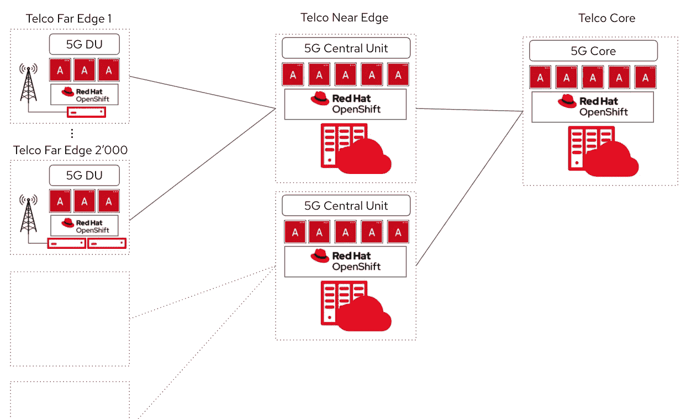
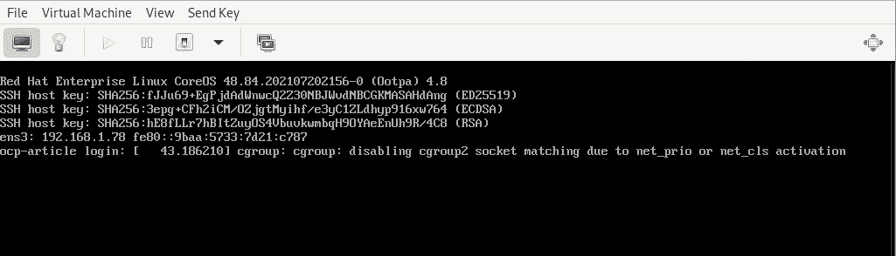
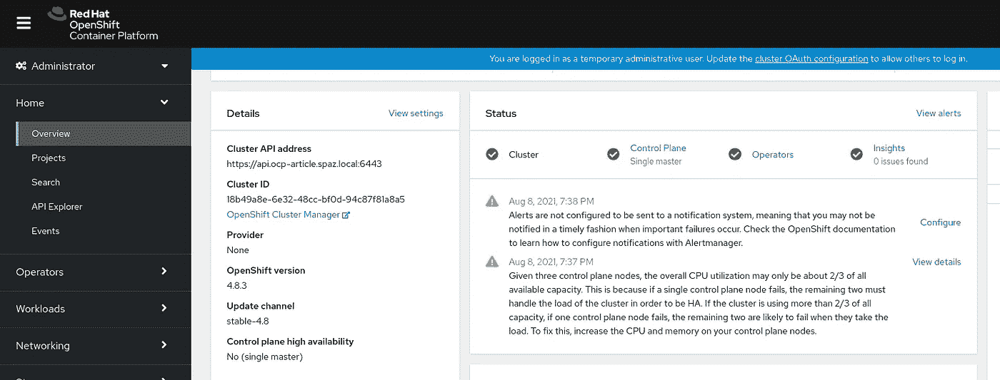

# 用于分布式云的 Openshift 单节点

> 原文：<https://medium.com/codex/openshift-single-node-for-distributed-clouds-582f84022bd0?source=collection_archive---------5----------------------->



# 介绍

众所周知，分布式云已经出现了。我们看到许多组织试图在多个云上部署他们的环境，无论是公共云、私有云还是混合云。如今，现代架构不仅包括中心的大规模云，还包括从中心云到边缘的多个层，随着安装越来越靠近边缘位置，占用的空间越来越小。(例如中央云→ 3 节点集群→单节点→物联网设备)。

这些架构与我们今天在行业中看到的许多用例相关，如人工智能、电信、制造、医疗保健等。也就是说，我们需要为未来做计划，并为问题选择正确的解决方案。随着我们走向分布式，我们需要以简单、一致和安全的方式控制这些分布式云。

今天我想和你分享安装单节点 Openshift 的简单性，这在分布式应用中是很常见的。重要的是，单节点 Openshift 与其他 Openshift 集群保持相同的 API，这使得它非常容易被中央云管理工具控制(如 ACM，将在下一篇文章中介绍)。

我们开始工作吧！

# 先决条件

*   用于安装准备的正在运行的虚拟机
*   正在运行的 Openshift 4.8 集群

# 装置

在 bastion 节点上，创建一个目录，用于托管安装所需的所有 CLI 工具:

```
mkdir ocp4-install-sno && cd ocp4-install-sno
```

一旦你在需要的目录中，确保你下载所有需要的软件包:

```
#! /bin/bash 
wget https://mirror.openshift.com/pub/openshift-v4/clients/coreos-installer/v0.8.0-3/coreos-installer
wget https://mirror.openshift.com/pub/openshift-v4/dependencies/rhcos/latest/4.8.2/rhcos-4.8.2-x86_64-live.x86_64.iso
wget [https://mirror.openshift.com/pub/openshift-v4/clients/ocp/stable/openshift-install-linux.tar.gz](https://mirror.openshift.com/pub/openshift-v4/clients/ocp/stable/openshift-install-linux.tar.gz)
```

现在已经有了二进制文件，提取它们并添加执行权限，这样就可以使用它们了:

```
chmod +x coreos-installer && tar xvf openshift-install-linux.tar.gz
```

现在，将下面的`install-config.yaml`示例复制到您的工作目录中。Openshift 安装程序使用此文件来创建最终安装中使用的点火文件:

```
apiVersion: v1
baseDomain: YOUR_BASE_DOMAIN
compute:
- hyperthreading: Enabled
  name: worker
  replicas: 0
controlPlane:
  hyperthreading: Enabled
  name: master
  replicas: 1
metadata:
  name: YOUR_CLUSTER_NAME
networking:
  clusterNetwork:
  - cidr: 10.128.0.0/14
    hostPrefix: 23
  networkType: OpenShiftSDN
  serviceNetwork:
  - 172.30.0.0/16
platform:
  none: {}
BootstrapInPlace:
  InstallationDisk: /dev/vda
pullSecret: 'YOUR_PULL_SECRET'
sshKey: 'YOUR_SSH_KEY'
```

很好，现在你已经设置好了，让我们创建安装 ISO！这个 ISO 嵌入了我们之前创建的点火文件，包含了安装所需的所有配置。一旦创建好了，你就可以使用 ISO 并引导机器安装。

现在让我们运行一个简短的脚本，它将为安装创建最终的 ISO 文件:

```
#! /bin/bash 
./openshift-install --dir=. create single-node-ignition-config
./coreos-installer iso ignition embed -fi bootstrap-in-place-for-live-iso.ign rhcos-4.8.2-x86_64-live.x86_64.iso
```

运行这个程序，我们将为配置创建点火文件，然后将它嵌入到原始 ISO 中，以便创建安装介质。

厉害！我们有了正确启动机器所需的一切，让我们继续安装部分。

# 配置 DNS、DHCP

## 动态主机配置协议

确保您已经向 DHCP 服务注册了您的机器，以便您的机器获得正确的 IP 地址。

## 域名服务器(Domain Name Server)

确保您有以下记录可供安装程序解析名称:

```
* api.ocp-sno - (A Record) 
* api-int.ocp-sno - (A Record)
* *.apps.ocp-sno - (A Record)
* ocp-sno - (A + PTR Record)
```

确保不要忘记为您的主机提供正确的 PTR 记录，否则主机名将无法自动提取，安装将会失败。

# 从 ISO 引导 SNO

只需从创建的 ISO 启动您的虚拟机/裸机主机，并确保您最终拥有正确的地址和 DNS 名称:



确保您可以 SSH 到您的机器，这将显示点火配置是否正确插入。您还可以尝试以下命令来查看安装过程的进展情况(在登录到您的节点之后):

```
journalctl -b -f -u release-image.service -u bootkube.service
```

现在，我们只需坐在椅子上，等待安装完成，确保您运行以下命令来获取安装状态:

```
./openshift-install wait-for install-complete --log-level=debug
```

安装完成后，确保获取控制台的 URL，并使用给定的`kubeadmin`凭证登录集群:

```
INFO To access the cluster as the system:admin user when using 'oc', run 'export KUBECONFIG=/root/ocp4-install-sno-article/auth/kubeconfig' 
INFO Access the OpenShift web-console here: [https://console-openshift-console.apps.ocp-article.spaz.local](https://console-openshift-console.apps.ocp-article.spaz.local) 
INFO Login to the console with user: "kubeadmin", and password: "XXXXX-XXXXX-XXXXX-XXXXX"
```

验证您可以登录到`Openshift Console`并查看其服务是否可以使用:



# 结论

未来几年，我们组织的大部分数据将在边缘处理，以确保最佳的客户体验，将工作负载迁移到边缘会面临许多挑战，如安全性、合规性、版本控制等。有了 ACM 控制的单节点 Openshift，我们可以很容易地实现这一点。

希望你喜欢这篇文章，下次再见:)