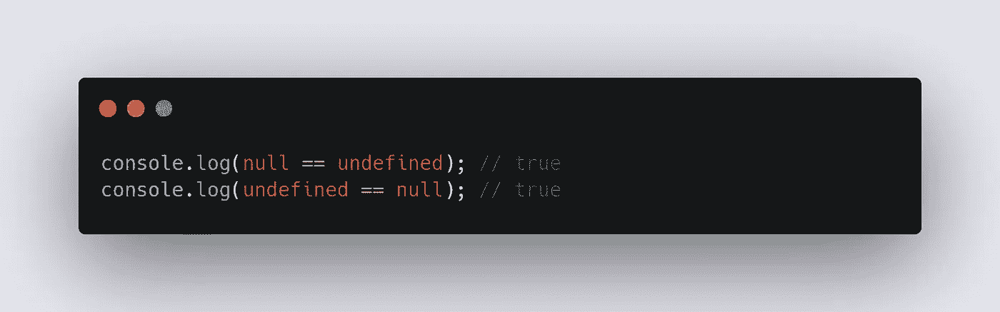

# = = & = = = JavaScript 中的运算符。

> 原文：<https://medium.com/codex/operator-in-javascript-ea971c7b2a6?source=collection_archive---------8----------------------->

如果你来自另一种编程语言，比如 C++、Java 或 Python。对你来说，这可能是新的有趣的东西。就像我一样！！如果这是你的第一门编程语言，那么你应该知道，这是非常独特的东西——JavaScript。

那么我们开始吧，那么这些运算符==和===是什么呢？

**==是抽象的等式运算符===是严格的等式运算符。**

> 主要区别在于，它们都先进行类型检查，如果两个操作数的类型是相同的数据类型，那么操作就交给严格相等运算符，如果类型不同，那么操作就交给抽象相等运算符，抽象相等将相应地对两个操作数进行强制。

在第一行代码中，JavaScript 将检查左操作数和右操作数的类型，如果它们相同，那么它将把它交给严格的等式运算符。现在你可能对“交出来”的含义感到困惑了？这意味着它将在内部调用严格相等运算符。

## 首先让我们从第一个操作员开始，

# 1.严格相等运算符(===):

## **严格相等(===)运算符**，其中 **x** 和 **y** 将是左右操作数，将产生**真**或**假:—**

**1。如果 type(x) === type(y ),那么它将返回 true。**

## **2。如果类型(x)是数字:**

→如果 x 是 **NaN，**返回 false。

→如果 y 是 **NaN，**返回 false。

→如果 x 与 y 相同，则返回 true。

# 2.抽象等式运算符:

## **抽象等式(==)运算符**，其中 **x** 和 **y** 将是左右操作数，将产生**真**或**假:——**

1.  如果**type(x)**= =**type(y)**相同，则返回执行**严格相等运算符 x===y.** 的结果

2.如果 x 为**空**且 y 为**未定义，**返回**真。**(反之亦然)

3.如果 **type(x)** 是 **Number** 而 **type(y)** 是**字符串，**则返回比较结果 **x==ToNumber(y)。(**反之亦然)

4.如果 **Type(x)** 为布尔值，则将比较结果**返回 Number(x) == y .(反之亦然**)

5.如果 **Type(x)** 为字符串、数字或符号，而 **Type(y)** 为 Object，则返回比较结果 **x == ToPrimitive(y)** 。(反之亦然)

所以是的，就是这样！！我们已经完成了抽象等式运算符和严格等式运算符。

**注:**

1.JavaScript 使用的函数即 **ToPrimitive()、ToNumber()** 等。它们是抽象操作，由 JavaScript 在内部使用。

2.在 JavaScript 中， **NaN** 是唯一不等于自身的原语值。

来源:[https://262 . ECMA-international . org/10.0/# sec-abstract-equality-comparison](https://262.ecma-international.org/10.0/#sec-abstract-equality-comparison)

感谢您的阅读！！