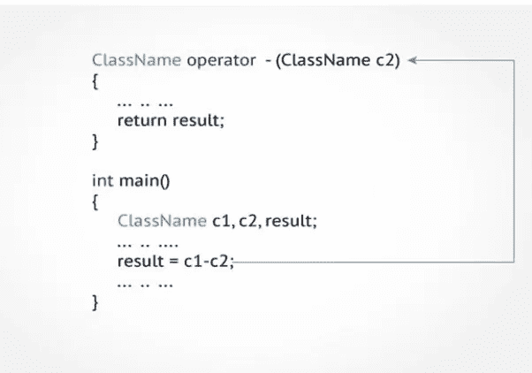

# C++中的运算符重载

> 原文：<https://medium.com/codex/operator-overloading-in-c-b9fa0b2fe96b?source=collection_archive---------10----------------------->

我们可以使用自定义数据类型的操作符的机制。这是 C++语言众多令人兴奋的特性之一。它是一种编译时多态性，试图使用户定义的数据类型的行为与内置类型的行为非常相似。基本上，它为我们提供了对同一操作数执行不同操作的优势。

例如，我们可以在 String 类中重载一个操作符 **+** ，这样我们就可以通过使用 **+** 来连接两个字符串。

几乎所有的运算符都可以重载，只有少数例外。以下是**不能过载的操作员列表**:

1.  范围解析运算符(::)
2.  大小运算符(Sizeof)
3.  三元运算符(？:)
4.  成员选择器(。)
5.  成员指针选择器(*)

# 定义运算符重载

运算符函数的一般形式是:

**returnType classname::运算符 op(arglist)**

**{**

**函数体//任务定义**

**}**

在哪里，

*   **returnType** 是指定操作返回的值的类型。
*   **运算符 op** 为函数名，其中**运算符**为关键字。
*   **arglist** 是参数列表(传递给函数的参数)。

操作员重载是在一个特殊函数的帮助下完成的，称为**操作员函数**，它向操作员描述了特殊任务。

## 注:算子函数和正常函数的区别。

> **正常功能和操作员功能相同。主要区别在于操作符函数的名字总是 operator 关键字后跟操作符符号，当使用匹配操作符时调用它。**

# **运算符重载规则**

1.  只能重载现有的运算符。无法创建新的运算符。
2.  重载运算符必须至少有一个用户定义类型的操作数。
3.  重载运算符必须遵循原始运算符的语法规则，它们不能被重写。
4.  **友**函数不能用来重载某些运算符(=、()、[]、- >)。
5.  由成员函数重载的一元运算符不带显式参数，也不返回显式值，但是由友元函数重载的运算符只带一个参数(相关类的对象)。
6.  当使用通过成员函数重载的二元运算符时，左边的操作数必须是相关类的对象。
7.  由成员函数重载的二元运算符有一个显式参数，由友元函数重载的二元运算符有两个显式参数。

**运算符重载示例:**

一元运算符中运算符重载的例子:
//一元运算符只对一个操作数进行运算。
//重载一元减量运算符- -。

> #包括<iostream></iostream>
> 
> 使用命名空间 std
> 
> 班级长度{
> 
> 浮点值；
> 
> 字符串单位；
> 
> 公共:
> 
> length(){ }//构造函数 1
> 
> length(浮点值，字符串单位){ //构造函数 2
> 
> 这个->值=值；
> 
> 这个->单位=单位；
> 
> }
> 
> 长度运算符—(int){//减量函数覆盖它会将值减 1
> 
> this-> value-= 1；
> 
> 返回* this
> 
> }
> 
> void display(){ //这个函数将显示数值和单位
> 
> printf("%.2f "，this-> value)；
> 
> cout <<this->单位<</this->
> 
> }
> 
> };
> 
> int main(){
> 
> length height; // invokes constructor
> 
> height = length(5.5, “feet”);
> 
> cout<
> 
> height.display();
> 
> height — ;
> 
> cout<
> 
> height.display();
> 
> return 0;

**输出:** 下降高度= 5.50 英尺前
下降高度= 4.50 英尺后

# **注:**

> 递增和递减运算符可用于递增/递减前或递增/递减后。
> 
> **预增减的实现:**
> 
> returntype class::operation op(){ }
> 
> **岗位增减实施:**
> 
> returntype class::operation op(int){ }

重载二元运算符的示例:

//处理两个操作数。

> #包括<iostream></iostream>
> 
> 使用命名空间 std
> 
> 类复合体{
> 
> 浮点 x，y；//实部、虚部
> 
> 公共:
> 
> Complex(){ } //构造函数 1
> 
> Complex(float real，float imag) //构造函数 2
> 
> {
> 
> x =实数；y = imag
> 
> }
> 
> 复数运算符+(复数)；
> 
> void 显示(void)；
> 
> };
> 
> 复杂复杂::运算符+(复杂 c){
> 
> 复杂 t；//临时
> 
> t . x = x+c . x；//浮点加法
> 
> t . y = y+c . y；
> 
> 返回(t)；
> 
> }
> 
> void Complex :: display(void){
> 
> cout << x << “ + i “ << y <
> 
> }
> 
> int main()
> 
> {
> 
> Complex c1,c2,c3;
> 
> c1=Complex(1.4,2.3); //invokes constructor 2
> 
> c2=Complex(3,4.2); //invokes constructor 2
> 
> c3=c1+c2;
> 
> cout<< “c1 = “;
> 
> c1.display();
> 
> cout<< “c2 = “;
> 
> c2.display();
> 
> cout<< “c3 = “;
> 
> c3.display(); // result
> 
> return 0;
> 
> }

**输出:** C1 = 1.4+I 2.3
C2 = 3+I 4.2
C3 = 4.4+I 6.5

重载指向成员(->)的指针运算符的示例:

//此运算符通常与对象指针结合使用，以访问对象的任何成员。

> #包括<iostream></iostream>
> 
> 使用命名空间 std
> 
> 类别号{
> 
> 公共:
> 
> int n；
> 
> num(int i){
> 
> n = I；
> 
> }
> 
> num*运算符-->(void)
> 
> {
> 
> 还这个；//返回指向自身的指针
> 
> }
> 
> };
> 
> int main(){
> 
> 数字 N(3)；
> 
> num *Ptr= &N;
> 
> cout <
> 
> cout< n = " < <ptr->n <</ptr->
> 
> cout< n = " <<n.n n="" using="" overloaded="">运算符</n.n>
> 
> 返回 0；
> 
> }

**输出:**

N . N = 3
Ptr->N = 3
N->N = 3

上面的程序演示了->操作符的正常(Ptr->n)和重载(N->n)行为。