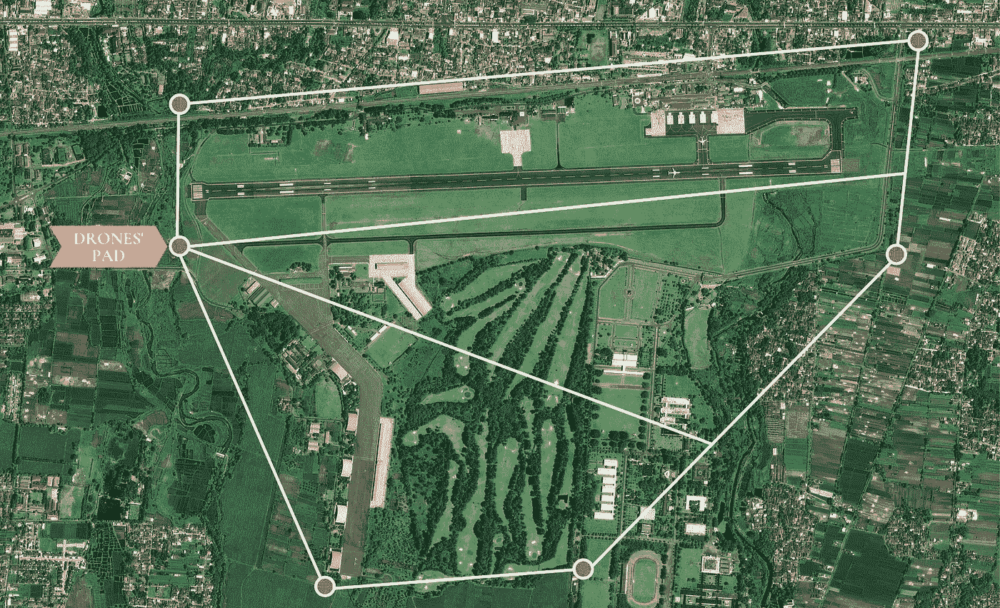
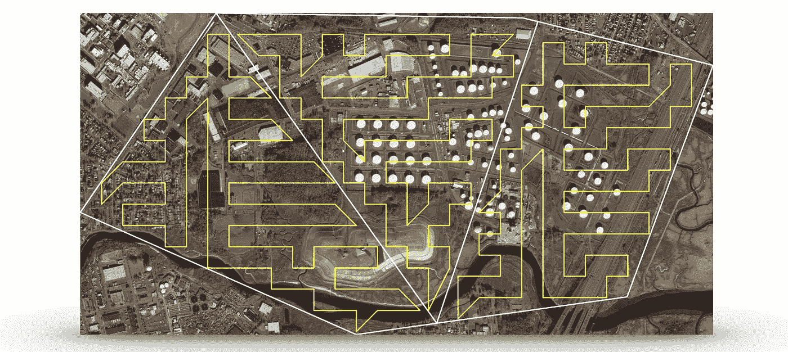
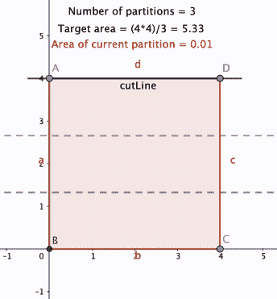
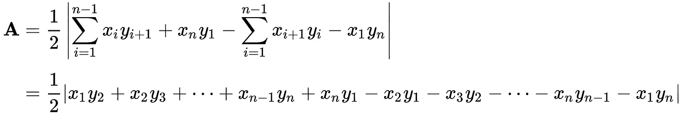
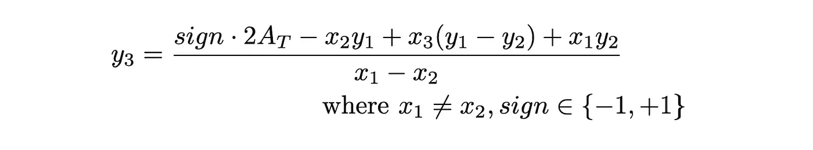
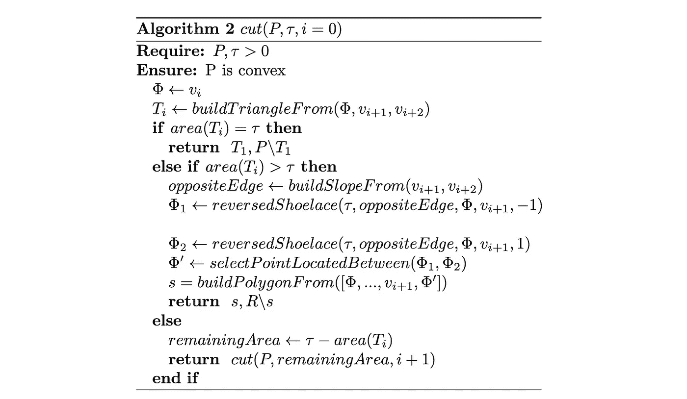
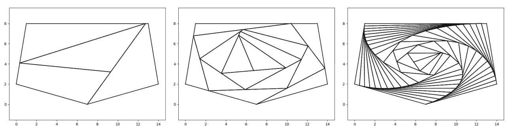
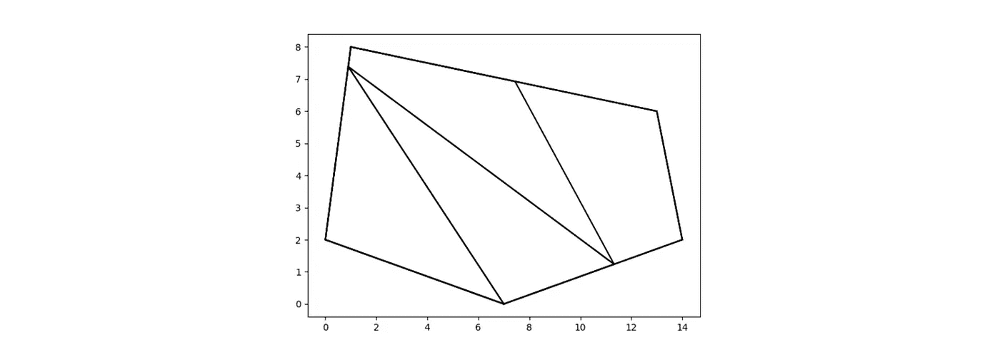

# 无人机和无人驾驶飞机在协同飞行环境中的最佳区域划分

> 原文：<https://medium.com/codex/optimal-region-partitioning-for-uavs-and-drones-in-cooperative-flight-settings-c0764a6450f9?source=collection_archive---------8----------------------->

## [法典](http://medium.com/codex)

## **区域划分的最优算法(可用 Haskell 和 Python 实现)。**

三架无人机的分区示例(飞越的子区域具有相同的面积)。

# 介绍

合作无人机系统越来越有利于空中跟踪任务。例如，它们被用于野火、洪水和失踪等灾难中。在本文中，我们提出了一个优化的划分算法，它通过分而治之的策略来改进任务处理。请注意，这篇文章是关于优化飞行计划算法的**系列文章的一部分，这些文章促进了快速有效的任务计划。一篇即将发表的论文将讨论另一种[算法，该算法生成的飞行计划以最短路径详尽地覆盖指定区域](https://github.com/mdiamantino/cyclic-flight-plan-travelling-salesman-problem)，从而确保优化的最大信息收集(参见下图)。**

现在是时候研究在合作环境中优化任务规划的一个基本特性了。每架无人机都应该公平地参与主要的空中跟踪任务，就像蜂群中的蜜蜂一样。这个怎么翻译成具体的术语？任务所涉及的区域需要划分为无人机将要飞越的同一区域的扇区。这个问题似乎可行。毕竟，举例来说，谁没切过蛋糕呢？

# “公平切饼”问题

为两位客人把一个圆形蛋糕分成两份，无疑是简单的。如果我们多了两个客人，我们自然会把前面的两部分垂直切成两半。如果客人的数量每次增加一倍，我们就会无意识地重复每一块蛋糕，从弧形的中心到蛋糕的中心进行切割。我们将通过递归分割来“分而治之”解决问题。如果客人的数量是奇数或者不是前一个的两倍，例如 7 个或 15 个，该怎么办？正如你所想象的，操作变得不直观，不再是“小菜一碟”。要保证从第一次尝试开始，每个人都能得到同样大小的一块，的确是一项挑战。很可能，我们可能要从某人的棋子中取出部分，加到原本倒霉的客人身上。最终，这意味着大量的测试或裁剪，以及一些令人尴尬的错误。
当我们考虑无人机需要监控不同形状(不一定是圆形)的区域的现实场景时，最初的困境变得更加复杂。

在 [Unsplash](https://unsplash.com?utm_source=medium&utm_medium=referral) 上由 [Toa Heftiba](https://unsplash.com/@heftiba?utm_source=medium&utm_medium=referral) 拍摄的照片

## 一些术语

如果我们假设每个客人都有能力决定他/她的份额是否公平，我们称这些客人为“**代理人**”。在我们的原始问题中，我们希望保证没有代理人感到“嫉妒”:这意味着每个份额被认为至少与其他份额一样有价值(根据他/她对公平的主观定义)。这种划分叫做**免嫉妒划分**。分割方法也应该是"**帕累托有效的**"，这意味着协议不会在不使另一个代理的份额变坏的情况下使一个代理的条件严格地"变好"。在我们的案例中，**帕累托最优分割**是一种分割方法，在这种方法中，不可能在不**客观上**损害其他代理的份额的情况下将更多份额分配给代理。

# 直觉方法

对于凸多边形，最自然的方法之一是追踪一条假想线，并将其向特定方向移动，直到我们正在“填充”的子多边形具有所需的面积。这种方法对人类来说似乎很幼稚，但是它很费力，并且经常导致近似的划分。问题是我们要以越来越小的步长移动假想线，以提高划分区域的正确性。换句话说，我们越想接近目标区域，需要的步长就越小。Even 和 Paz [*]对这种方法进行了优化，得到了一种运行于 O(n log n)的高效算法。

直观的方法(注意，几何方法将给出直接的划分)

# 所提出的方法

本文旨在提出一种算法，利用解析几何方法确定分割问题的最优解。让我们先了解一下大局。假设我们知道如何从一个区域中切割出一个特定区域的分割。在这种情况下，我们删除原始多边形的这一部分，并对剩余的多边形再次应用相同的算法。我们很容易递归地理解这个“分而治之”的过程。在下面的代码中，我们给出了迭代和递归函数。

Python 中的递归方法

Python 中的迭代方法

Haskell 实现的主要功能

# 查找一个分区

现在的问题是能够从主要区域中切割出特定区域的子多边形。在给出的算法中，我们首先选择一个顶点，我们将从该顶点执行切割。我们称这个顶点为“**指定顶点**”(以下用**φ**表示)。一旦选定，主要的想法是建立一个三角形 **T** ，它包括φ和两个相邻的顶点 v1，v2。

*   如果这个三角形区域 T 的面积等于期望的面积，我们需要通过从初始多边形中移除 T 来执行具体的切割操作。因此，当前客人立即获得完美的份额。
*   如果 T 的面积大于要求的面积，我们将寻找一个"**魔点"**φ'(！= v2 ),使得从指定顶点φ和 v1 和φ’构建的子多边形具有目标面积。我们在哪里可以找到φ？它不位于边缘(φ，v1)；否则，产生的部分将是一条线。它也不在三角形之外，因为最终形状的面积甚至会比 T 的面积更大。我们推断φ'位于边(v1，v2)上。我们还不知道如何找到那个点，但知道它所在的斜率无疑会帮助我们，因为从几何角度来看，我们正在应用越来越多的约束。
*   否则；如果 T 的面积小于目标面积，我们推断“魔点”φ'不会在 T 的任何边上。因此，我们需要像以前一样继续研究相邻三角形 T '上的φ'，但使用不同的目标面积=原始目标面积-面积(T)。

正如我们所观察到的，如果我们知道如何在一个三角形内找到φ——这样切割部分就有一个目标区域——那么，我们最初的问题就解决了。

提取一个分区的函数“cut”的 Python 实现

Haskell 实现的函数“cut”提取一个分区

# 魔点φ'的研究

## 简单多边形

由于所提出的算法在简单的(以及凸的)多边形上操作，我们将在此简要定义该类型形状的属性:

*   多边形包围一个区域(它不包含空腔)。
*   每条边通过一个点连接到另一条边。该点位于边段的两端之一。因此，多边形不与自身相交。
*   每个顶点只是两条边的交汇点。因此，边的数量总是等于顶点的数量。

## 高斯面积公式

**高斯面积公式**

原来的问题现在变成了寻找一个位于三角形边上的点。子多边形产生于:这个“魔点”，它的前一个顶点 v1 和指定的顶点，将具有目标区域(小于原始区域)。“高斯面积公式”(或鞋带或测量员公式)用于确定简单多边形的面积，以其顶点的坐标作为输入。有了这个知识，让我们根据我们的主要问题进行推理:我们可以尝试反转这个公式，这样，如果我们已经有了一个目标区域-并且我们没有顶点-我们可以找到可能满足高斯面积公式等式的坐标，即我们的魔点φ’。例如，下面是三角形 T 的高斯面积公式:

在原问题中，我们已经知道三角形的面积(即目标面积)，但我们没有它的一个顶点φ' =(x₃，y₃).因此，我们通过颠倒鞋带公式来进行:

这个公式不足以解决问题，因为它会产生一组无穷多的“魔点”。因此，我们需要施加额外的约束来确定精确的点。如果你记得我们之前提到的条件(第二步“找到一个分区”)，我们现在知道φ'必须位于面向指定顶点φ(当前三角形的)的线段上。为了从数学上表达这种约束，我们假设重点是:

1.  在位于边缘 v1、v2 的线上(如下图)

2.因为下面的方程组将生成两个点，我们仍然需要强制坐标在 v1，v2
之间(即位于线段上—而不仅仅是直线上)。

Python 实现

Haskell 实现

# 整体情况

主要问题是:给每架无人机分配一个子区域，每个分区必须有相同的区域(以公平操作)。这个问题的另一种解释是从原始区域“切割”一部分(具有目标区域),然后在另一个多边形上递归地继续相同的过程。使用三角测量和逆高斯公式，我们计算一个点的坐标，使得结果分区具有目标区域。

# 算法的复杂性

用来寻找魔点(崇敬的鞋带)的方程是一个直公式；其复杂度为 O(1)。同样，在" *cut* "算法中调用的其他每个函数都有固定的执行时间(除了对自身的递归调用)。因此，“*截*的复杂度只取决于它调用自己的次数。正如我们之前看到的，算法“*切割*”仅当多边形三角形中的一个包含魔点时才返回两个子多边形(这样得到的多边形具有所要求的面积)。)因此可以理解，在最坏的情况下，魔点属于最后访问的三角形。更具体地说，它将位于倒数第二条边上(从指定的顶点开始)。当顶点数为 **|V|时，凸多边形中有|V|-2 个三角形(具有相同的顶点)。因此，如果“ *cut* ”在第一个三角形中没有找到临界点，它调用自己来访问第二个三角形，以此类推，直到最后一个。所以在最坏的情况下，“ *cut* ”调用自己|V|-3 次。现在让我们检查一下高级算法，它使用“ *cut* ”来执行分区。我们注意到“*切割*”是唯一没有固定时间的操作。我们(从主算法中)调用这个过程多少次？它完全取决于原始多边形的被请求分区的数量。停止条件是我们有 **n 个分区**；因此，总有 n-1 个调用(因为最后一个是“剩余”的一个)。如果“cut”需要访问所有三角形并在最后一个三角形上找到魔点，这意味着对于所有剩余的分区，“cut”将只调用自己一次(因为该形状已经是一个三角形—并且它是原始三角形的最后一个)。因此，在主算法中，第一个调用最多会导致|V|-3 个调用，而其他 n-2 个调用将只需要执行一次“cut ”,导致最坏的情况是|V|-3+n-2 = |V|+n — 5，复杂度为 **O(|V|+n)** 。**

# 算法的完整实现

文章中显示的几个小功能被省略了。如果您对完整的实现感兴趣，请访问以下存储库:

*   Python 实现(带 Matplotlib 可视化):[https://github . com/mdiamantino/optimal-region-partitioning-convex-polygons-python](https://github.com/mdiamantino/optimal-region-partitioning-convex-polygons-python)
*   Haskell 实现:[https://github . com/mdiamantino/optimal-region-partitioning-convex-polygons-haskell](https://github.com/mdiamantino/optimal-region-partitioning-convex-polygons-haskell)

## 指定顶点的选择

n = 4，n = 16，n = 64 的螺旋模式

最后，有趣的是，指定顶点的选择会影响整体划分。例如，通过选择以前的魔点作为新指定的顶点，分区将形成螺旋模式分区(见上图)。我们也可以选择锯齿形分区(见下图)。在本文和每个相关的实现中，我们更喜欢选择相同的第一个指定顶点，因此，一个放射状的图案。后者是对无人机原始问题优化最多的一个，因为所有无人机都将从同一个发射台起飞；因此，他们可以立即进入指定的飞行区域。

曲折图形