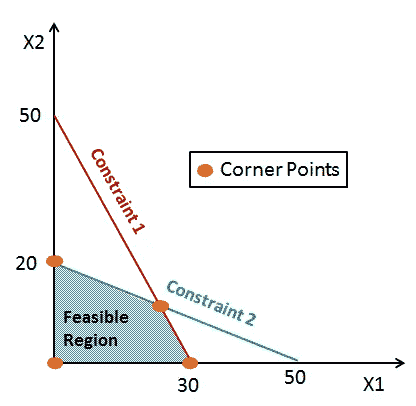
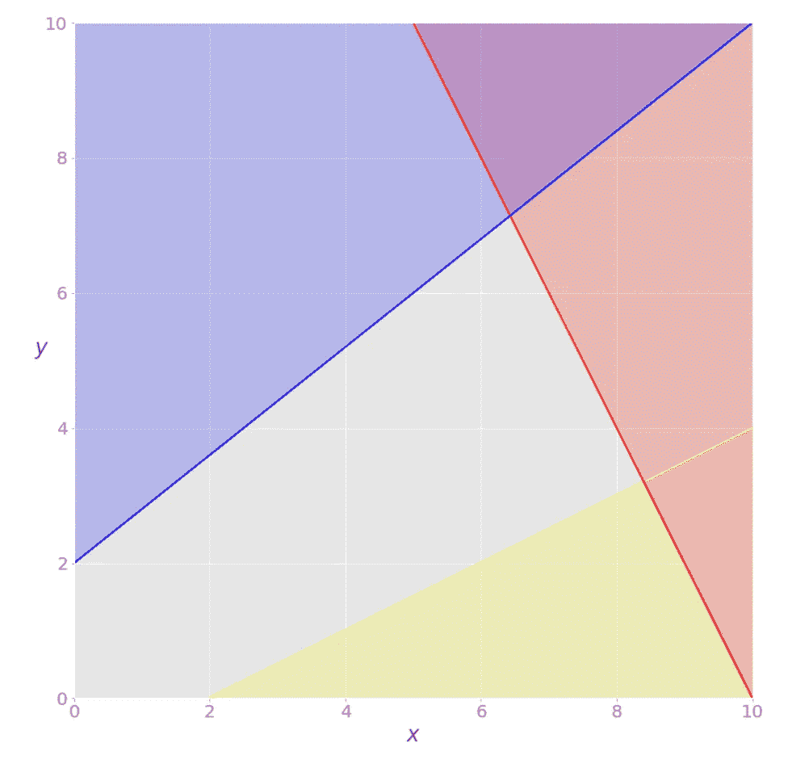

# 最优化和线性规划

> 原文：<https://medium.com/codex/optimization-and-linear-programming-f0b1faab1e5a?source=collection_archive---------5----------------------->

艾萨克·史密斯在 [Unsplash](https://unsplash.com?utm_source=medium&utm_medium=referral) 上拍摄的照片

优化；一个我们在日常生活中都会用到的词。但本质上是什么呢？如何以编程方式优化任何东西？你所有的回答都将在下面的段落中得到回答。

# 什么是优化？

我们都试图充分利用日常生活中有限的资源。它本质上是一种生活方式。我们周围的一切，从电器到我们的机械汽车，都使用优化。

整体而言，这是一个数学问题。*优化是在约束环境下，通过控制一组决策，找到给定目标的最大值或最小值的过程。*在这里，目标可以是任何事情，例如，在资金有限的情况下去特定的城市旅行，或者寻找最佳股票进行投资以实现利润最大化。应用程序是无止境的！

最简单的优化方法之一是使用线性规划(LP)。几个简化的假设允许你处理一些非常复杂的优化问题。分析人员必然会遇到要用线性规划来解决的应用和问题。

# 线性规划导论

线性规划本质上是最优化的一个子集。在线性规划或线性优化中，我们试图使用各种决策变量为线性约束系统的线性目标函数找到最优值。

来源:数据营

当问题的目标是最大化某个值，并且有一个线性不等式系统定义了问题的约束时，可以使用线性规划来解决问题。

**约束** ~约束定义为不等式，其值决定变量如何取值。线性规划要求所有约束都是线性不等式。

**目标函数** ~目标函数**是一种最大化(或最小化)某物的方法。这个东西是一个数值。在现实世界中，它可能是一个项目的成本，一个生产数量，利润值，甚至是从一个简化的过程中节省下来的材料。使用目标函数，你试图达到一个产量、利润、资源使用等目标**

****目标函数系数** ~决策变量改变一个单位时目标函数值的变化量由相应的目标函数系数给出。**

****决策变量** ~这些未知量是作为线性规划问题解决方案的输出进行估计的。**

**为了更好地理解事情，让我们看一个简单的优化问题。**

**假设我们想最大化函数 z = f(x，y)-> **z = x + 2y****

**受以下约束:
*-2x+y≤20
-4x+5y≤10
-x+2y ≥- 2
x≥0
y≥0***

**我们需要确定独立变量，在本例中是 x 和 y，它们被称为**决策变量**。要被最大化或最小化的决策变量的函数——在这种情况下，*z*——被称为**目标函数**、**成本函数**，或者仅仅是**目标**。我们需要满足的不等式叫做**不等式约束**。**

**让我们试着想象一下这个问题:**

****

**可行解:灰色区域代表所有可行解的空间**

**这里，方程***-2x+y≤20****用**红色**线*，****-4x+5y≤10****用* **蓝色**线和 *-x + 2y ≥ -2* 用**黄色**线表示。在应用了最后两个不等式后，用灰色表示的有界区域给了我们所有可行解的论域。现在，我们的目标可以是最大化或最小化目标函数。对应于最大 *z* 的可行解是**最优解**(在这种情况下是红线和蓝线的交点)。如果你试图*最小化*目标函数，那么最优解将对应于它的可行最小值(原点)。***

*****不可行线性规划问题** —不可行是指没有解的线性规划问题。它通常发生在没有解决方案可以同时满足所有约束的时候。***

*****无界线性规划问题** —无界线性规划问题是指可行域无界且解不有限的问题。本质上，这意味着你的一个变量不受约束，可以达到正或负的无穷大，这意味着目标也是无穷大。***

# ***用于线性编程的 Python 库***

******

***照片由 [Clément Hélardot](https://unsplash.com/@clemhlrdt?utm_source=medium&utm_medium=referral) 在 [Unsplash](https://unsplash.com?utm_source=medium&utm_medium=referral) 上拍摄***

***线性编程的 python 库有很多实现。其中大多数贵重物品是:***

*   ***[果肉](https://pypi.org/project/PuLP/)和/或[果肉](http://www.pyomo.org/)。纸浆是一个用 Python 写的 LP 建模器。Pyomo 是一种基于 Python 的开源优化建模语言，具有多种优化功能。***
*   ***[CVXOPT](http://abel.ee.ucla.edu/cvxopt/) 是 Lieven Vandenberghe 和他的一些合作者写的。CVXOPT 是一个基于 Python 编程语言的免费凸优化软件包。***
*   ***谷歌用于组合优化的软件套件。这是一个开源、快速、可移植的软件套件，用于解决组合优化问题。***
*   ***[Scipy.optimize.linprog](https://docs.scipy.org/doc/scipy/reference/generated/scipy.optimize.linprog.html) 是 Python 库，用于最小化受线性等式和不等式约束的线性目标函数。***

***首先，你可以想出一个问题，试着通过编程来优化它。最好的学习方法是开始做。下面我会链接一些资源，祝你一切顺利！***

## ***资源:***

1.  ***[Scipy 官方文档](https://docs.scipy.org/doc/scipy/reference/generated/scipy.optimize.linprog.html)***
2.  ***[用 Python 解决你的第一个线性编程程序](https://towardsdatascience.com/solving-your-first-linear-program-in-python-9e3020a9ad32)***
3.  ***[线性规划换浆](https://www.geeksforgeeks.org/python-linear-programming-in-pulp/)***
4.  ***[线性规划简介—分析 Vidhya](https://www.analyticsvidhya.com/blog/2017/10/linear-optimization-in-python/)***

***我希望上面的文章能帮助你理解围绕这个话题的所有混乱。现在，让我们在这里结束它。如果您想提供反馈或有任何疑问，请在 Twitter 上联系我。
**和平**👋***