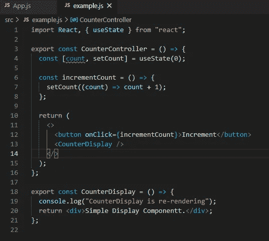
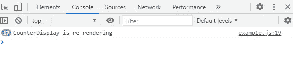
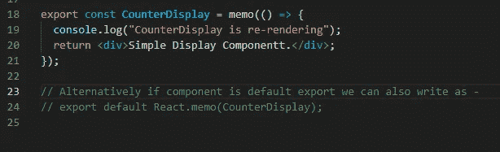
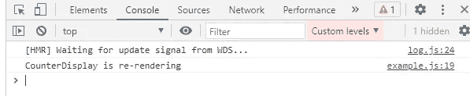
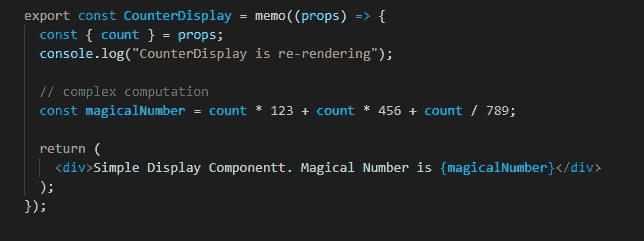
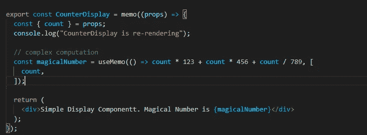
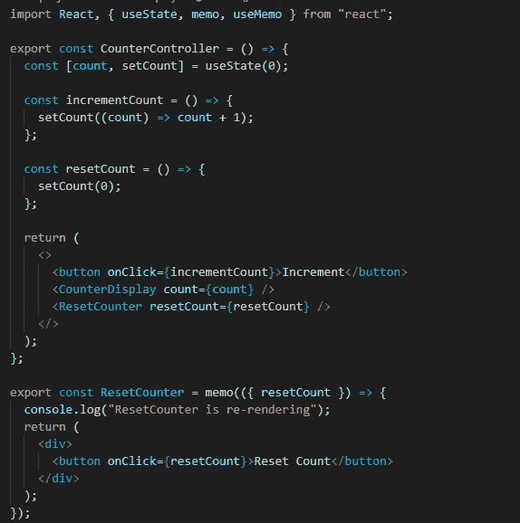
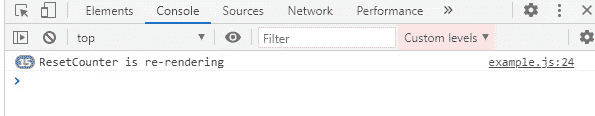
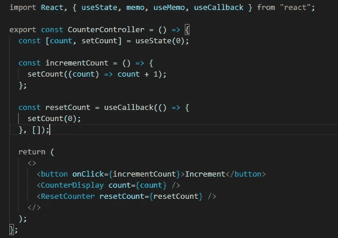
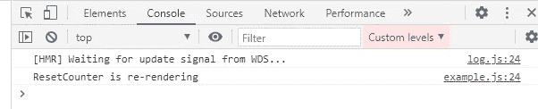

# React 应用程序的优化技术可提高性能

> 原文：<https://medium.com/codex/optimization-techniques-for-your-react-app-for-better-performance-143c86663776?source=collection_archive---------6----------------------->

我们都知道 ***React*** 是著名的用于 web 开发的 javascript 框架之一。使用 React 开发的网络应用以其*速度*和*高效性能*而闻名。

虽然 React 提供了比其他可用框架更好的速度和效率，但我们可以通过一些简单的**优化**技术为我们的应用程序增加一些效率。

如果我们避免和防止*不必要的渲染*，web 应用的**速度**和**性能**可以得到提高。

我们先找出父子组件中重渲染的原因。

1)组件的**本地状态**被**改变/更新**。

2)传递给组件的**道具**被**改变/更新**。

3)调用组件中的 **forceUpdate**

第三点完全取决于用户需要调用 forceUpdate 的用例及场景，这种用例不在我们的控制范围内，但第一点和第二点在我们的控制范围内，可以进行优化。

现在让我们来看一个不想要的重新渲染场景

我们有两个组件，分别是*计数器* & *计数器*。

反控制器和反显示器

*计数器控制器*有本地状态来维持*计数器*的值。以及增加计数值的成员函数 *incrementCount* 。我们已经把这个函数传递给了按钮的 *onClick* 事件。

计数器显示是一个显示静态字符串的简单组件。因此*计数器显示*与我们的*计数器控制器*的状态无关，不应受其状态变化的影响。

我们已经在子组件 ie 中添加了一个控制台日志。*计数器显示*组件，以检查其何时被重新渲染。因此，当我们单击按钮来增加计数状态时，我们会在控制台中看到“*计数器显示正在重新呈现*”。

计数器显示多次重新渲染

所以这是我们的反显示组件的**不想要的重新渲染**。这个组件可能会在我们的应用程序中的许多地方使用，这将影响我们的应用程序性能。

那么如何才能避免这种不必要的渲染呢？

我们的救星来了！

> 在计算中，*内存化*或*内存化*是一种优化技术，主要用于通过存储昂贵的函数调用的结果并在相同的输入再次出现时返回缓存的结果来加速计算机程序。

React 为我们提供了一些内部使用**记忆化**概念的特性。我们可以使用这个特性来防止不必要的渲染。

其中一个特色就是 **React.memo()**

**1)** **React.memo()**

我们可以将我们的功能组件包装在 *React.memo()中。*

备忘录包装的柜台展示

*React.memo()* 采用两个参数。要记忆的组件和其他参数是可选的比较函数。(默认情况下做一个简单的比较)

现在让我们使用 *React.memo()* 来包装我们的 *CounterDisplay* 组件并检查控制台日志。

防止了不必要的反显示渲染。

哇！我们可以看到，每次单击 add 按钮时，组件都不会重新呈现。

2)使用备忘录()

与 React.memo()类似的是 **useMemo** 钩子。很多时候，我们通过执行一些数据操作操作来计算功能组件中的一些复杂的 T21 值，每当我们的组件或包含这个计算值的容器被重新呈现时，这个复杂的值就会被再次计算。

这会影响性能，如果我们**减少**计算复数值的次数，性能会得到优化。这可以使用 useMemo 钩子来完成

useMemo hook 的语法与 useEffect 非常相似。我们在依赖数组中传递依赖关系。必须重新计算复数值的更改值在依赖数组中传递。

让我们看一个使用备忘录的例子

所以在上面的例子中，当我们的*计数器显示*组件重新渲染时，我们的*魔术数字*总是被重新计算。但是如果我们看到 *magicalNumber* 的值只依赖于 count prop。因此只有当计数器属性发生变化时，才应该重新计算它。

现在让我们将这个*神奇的数字*包装在使用备忘录中

如果相关性没有改变或更新，则存储并使用先前计算的值。这减少了组件不必要的重新计算和重新渲染。

**3)使用回调**

让我们看一个带有额外组件的相同示例。我们将创建一个新的*重置计数器*组件，它将重置计数器状态。

让我们在父组件*反控制器*中定义*重置计数*函数，并将其作为 prop 传递给子组件*重置计数*。在*重置计数器*组件中添加一个控制台日志，以检查它何时被重新渲染。

我们可以看到，在增加计数时，我们的 *ResetCounter* 组件得到了不必要的重新呈现。

我们可以通过使用 react ie 提供的另一个特性来避免这种情况。**使用回调**

我们的子组件被不必要地重新呈现，因为每当父组件被重新呈现时，一个新的成员函数引用被创建，该引用被进一步传递给子组件。每次重新渲染时，都会创建新的引用，它会强制子组件重新渲染。

**useCallback** 通过记忆函数引用来避免这种情况，只有当它的任何一个依赖项被更新时，函数才会被重新创建。

在包装了 useCallback 之后，我们可以看到我们的子组件在计数改变时没有被重新呈现。

答对了。！我们通过避免不必要的重新渲染优化了应用性能。

因此，遵循编码实践，我们可以提高应用程序的性能。但是正如我们所知，每样东西都有它自己的缺点，所以我们应该准确地使用这个特性，否则它可能会给我们带来不必要的错误。

今天到此为止。谢谢大家！