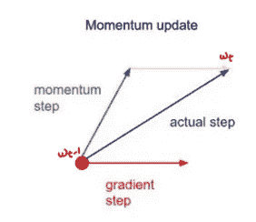
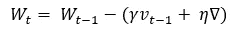

# 深度学习中的优化技术

> 原文：<https://medium.com/codex/optimization-techniques-in-deep-learning-5ac07a6e552b?source=collection_archive---------11----------------------->

坦维·马利克在 [Unsplash](https://unsplash.com?utm_source=medium&utm_medium=referral) 上的照片

在我之前的[帖子](/codex/the-way-i-learned-the-gradient-descent-cb408e6149e4)中，我讨论了梯度下降及其变体是如何工作的。但是，这些优化技术可能并不是在所有情况下都能很好地工作。没有什么理由 SGD 或批量 SGD 不值得每次都使用。

1.  由于我们在深度学习中经常遇到的鞍点，这些优化技术可能不适用于非凸目标函数。

凸函数和非凸函数的区别

2.所有的特征不具有相同的频率，因此相同的学习率不能应用于所有的权重。

3.由于超调或偏离路径，不能使用大的学习速率。

在这篇博客文章中，我们将讨论一些其他流行的可以解决上述问题的优化技术。

1.  带动量的 SGD
2.  困扰
3.  阿达格拉德
4.  RMSProp
5.  阿达德尔塔
6.  圣经》和《古兰经》传统中）亚当（人类第一人的名字

# 1.带动量的 SGD

我们知道 SGD 或小批量 SGD 不使用全部数据来收敛。由于这种数据的缺乏，它试图近似实际路径以达到最佳点。到达目的地的方向是明确的，但在到达目的地的旅途中要经历许多风风雨雨。🙁

> 动量允许我们使用梯度的指数加权平均来抑制振荡，

[SGD 无动量](https://www.willamette.edu/~gorr/classes/cs449/momrate.html)

[带动量的新币](https://ruder.io/optimizing-gradient-descent/index.html#gradientdescentoptimizationalgorithms)

有了动量，就不会再陷入局部极小值，也加快了收敛速度。

我们只改变更新函数来实现动量

更新 SGD 中的功能

查看我之前的[博客](/codex/the-way-i-learned-the-gradient-descent-cb408e6149e4)了解更多关于这个更新功能的信息。

**有两组等式来做指数平均。为了避免混淆，最好了解两组方程式。**

指数加权平均

其中，γ是已知的动量因子，η是学习率。(0

These both set of equations give the same result but with different γ, η values. But I prefer the second set of equations (i.e., eq (3) & eq (4)) for now.

By substituting eq (3) in eq (4), we get:

[[来源](https://cs231n.github.io/neural-networks-3/#sgd))

在上面的等式中，即等式(5)

γV(t-1)是动量步长(绿线)，ηdL/dW(t-1)是梯度步长(红线)。实际步长(蓝线)是动量和梯度步长之和。我们知道动量是梯度的指数平均值。随着迭代次数的增加，动量步长增加(绿线的长度)，实际步长也增加(蓝线)。这就是它如何在每次迭代中收敛得更快。

让我们看看权重是如何随着动量更新的

[图片由作者提供]

这就是 SGD 与动量的工作方式和权重的更新方式。

# 2.内斯特罗夫加速梯度(NAG)

内斯特罗夫加速梯度类似于 SGD +动量，但有微小的区别。在带动量的 SGD 中，我们计算梯度项(ηdL/dW(t-1))和动量项(γV(t-1))并求和以移动到下一个点。但是在内斯特罗夫加速梯度中，首先，我们计算动量并向其方向移动，然后计算该点的梯度(dL/dw’)(这与实际梯度(dL/wt-1)不同)，然后向最终到达实际点的方向移动，即 wt。

简单来说，我们首先从 Wt-1 到 W '，然后到 Wt。

[ [来源](https://cs231n.github.io/neural-networks-3/#sgd)

从 SGD 提供的动力中，我们知道:

现在，为了只在动量步中运动，我们不应该在上面的方程中加入梯度项。

因此，没有梯度项，我们不会移动到 Wt，相反，我们移动到 W’。

注意！它没有梯度步骤。

现在计算从 W '到 Wt 的梯度

“前瞻”渐变

所以，最后的等式看起来像:

你可能会怀疑我们最终会到达同一点(Wt ),那么用内斯特罗夫加速梯度代替 SGD 加动量有什么意义呢？

我们在 W '处计算的梯度被称为“向前看”梯度，这有助于我们向前看我们将要到达的地方。

[ [来源](https://towardsdatascience.com/learning-parameters-part-2-a190bef2d12)

在图(a)中，对于每次更新，损耗减少，并且比之前的步骤行进更多的距离以收敛，这是很大的。但在第 4 次更新时，它超过了，后来，随着第 5 次和第 6 次更新，它又回到了最小损失点。直到前三次更新，SGD 里的一切都是一样的有气势，有 NAG。但是在更新 4 上，你可以看到 NAG 的重要性。我们知道，我们在 NAG 中计算两个部分步骤来达到下一个点。在第四次更新中，第一个部分步骤是 4a，即，在动量方向上移动，在 4b，我们计算前瞻梯度以查看我们正在前进的方向并移动到该点。因此，在更新 4 结束时，与具有动量的 SGD 相比，NAG 中的过冲减少，并且仅再有一次更新，即第 5 次更新，它就达到最小值。因此，NAG 需要 5 次更新，SGD 需要 6 次更新才能到达同一个目的地。这就是 NAG 和 SGD 有动量的区别。

# 3.自适应梯度

到目前为止，我们讨论的所有先前的优化技术都具有恒定的学习速率。自适应梯度的核心思想是在每次迭代中对每个权重有不同的学习速率。但是为什么不同的学习速度如此重要呢？

基本上，特征可以是稀疏的(包含很少的非零元素)和密集的(包含很少的零元素)。因此，您不能对稀疏和密集要素应用相同的学习速率，因为它们不会以相同的速率收敛。

SGD 的更新功能:

这里，η是学习率，它对于所有迭代中的所有权重都是相同的。

使用 Adagrad 更新功能:

这里η’是学习率，它对于每次迭代中的所有权重都是不同的。

ε是一个小正数，以避免被零整除的错误。

α(t-1)是前一个梯度的平方和。

其中η是恒定的学习速率，η是通过使用先前梯度的所有信息而改变的自适应学习速率。

让我们看一个例子，每个权重在一次迭代中有不同的学习率。

考虑具有两个输入节点和一个输出节点的神经网络。

这里，α对于每个权重是不相同的，并且它的值对于每次迭代是变化的，因此它们对于每次迭代中的每个权重具有不同的学习速率。但是当我们使用 SGD 解决同一个例子时，它看起来是这样的:

η是恒定的学习速率，直到最后一次迭代，它对于所有的权重都是相同的。

到目前为止，adagrad 的一切看起来都很好，但有一个不能忽视的主要缺点，即，

随着迭代次数(t)的增加，α的值增加，然后η'减小。

学习率η'随着每次迭代而降低，然后收敛变得更慢，并且在某一点上η'变得几乎为零。这个问题被称为消失梯度。Adadelta 和 RMSprop 是试图有效解决这种消失梯度问题的其他优化技术。

# 4.RMSProp

在 adagrad 中，为了计算α，我们取梯度平方的和。但是，在 RMSProp 中，我们对梯度平方取指数平均值。

我们实际上是在控制η'中分母项的增长，通过执行指数平均来解决梯度消失的问题。

# 5.阿达德尔塔

Adadelta 与 rmsprop 在η'的分母部分做同样的事情。此外，在 adadelta 中，我们用 delta 的指数平均值替换默认学习速率η。

δ(D)为

看一眼这些方程，你可能会感到困惑。请花时间处理每一行。

# 6.自适应矩估计

动量和内斯特罗夫加速梯度具有恒定的学习速率，并且仅关注于修改梯度部分。Adagrad、adadelta 和 RMSProp 都是关于修改学习率的。Adam 是 momentum 和 RMSProp 的结合，它侧重于修改两者，学习率和梯度，以获得更好的结果。

在统计学中，均值常被称为一阶矩，方差常被称为二阶矩

在 RMSProp 中，我们做了 *gₜ* 的指数加权平均(EWA)来获得学习率η’，在 SGD 中，我们做了 gₜ的指数加权平均(EWA)来获得动量。

*gₜ* 和 *gₜ* 的 EWA 是均值(一阶矩)和方差(二阶矩)的估计值，将它们表示为 *mₜ* 和 *vₜ*

但是当我们用零初始化 *mₜ* 和 *vₜ* 时，它们偏向于零。因此，我们计算一阶和二阶矩中的偏差修正。(我强烈推荐你观看[吴恩达偏差修正视频](https://www.youtube.com/watch?v=lWzo8CajF5s)来更好地理解这一点)。

更新函数看起来与 RMSProp 的相似

由于这些协同修改，Adam 在大多数情况下都比其他优化器工作得更好。

这就是了。我们已经走到了尽头。谢谢你一直读到最后，如果有任何建议或反馈，请在评论区告诉我。下次博客再见！😊

## 参考资料:

1.  [塞巴斯蒂安·鲁德的博客](https://ruder.io/optimizing-gradient-descent/index.html#gradientdescentoptimizationalgorithms)
2.  [cs231 讲义](https://cs231n.github.io/neural-networks-3/#sgd)
3.  阿达格勒的参考资料