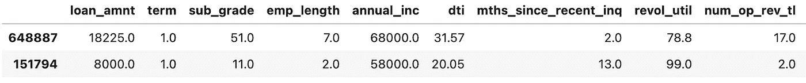
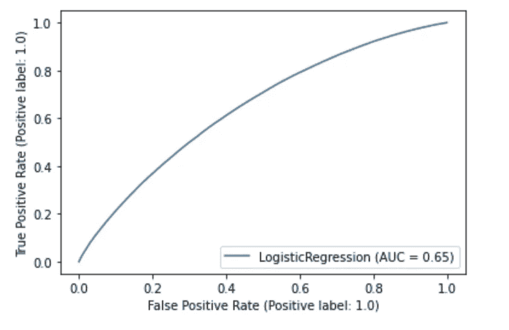
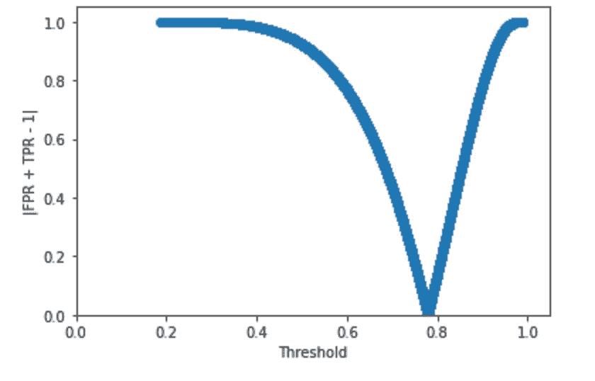
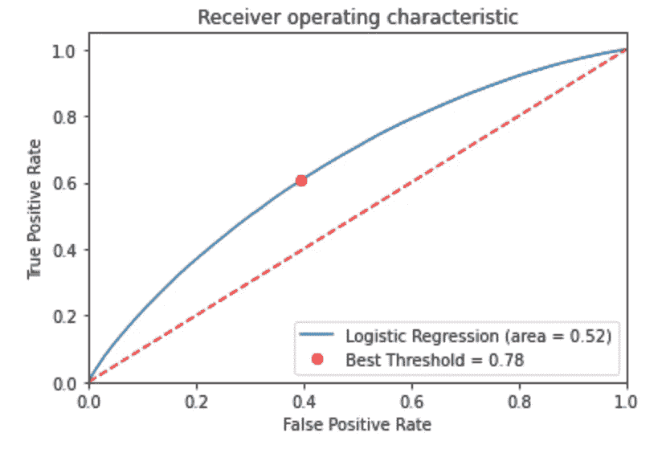
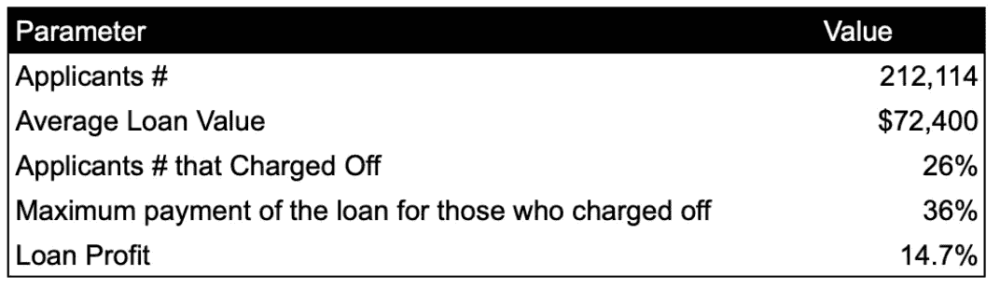
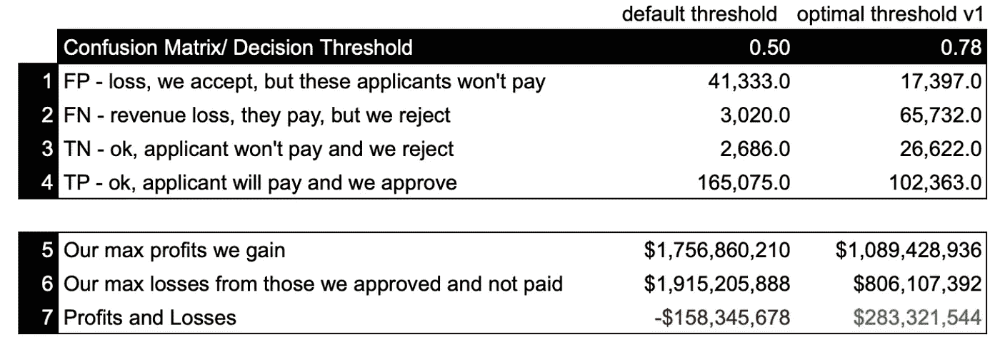
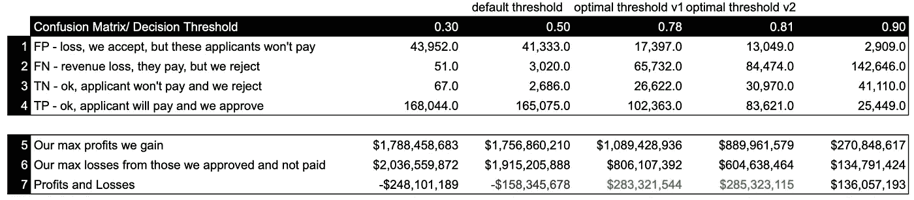
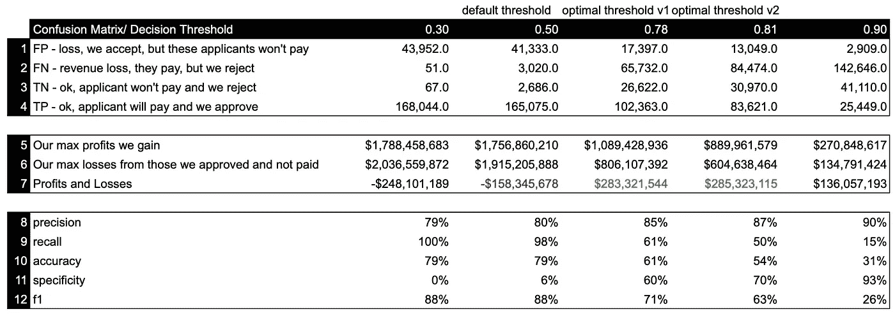

# 优化您的决策阈值，或者为什么 ML 模型度量并不总是有助于构建业务相关的模型

> 原文：<https://medium.com/codex/optimize-your-decision-threshold-or-why-ml-model-metrics-are-not-always-helpful-to-build-a-b84821c51e2?source=collection_archive---------5----------------------->


什么是决策阈值，我们为什么关注它，它如何帮助我们产生最大的商业价值？我们将在这篇文章中涵盖所有这些令人兴奋的问题！

# **首先，什么是决策门槛？**

ML 分类器以概率的形式为您预测的每个样本提供输出，阈值处理作为后处理步骤应用于训练好的模型，以二进制类别的形式返回预测的标签。

假设我们正在解决一个消费贷款行业的问题，我们代表一家贷款公司，对于给定的申请人数据，如收入、债务收入比、贷款历史等，我们的任务是批准或拒绝贷款，以最大化公司收入并限制可能的财务损失。

为了解决这个问题，我们在这个[贷款数据集](https://www.kaggle.com/datasets/mariiagusarova/prepared-lending-club-dataset)上建立了一个简单的逻辑回归模型:

```
from sklearn.model_selection import train_test_split 
from sklearn.linear_model import LogisticRegression loans = pd.read_csv('../input/prepared-lending-club-dataset/mycsvfile.csv') X = loans.drop('loan_status', axis=1) 
y = loans[['loan_status']] X_train, X_test, y_train, y_test = train_test_split(X, y, test_size=0.25, random_state=42, stratify=y) logreg = LogisticRegression() 
logreg.fit(X_train, y_train) print('Accuracy of logistic regression classifier on test set: {:.2f}'.format(logreg.score(X_test, y_test)))
```

现在，让我们检查模型的输出，并使用 predict_proba()方法返回概率，该方法返回按类标签排序的所有类的概率估计值。

```
y_pred = logreg.predict_proba(X_test) 
y_pred.view()[0:2] #to view each class probabilityoutput:
array([[0.37733748, 0.62266252], 
       [0.12955536, 0.87044464]])
```

在这个数据集中有两类:1)偿还贷款的贷款申请人和 2)未能偿还贷款的贷款申请人。

从概率上可以看出，第二个申请人在第一类上的概率是 0.87，而第二类的概率是 0.13。在阅读这些概率时，听起来申请人很有可能偿还贷款。

然而，通过检查第一个申请人，第一类的概率是 0.62，第二类是 0.38。我们如何决定这个申请人可能属于哪一类？

通常情况下我们会用。predict()方法返回预测的标签而不是概率估计值:

```
#predict - Predict class labels for samples in X.
y_pred_c = logreg.predict(X_test)y_pred_c[0:2]output:
array([1., 1.])
```

如您所见，两个申请人都被标记为可能偿还贷款-1 级。这是为什么呢？对于二元分类，正概率≥0.5 的实例通常被预测为正，否则被预测为负，因为默认分类阈值是 0.5。

这个门槛合理吗？让我们检查一下这些申请人的特征，以便有更好的了解:

```
X_test[0:2]
```



我们在这里看到的非常有趣——第一个申请人的 dti 高达 31.57。DTI 代表债务收入比，这是信贷员的一个重要标志。债务与收入的比率越高，申请人无法偿还贷款的风险就越高。

实际上，这个数据集的平均 dti 是 18.6，这意味着这个申请人几乎是平均水平的两倍。

```
X_test["dti"].mean()output:
18.57
```

贷方不太可能贷款给 dti 高于 36%的申请人([参考](https://www.investopedia.com/terms/d/dti.asp))，这意味着我们 32% dti 的案例听起来相当尖锐。

实际上，我们的数据集是不平衡的，在不平衡数据上训练的机器学习分类器容易过度预测多数类。这导致少数类的错误分类率更高，而在许多现实应用中，少数类是我们感兴趣的类。默认的分类阈值 0.5 对于不平衡的数据往往不理想，调整它是一个很好的策略。

让我们后退一步，看看这个默认阈值的混淆矩阵:

```
from sklearn.metrics import confusion_matrixlogreg_conf_matrix = confusion_matrix(y_test, y_pred_c)
logreg_conf_matrixoutput:
array([[ 2686, 41333], 
      [ 3020, 165075]])
```

该模型很好地识别真阳性，然而，该模型根本不识别假阴性。在 4.4 万名未能还贷的申请人中，我们实际上只预测对了 6%。

为了优化少数类，让我们应用阈值优化方法。

# 我们如何找到一个最佳决策阈值？

有许多方法来识别分类中的最佳决策阈值，仅举几个例子:通过 F1 分数、G 均值或马修斯相关系数等来最大化平衡的准确性度量。

在本文中，我们将根据这两种方法确定最佳阈值:

1.  基于 ML 模型指标—通过 ROC 曲线；
2.  基于定制的业务模型来最大化业务指标；

# **1-我们如何找到基于模型度量的最佳决策阈值？**

*如果你没听说过 ROC，先读读* [*这篇文章*](/greyatom/lets-learn-about-auc-roc-curve-4a94b4d88152)

*我们的目标是确定最接近 ROC 图左上角的阈值，或者从数学上讲，满足以下等式的阈值:tpr = 1 — fpr。*

*首先，让我们绘制 ROC 曲线:*

```
*#ROC Based Tuning
from sklearn.metrics import roc_curve,plot_roc_curve,roc_auc_score
import matplotlib.pyplot as pltplot_roc_curve(logreg,X_train,y_train)*
```

**

*其次，我们在每个阈值估计 fpr + tpr — 1，以找到最佳值:*

```
*logit_roc_auc = roc_auc_score(y_test, logreg.predict(X_test))
fpr, tpr, thresholds = roc_curve(y_train,logreg.predict_proba(X_train)[:,1],drop_intermediate=False)
plt.scatter(thresholds,np.abs(fpr+tpr-1))
plt.xlabel("Threshold")
plt.ylabel("|FPR + TPR - 1|")
plt.xlim([0.0, 1.05])
plt.ylim([0.0, 1.05])
plt.show()*
```

**

*我们从该图中了解到，fpr + tpr - 1 → 0 处的阈值约为 0.8，我们可以认为这是最佳阈值。*

*这是最佳阈值在 ROC 曲线上的投影:*

```
*o_tpr = tpr[np.argmin(np.abs(fpr+tpr-1))]
o_fpr = fpr[np.argmin(np.abs(fpr+tpr-1))]
o_threshold = thresholds[np.argmin(np.abs(fpr+tpr-1))]
plt.figure()
plt.plot(fpr, tpr, label='Logistic Regression (area = %0.2f)' % logit_roc_auc)
plt.plot([0, 1], [0, 1],'r--')
plt.plot(o_fpr, o_tpr, 'ro', label='Best Threshold = %0.2f' % o_threshold)
plt.xlim([0.0, 1.0])
plt.ylim([0.0, 1.05])
plt.xlabel('False Positive Rate')
plt.ylabel('True Positive Rate')
plt.title('Receiver operating characteristic')
plt.legend(loc="lower right")
plt.savefig('Log_ROC')
plt.show()*
```

**

*建议的阈值是 0.78，这意味着我们在文章开头谈到的概率为 0.62 的申请人现在被认为是 0 类，很可能无法偿还贷款，这在给定申请人数据的情况下更有意义。*

*现在，让我们回顾一下这个阈值的混淆矩阵:*

```
*y_pred_opt_1 = (logreg.predict_proba(X_test)[:, 1] > o_threshold).astype('float')
confusion_matrix(y_test, y_pred_opt_1)output:
array([[ 26711,  17308],
       [ 66083, 102012]])*
```

*60%的少数类现在被正确预测，这是 10 倍的改进，但是代价是 TPs 从 160K 下降到 102K。*

*从商业角度来看，我们如何知道这个最佳阈值是否给了我们更多的价值？当然，我们可以按常规方式查看模型指标，如准确性、召回率等，但是，我建议我们直接将混淆矩阵的结果与业务指标联系起来。*

# *2-我们如何找到基于模型度量的最佳决策阈值？*

*从商业角度来看，我们希望公司利润最大化，这意味着我们要优化收入或“我们提供的贷款数量”与可能违约的申请人的潜在财务损失之间的平衡。尽管最终不还钱的人是少数，但这对企业有着巨大的财务影响。*

*在构建业务逻辑时，让我们考虑以下情况:1)平均贷款价值和贷款的平均利润，以便计算公司利润 2)即使申请人在某个阶段销账，申请人也会支付一定金额的款项，让我们计算一个平均数，以便计算财务损失。*

**

*通过将混淆矩阵投影到这个模型上，我们现在可以计算利润和损失:*

**

*默认阈值完全超过了我们获得的收入，看第 5 行，我们获得的利润比最佳阈值高 61%，但是，这都是以财务损失为代价的。*

*由于我们批准了太多具有默认门槛的候选人，我们从实际上没有支付的候选人那里损失了很多钱。通过计算 P&L，最佳阈值确实有助于我们公司保持盈利+2.83 亿美元，而默认阈值为-1.58 亿美元。*

*我们现在可以直接基于业务成果优化阈值，而不是基于模型指标运行优化— P&L:*

**

*阈值 0.81(在上表中称为最佳阈值 v2)将为我们提供最大的 P&L 结果。我们可以得出结论，从商业角度来看，这个阈值是最适合使用的。*

*还有一点需要注意的是，我们还要计算每个阈值情况下的流行模型评估指标:*

**

*一个问题是，你真的会仅仅根据这些模型指标来选择 0.81 的阈值吗？*

*0.81 阈值提供了 63%的 f1(0.5 时为 88%的 f1)，54%的准确性(0.5 时为 79%)，精度达到了最大，但是，与 0.5 阈值相比，只有 7%的差异。*

*仅仅通过判断指标，你有可能选择正确的模式来推动业务发展吗？难道不应该在优化模型的同时，时刻想到下游的影响吗？*

*kaggle 笔记本参考的是[这里的](https://www.kaggle.com/code/gusarovma/threshold-optimization)*