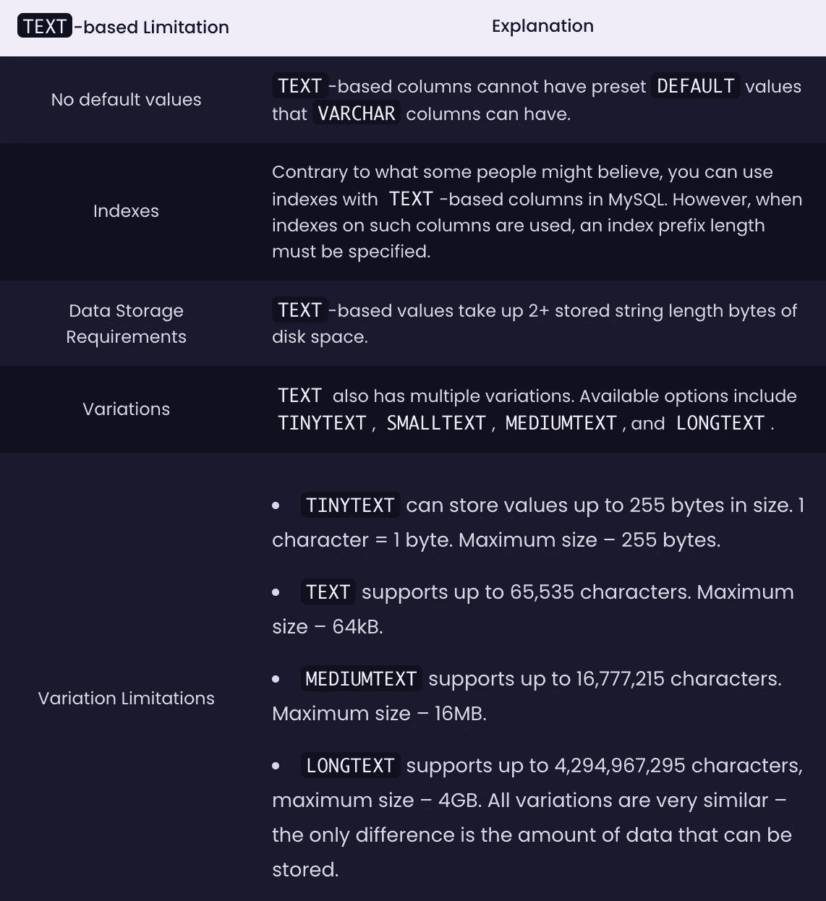
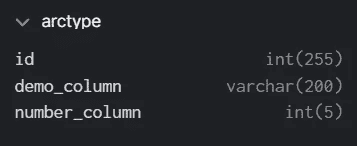
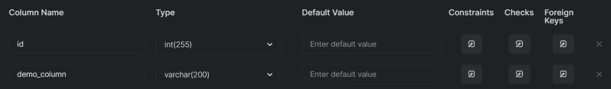

# 为文本优化 MySQL 和 MariaDB:指南

> 原文：<https://medium.com/codex/optimizing-mysql-and-mariadb-for-text-a-guide-f3eb142cc3d0?source=collection_archive---------11----------------------->

# 介绍

您经常发现自己在使用关系数据库实例，尤其是 MariaDB 或 MySQL，您可能已经知道 MySQL 提供的两种数据类型的细微差别。MySQL 提供的一些数据类型适合数字；其他的适合可变长度的值，其中一些也很适合基于文本的值。

# MySQL 中有哪些数据类型？

在解释如何针对特定的(在本例中是`TEXT`)数据类型调优 MySQL 实例之前，我们必须回顾一下 MySQL 提供的一些数据类型，以便让您首先理解一切是如何工作的。谈到数据类型，MySQL 提供了几个类别供选择:

1.  字符串数据类型—当我们的大部分数据由字符串或可变字符值(字符串和数字)组成时，这种数据类型可能会很有帮助。)
2.  数字数据类型——如果我们处理的数据主要由数字组成，那么这种数据类型可能是值得的。
3.  日期数据类型——顾名思义，这种数据类型存储日期:如果需要存储年、月、日等，它们可能会很有帮助。，出现了。
4.  空间(地理)数据类型-此类数据类型可用于存储面、几何值等。
5.  `JSON`数据类型——这种数据类型在存储 JSON 格式的文本时很有用。

对于这篇博文，我们感兴趣的是字符串值，特别是`TEXT`值。`TEXT`即使在字符串空间中，值也不同于所有其他值；虽然有各种各样的字符串类型可供选择(`CHAR`、`VARCHAR`、`BINARY`和`BLOB`是其中的一些)，但我们选择了`TEXT`，因为它与众不同；例如，它与`VARCHAR`不同，因为对于`VARCHAR`，我们可以设置一个可变的最大字符大小(这就是它被称为`***VAR***CHAR`的原因)，并且最大字符大小必须在 1 到 65，535 之间，但是对于`TEXT`数据类型，已经设置了 65，535 个字符的固定最大长度。请记住，基于`TEXT`的列通常也不能成为索引的一部分:我们不能像`VARCHAR`类型那样快地索引基于`TEXT`的列。

# 基于文本的值的限制

至此，您应该对基于`TEXT`的工作负载的功能有了基本的了解。以下是 MySQL 中`TEXT`字符串数据类型的一些细微差别:

除此之外，一般来说，如果我们发现自己存储了更长的文本值:比如说，代码片段之类的，那么从`TEXT`数据类型派生出来的数据类型可能是有益的。如果我们存储用户名、电子邮件地址或散列和加盐密码，那么`VARCHAR`可能是合适的(salts 防止散列被快速破解，所以请考虑*散列和加盐您的密码—[数据泄露猖獗](https://breachdirectory.com))。`TEXT`如果我们想要存储看起来更像一个小故事但不仅仅由几个字符组成的文本，数据类型可能正是我们需要的。*

# 何时使用文本？

到目前为止，你应该对你正在对付的是哪种野兽有所了解；事实上，基于`TEXT`的值是另一种数据类型。让它们如此不同的是，它们特别适合存储大量文本。文本不一定是传统意义上的“文本”；你也可以存储数字，但是记住`TEXT`不是`VARCHAR`——一旦你选择了`TEXT`，就要为特殊的挑战做好准备。上面概述了一些(您不能在整列上添加索引，等等。)，而另一些不太为人所知，但仍需牢记在心。例如，`TEXT`数据类型通常只有在我们的数据库实例有很多，我的意思是，**很多**存储空间的情况下才有用，因为`MEDIUMTEXT`可以存储最大 16MB 的字符串，如果我们选择使用`LONGTEXT`，这个限制会增加到 4GB。

**但是，一般来说，如果我们的应用程序需要存储更长的文本字符串，并且我们可能会发现** `**VARCHAR**` **不能满足要求，那么** `**TEXT**` **数据类型的任何变体都是有用的。**

# SQL 客户端？

数据类型当然很重要，但同样重要的是选择正确的 SQL 客户机来执行您的任务。像 Arctype 这样的 SQL 客户端速度很快，它们为您提供 MySQL 实例正在使用的数据类型，以及如何进一步优化您的模式的一些见解:

无论如何，我们希望这篇博客文章能让你对 MySQL 的`TEXT`数据类型世界有所了解。所以，如果你喜欢阅读，一定要[探索更多内容](https://arctype.com/blog)，下一期再见。

Lukas 是一个有道德的黑客，MySQL 数据库管理员，也是一个经常参加会议的演讲者。自 2014 年以来，Lukas 发现并负责任地披露了立陶宛国内外一些访问量最大的网站的安全漏洞，包括广告、礼品购买、游戏、托管网站以及一些政府机构的网站。Lukas 运营着世界上最大和最快的数据泄露搜索引擎之一—[BreachDirectory.com](http://breachdirectory.com/)，并经常在多个地方撰写博客，向人们介绍信息安全和其他主题。他还在 lukasvileikis.com 经营自己的博客