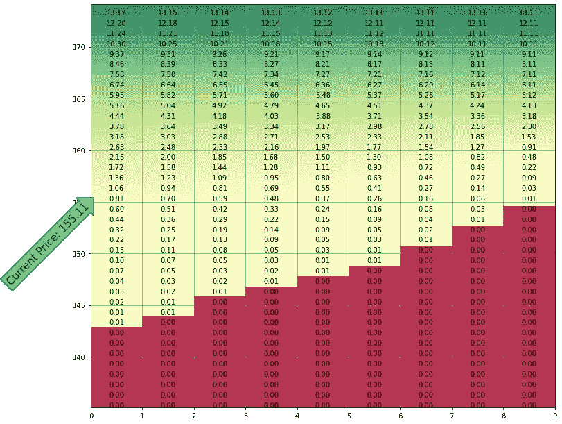
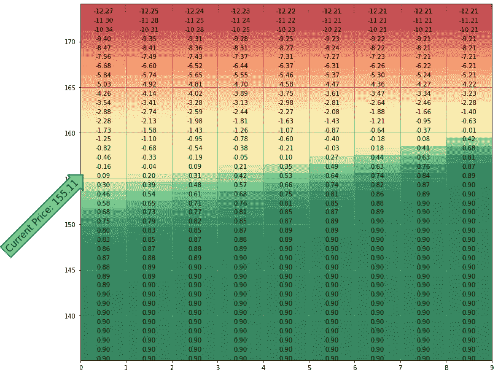
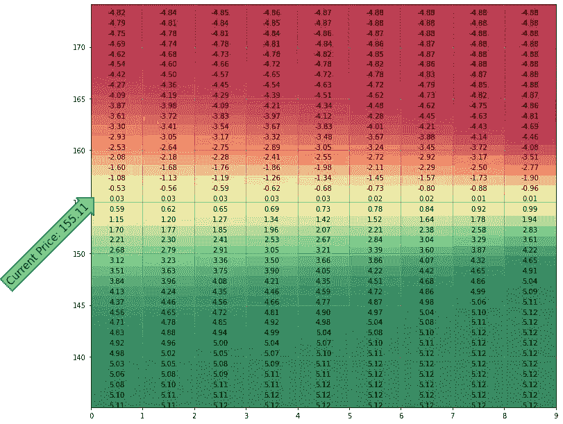

# 用 Python 可视化期权策略

> 原文：<https://medium.com/codex/option-visualization-in-python-66da373e4ee5?source=collection_archive---------4----------------------->


期权是一种投资方法，通过签订合同，允许某人在合同到期前的任何时候以特定价格买卖一定数量的股票。“看涨”期权意味着合同持有者有权以“执行”价格——合同中规定的价格——从合同卖方处购买一定数量的股票。“看跌”期权赋予持有者以执行价出售股票的权利。

期权可以作为一种“对冲”，或者保护你所拥有的股票免受波动的影响，或者它们本身也可以作为一种投资。要获得更深入的解释，请尝试 [Investopedia](https://www.investopedia.com/terms/o/option.asp) 。

为了获得可用股票及其期权的基本数据，我们将使用 Python 的 [yfinance](https://pypi.org/project/yfinance/) 模块。这个模块不仅给出了关于公司本身的大量信息，而且我们还可以获得它的期权链的重要数据。在这里，我们将从获得苹果(符号 AAPL)的当前价格开始。

(这个 Jupyter 实验室笔记本在[这里](https://github.com/mullenba/option_visualization/blob/main/option_visualization.ipynb)有售)

```
import yfinance as yf
import json

symbol = "AAPL"

# Create the object representing the symbol of interest
equity = yf.Ticker(symbol)

current_price = equity.info['currentPrice']
print(f"Current price of {symbol} - ${current_price}")>>Current price of AAPL - $155.11
```

## 为看涨期权定价

在本教程中，我们将使用一个几天后到期的看涨期权。这将适合极短期投资。

为了给期权定价，我们需要一些当前市场条件的信息。执行价格是期权合约可以执行的价格。这意味着你的合同规定的基础股票的出售价格。隐含波动率代表在合约到期前，股票价格随机上下波动的比率。我们使用“隐含”一词，因为这个数字与交易者对股票的需求有关(这反过来会影响价格)。

```
# Lets choose the options out a few days
expiration_date = equity.options[1]
print("Expiration Date: ", expiration_date)

# get option chain for specific expiration
opt = equity.option_chain(expiration_date)

# Choosing a strike price appropriate for our strategy
strike_price = 160

# Get the available data for the option contract with our chosen strike price
option_data_at_strike = opt.calls.loc[opt.calls['strike'] == strike_price]
implied_volatility = option_data_at_strike['impliedVolatility'].values[0]
print(f"Option Implied Volatility: {implied_volatility}")>> Expiration Date:  2021-09-17
>> Option Implied Volatility: 0.256843369140625
```

## 可视化性能

我们希望看到我们的投资价值如何随着股价的变化而变化。这给了我们一个机会，来判断如果市场按照我们预期的方式运行，我们的策略会如何表现。为此，我们将首先获得从现在到期权合约到期日之间的剩余天数。

```
from datetime import date

current_date_object = date.today()
expiration_date_object = date.fromisoformat(expiration_date)

# We need the number of days until expiration for our plots
days_to_expire = (expiration_date_object - current_date_object).days
```

由于我们并不真正知道股价将向哪个方向移动，我们将考虑到期时价格上下波动 20 美元。

```
import numpy as np
np.set_printoptions(suppress=True)

# Create an array of possible share prices starting $20 below the current
# price and ending $20 above the current price, at $1 intervals.
share_prices = np.arange(current_price-20, current_price+20, 1)
```

现在是程序的核心。我们需要一个函数来实际创建每天可能的股价矩阵，以及相应的头寸价值。[米变](https://pypi.org/project/mibian/)是一个为欧美股票期权定价的库。通过使用股价、期权的执行价格、合同到期前的天数和隐含波动率，我们可以使用[布莱克-斯科尔斯](https://www.investopedia.com/terms/b/blackscholes.asp)定价模型来预测期权在未来某个时间点的价格。

```
import mibian

def create_value_matrix(prices, 
                        number_of_days, 
                        strike, 
                        implied_volatility):
    # Create an empty array to hold the estimated option values
    output_array = np.zeros((len(prices), number_of_days))

    # For each possible share price...
    for i, p in enumerate(prices):
        # ...and each day from now to expiration
        for d in range(number_of_days):
            # Get the Black-Scholes data for the contract assuming the 
            # given price and days until expiration
            bsData = mibian.BS([p, strike, 0, number_of_days - d], 
                               volatility= implied_volatility*100)

            # For the sake of this tutorial, we're doing strategies with calls.
            # Puts are similar
            price = bsData.callPrice
            output_array[i,d] = round(price, 2)

    return output_array

price_matrix = create_value_matrix(share_prices, 
                                   days_to_expire, 
                                   strike_price, 
                                   implied_volatility)

# Keep in mind, the origin of the points on the matrix is in 
# the upper left, this means it's upside down from what 
# we're expecting, with higher share prices increasing from 
# top to bottom and days counting from left to right.>>print(price_matrix)>>[[ 0\.    0\.    0\.    0\.    0\.    0\.    0\.    0\.    0\.  ]
 [ 0\.    0\.    0\.    0\.    0\.    0\.    0\.    0\.    0\.  ]
 [ 0\.    0\.    0\.    0\.    0\.    0\.    0\.    0\.    0\.  ]
 [ 0\.    0\.    0\.    0\.    0\.    0\.    0\.    0\.    0\.  ]
 [ 0\.    0\.    0\.    0\.    0\.    0\.    0\.    0\.    0\.  ]
 [ 0\.    0\.    0\.    0\.    0\.    0\.    0\.    0\.    0\.  ]
 [ 0\.    0\.    0\.    0\.    0\.    0\.    0\.    0\.    0\.  ]
 [ 0\.    0\.    0\.    0\.    0\.    0\.    0\.    0\.    0\.  ]
 [ 0.01  0\.    0\.    0\.    0\.    0\.    0\.    0\.    0\.  ]
 [ 0.01  0.01  0\.    0\.    0\.    0\.    0\.    0\.    0\.  ]
 [ 0.02  0.01  0\.    0\.    0\.    0\.    0\.    0\.    0\.  ]
 [ 0.03  0.02  0.01  0\.    0\.    0\.    0\.    0\.    0\.  ]
 [ 0.04  0.03  0.02  0.01  0\.    0\.    0\.    0\.    0\.  ]
 [ 0.07  0.05  0.03  0.02  0.01  0\.    0\.    0\.    0\.  ]
 [ 0.1   0.07  0.05  0.03  0.01  0.01  0\.    0\.    0\.  ]
 [ 0.15  0.11  0.08  0.05  0.03  0.01  0\.    0\.    0\.  ]
 [ 0.22  0.17  0.13  0.09  0.05  0.03  0.01  0\.    0\.  ]
 [ 0.32  0.25  0.19  0.14  0.09  0.05  0.02  0\.    0\.  ]
 [ 0.44  0.36  0.29  0.22  0.15  0.09  0.04  0.01  0\.  ]
 [ 0.6   0.51  0.42  0.33  0.24  0.16  0.08  0.03  0\.  ]
 [ 0.81  0.7   0.59  0.48  0.37  0.26  0.16  0.06  0.01]
 [ 1.06  0.94  0.81  0.69  0.55  0.41  0.27  0.14  0.03]
 [ 1.36  1.23  1.09  0.95  0.8   0.63  0.46  0.27  0.09]
 [ 1.72  1.58  1.44  1.28  1.11  0.93  0.72  0.49  0.22]
 [ 2.15  2\.    1.85  1.68  1.5   1.3   1.08  0.82  0.48]
 [ 2.63  2.48  2.33  2.16  1.97  1.77  1.54  1.27  0.91]
 [ 3.18  3.03  2.88  2.71  2.53  2.33  2.11  1.85  1.53]
 [ 3.78  3.64  3.49  3.34  3.17  2.98  2.78  2.56  2.3 ]
 [ 4.44  4.31  4.18  4.03  3.88  3.71  3.54  3.36  3.18]
 [ 5.16  5.04  4.92  4.79  4.65  4.51  4.37  4.24  4.13]
 [ 5.93  5.82  5.71  5.6   5.48  5.37  5.26  5.17  5.12]
 [ 6.74  6.64  6.55  6.45  6.36  6.27  6.2   6.14  6.11]
 [ 7.58  7.5   7.42  7.34  7.27  7.21  7.16  7.12  7.11]
 [ 8.46  8.39  8.33  8.27  8.21  8.17  8.13  8.11  8.11]
 [ 9.37  9.31  9.26  9.21  9.17  9.14  9.12  9.11  9.11]
 [10.3  10.25 10.21 10.18 10.15 10.13 10.12 10.11 10.11]
 [11.24 11.21 11.18 11.15 11.13 11.12 11.11 11.11 11.11]
 [12.2  12.18 12.15 12.14 12.12 12.11 12.11 12.11 12.11]
 [13.17 13.15 13.14 13.13 13.12 13.11 13.11 13.11 13.11]
 [14.15 14.14 14.13 14.12 14.11 14.11 14.11 14.11 14.11]]
```

现在，我们可以创建一个不同基础股价和剩余到期日的期权价值矩阵。这些数字是有帮助的，但如果能添加一些颜色来真正感受股票价值变化时会发生什么，那就更好了。

```
import matplotlib.pyplot as plt
from matplotlib import colors
import matplotlib.patheffects as PathEffects

# We want to take an arbitrary price matrix and display it nicely
def display_value_matrix(matrix, 
                         share_prices, 
                         days_to_expire, 
                         underlying_price):
    fig, ax = plt.subplots(figsize=(12,12))

    for x in range(days_to_expire):
        for i in range(len(share_prices)-1):
            y = share_prices[i]
            txt = ax.text(x+0.5,y , "{:.2f}".format(matrix[i,x]), 
                          ha='center', color='k')

    divnorm=colors.TwoSlopeNorm(vmin=np.min(matrix), 
                                vcenter=0.0001, 
                                vmax=np.max(matrix))

    ax.imshow(matrix, origin="lower", cmap="RdYlGn", alpha=0.8,
              extent = [0 , days_to_expire, 
                        share_prices[0], share_prices[-1]],
              norm=divnorm)

    ax.text(0, underlying_price, 
            "Current Price: {:.2f}".format(underlying_price), 
            ha="right", va="top", rotation=45, size=15,
            bbox=dict(boxstyle="rarrow,pad=0.3", fc="cyan", ec="b", lw=2))

    ax.grid(which="both", c="grey", linewidth=0.8)

    ax.set_aspect(0.2)
    plt.show()

display_value_matrix(price_matrix, 
                     share_prices, 
                     days_to_expire, 
                     current_price)
```



## 解读图表

在目前 155.11 美元的股价下，我们可以以大约每股 2.63 美元的价格买入一个执行价格为 160 美元的看涨期权。如果明天 AAPL 的股票价格涨到 165 美元，我们的期权会突然变成 5.93 美元！

另一方面，如果 AAPL 的价格保持在当前价值附近，那么在 10 天后到期时，价格将降至零。

## 短(裸)电话

如果我们卖出一个看涨期权而不是买入呢？我们将立即获得期权的现金价格，但我们面临的风险是，如果股价上涨，我们的合同可能被执行，我们将欠 100 股。下图显示了这种交易的利润是有限的，但是潜在的损失是无限的。一般来说，裸聊不是一种好的投资方式。

```
# Short Call

# Get the current price of the option we want to sell
current_option_price = option_data_at_strike['lastPrice'].values[0]

# Now, the values of our matrix will be the money we get from selling 
# the option, minus the current value of the option.
# For example, if we were to sell the option for $1, then immediately 
# buy it back to close the position, it would effectively have no value.
# +$1 selling, -$1 buying to close = $1-$1 = $0
short_values = current_option_price - price_matrix

display_value_matrix(short_values, share_prices, days_to_expire, current_price)
```



## 基本策略—涵盖的电话

假设我们拥有 100 股 AAPL 股票，我们担心价格可能会在不久的将来下跌。我们可以使用期权给我们一些快速收入，以帮助抵消我们预期的损失。通过出售由我们的股票支持的看涨期权，我们出售的是一个“备兑看涨期权”，即一份合同，规定我们将以预定(执行)价格向合同持有人出售我们的 100 股股票。通过以高于当前价格的价格出售一份执行合同，我们可能被迫以增加的价格出售我们的股票，但由于我们预计价格会下降，我们希望保留出售合同的资金，并保留我们的股票。

重要的是要注意，我们可以在任何时候通过执行“买入成交”交易来解除合约。我们购买一份与我们出售的合同相同的合同，但价格不变。这抵消了我们卖出的期权，让我们摆脱了债务。

## 多选项策略

有许多共同的策略，涉及在一个单一的立场多种选择。一个例子是“买入信用利差”，也称为“空头买入利差”。这是一种看跌策略，你预期标的股票会下跌。它包括买入一个执行价格高于当前股价的看涨期权(称为“价外”)，同时卖出一个执行价格低于当前股价的看涨期权(称为“价内”)。假设股票价格在到期时下跌，两个期权之间的价格差就是你可以从交易中获得的最大利润。

```
# More complicated strategies - Call Credit Spread

# Short (sell) position
short_strike_price = 150
short_option_data_at_strike = opt.calls.loc[opt.calls['strike'] == short_strike_price]
short_implied_volatility = short_option_data_at_strike['impliedVolatility'].values[0]
short_option_price = short_option_data_at_strike['lastPrice'].values[0]
short_call_matrix = create_value_matrix(share_prices, 
                                        days_to_expire, 
                                        short_strike_price, 
                                        short_implied_volatility)

print("Short Price: ", short_option_price)

# Long (buy) position
long_strike_price = 160
long_option_data_at_strike = opt.calls.loc[opt.calls['strike'] == long_strike_price]
long_implied_volatility = long_option_data_at_strike['impliedVolatility'].values[0]
long_option_price = long_option_data_at_strike['lastPrice'].values[0]
long_call_matrix = create_value_matrix(share_prices, 
                                       days_to_expire, 
                                       long_strike_price, 
                                       long_implied_volatility)

print("Long Price: ", long_option_price)

# The entry cost is the amount we get when we first buy and sell our options
entry_cost = short_option_price - long_option_price

# The matrix for this position is the entry cost minus the amount 
# it would take to close the positions.
call_spread_matrix = entry_cost - short_call_matrix + long_call_matrix

display_value_matrix(call_spread_matrix, 
                     share_prices, 
                     days_to_expire, 
                     current_price)>>Short Price:  6.02
>>Long Price:  0.9
```



## 解读信用利差图

看上面的情节，可以看出几个东西。首先，我们看到信用利差的利润或损失是有限的。事实上，如果股价像我们希望的那样快速下跌，我们或许可以提前几天兑现全额利润。

## **结论**

我希望这个教程对你有用。我计划在以后的文章中继续添加小的代码示例，以提供工具来帮助做出投资决策。

下面是 Jupyter 实验室笔记本。

[](https://github.com/mullenba/option_visualization/blob/main/option_visualization.ipynb) [## 主 mullenba/option_visualization 处的 option _ visualization/option _ visualization . ipynb

### 伴随 Jupyter 实验室笔记本的是我关于可视化期权价值的文章…

github.com](https://github.com/mullenba/option_visualization/blob/main/option_visualization.ipynb)