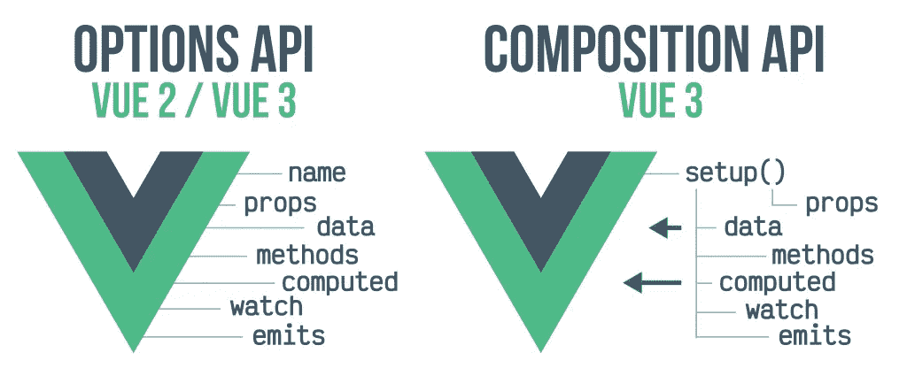

# 选项 API 与组合 API

> 原文：<https://medium.com/codex/options-api-vs-composition-api-4a745fb8610?source=collection_archive---------3----------------------->

如果您正在 Vue 3 中开始一个新项目，或者如果您仍在决定是否将现有项目迁移到最新的 Vue.js 版本，那么这篇文章是为您准备的。



# 我们开始吧

在 Vue 2 之前，有一种在 Vue 中创建组件的方法，这种方法现在被称为 Options API。在 Vue 3 中，引入了一种新的方法，称为组合 API，您可能想知道区别在哪里？在这篇文章中，我们将看看这两者有什么不同。

让我们从一个简单的选项 API 设置开始:

```
export default {
  data() {
    return {
      name: 'Vue 3 App',
    };
  },
  methods: {
    showTxt() {
      console.log(`this is ${this.name}`);
    },
  },
  mounted() {
    this.showTxt();
  },
};
```

如果我们看一下代码，我们会注意到 3 件事，它们是[选项 API](https://vuejs.org/api/options-state.html) 的构建块:

*   [**数据:**](https://vuejs.org/api/options-state.html#data) 为组件实例返回初始反应状态的函数，
*   [**方法:**](https://vuejs.org/api/options-state.html#methods) 声明要混合到组件实例中的方法。声明的方法可以在组件实例上直接访问，或者在模板表达式中使用。声明方法时避免使用箭头函数，因为它们不能通过 *this，*访问组件实例
*   [**挂载:**](https://vuejs.org/api/options-lifecycle.html#mounted) 这是一个**生命周期钩子**，当组件被创建并插入到 DOM 中时，组件被挂载。

我们可以在 Options API 中遇到的、上面代码中没有的其他常见情况有:

*   [**道具:**](https://vuejs.org/guide/components/props.html#props-declaration) 组件需要显式的道具声明，这样 Vue 才知道传递给组件的外部道具应该被当作 fallthrough 属性，
*   [**观察器** :](https://vuejs.org/api/options-state.html#watch) 声明在数据改变时调用观察器回调。监视选项需要一个对象，其中键是要监视的反应组件实例属性(例如，通过数据声明或计算的属性)，值是相应的回调。

现在让我们看一下同一个例子，但是使用了组合 API:

```
export default {
  setup() {
    const name = ref('Vue 3 App');

    const showTxt = () => console.log(`This is ${name.value}`);

    onMounted(() => {
      showTxt();
    });

    return { name };
  },
};
```

从代码中我们可以看到，Composition API 只使用了 [**setup hook**](https://vuejs.org/api/composition-api-setup.html) 来定义组件，意味着代码少了很多。代码的另一个重要部分是 **ref、**，它使数据具有反应性。它返回一个带有值属性的对象。

# 代码共享

Options API 和 Composition API 最大的区别之一就是它们实现代码共享的方式。 **Options API** 有两种共享代码的方式， **mixins** 和 **renderless components** 。Mixins 使用起来可能有点棘手，因为它们很难确定部分代码来自哪里。

根据文档，mixins 是一种为 Vue 组件分发可重用功能的灵活方式。mixin 对象可以包含任何组件选项。当一个组件使用 mixin 时，mixin 中的所有选项都将“混合”到组件自己的选项中。下面是一个混音的例子:

```
// define a mixin object
var myMixin = {
  created: function () {
    this.helloWorld()
  },
  methods: {
    helloWorld: function () {
      console.log('hello from my mixin!')
    }
  }
}

// define a component that uses this mixin
var Component = Vue.extend({
  mixins: [myMixin]
})
```

然而，对于新开发人员来说，使用 mixin 可能**难以调试和理解**，尤其是当他们处理全局 mixin 时。它们的使用也会导致**与组件的**命名冲突。

有了**组合 API，**就不需要 mixins 了。在设置钩子内部，我们可以**按照逻辑关系**对代码的各个部分进行分组。然后，我们可以提取一些反应式逻辑，并与其他组件共享。

现在我们来看看**无渲染组件。**无渲染组件是**不渲染任何自己的 HTML** 的组件。相反，它只管理状态和行为，让父组件完全控制应该呈现的内容。这意味着，如果你把逻辑从一个 UI 组件移到一个无渲染组件中，你可以重用它。

# 可组合物

Composition API 也支持 **renderless components** ，事实上，这是 Composition API 和 Options API 的共同点之一。然而，组合 API 的一个主要优势是 **composables** 。它们是可重用的代码，由于它们，我们可以在任何地方编写反应式代码。我们不再局限于 Vue 组件的范围。下面是一个可组合计数器的简单示例:

```
import { computed, ref } from 'vue';

export function count() {
  const counter = ref(0);
  const addOne = () => { counter.value += 1 };

  return {
    counter,
    addOne,
  };
}
```

这里我们可以看到，如何在组件中使用它。

```
<template>
  <div>Count: {{ counter }}</div>
  <button @click="addOne"> 
     +
  </button>
</template>

<script>
import { count } from '../composables/counter-example';

export default {
  setup() {
    const {
      counter,
      addOne,
    } = count();

    return {
      counter,
      addOne,
    };
  },
};
</script>
```

Composables 充当一个外部函数，它提取反应状态和功能，以便跨几个其他组件使用。它们也可以被称为复合函数。有了组件，我们可以准确地告诉**我们的可重用数据和功能来自**。

Composition API 的另一个主要优点是，它使模板中的常量和依赖项可用:

```
<template>
  <div>
  <button @click="create">
   Save
  </button>
</div>
</template>

<script>
import { create } from './services';

export default {
  setup() {
    return {
      create,
    };
  },
};
</script>
```

当使用 Options API 做同样的事情时，会感觉很尴尬。您要么必须将常量和依赖项添加到数据选项中，要么使用创建的钩子将非反应性变量添加到这个上下文中。Composition API 为我们省去了一些麻烦，因为我们可以简单地从 setup hook 中导出它们，并使它们在模板中可用。

这是对比较的总结和总结，如果你决定迁移到 Vue 的最新版本，由于上述原因，Composition API 可能值得麻烦，因为它非常好地优化了代码，因此会给你的应用程序带来更好的性能。如果你是从零开始，建议使用 Composition API。