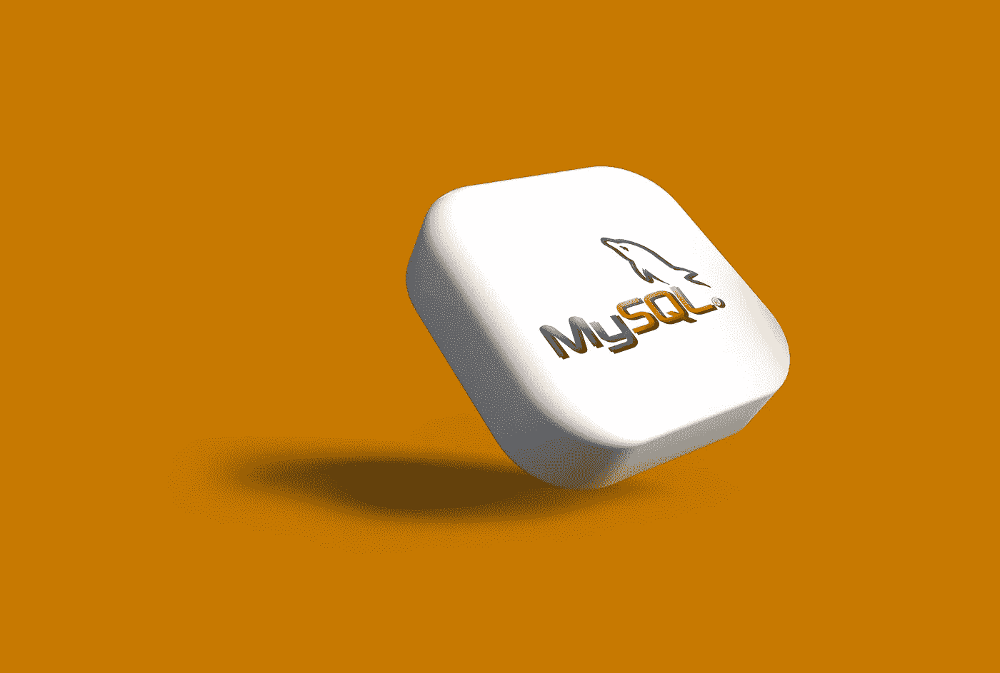

# 甲骨文——雪花、BigQuery、Redshift & Co .的失败者？

> 原文：<https://medium.com/codex/oracle-defeater-of-snowflake-bigquery-redshift-co-b2bffd7ae399?source=collection_archive---------1----------------------->

## MySQL HeatWave 比亚马逊 RDS 快 5400 倍吗？

鲁拜图·阿扎德在 [Unsplash](https://unsplash.com/?utm_source=unsplash&utm_medium=referral&utm_content=creditCopyText) 上的照片

当你看到这些数字时，你会想 Snowflake，AWS & Co .可以做些什么来阻止 Oracle 成为最佳数据分析平台。

*   比亚马逊 RDS 快 5400 倍
*   比亚马逊 Aurora 快 1400 倍