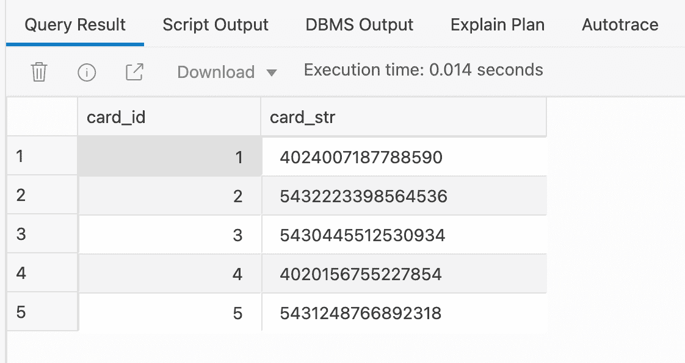
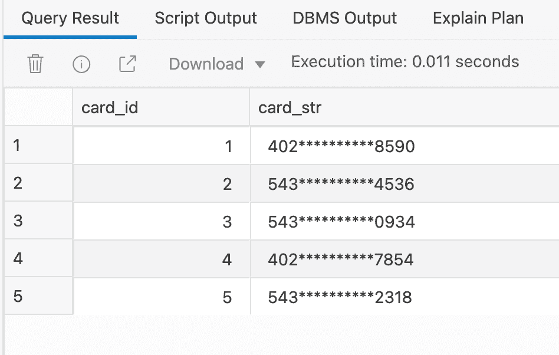
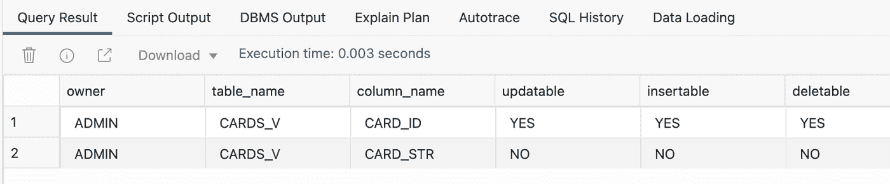
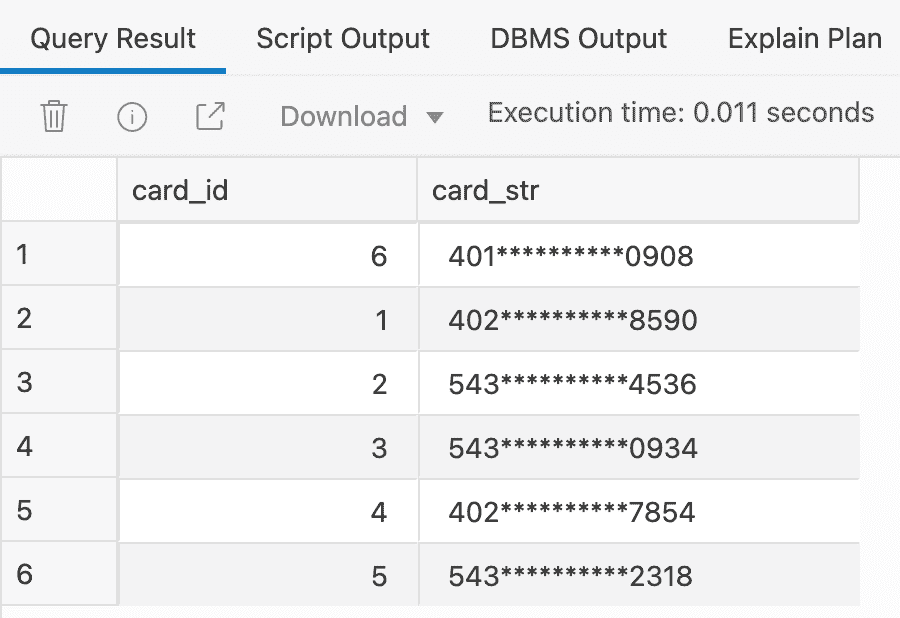
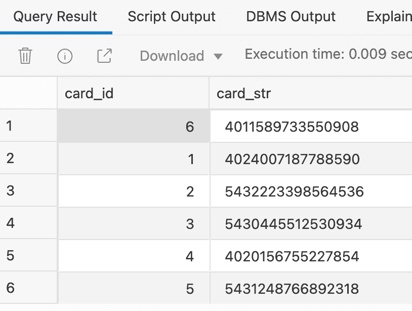
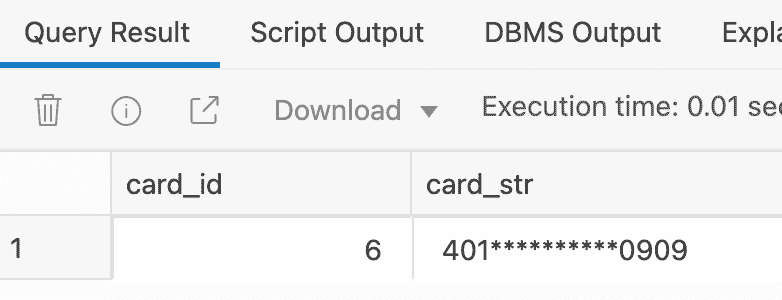
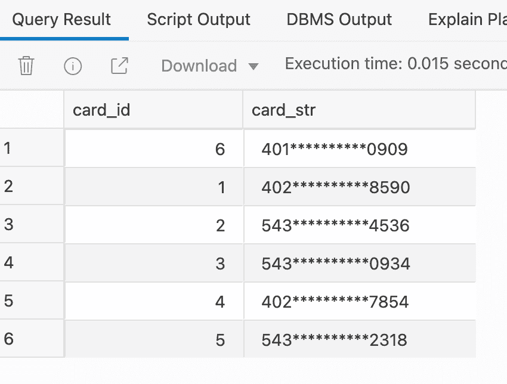
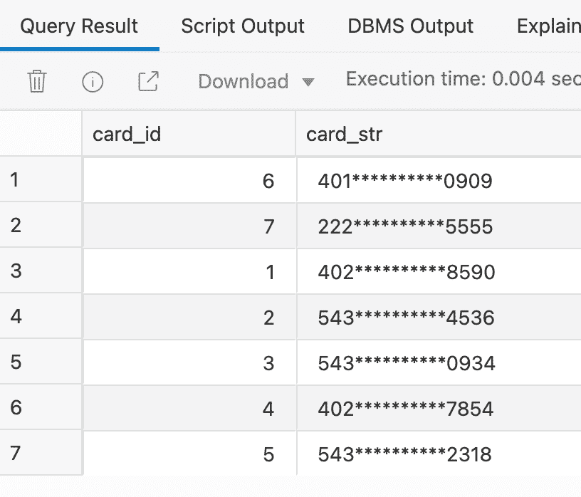
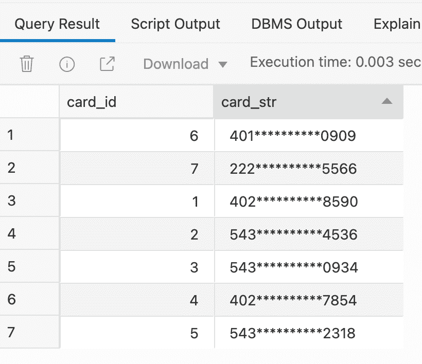

# Oracle:如何快速免费地用视图屏蔽敏感数据

> 原文：<https://medium.com/codex/oracle-how-to-mask-sensitive-data-with-the-views-quickly-and-free-aff9175146b0?source=collection_archive---------4----------------------->

有时，您可能会突然发现一些数据，这些数据必须对系统中的每个人紧急隐藏起来，而系统是由各种组件、服务和进程组成并运行的。

例如，您发现系统可以在一个或多个应用程序中访问客户的电子邮件，包括移动、桌面、web 应用程序和 reporting services。现在，开发团队面临的任务是:紧急禁用查看这些数据的权限。您知道访问这些数据的应用程序构成了一个未知的集合。一些应用程序/服务直接使用表，而其他应用程序/服务通过过程/批处理与表交互。

如何快速解决任务而不破坏任何东西？当然，有一些优秀的 Oracle 产品(数据编辑、虚拟专用数据库)可以以全面可靠的方式解决这一任务，并提供各种其他好处。然而，这些都是付费选项，你需要特定的技能来实现它们。我的建议是采取简单的方法快速免费解决这个问题。

解决方案的要点是创建与表同名的视图，我们需要保护表的数据。同时，我们将重命名源表，这样就没有人可以再引用它了。

**许多人被**绊倒的困难是，即使视图足够容易地解决数据采样任务，只要我们试图通过视图插入或修改数据，我们就会得到 *ORA-01733:此处不允许虚拟列错误*。这意味着视图中有我们修改的字段。这个问题很容易通过触发器绕过。我将用下面的例子来说明如何去做。

在这个实验中，让我们使用免费的 Oracle 自治数据库。方便做实验。

数据屏蔽步骤:

1.  创建一个测试表并用数据填充它
2.  创建带有数据屏蔽的视图
3.  通过视图启用数据插入和更新
4.  重命名表和视图

# 第一步。创建表并用数据填充它

创建一个名为 Cards 的简单表，该表包含两列——标识符和存储信用卡 PAN 的 varchar 列。

插入几行:

检查数据是否可访问:

很好，我们可以清楚地看到我们刚刚插入的内容。

# 第二步。创建带有数据屏蔽的视图

现在让我们创建一个视图，该视图使用 REGEXP_REPLACE 正则表达式函数查询带有数据屏蔽的表:

检查返回的输出是否是我们期望的:

现在，这就是我们需要的——数据被屏蔽了。

# 第三步。通过视图启用数据插入和更新

到目前为止，视图不允许插入新数据。看一看:

我们得到错误 *ORA-01733:这里不允许虚拟列*

这是因为当我们创建视图时，字段发生了变化。

我们可以通过检查 USER_UPDATABLE_COLUMNS 来确定这一点:

这实际上不是问题，因为我们可以通过简单的触发机制绕过这个限制。

让我们创建一个触发器，当试图在视图中插入时，将执行这个触发器。在触发器本身中，我们将直接对源表进行操作:

现在让我们尝试在视图中插入值:

没有错误。让我们检查该行是否已被添加。

在这里，卡 id = 6

现在让我们检查源表是否也有数据，并且它们没有被屏蔽:

太好了！

让我们通过视图用数据更新来重复这个魔术。

如果不创建触发器，racle 会用同样的错误威胁我们:

是的，在这里:

*ORA-01733:此处不允许虚拟列*

但我们已经知道该做什么，只需创建触发器:

让我们再次尝试更新数据:

没有错误。让我们检查数据是否已更新:

现在，我们已经确保既可以从视图中读取数据，也可以获取屏蔽的数据，还可以通过视图插入和更新数据。

# 第四步。重命名表和视图

现在我们要做的是重命名视图，使其名称与源表的名称相同，并为表指定任何其他名称。我们还必须重新创建触发器，最后，重新编译失效的对象。当我们重命名该表时，对它的所有引用(外键)都将保留。

删除触发器，然后使用对表的正确引用再次创建它们:

将表格名称从 cards 更改为 cards_tbl:

使用此表的对象已经无效。我们需要重新创建视图，以便所有对象都有效。

将视图名称从 cards_v 更改为 cards:

重新创建触发器:

现在我们可以重新编译无效的对象:

让我们检查一下是否一切正常:

代码按预期运行。

# 结论

在本文中，我们已经处理了如何用视图添加数据屏蔽来替换表。我们还学习了如何通过视图绕过 Oracle 对数据修改的限制。当我们需要屏蔽敏感数据而不进行重大修复时，这个技巧很有用。

我很想在评论中听到你对上述问题的看法，并随时通过 [LinkedIn](https://www.linkedin.com/in/yevgeniysamoilenko/) 与我联系。