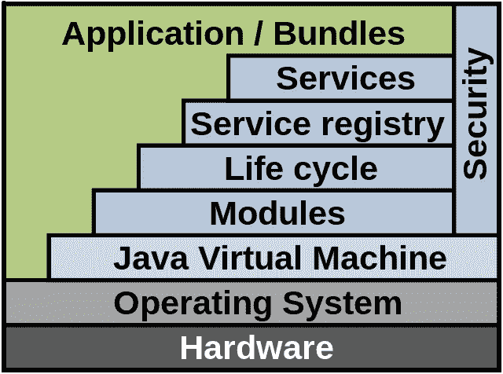

# 奥斯吉

> 原文：<https://medium.com/codex/osgi-4a4656908a64?source=collection_archive---------11----------------------->


首先让我们看看 OSGi 代表什么。OSGi 代表**开放服务网关倡议**。这基本上为用 Java 动态开发和部署模块化应用程序和库提供了一个架构。


来源:[https://piraveenaparalogarajah . medium . com/OSGi-in-a-through-aafc 3a 86 CFF 0](https://piraveenaparalogarajah.medium.com/osgi-in-a-nutshell-aafc3a86cff0)

在模块化应用程序中，其中的类将被封装在模块的逻辑边界内。对外公开使用的类和外部导入的类应分别在模块 pom 文件的<export-package>和<import-package>标签中定义。如果这没有给你太多的想法，它将在后面的部分讨论。</import-package></export-package>


来源:https://thiloshon . WordPress . com/2020/03/04/OSGi-for-dummies/

```
<project ...>  
    <groupId>org.wso2.mbp</groupId> 
    <modelVersion>4.0.0</modelVersion>
    <artifactId>sample01</artifactId>
    <version>1.0.0</version>
    <packaging>bundle</packaging> 
    <name>Sample01</name>  
    <description>A Simple Bundle which print "Hello World" and "Goodbye World"</description>
    <url>https://www.wso2.org</url>
    <build>
        <plugins>
            <plugin>
                <groupId>org.apache.felix</groupId>
                <artifactId>maven-bundle-plugin</artifactId>
                <version>1.4.0</version>
                <extensions>true</extensions>
                <configuration>
                    <instructions>
                        <Bundle-SymbolicName>${pom.groupId}.${pom.artifactId}</Bundle-SymbolicName>
                        <Bundle-Name>${pom.name}</Bundle-Name>
                        <Bundle-Version>${pom.version}</Bundle-Version>
                        <Bundle-Activator>org.wso2.mbp.sample01.Activator</Bundle-Activator>
                        <Private-Package>org.wso2.mbp.sample01</Private-Package>
                    </instructions>
                </configuration>
            </plugin>
        </plugins>
    </build>
    <dependencies>
        <dependency>
            <groupId>org.apache.felix</groupId>
            <artifactId>org.osgi.core</artifactId>
        </dependency>
    </dependencies>
</project>
```

上面的代码片段来自 sample01 模块的 pom.xml，其中包括关于项目的信息和 Maven 用来构建项目的配置细节。

基于 pom 文件中的这些指令，包插件决定在构建时应该复制到包中的类和资源。pom 文件的配置将在下面讨论。

**<打包>捆绑</打包>** ，配置 maven 构建 OSGI 捆绑。

那么包的导出和导入将在下面讨论。

使用 Export-Package 指令可以指定要导出的包的列表。从包中导出包将取决于值的模式。

> **<出口包>org . WSO 2 . MBP . echo</出口包>**
> 
> 上述包中的类将被复制到一个目标包中。
> 
> **<导出包>org . WSO 2 . MBP . echo . *</导出包>**
> 
> 上述包中的类和所有子包中的类将被复制到目标包中。
> 
> **<Export-Package>org . wso2 . MBP . echo . *，！org . WSO 2 . MBP . echo . string</Export-Package>**
> 
> "由于包列表是有序的，所以较早的模式在较晚的模式之前生效。因此，所有与模式 org.wso2.mbp.echo.*匹配的包都被选择来包含目标包。第二种模式没有效果，因为 org.wso2.carbon.mbp.echo.*包已经被选择包含在内。实现预期结果的正确方法是改变模式的顺序。”

当一个包中的类引用其他包中的类时，应该使用 Import-Package 指令来指定。该指令的默认值为“*”。价值观及其行为的模式如下。

> **<导入包>org . WSO 2 . MBP . export sample . *</导入包>**
> 
> 导入 org.wso2.mbp.exportsample 包及其所有子包中的类。
> 
> **<导入-打包>！org.wso2.carbon.ui，org . WSO 2 . MBP . export sample . *</Import-Package>**
> 
> 使用否定模式，可以删除不需要的 org.wso2.carbon.ui 包的导入。
> 
> **<进口-包装>**
> 
> **org.wso2.mbp.exportsample.*，**
> 
> **org . WSO 2 . carbon . ui；分辨率:=可选**
> 
> **</导入-打包>**
> 
> Resolution 指令用于指示包 org.wso2.carbon.ui 是可选的。即使 org.wso2.carbon.ui 不存在，这个包也可以成功解析。resolution 指令的默认值是“mandatory”。

现在让我们试着去理解 **OSGi 框架**。

OSGI 服务平台由 OSGi 框架和 OSGi 标准服务两部分组成。该框架提供了 OSGi 功能，而 OSGi 标准服务为常见任务定义了可重用的 API。

OSGi 框架具有如下的分层架构。



来源:[https://www.wikiwand.com/en/OSGi](https://www.wikiwand.com/en/OSGi)

在深入研究这些层之前，如果对图中所示的每个区域进行简单介绍，那么捆绑包通常是具有额外清单头的 JAR 组件，服务层以动态方式连接捆绑包，服务注册是用于管理服务的 API，生命周期是用于捆绑包的生命周期管理的 API，模块层定义封装和依赖性声明。

现在让我们讨论捆绑包、服务和生命周期层。

# **捆绑层**

如上所述，OSGI 应用程序由导出和导入包等的多个包组成。OSGI 包是一个带有额外元数据的 JAR 文件。因此，当 jar 文件被转换成包时，应该为清单添加元数据。MF 文件。


[http://www . liferaysavvy . com/2017/09/OSGi-bundle-manifest-headers . html](http://www.liferaysavvy.com/2017/09/osgi-bundle-manifest-headers.html)

# **服务层**

服务层提供了包之间的交互。


[https://www . research gate . net/publication/321705781 _ Immersive _ Exploration _ of _ OSGi _ Based _ Software _ Architectures _ in _ Virtual _ Reality](https://www.researchgate.net/publication/321705781_Immersive_Exploration_of_OSGi_Based_Software_Architectures_in_Virtual_Reality)


[https://piraveenaparalogarajah . medium . com/OSGi-in-a-shell-aafc 3a 86 CFF 0](https://piraveenaparalogarajah.medium.com/osgi-in-a-nutshell-aafc3a86cff0)

# **生命周期层**

生命周期层提供运行时模块(包)管理。


生命周期状态可以标识如下:

> **已安装** —安装已成功完成。但是，在这种状态下，不进行依赖或类加载。
> 
> **已解决** —当 OSGI 解决并满足依赖关系并进行类加载操作时。
> 
> **启动**——当调用捆绑包激活器的启动方法时
> 
> **活动** —启动方法已成功运行，且捆绑包已成功启动并运行。
> 
> **停止** —当调用束激活器的停止方法时。
> 
> **已卸载** —从系统中移除软件包时。

当服务器在 OSGI 模式下运行时，可以按如下方式检查现有包的列表。显示所有包的包 ID、状态和包符号名。

> osgi> ss
> 
> 框架已启动。
> 
> id 状态包
> 
> 0 ACTIVE org . eclipse . OSGi _ 3 . 4 . 0 . v 2008 06 05–1900
> 
> 1 解析 helloworld_1.0.0

在未激活某个包的情况下，可以使用以下命令对该包进行诊断。它将显示丢失的导入包的列表。

> **OSGi>diag<bundle-id>**

希望这对理解 OSGI 的基础有帮助！

# 参考

[https://piraveenaparalogarajah . medium . com/OSGi-in-a-through-aafc 3a 86 CFF 0](https://piraveenaparalogarajah.medium.com/osgi-in-a-nutshell-aafc3a86cff0)

[https://wso2 . com/library/tutorials/develop-OSGi-bundles-using-maven-bundle-plugin/](https://wso2.com/library/tutorials/develop-osgi-bundles-using-maven-bundle-plugin/)