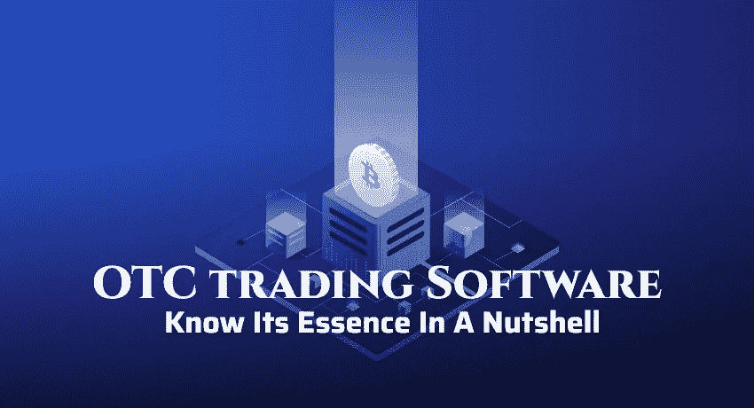

# 场外交易软件——简单了解其本质

> 原文：<https://medium.com/codex/otc-trading-software-know-its-essence-in-a-nutshell-9b612131da0d?source=collection_archive---------9----------------------->

随着虚拟空间中加密货币使用的增加，许多人开始交易和投资加密货币。对他们来说，唯一交易密码的地方就是密码交易所。

市场上有许多流行的加密交易所，如 Paxful、Bybit、Huobi、Localbitcoins 等。这些交易所为普通投资者提供了一个拥有多种交易选择的平台。但是它不适合大量交易的鲸鱼。

这就是为什么它创造了对场外交易平台的需求，使大宗交易更容易。由于这种需求的增长，许多创业公司正在利用这种需求来建立一个场外交易平台。

本文将介绍场外交易平台及其开发方法。首先，让我们从…

# **什么是 OTC 密码交易所？**

**场外交易(OTC)** 密码交易所促进了大规模的交易，这种交易容易引起市场价格的波动。场外交易涉及买卖双方的双边协议，没有第三方的介入。然而，该行业需要经纪人或仲裁人的帮助，以充当管理人。

在传统的加密交易中，由于某些限制和一系列规则，批量交易是不可能的。但是 OTC 可以通过交易所的管理员来完成这项工作。

例如，当一个买家想买一大块硬币，例如，500 BTC。用户可以从不同的商人那里购买不同数量的硬币来获得 500 BTC。而是在寻找卖家、与卖家谈判以及完成购买的时间间隔内。本质上非常不稳定的加密硬币在一夜之间改变其价值，导致以高于市场价格的价格购买加密货币。这就是所谓的滑移。这是指 OTC 帮助用户以固定价格交易大量硬币。场外交易安排大宗交易，由买方从不同的卖方报价，并以统一价格交付给询价者。

由于这个原因， **OTC 加密交易所**主要被加密市场的大人物投资者和有经验的交易者使用。这导致了对 OTC 密码交易所开发的需求。

场外交易软件

# 如何开发一个场外密码交易所？

场外交易软件的结构远远不同于其他类型的交易所。这就是为什么在选择开发 OTC 加密交易所的方法时要小心的原因。

一般来说，有两种方法:

*   从头开始构建
*   白标 OTC 加密交换软件。

## **白手起家**

一开始，从零开始构建 OTC 交易软件似乎是合乎逻辑的。因为市场上构建 OTC 交易软件的竞争非常激烈。作为一家初创公司，你可能希望通过从头开始构建功能来显得与众不同。

此外，你不能制作完全独特的场外交易软件，因为软件中集成了场外交易的基本元素，并且是用户所需要的。

从零开始构建场外交易软件存在大量风险。因为在做新东西的时候，意料之外的错误很难解决，交付会有延迟。然后，你可能要花很多钱，并且至少要等 8 到 12 个月才能执行。

这种风险仅在特定情况下出现。如果你有清晰的愿景和资金来构建一个改变游戏规则的**场外交易软件，那么你可以毫无疑问地选择这个方法。**

## ****白标 OTC 加密货币兑换软件****

****白色标签 OTC 加密交换软件**是一个现成的解决方案，可以无限定制。这种现成的解决方案可以以任何方式开发或品牌化，以增加您在用户中的市场。开发只需几周时间，成本更低。**

**它将被彻底测试，所以你不需要担心操作错误和安全水平。此外，该软件带有保证书和 SLA(服务水平协议)。最重要的是，大型开发团队不需要像第一种方法那样进行定制。它将节省你投资的最大部分。**

**当你比较这些方法时，很明显，白标场外交易软件似乎是最好的选择。**

**除了这些，还有其他特殊原因…**

# ****为什么偏爱白标场外交易软件？****

**选择白标场外交易软件的好处是**

## ****进入商业的快捷方式****

**一个白标 OTC 密码交易所可以在一个弱的。一个可靠的白标场外密码交易所开发公司将实施该软件，业务可以立即开始。因此，它适用于所有业务类型，比从头开始开发要快得多。**

## ****便宜的软件****

**白标加密交换软件开发比 scratch 便宜得多。有了领先的开发公司开发的软件，您无需进行市场宣传和购买昂贵的基础设施。它可以节省您的大部分投资，并使您能够向客户提供价格合理的服务。**

## ****高效定制****

**白标 OTC 软件可以定制以满足您的业务需求。开发公司将集成对您至关重要的附加功能和参数。通过这种方式，企业可以创建适合其领域的专门设计的软件，从而提高效率并降低成本。**

## ****品牌认知度提高****

**白色标签为企业提供了提高品牌知名度的有效机会。由于软件是按照公司设计构建的，目标客户会将您的产品视为加密行业中值得信赖的服务来源。**

## ****更加注重客户服务****

**在任何产品和服务的业务中，质量协助都是非常重要的。选择白标，就不需要担心软件的后端操作和错误。这样你就可以专注于协助和为客户提供最好的场外交易平台。**

## ****安全性提高****

**White label OTC crypto exchange 将先进的安全措施集成到平台中，确保数据的安全。它将使用区块链来构造，以防止日期被删除或修改。其他重要的安全措施，如 2FA、欺诈监控和 SSL 加密也与该软件集成在一起，以确保信息不被窃取或泄露。**

# ****成本白标场外交易软件****

**作为一家计划使用白标 OTC 加密交换软件建立加密交换的初创公司，开发成本由某些关键因素决定。他们是**

1.  **软件的交易和安全功能**
2.  **业务需求**
3.  **平台的用户界面/UX 设计**
4.  **技术堆栈**
5.  **企业所在地**
6.  **支持和维护**

> **这些因素决定了场外交易平台开发成本的形态。使用现成软件创建一个完整的场外交易平台的成本从**7000 美元到**13000 美元不等。但是，它会根据业务要点和紧急需求而有所不同。**

# ****哪里能买到最好的白标场外交易软件？****

**为了以预算友好的成本开发一个良好构建的 OTC 加密交易软件，你需要从区块链领域领先的白色标签 [**OTC 加密交易开发公司**](https://www.zabtechnologies.net/otc-crypto-exchange-development/?utm_source=CodexMDM&utm_medium=GBG&utm_campaign=OTC) 雇佣专业开发人员。**

**为此，你需要选择拥有某些专长的最佳公司。他们需要精通密码领域当前趋势和法规的开发人员。他们需要遵循战略流程来创建特定于您的业务性质的 OTC 软件。此外，了解他们的客户评论、过去的项目以及他们提供的服务，并获得演示。这些东西将有助于评估公司的价值，并决定最适合你的业务发展公司。**