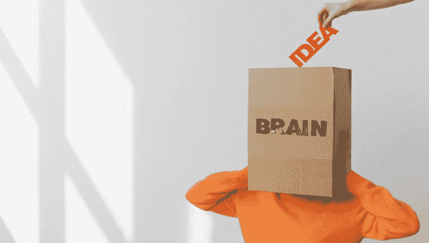

# 我们的大脑和技术。他们能适应吗？

> 原文：<https://medium.com/codex/our-brains-technology-can-they-adapt-f9cd505a8545?source=collection_archive---------13----------------------->

照片由[从](https://www.pexels.com/@shvets-production?utm_content=attributionCopyText&utm_medium=referral&utm_source=pexels)[派克斯](https://www.pexels.com/photo/box-with-brain-inscription-on-head-of-anonymous-woman-7203727/?utm_content=attributionCopyText&utm_medium=referral&utm_source=pexels)拍摄制作

成年人每天看手机屏幕大约 30 次。青少年每天会花 7 个多小时在手机屏幕上[。今天的知识工作者经常在工作日的大部分时间里看着他们连接了多个屏幕的笔记本电脑和台式机，还有他们的手机，可能还有一个手表和一个平板电脑。每天有很多时间在屏幕前。当然，还有我们的电视屏幕和越来越多的虚拟现实(VR)护目镜。慢慢的，智能眼镜也开始发挥作用。](https://www.cnn.com/2019/10/29/health/common-sense-kids-media-use-report-wellness/index.html)

我们与数字世界互动的另一种方式当然是语音，这是亚马逊正在大力投资的领域。虽然我怀疑语音将发挥关键作用，就像手势一样，尽管手势交互仍处于早期阶段，还没有完全超越早期采用阶段。

虽然屏幕很多，但这不仅仅是因为我们越来越频繁地盯着数字世界，而是因为我们的大脑可能会如何适应。如今，手机上的几乎所有应用程序，当然还有从 YouTube 到脸书、Instagram 和抖音的社交媒体服务，都是为了让我们与它们保持互动而特意设计的。iOS 和 Android 都没有被设计成黑白和彩色的，这是有原因的。应用程序和数字产品被设计成以多种方式弹出通知是有原因的。归根结底就是一个词:多巴胺。

多巴胺是一种神经递质，一种有机化合物，一种化学信使，在我们大脑的愉悦中起着关键作用。它还帮助人类计划、奋斗、专注和感兴趣。多巴胺还在肾功能、血管工作方式、睡眠和情绪中发挥作用。这是我们人性的必要组成部分。太多会导致像帕金森氏症这样的疾病，太少也会有不好的影响。做数码产品的人都很清楚这一点。就像食品工业带给我们太多的糖、盐和脂肪一样。

虽然我们现在知道食物中不必要的大量糖、盐和脂肪会导致糖尿病、心脏病、肥胖、炎症和其他问题，但我们才刚刚开始了解多巴胺的影响。这里有一篇很好的文章，它着眼于我们对多巴胺上瘾的世界。

作为一名数字人类学家，我生活和呼吸在人类、我们的文化和社会与技术的交汇处。我在即将出版的书中研究的理论是，在我称之为认知适应的时代，人类将如何适应。从自动驾驶汽车到人工智能，我们越来越多地使用数字技术来丰富我们的生活。为了人类不仅生存，而且繁荣，我们将不得不使用这些技术。

我们现在对技术有了足够的了解，知道每一种技术，无论是像锤子这样的物理技术还是像人工智能这样的数字技术，都是一把双刃剑。所有的技术，每一项技术，都有好有坏。我们不能总是确切地知道如何实现，但是当我们发明新技术并采取措施时，我们可以使用一些框架来解决这个问题。

由于数字技术在很大程度上是我们认知世界的一部分，与我们的大脑互动多于身体，为了适应并充分利用这些工具，我们将不得不做更多的研究并考虑对我们大脑的影响。

[新的研究](https://psychcentral.com/lib/how-do-smartphones-affect-childhood-psychology#brain-affects)已经显示出一些警告信号。尤其是对年幼的孩子。2020 年[皮尤研究中心](https://www.pewresearch.org/internet/2020/07/28/parenting-children-in-the-age-of-screens/)的一项研究显示，在美国，60%的儿童在 5 岁前接触过智能手机。在这个群体中，31%在 2 岁以前。虽然让孩子使用这种设备有好处，但关于什么是合适的年龄和使用程度还有问题。

对于 5 岁及以下的儿童来说，除了明亮、彩色的图片，他们很难处理其他图像。研究表明，即使是 5 岁以上的儿童，过度使用也会导致一些行为问题，如多动症、注意力不集中、情绪波动。症状与毒瘾非常相似。好的一面是，这些可以很快逆转，无需药物治疗。

我们还知道，青少年长期使用和参与社交媒体会导致抑郁、焦虑，有时甚至自杀。一个事实 Meta(原名脸书)对其 Instagram 产品了如指掌，但却一直隐瞒，直到一名举报者曝光。

其他的[研究](https://www.verywellmind.com/how-do-smartphones-affect-the-brain-2794892)成成年人也显示出一些警告的迹象。从睡眠中断，到认知能力下降，精神懒惰和情绪变化。

现在有几家公司正在开发脑机接口(BCI)技术，将芯片直接植入我们的大脑。这对帮助盲人看东西、处理瘫痪、严重抑郁和所有类型的问题都非常有益。然而，我们不知道会有什么负面影响。因为没有一种技术是没有缺点的，所以我们必须假设 BCI 技术也会有缺点。从武器化到我们尚不了解的情绪障碍或生理副作用。

我们拥有这些技术，并且正在开发更多。在我们生活的指数增长时代，他们会以迅猛的速度向我们扑来。他们已经是了，就像“元宇宙”这个夸张的想法，这可能不是我们今天所想的方式。

我们的大脑在几十万年前就已经适应了，随着我们进化语言和文字，甚至创造文化，我们知道“复杂的人类行为”，化学物质，我们的前额叶皮层和其他适应也发生了变化。所以是的，很可能我们可以适应。但是怎么做呢？我们可以预测避免哪些危险？有些我们可能直到事情发生才知道，这是人之常情。

在某个时候，我们可能需要某种程度的政府监管。关于社交媒体和虚假信息，我们已经做了，因为我们不能用技术解决这个问题，因为这不是技术问题，这是人类的问题。挑战在于不要过度监管，因为过度监管会扼杀竞争和创新。这将是一个非常微妙的平衡。资本主义对我们如何进入数字时代至关重要，但某种程度的指导方针需要到位。

我们脑袋里的有机电脑已经受到了影响。我们知道这是科学事实。我们现在需要考虑我们将如何适应认知时代。