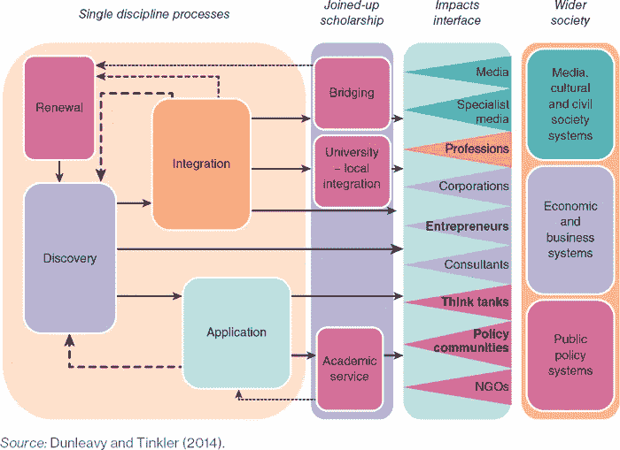
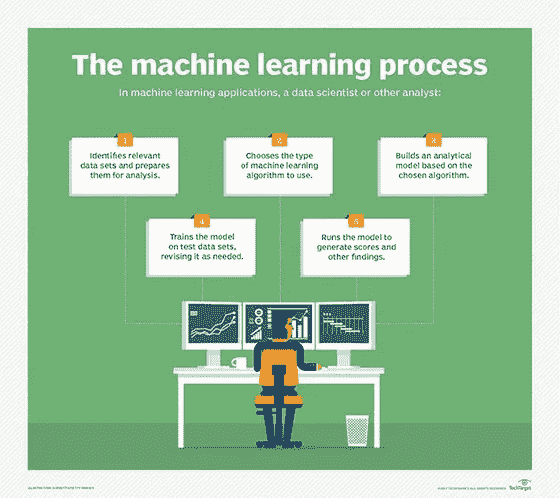
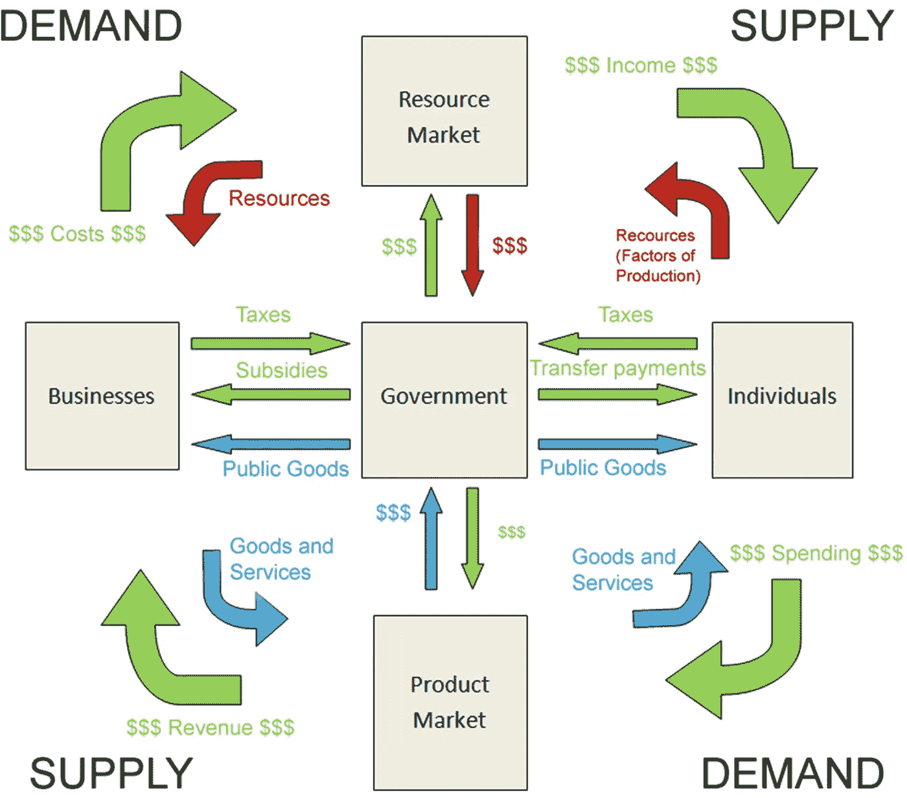
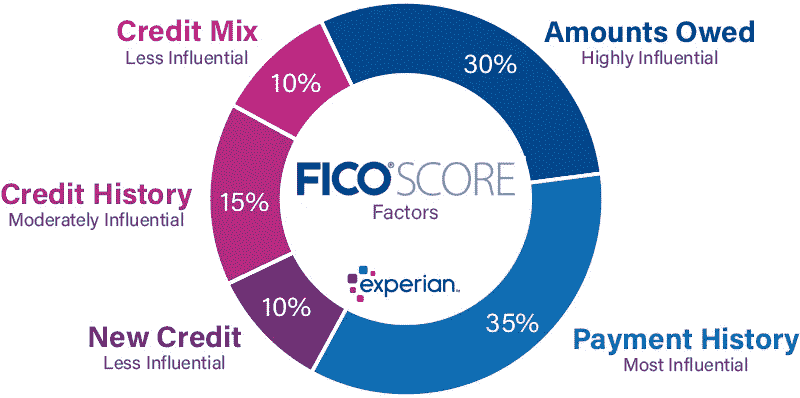
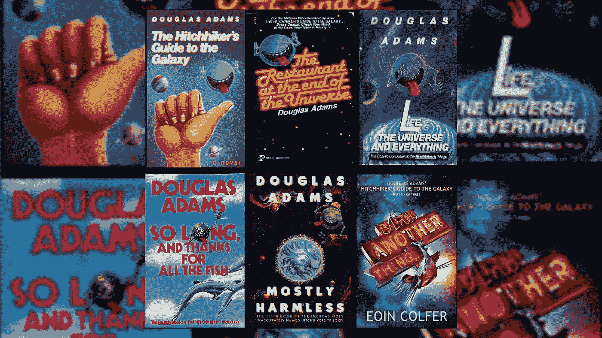

# 我们的世界是一台由机器学习构建的巨型计算机。

> 原文：<https://medium.com/codex/our-worlds-a-giant-computer-built-with-machine-learning-828d894c8019?source=collection_archive---------9----------------------->

有许多方法可以尝试回答“世界是如何运转的？”。我们都在试图理解我们作为人类(线索[社会科学](https://www.ukri.org/about-us/esrc/what-is-social-science/))和超越人类的功能，延伸到心理学、天文学和所有科学，包括化学、生物学等。我们甚至有宗教来解释我们尚未理解的所有事情，以及我们总是可以求助的可靠的命运。

资料来源:现代研究中的社会科学，载于:[社会科学的影响:学者及其研究如何产生影响](https://methods.sagepub.com/Book/the-impact-of-the-social-sciences)

## 计算机是如何适应的？

当我想到一台计算机时，我会想到硬件、软件和构建过程中需要的所有部件。你还需要算法和指令。随着所有关于增强现实(或替代现实？)，虚拟现实还有哈，，我不禁好奇，这一切不都是基于你的编程吗？我说的编程是什么意思？这是个复杂的问题。一个我们一直试图解释为一场竞赛和一个我们一直试图解决的方程式——是什么让人们滴答作响？为什么某些事情会发生？什么是对的，什么是错的？

由 [TechTarget](https://www.techtarget.com/searchenterpriseai/definition/machine-learning-ML) 完成的机器学习过程。看到相似之处了吗？

## 为算法提供信息的代码和数据集

让我们从小处着手，从一些可以量化的有形的东西开始——经济。我们衡量许多指标。我们试图评估各国，以及需要什么样的政策来维持它。然后我们有了法律——我们赖以生存的一套规则来区分什么是对什么是错。我们也有社会学、心理学和哲学的许多方面——告诉我们社会学习和如何解释不同事物的软科学。

资料来源:[“微观经济和宏观经济问题的方法”，作者 Jarmila Zimmermannová，发表于 Springer Link](https://link.springer.com/chapter/10.1007/978-3-030-26626-4_5)

因此，这里抛出一个过于简单的公式:人类世界的复杂[社会结构](https://dictionary.cambridge.org/example/english/social-fabric)+[基础设施](https://www.investopedia.com/terms/i/infrastructure.asp)+心理学+哲学=(一个推论)我们生活的世界只是一台超级计算机，拥有不断进化的算法，很少有任何[NPC](https://en.wikipedia.org/wiki/NPC_(meme))(取决于你在谁的故事中)。

## 一切都是相互关联的，主观的，数据点可以相互依赖

我的第一份工作是在一家信用机构和商业信息公司，在那里我了解到信用评分、犯罪记录、个人和公共数据(如地址和近亲)的重要性。这些是辨别你是否是一个值得他人信任的正派人的关键数据点。将所有这些与我作为社会科学家在大学接触到的东西结合起来——社会工程的影响，人口统计学如何影响你的社会流动性，群体思维和极端行为如何产生，文化扮演的角色。很自然，人类试图寻找“我们是谁”的答案，并从我们环境的所有这些变量中形成对我们身份的理解。

来源:[《你的信用评分是如何确定的》Experian 的 Louis DeNicola](https://www.experian.com/blogs/ask-experian/how-is-your-credit-score-determined/)

我们像赛跑一样不断学习。我们让我们的发现让我们更接近“真相”。为了理解这个世界，我们在内心深处搜索彼此的大脑和道德规范。都是关于主观和对其他“真相”的包容之间的平衡。我们真的能写出正确的算法或程序吗？我们将会有一些错误需要调试。我们的算法中总会有漏洞，黑客会利用这些漏洞。我们将不得不接受一切都是相互关联的这一事实，我们仍在探索理解世界是如何运转的。

我正在读斯科特·比切诺的书《T2 的身份危机》，所有这些想法在我脑海中闪过。(如果你喜欢让你思考的书，我强烈推荐。)他的小说让我想起了 T4·道格拉斯·亚当斯的幽默，也让我将道格拉斯书中的一些概念与司各特的进行了对比。斯科特在他的小说中所做的是探索一个人的身份是如何形成的，以及社会对个人的影响，其中夹杂着机智的幽默(鉴于我对这些有多了解，我并不经常这样做)。

 [## 身份危机:一个人在失去理智的世界中寻找意义

### 通过 Kindle 分享。描述:戴夫·达尔斯顿一直梦想着成为一个自信的城市男孩，直到他的生活发生天翻地覆的变化…

read.amazon.com](https://read.amazon.com/kp/embed?asin=B09419RG9K&preview=newtab&linkCode=kpe&ref_=cm_sw_r_kb_dp_G2CF4FKTWHN9JT7K3HJ2) 

探索的概念包括非暴力反抗、社会契约、社会资本和自我意识(以及[镜子中的自我](https://lesley.edu/article/perception-is-reality-the-looking-glass-self))。因为我们谈论的是社会信用评分——在中国已经成为现实，它也探究了种族主义、性别偏见和所有我们仅仅因为看得见就刻板印象的东西。斯科特避开了刻板印象和偏见，这种偏见因其线索的确定性而得以延续。我们发现，当你手头的信息无法一眼看到时，就更难辨别某人是否安全或可信。*(不一样但让我想起这个研究:“* [*刻板印象威胁与女性数学成绩*](https://www.sciencedirect.com/science/article/abs/pii/S0022103198913737) *”。)*

对我来说最突出的是“团队”的概念。我在读书笔记中写道:“当你强迫人们加入团队时，他们当然会去竞争”。那么我们应该加强团队吗？我们和<insert cause="" here="">站在一起吗？还是我们视自己为一个团队，一个人类。原因也是团队的结果。然而，另一方面，随着竞争，我们推动自己，超越现状。那么竞争好不好？人类能应对竞争吗？</insert>

这么多的问题，这么多的词语，这么多的突触在活动，然而，我们有一台巨大的计算机，这就是我们存在的世界，它以某种方式工作并不断重复它的程序。我们离完美还远着呢，但也许我们永远也不会，我们永远也不会得到关于生命、宇宙和一切的终极问题的答案(剧透:是 T2 42 T3)，或者找出问题是什么。

来源:“[道格拉斯·亚当斯——搭车人指南和他的遗产](https://www.bookishsanta.com/blogs/booklings-world/books-douglas-adams)”，由 [*杜宾巴拉*](https://www.bookishsanta.com/blogs/booklings-world/tagged/bindu-bala) *为书生气十足的圣诞老人。*

**附言:**当我对斯科特的书只有 30%的了解时，我写了另一篇文章。在这里阅读:[科技和谈话的商品化&沉默](/codex/tech-and-the-commoditization-of-talk-silence-db0ba708cc7)，让我知道你的想法！