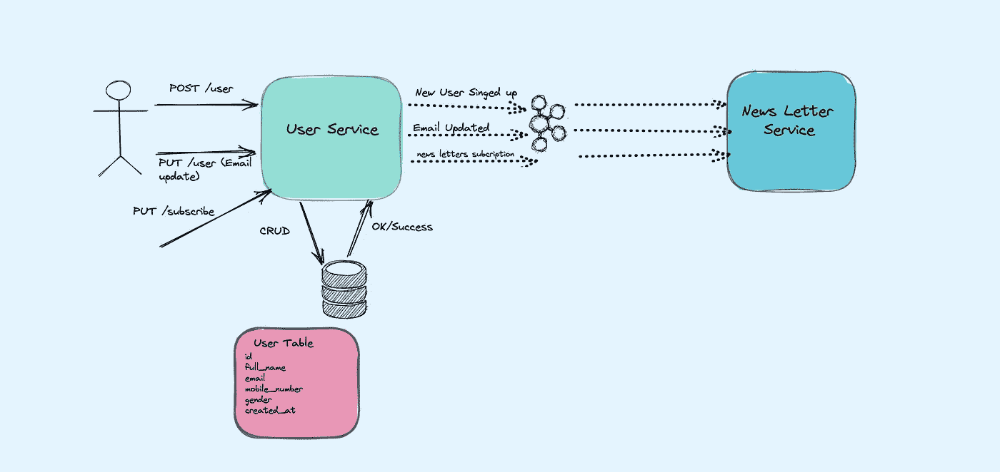
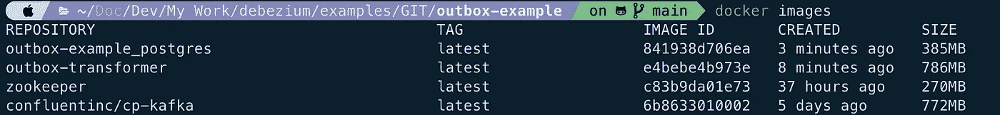

# 用于微服务之间可靠数据交换的发件箱模式

> 原文：<https://medium.com/codex/outbox-pattern-for-reliable-data-exchange-between-microservices-9c938e8158d9?source=collection_archive---------1----------------------->

这个故事讲述了在事件驱动架构中，我们如何高效地在微服务之间交换数据。发件箱模式如何帮助实现这一点，它解决了什么问题，它还不能解决什么问题。

如果你已经构建了几个微服务，你可能会同意[最难的部分是数据](https://blog.christianposta.com/microservices/the-hardest-part-about-microservices-data/)，微服务不是孤立存在的，它们经常需要在彼此之间传播数据和数据变化。

接收一个请求，将它保存到数据库中，最后发布一条消息可能比预期的要复杂。一个简单的实现可能会丢失消息，或者更糟糕的是，发布不正确的消息。



> **用户服务→** 该服务将有一个注册用户列表。
> 
> **简讯服务→** 该服务将根据订阅情况为用户配置简讯。用户也可以订阅。它有一个文档数据存储。
> 
> **Kafka Streams →** 在上面的用例中有三个事件`New User Singedup`、`News Letter Subscription`和`Email Updated`。
> 
> **用户服务数据库→** 底层数据库是 Postgres。当新用户注册时，用户数据存储在本地存储中。当任何用户请求电子邮件更新时，该电子邮件在用户表中被更新。

**这里的问题是什么？**

当一个微服务改变了它作为记录系统的状态，然后通过一个事件通知订阅者它已经改变了它的状态，我们如何确保订阅者接收到这个事件并因此与生产者保持一致？

记录系统可能变得与下游消费者不一致，因为在向实体写入更改后，我们可能无法发布相应的消息。我们与面向消息的中间件(MoM)的连接可能会失败，或者 MoM 可能会失败。

新记录保存到数据存储中，但不会引发事件，因此订阅系统变得不一致。

让我们理解上面的用例。 ***用户服务*** 管理用户数据，该服务是用户的单一真实来源。当新用户向用户服务注册时，它必须保存本地副本，并让 N 个 ***新闻记者*** ***服务*** 知道新用户已经注册。 ***简讯服务*** 会给用户分配默认简讯。用户可以在以后管理它们。

用户服务可以让其他服务以同步和异步的方式。

**同步接近**

服务可以通过`Rest`、`RPC`或任何其他同步方式进行通信。但是，这可能会产生一些不希望的耦合，发送服务必须知道要调用哪些其他服务以及在哪里可以找到它们。还必须为这些服务暂时不可用做好准备。除此之外，我们应该增加请求路由、重试、断路器等功能。

任何同步方法的普遍问题是，一个服务如果没有它调用的其他服务，就不能真正发挥作用。虽然缓冲和重试可能有助于其他服务只需要被通知某些事件的情况，但如果一个服务实际上需要向其他服务查询信息，情况就不是这样了。这种同步方法的另一个缺点是它缺乏可再玩性，即新消费者在事件已经被发送之后到达并且仍然能够从头消费整个事件流的可能性。

**异步方法**

上述两个问题都可以通过异步方法来解决。即从`User Service`通过持久消息日志如 ***阿帕奇卡夫卡*** 传播事件。通过订阅这些事件流，每个服务将被通知其他服务的数据更改。它可以对这些事件作出反应，并且如果需要的话，可以在自己的数据存储中创建该数据的本地表示，使用针对自己的需求定制的表示。例如，这样的视图可能被反规范化以有效地支持特定的访问模式，或者它可能只包含与消费服务相关的原始数据的子集。

持久日志还支持可重用性，即可以根据需要添加新的消费者，支持您最初可能没有想到的用例，并且不涉及源服务。一旦**用户服务**事件位于 Kafka 主题中(Kafka 主题的保留策略设置可用于确保事件在给定用例和业务需求需要时一直保留在主题中)，新消费者就可以订阅，从一开始就处理主题，并物化微服务的数据库、搜索索引、数据仓库等中的所有数据视图。

分布式事务似乎是一个答案，但有两个问题。首先，我们可能使用来自不同供应商或 OSS 项目的后备存储和面向消息的中间件，它们不支持相同的分布式事务协议。第二，分布式事务的伸缩性不好。

我们可能天真地试图通过首先发送消息来解决这个问题，如果成功的话，就更新后备存储。但是这也不一定行得通，因为我们可能无法写入数据库。

新记录被发送到下游系统，但是本地数据库调用被拒绝，因此上游系统现在不一致。一个幽灵发送。

这导致了 ***双重写入问题。***

**双重写入导致数据不一致**

> **双重写入**在分布式、事件驱动的应用中经常导致问题。当应用程序必须在两个不同的系统中更改数据时，就会发生双重写入，例如当应用程序需要在数据库中保存数据并发送 Kafka 消息以通知其他系统时。如果这两个操作中的一个失败，您可能会得到不一致的数据。双重写入很难检测和修复。

**双重写入可以使用** [**发件箱模式**](https://microservices.io/patterns/data/transactional-outbox.html) **来修复。**

# **发件箱模式**

当您应用发件箱模式时，您将微服务和消息代理之间的通信分成两部分。关键要素是您的服务在其数据库中提供了发件箱。

> 它类似于 Gmail 的发件箱，电子邮件将被保留，直到它交付给预期的收件人。

发件箱通常是位于源系统中的一个表。在我们这里，是 ***用户服务。***


**发件箱表的内容**

以下格式的发件箱结构没有这样的规则。请根据您的要求重新设计。我在演示中使用了这种格式。


现在发件箱表已经设置好了，我们必须在生态系统中定义一个过程，从另一个服务的发件箱表中读取数据。另一个服务可以有任何类型的数据库(RDBMS/Doc Store)。以下是我们可以实施的方法。

*   您可以实现一个服务来轮询发件箱表，并在发现新记录时向消息代理发送新消息。
*   您可以使用 Debezium 这样的工具来监控数据库的日志，并让它为发件箱表中的每个新记录向您的消息代理发送一条消息。这种方法称为变更数据捕获(CDC)。

> 我更喜欢方法 2，因为它在企业用例中的能力和较少的维护麻烦。

# **使用 Debezium 的 CDC 发件箱模式正在运行**

**使用的技术**

> **Java 11**
> 
> **Spring Boot 2 和春云。**
> 
> **格雷尔**
> 
> **Debezium Kafka 连接器。**
> 
> Postgres 12。
> 
> **Mongo DB。**
> 
> **阿帕奇卡夫卡。**
> 
> **码头工人**

基础架构在 docker 文件中设置。

我们有一个多模块的 spring boot 项目，使用 Gradle 作为构建工具。

1.  **用户服务→** 该服务包含所有用户详细信息和用户数据的单一真实来源。它有 Postgres 作为数据存储。此服务有一个发件箱表。该服务具有 Postgres 模式和种子数据，可以在通过 docker 启动 Postgres 实例的过程中创建表和一些数据。
2.  **发件箱变压器→** 这是一个连接 Debezium Kafka 连接器的实用模块。它有一个 ***自定义发件箱转换器，*** 其中转换器控制数据库变更日志发出的事件。我们没有使用我们自己编写的满足用例的默认转换器。
3.  **简讯服务→** 这是发件箱日志事件的目标服务。它有 MongoDB 作为数据存储。

请点击***GitHub***[***链接***](https://github.com/ereshzealous/outbox-example)*获取完整源代码。*

***Docker 撰写文件***

***自定义发件箱转换器***

*在第 22 行→条件逻辑，Debezium 捕获表的所有变化。在这里，我限制只插入/创建一个新记录。*

*在第 27 行→从数据变更`event_name`中获取值，并将其用作 Kafka 发布消息的主题。*

*获得更多关于 Debezium 的 CDC 消息格式的信息。请阅读我之前关于 CDC 的[故事](https://eresh-gorantla.medium.com/change-data-capture-use-cases-and-real-world-example-using-debezium-fe4098579d49)。*

***Debezium Kafka 连接器***

*发件箱类型是为我们编写的定制转换器定义的。*

```
*curl -X POST  http://localhost:8083/connectors/ \
  -H 'content-type: application/json' \
  -d '{
   "name": "student-outbox-connector",
   "config": {
      "connector.class": "io.debezium.connector.postgresql.PostgresConnector",
      "tasks.max": "1",
      "database.hostname": "postgres",
      "database.port": "5432",
      "database.user": "postgres",
      "database.password": "postgres",
      "database.dbname": "user_DB",
      "database.server.name": "pg-outbox-server",
      "tombstones.on.delete": "false",
      **"table.whitelist": "public.outbox",**
      "transforms": "outbox",
      **"transforms.outbox.type": "com.eresh.outbox.OutboxTransformer"**
   }
}'*
```

***演示***

***构建步骤***

*首先，为 outbox-transformer 构建并准备 docker 映像。Docker 会将这个生成的 outbox-transformer 的 jar 文件添加到 Debezium connect 中。由于我们使用自定义发件箱转换器，我们需要将它添加到 Debezium 连接器的构建路径中。*

```
*FROM debezium/connect
ENV *DEBEZIUM_DIR*=$*KAFKA_CONNECT_PLUGINS_DIR*/debezium-transformer

RUN mkdir $*DEBEZIUM_DIR* COPY build/libs/outbox-transformer-0.0.1-SNAPSHOT.jar $*DEBEZIUM_DIR**
```

*建设*

```
*$ cd outbox-transformer
$ ./gradlew clean build
$ docker build -t outbox-transformer .*
```

*docker 构建的响应*

```
*[+] Building 41.9s (8/8) FINISHED
--------
=> [internal] load build definition from Dockerfile                                                                                                                                                                     
=> [2/3] RUN mkdir /kafka/connect/debezium-transformer                                                                                                                                                                  0.7s
=> [3/3] COPY build/libs/outbox-transformer-0.0.1-SNAPSHOT.jar /kafka/connect/debezium-transformer                                                                                                                      0.0s
=> exporting to image                                                                                                                                                                                                   0.0s
=> => exporting layers                                                                                                                                                                                                  0.0s
=> => writing image sha256:e4bebe4b973e13ce083f64e3743c3f002d5ba83812dc30e350425f9d6d50f195                                                                                                                             0.0s
**=> => naming to docker.io/library/outbox-transformer***
```

*现在，我们已经向 Debezium 连接器添加了自定义转换器。*

***调用 Docker 合成文件***

```
*$ cd .. (Go to root directory that's where docker-compose.yaml file resides. Then run below command
$ **docker-compose up -d***
```

**

*我没有使用过任何像 L *iquibase 或 flyway* 这样的数据迁移工具来创建表。我使用 docker 来创建表，这些表在 Postgres 初始化期间执行。如果您看到已经创建了两个表。*

**

***创建主题和 Debezium 连接器配置。为了简单起见，我为我们创建了一个 shell 脚本文件。***

```
*$ ./init.sh
--------------
-e
-------- Creating Kafka Topics Initiated --------
-e
-------- Creating Kafka Topics new_user --------
WARNING: Due to limitations in metric names, topics with a period ('.') or underscore ('_') could collide. To avoid issues it is best to use either, but not both.
Created topic new_user.
-e
-------- Creation Kafka Topics new_user Completed --------
-e
-------- Creating Kafka Topics news_letter_subscription --------
WARNING: Due to limitations in metric names, topics with a period ('.') or underscore ('_') could collide. To avoid issues it is best to use either, but not both.
Created topic news_letter_subscription.
-e
-------- Creation Kafka Topics news_letter_subscription Completed --------
-e
-------- Creating Kafka Topics email_changed --------
WARNING: Due to limitations in metric names, topics with a period ('.') or underscore ('_') could collide. To avoid issues it is best to use either, but not both.
Created topic email_changed.
-e
-------- Creation Kafka Topics email_changed Completed --------
-e
-------- Creating Outbox Kafka Connector For Debezium --------
{"name":"student-outbox-connector","config":{"connector.class":"io.debezium.connector.postgresql.PostgresConnector","tasks.max":"1","database.hostname":"postgres","database.port":"5432","database.user":"postgres","database.password":"postgres","database.dbname":"user_DB","database.server.name":"pg-outbox-server","tombstones.on.delete":"false","table.whitelist":"public.outbox","transforms":"outbox","transforms.outbox.type":"com.eresh.outbox.OutboxTransformer","name":"student-outbox-connector"},"tasks":[],"type":"source"}-e
-------- Creating Outbox Kafka Connector For Debezium is Completed --------*
```

*我们已经完成了所有的基础设置。是时候开始服务了。*

*   *将用户服务作为 Spring Boot 应用程序启动。您可以根据需要自定义环境变量。*
*   *将简讯服务作为 Spring Boot 应用程序启动。您可以根据需要自定义环境变量。(*为此，您需要在本地安装 MongoDB。我用的是社区版 4.2 版本*)。*

****用例 1，创建新用户****

*让我们创建一个新用户。在创建用户的过程中，`User Service`会将用户保存在其`USERS Table`的本地副本中，并将`event_name`作为`new_user`保存在`OUTBOX TABLE`的另一个副本中。然后，Debezium Kafka Connect 的 CDC 将发布关于该主题的新创建的事件。该主题由`News Letter Service`订阅，并为用户`Best Sellers, Weekly Frequency`和`Hot keywords, Monthly Frequency`创建了两个默认的新闻信件。*

```
*$ curl -X POST \                                                                                                      
  '[http://localhost:9000/api/user'](http://localhost:9000/api/user') \
  -H 'content-type: application/json' \
  -d '{
    "fullName": "Medium Demo",
    "email": "[medium.demos@gmail.com](mailto:medium.demos@gmail.com)",
    "mobileNumber": "+919876543214",
    "gender" : "Male"
}'
{"id":"a2beaf38-4569-44e6-8d37-bf54553f7b69","fullName":"Medium Demo","email":"[medium.demos@gmail.com](mailto:medium.demos@gmail.com)","mobileNumber":"+919876543214","gender":"Male","createdAt":"2021-08-19T16:35:29.719768"}*
```

***验证用户服务表***

*在`User`表和`Outbox`表中创建新记录，其中`event_name`为`new_user`。*

**

***验证简讯服务***

**

****用例 2，用户可以创建订阅****

*在这个用例中，`User Service`上没有动作。但是我调用了`News Letter Service`到`User Service`(请原谅我)。这将在`outbox`表中添加一个新行，其中`event_name`为`news_letter_subscription`。*

```
*$ curl --location --request PUT '[http://localhost:9000/api/user/subscribe'](http://localhost:9000/api/user/subscribe') \                                       
--header 'Content-Type: application/json' \
--data-raw '{
    "userId": "a2beaf38-4569-44e6-8d37-bf54553f7b69",
    "subscriptions": [
        {
            "frequency": "Monthly",
            "newsLetter": "Top Brands"
        }
    ]
}'*
```

*发件箱表格中插入了新的一行，其中`event_name`为`news_letter_subscription`。*

**

***验证简讯服务***

*一条新记录被插入到带有订阅详细信息的文档中。*

**

***用例 3，更新用户的电子邮件***

*这将更新`USER`表，并在`OUTBOX`表`event_name`中插入一个新行作为`email_changed`。在`News Letter Service`收听该主题的订阅者将使用修改后的电子邮件更新用户的所有订阅。*

```
*$ curl --location --request PUT '[http://localhost:9000/api/user/email/a2beaf38-4569-44e6-8d37-bf54553f7b69'](http://localhost:9000/api/user/email/a2beaf38-4569-44e6-8d37-bf54553f7b69') \
--header 'Content-Type: application/json' \
--data-raw '{
    "email" : "[medium.demo@medium.com](mailto:medium.demo@medium.com)"
}'
{"id":"a2beaf38-4569-44e6-8d37-bf54553f7b69","fullName":"Medium Demo","email":"[medium.demo@medium.com](mailto:medium.demo@medium.com)","mobileNumber":"+919876543214","gender":"Male","createdAt":"2021-08-19T16:35:29.802427"}*
```

***验证用户服务表***

*`User`表被更新，新的一行被添加到发件箱中，其中`event_name`为`email_changed`。*

**

***签到简讯服务***

**

***学习***

*我们已经使用 Debezium 的变更数据捕获了解了发件箱模式。发件箱模式是在不同微服务之间传播数据的一种很好的方式。*

*通过只修改单个资源——源服务自己的数据库——它避免了同时修改不共享一个公共事务上下文(数据库和 Apache Kafka)的多个资源的任何潜在的不一致性。通过首先写入数据库，源服务具有即时的“读取您自己的写入”语义，这对于一致的用户体验很重要，允许在写入之后调用的查询方法即时反映任何数据更改。*

*同时，该模式支持异步事件传播到其他微服务。Apache Kafka 充当服务间消息传递的高度可伸缩和可靠的主干。给定正确的主题保留设置，新消费者可能在事件最初产生后很久才出现，并基于事件历史建立他们自己的本地状态。*

***发件箱模式的优势***

*   *与其他解决方案相比，这种模式的最大优点是相对简单*
*   *发件箱模式为我们提供了至少一个成功的事务提交。*
*   *审计和重放事件的能力。*
*   *避免复杂的应用程序逻辑。*
*   *定制的数据格式有利于消费者，并减少了集成问题。我们可以使用 Avro，图式可以进化。*

***发件箱模式无法解决的挑战或问题***

> *消息中继可能会多次发布一条消息。例如，它可能会在发布消息之后，但在记录它已经发布消息的事实之前崩溃。当它重新启动时，它将再次发布消息。因此，消息消费者必须是等幂的，也许是通过跟踪它已经处理的消息的 id。幸运的是，由于消息消费者通常需要是幂等的(因为消息代理可以多次传递消息)，这通常不是问题。*

# *参考*

*[](https://microservices.io/patterns/data/transactional-outbox.html) [## 微服务模式:事务发件箱

### 应用程序事件服务命令通常需要更新数据库和发送消息/事件。例如，一个…

微服务. io](https://microservices.io/patterns/data/transactional-outbox.html) [](https://debezium.io/blog/2019/02/19/reliable-microservices-data-exchange-with-the-outbox-pattern/) [## 使用发件箱模式进行可靠的微服务数据交换

### Debezium 是一个用于变更数据捕获的开源分布式平台。启动它，指向你的数据库，然后…

debezium.io](https://debezium.io/blog/2019/02/19/reliable-microservices-data-exchange-with-the-outbox-pattern/)*