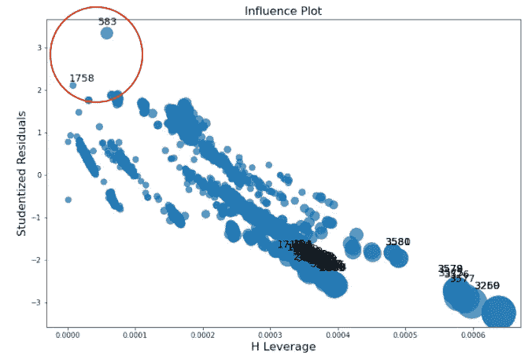
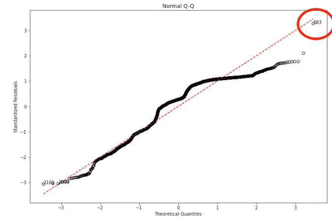
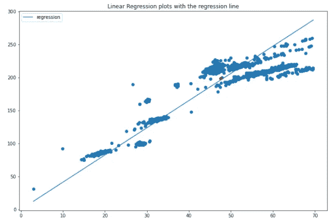
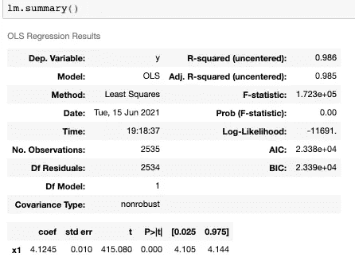
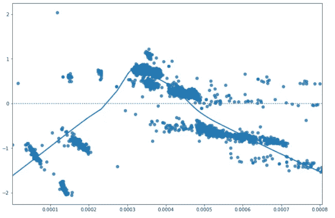
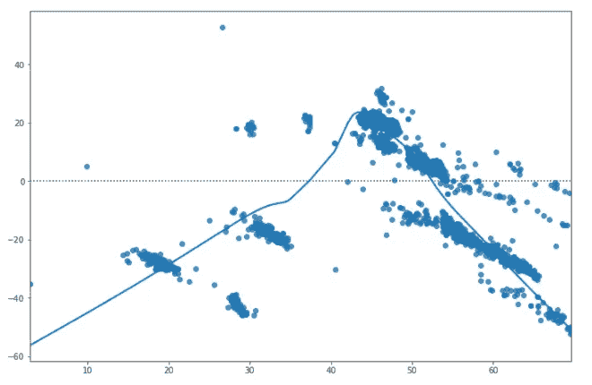

# 使用 Python 进行异常研究和线性回归诊断

> 原文：<https://medium.com/codex/outlier-study-and-linear-regression-diagnosis-using-python-d148223859c0?source=collection_archive---------0----------------------->

作为研究建筑物中暖通空调(HVAC)系统的传感器数据的数据科学家，我们通常应用异常检测统计技术或机器学习方法来检测和识别故障，如设备故障或操作错误。处理真实世界的传感器数据有其自身的挑战。

一个这样的用例是检测用于促进冷冻水流动以冷却建筑物的故障泵。当冷冻水泵功率的增加或减少分别与管道冷冻水流速的增加或减少不一致时，就会出现这种情况。

我们的方法是训练一个回归模型。新数据的后续预测与某个阈值的任何偏差都意味着检测到异常。为了确保训练数据代表泵的最佳状态，我们需要仔细研究并去除异常值。

在很长一段时间里，我会通过标记偏离四分位数范围(IQR)的点来识别数据中的异常值或不规则性。四分位数间距(IQR)定义为第三个四分位数和第一个四分位数之差(IQR = Q3 -Q1)。在这种情况下，异常值被定义为低于(Q1 1.5 倍 IQR)或高于(Q3+1.5 倍 IQR)的观测值。然而，我们很快意识到我们删除了太多对回归很重要的数据点。幸运的是，我们想出了一个更系统的方法来识别异常值，从我们面临的异常值的性质开始。我们意识到，我们面临的异常值可以总结为三个主要特征:

(a)杠杆作用:一个点是否远离 x 空间中的主要集群。(b)一致性:就(x，y)空间中的拟合而言，一个点是否是一致的。(c)影响:一个点是否高度影响模型的拟合。

我们如何识别这些异常值？我们使用学生化的删除残差作为一致性的度量。这种影响通过库克的距离来衡量。有趣的是，对于杠杆的测量，我们利用了臭名昭著的 OLS hat 矩阵的对角线:H = X * (transpose(X)*X)^(-1) *转置(x)。hat 值 h(i)被用作第 I 个数据点的杠杆测量。

下面是 python 中的实现，使用了 statsmodels 的一个名为 OLSInfluence 的库。首先，拟合回归模型。然后，拟合的回归对象用于分别导出学生化残差、杠杆和库克距离。

下图是杠杆与学生化残差图。y 轴是学生化残差，表示是否存在基于 alpha 值的异常值(显著性水平)。它显示右下角的点是高杠杆数据点。一般来说，除了点 583 和 1758 之外，这种回归拟合没有任何问题。

非正式的评估通常通过目测学生化删除残差的 Q-Q 图、杠杆 h(i)和 cook 的距离 d(i)来帮助我们评估异常值并识别点的指数，以便我们可以删除或保留它们用于我们的训练。Q-Q 图的更详细的解释可以在下面的部分中阅读。学生化残差的 Q-Q 图显示数据点 583 确实是异常值。

Q-Q 概率图是重尾的，并且显示了存在异常值的非正态分布。

下面是检索上述 Q-Q 图的代码。类似的图可以用于分析库克的距离和杠杆。在这里，我们使用 scipy.stats 中的 probplot()来生成值。

然而，可以使用的更正式和具体的评估是在我们的回归中引入虚拟变量 u。对于第 I 个单元(即我们通过非正式评估认为异常的数据点)，虚拟变量将取值 1，否则取值 0。该系数 u 在线性预测值中的显著性表明并确认第 I 个点确实是异常值。

除非异常值非常有影响力，否则不需要从模型拟合中排除。但是需要调查来找出这个有影响的数据点的可能性。

**使用 Python 的模型诊断**

建模的一个重要方面是确保正确诊断您的模型。无论模型有多复杂，模型都可能经历系统差异，从而严重损害预测的性能。

幸运的是，线性回归通常表现良好，因为 r 平方值为 0.985。然而，让我们继续使用这个数据集和问题作为用例来评估我们的数据是否打破了任何正态假设。我们首先拟合数据，生成回归函数及其组件(如对象本身)以及汇总表。在这种情况下，我们只有一个预测变量，即泵功率。响应变量是流速。

左边的图显示了回归函数，右边的表是拟合回归函数的结果汇总。

让我们详细检查当线性回归的假设被打破时所面临的常见差异。

回归函数不是线性的。(b)误差项不具有恒定的方差。误差项不是独立的。(d)误差项不是正态分布的。(e)模型中忽略了一些重要的预测因素。

我们如何识别哪些是模型的正确错误诊断？一把瑞士军刀是通过绘制残差图来检查非线性、恒定方差。如果没有差异，残差将看起来像均值为零的随机误差，即零模式。在任何残差图中，点将均匀分布在零周围的水平带内。如果模式存在，模型是失败的，因为它不适合回归函数，并且我们知道是否存在非线性或非恒定方差。创建拟合值的残差图以及预测变量的残差图将有助于找出这一点。

seaborn 软件包使我们能够通过一行代码方便地绘制剩余图以及更平滑的 Lowess 函数。在下面的代码中，我构建了学生化残差与杠杆的关系图。响应变量是学生化残差，这里的 x 轴是杠杆，通过 OLS 帽矩阵的对角线确定。在这种情况下，在 Lowess 平滑器中似乎有一个向上，然后向下的趋势，表明异方差的迹象。

剩余价值与杠杆价值显示出异方差的迹象。

我们还要检查残差中是否存在与拟合值相关的结构。这个情节相对容易创作。这里的计划是从拟合模型中提取残差和拟合值，计算通过这些点的 Lowess 平滑线，然后绘制出来。在这种情况下，残差中可能存在轻微的非线性结构。

残差与拟合图显示非线性迹象，违反零模式。

另一把瑞士军刀是 Q-Q 图或正态概率图，我们在上一节已经谈到了。Q-Q 图帮助我们识别预测值或误差项的正态条件。Q-Q 图的零模式是这些点应该单独落在一条直线上。如果它是一条凸曲线，则分布是非对称和偏斜的，通过伽马分布可以更好地解释。对称但重尾的分布也违反了 Q-Q 图的零模式，这意味着数据的分布不是正态分布，最好在拟合回归模型之前进行一些转换。关于不同类型的 Q-Q 情节的更多细节和精彩解释可以在我找到的这篇博文中找到:[https://towardsdatascience . com/Q-Q-plots-explained-5aa 8495426 c0](https://towardsdatascience.com/q-q-plots-explained-5aa8495426c0)

总之，对于模型诊断，首先，检查非线性。有几个残差图可以用来检查这种情况。首先，绘制拟合值的残差图，然后绘制每个预测变量的残差图。此外，当有多个预测变量时，响应与预测变量的散点图有助于确定与响应变量的关系。

其次，当检查同质性时，拟合值的残差图和预测变量的残差图就足够了。我们需要看到残差的方差是一个常数，即这些点看起来是随机的。这使我们确信误差项是独立分布的。

最后，但肯定不是最不重要的，检查常态。Q-Q 图在识别响应变量分布的任何偏斜方面非常有效，可以帮助我们决定是否需要 x，y 变量的转换。正态性是成功拟合模型的一个重要假设。

我希望这是对忙于拟合线性回归模型，但无法识别和补救真实世界数据集中的异常的数据科学家有用的总结。请注意，当使用 Sklearn 库进行线性回归时，很难提供这样的诊断。因此，对于 python 中的线性回归类型的问题，我强烈推荐使用 statsmodels 或 scipy.stats。

希望你喜欢我的帖子！随时学习和分享这些发现，随时在 LinkedIn 上加我:[https://www.linkedin.com/in/esther-dawes-9b462343/](https://www.linkedin.com/in/esther-dawes-9b462343/)并在 github 上关注我的一些工作，我会尽力不时地发布一些有趣的项目:【https://github.com/technologic27】T2。