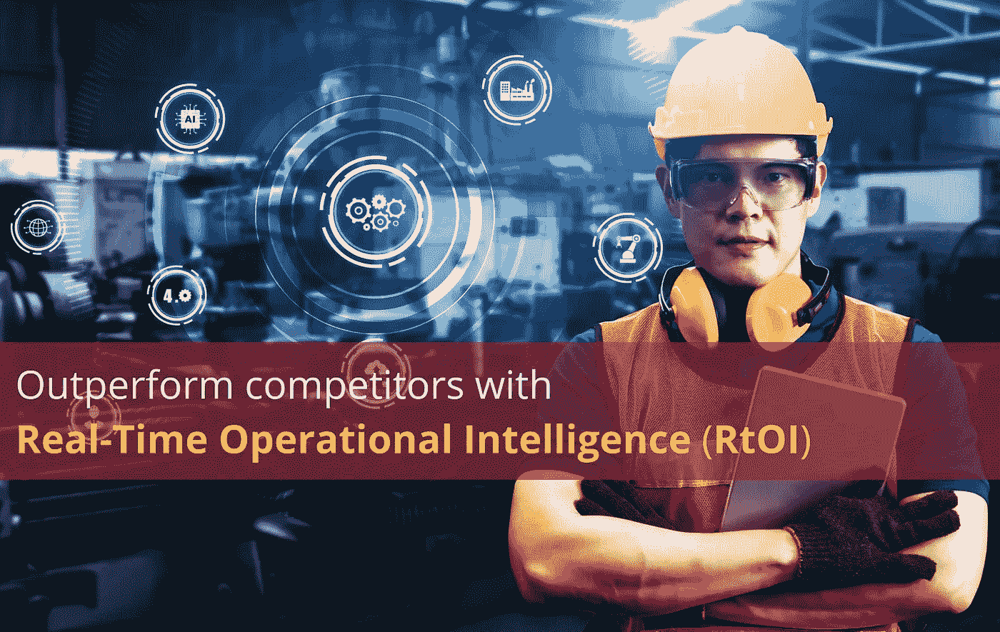
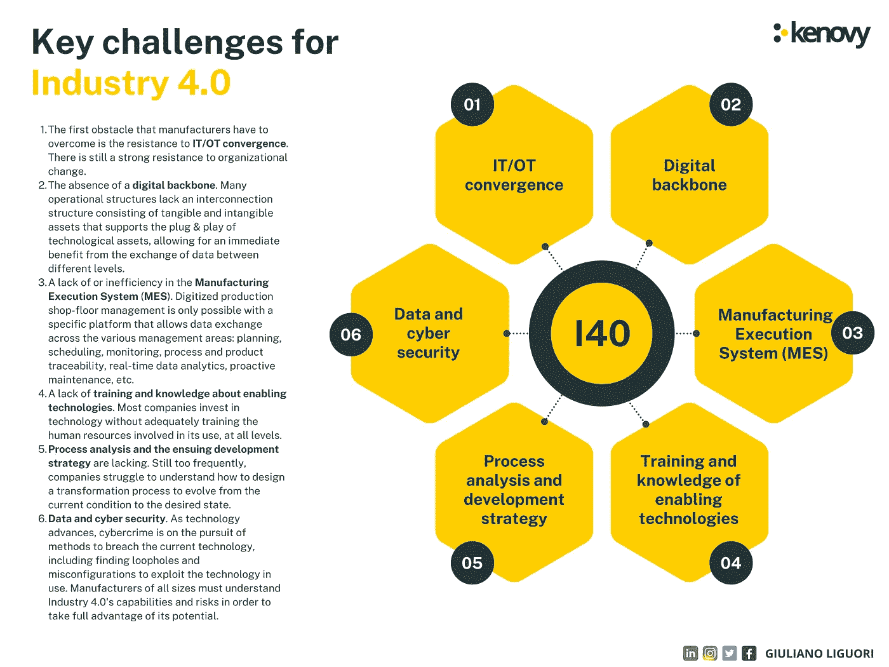

# 凭借实时运营智能(RtOI)超越竞争对手

> 原文：<https://medium.com/codex/outperform-competitors-with-real-time-operational-intelligence-rtoi-f36f4f0aebb0?source=collection_archive---------2----------------------->

作者图片

***实时运营智能(RtOI)是一个在商业领域越来越流行的术语。但是 RtOI 是什么呢？它的好处是什么？***

**简介**

第四次工业革命范式(工业 4.0)源于这样一种想法，即工厂是信息物理系统(CPS)运行的地方，即与计算机集成的物理系统。工业 4.0 的结果是，生产变得更加灵活和自主，产品可以更加互联和定制。该术语概括了各种使能技术，包括物联网、增强现实、云计算、智能机器人、大数据和网络安全。

这些技术的采用受到生产数字化转型的推动，因此需要采用技术来实时连接和分析生产和流程数据。然而，只有在能够实时、端到端监控的特殊平台的支持下，数字化生产车间才能得到管理。

拥有实时作战情报(RtOI)系统是实现这一性能的关键。事实上，在竞争经济中，由实时数据驱动的技术为制造商提供了新的强大能力来应对一系列挑战。使用 RtOI 系统，可以按需扩展运营、分配资源、实时识别和解决车间问题，并对客户期望做出更加敏捷的响应。

【RtOI 代表什么？

RtOI 被定义为“实时收集、处理和处理数据的能力，使组织能够做出更好的决策并提高业务绩效。”换句话说，这是一种利用数据做出决策的能力。运营情报(OI)传统上被定义为管理当前运营所需的主动和被动决策；同时，RtOI 是一种使用实时数据做出决策的 OI。RtOI 的好处是多方面的，包括能够更快地做出决策，提高态势感知能力，以及降低运营成本。

**为什么 RtOI 很重要？**

实时作战情报是近十年来出现的一个新概念，正在迅速获得关注。它通过提供整个制造过程的可见性，帮助公司提高效率和正常运行时间。其目标是为公司提供将海量数据转化为可随时访问的实时可操作见解的能力。

RtOI 的目的是

*   为了防止事故和节省时间。它有助于公司在机器出现问题之前发现问题，以便进行更智能的预防性维护。这降低了事故发生的风险，为公司、客户和员工节省了时间；
*   提供工厂和设备的当前状态、运行情况以及维护需要的信息。这些信息可用于识别潜在问题，并在问题变成灾难之前采取纠正措施。

为了保持高水平的运营效率，公司需要预测和预防潜在问题的能力。这就是实时作战情报的用武之地。预防和识别维护问题有助于企业避免这些问题。尽快采取适当的行动不仅仅是预测失败，还包括识别已经发生的事情。换句话说，失败不仅仅是可以预测的，而是需要尽快识别和纠正。这样，公司可以减少停机时间并增加收入。

**什么是 RtOI 流程？**

实时操作智能过程是一个收集、分析和解释由工厂操作产生的数据以产生实时洞察的系统。这使得操作员能够及时做出决策。

该过程基于以下步骤:

1.  从传感器和其他来源(即人、机器和系统)收集数据。
2.  分析这些数据并产生见解。
3.  为利益相关者提供他们需要的信息的直接访问。
4.  当条件不符合预期时生成警报。
5.  通知操作员这些警报。
6.  分析形势并制定解决问题的行动计划。

实时运营智能流程是一种更智能、更主动的车间管理方法。这是一种使用数据分析来实时获得车间发生的事情的详细视图的方法。

起初，该流程主要提供简单的任务，例如防止机器出现故障。如今，它在整个工厂中被系统地用于更复杂的任务，不仅避免停工时间，而且防止操作人员受伤。

**工业 4.0 的未来会怎样？什么是工业 4.1？**

创建零缺陷制造业是工业 4.0 的目标之一，这一概念于 2014 年在汉诺威工业博览会上首次提出。然而，由于工业 4.0 范式的构建方式，企业往往更注重提高生产率，而不是质量。

这就是**工业 4.1** 范例发挥作用的地方。为了保证零缺陷，有必要实施一个系统，提供可用于整个生产线和所有生产阶段的总检测的实时和在线数据。

因此，通过采用 RtOI 系统，如果实施得当，将有可能始终确保高产品质量并减少不合格品。事实上，该系统可用于识别缺陷的根本原因，以持续改进那些有缺陷的产品；因此，可以实现所有产品的高质量。

实时访问数据意味着能够:

*   实施可行的质量控制见解；
*   基于生产数量、时间和事件触发通知；
*   轻松快速地定义、捕获和分析测试结果；
*   允许实时生产预测和控制。

为了实施智能制造，高科技和传统产业都可以通过将工业 4.0 升级到工业 4.1，以实现产品的“零缺陷”为目标，从这样的系统中受益。

**制造商现在可以利用工业 4.0 技术解决哪些挑战？**

制造业面临着提高生产率和满足消费者需求的压力。许多制造商正在寻求工业 4.0 技术来提供解决方案。

作者提供的信息图

1.  制造商必须克服的第一个障碍是对 IT/OT 融合的阻力。组织变革仍面临强大阻力。公司的 IT 和 OT 部门仍然高度孤立，有不同的人、不同的目标和不同的政策。他们以完全独立、竞争和冲突的方式工作。传统上，IT(信息技术)主要用于金融计算和商业交易。另一方面，运营技术(OT)是一个预先配置的、专有的供应商系统，旨在只在特定的设备上工作。虽然技术上的差异已经逐渐成为组织上的差异，但信息技术在作战行动中的使用正变得越来越频繁。
2.  缺乏数字主干网。许多运营结构缺乏由支持技术资产即插即用的有形和无形资产组成的互连结构，从而无法从不同级别之间的数据交换中立即获益。
3.  制造执行系统(MES)缺乏或效率低下。数字化生产车间管理只有在特定平台上才可能实现，该平台允许跨各种管理领域的数据交换:规划、调度、监控、过程和产品可追溯性、实时数据分析、主动维护等。
4.  缺乏关于使能技术的培训和知识。大多数公司投资于技术，却没有在各个层面充分培训使用技术的人力资源。
5.  缺乏过程分析和随后的发展战略。很多时候，公司都很难理解如何设计一个转型过程来从当前状况发展到期望的状态。
6.  数据和网络安全。随着技术的进步，网络犯罪正在寻求突破当前技术的方法，包括找到漏洞和错误配置来利用正在使用的技术。在工业 4.0 中，通信和网络安全不能被认为是独立的过程。各种规模的制造商必须了解工业 4.0 的能力和风险，才能充分利用其潜力。

**领导者如何为投资于让他们更接近实时智能的技术提供商业理由？**

在这个瞬息万变的世界中，制造业领导者获得实时生产数据比以往任何时候都更加重要。实时运营情报可以为他们提供最新信息，从而帮助他们做出更好的决策。然而，技术可能很昂贵，领导者需要能够证明投资于技术的成本是合理的。因此，为了对技术投资进行商业论证，领导者需要清楚地了解如何使用该技术来解决其运营面临的独特挑战。

在投资此类技术时，有几种方法可以证明这一点，但一些最重要的因素包括业务收益、潜在投资回报，当然还有提高整体设备效率(OEE)。

让我们看看实践中可能的框架。这个例子涉及一家为各种行业生产塑料的真实公司。他们的两家工厂目前运营着 100 多台注塑机。这些工厂为汽车、医疗保健和消费品等行业生产各种各样的零件。

制造运营部门决定采用 [**Matics 的实时运营智能(RtOI)**](https://matics.live/) 解决方案。目标是利用该平台从现有的企业资源规划(ERP)和车间机器中收集数据，并使用规划工具和优化工具来不断改进其流程。由于这一解决方案，客户已经能够实现他们的业务目标:

**满足所有需求的解决方案(成功指标— SMs)**

*   *SM.1*
*   *SM.2*
*   *SM.3*
*   *SM.4* *该平台改善了原材料管理，使客户能够减少因废料而产生的成本，并通过减少停工来提高 OEE。*
*   *SM.5*

您可以在此处找到有关该用例的更多详细信息:“ [Rimoni 利用 Matics](https://matics.live/case-studies/rimoni-delivers-on-time-and-improves-raw-material-consumption-with-matics/) 按时交付并改善原材料消耗”。

**结论**

数据分析将日益成为未来智能制造的核心。领先的制造商可以通过先于竞争对手实施 RtOI 系统来获得竞争优势。事实上，RtOI 系统将来自智能系统、单个机器、物联网传感器、人工操作员等的数据集成到一个位置，以提供当前车间正在发生的高分辨率画面，因此任何问题都可以立即解决，而不是几个小时后。

借助正确的 RtOI 解决方案，企业可以用更少的资源生产更多的产品，更快地适应市场条件，并取得令人印象深刻的成果，如提高 OEE、降低成本和提高效率。

**关注我的每日技术和创新更新**

[https://bit.ly/m/ingliguori](https://bit.ly/m/ingliguori)

**参考文献**

*   [什么是实时作战情报？](https://matics.live/blog/real-time-operational-intelligence/)
*   [更智能的预防性维护:通过实时运营智能提高正常运行时间和效率](https://matics.live/blog/smarter-preventive-maintenance/?utm_source=Social&utm_medium=LinkedIn&utm_campaign=PreventiveMaintenance)
*   工业 4.1:零缺陷智能制造——威利
*   24 小时指南:PNRR DIGITALE 企业新手指南