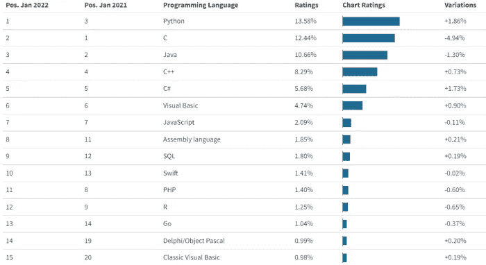
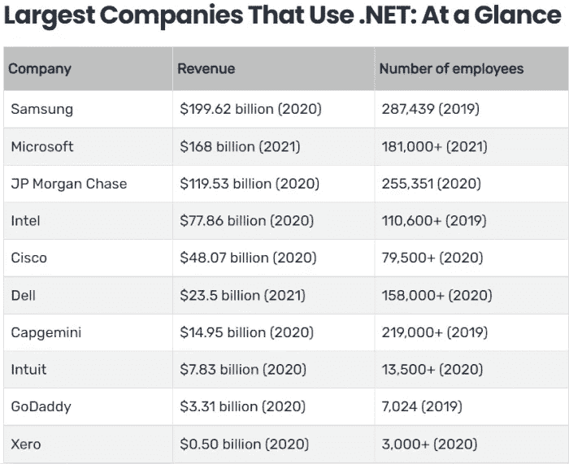

# C#外包:为什么为你的产品选择这种语言

> 原文：<https://medium.com/codex/outsourcing-in-c-why-choose-this-language-for-your-product-dc6dbaff7900?source=collection_archive---------11----------------------->

图片由 Desinika 提供

是时候了！你已经准备好开始一段激动人心的旅程，将设计最漂亮、构思最好的 UX/用户界面 web 应用程序项目放在一起，这个项目一定会赢得用户的尊重，并带来大量的金钱、声誉和好评。你找到了一个可靠的外包团队，给每个开发人员买了一件印有激励名言的品牌 t 恤。现在是时候在比赛中一展身手了！

突然，你的项目经理向你走来。他说:这是你的项目赖以生存的技术基础。但是这些花哨的名字有什么意义:只是“C”，“C plus plus”，“C sharp”，当你不知道它们是做什么的时候？

这就是为什么我们决定让你知道编程语言如何影响 C# web 开发，以及选择 C#作为你的核心有什么好处和坏处。

让我们探索一下 C# (" [C-Sharp](https://shakuro.com/c-sharp) ")编程语言是如何产生的，弄清楚它是如何与 web 应用程序和程序一起工作的，以及如果你选择在 C#上构建你的网站，C#有什么好处。

# 一点历史

IT 界的影响者和穿黑色 t 恤之间肯定有联系，你不觉得吗？总之，这是传奇安德斯·海尔斯伯格，照片通过瑟罗特

C#编程语言是由安德斯·海尔斯伯格和斯科特·威尔特索莫特领导的一群[微软](https://devblogs.microsoft.com/dotnet/welcome-to-csharp-10/)工程师在 1993-2001 年开发的，作为微软平台的应用程序开发语言。不知何故，知道它不是由两个极客在他们妈妈的地下室里发明的，立刻给它带来了希望。

丑陋但有效的解释

比尔·盖茨曾经说过。NET 是微软创造的[最好的东西。他有充分的理由这样认为。的。NET 框架为构建 web 应用程序提供了一个强大的平台。也许我们将来会就此单独写一篇文章。现在，让我们把重点放在 C-Sharp 编程语言上。](https://visualstudiomagazine.com/articles/2022/02/16/birth-of-net.aspx)

重要的是要明白。NET 框架和。网芯。他们不一样。后者是一个用于 C#的更先进的平台。

**c#是 C++还是 C 的版本？**

很多人以为这是 C 的程序语言的单独版本，其实不是。C#确实有很多类似于 C 和 C++的结构，但是你也可以在其中找到 Pascal 和 Java 的元素。这不是 C-line 的发展，而是**从零开始创造的新语言**。

**c#到底有多流行？**

C#在最流行和最好的编程语言列表中排名第五**。它吸取了 C(高性能)、C++(面向对象结构)和 Java(高安全性和垃圾收集器)编程语言的精华。在 C#中，您可以创建动态页面、XML 服务、数据库访问组件、Windows 桌面应用程序和客户端应用程序或组件。**

****

**2022 年 1 月 statisticsanddata.org 最受欢迎的编程语言**

****C Sharp 语言更新频繁吗？****

**是的。现在，全世界的с#开发者都兴奋地想看看微软创造的第 11 版 C# 11 作为一种网站编程语言能提供什么。**

****用 C#编程语言可以创建什么？****

**C#是一种适用于各种软件应用的语言。C#语言可用于构建各种针对桌面、web、移动、游戏主机、电视、物联网和云应用的软件应用。我们在网站上展示的[作品](https://shakuro.com/works)的很大一部分是用 C-Sharp 编程语言制作的。**

# **为什么要用微软 C#和。NET 进行 web 开发？**

**。NET framework 是 2021 年全球开发者使用的#1 框架，市场份额 [34.2%](https://www.statista.com/statistics/793840/worldwide-developer-survey-most-used-frameworks/) 。**

**全球近 90%的专业开发人员将 Windows 操作系统作为定制解决方案软件开发的目标。**

**。NET Core 是最受[喜爱的框架](https://visualstudiomagazine.com/articles/2021/08/03/so-survey-2021.aspx)，得分 77.2，其次是 Torch/PyTorch 和 Flutter。该平台的主要优势包括:**

****易云集成****

**当我们谈到跨平台的 web 应用程序时，我们知道它们是完全兼容的，并且可以很容易地使用与云设置集成的各种插件。这意味着单个源代码与许多不同的扩展和插件相协调，以增加应用程序的功能和可伸缩性。**

****更快的开发过程****

**跨应用程序的网站开发过程要快得多。而且是双赢。创建一个跨平台的应用程序使用一个单一的源代码用于多个平台，这有助于开发人员减少超过 50%的应用程序开发工作。这使得с#开发人员能够在很短的时间内提供丰富的业务应用程序。基本上，使用跨平台应用程序开发，应用程序开发人员可以在最短的时间内满足预期的期限。**

****可重用代码****

**众所周知，[为不同平台开发](https://shakuro.com/blog/interview-with-a-back-end-developer-what-makes-a-good-code)跨平台应用的过程中，只创建了一段代码。当开发人员想要在其他平台上提供相同的应用程序时，可以反复使用这些代码。因此，开发人员不再为每个平台和网站编写新代码，而是重用相同的代码。这为应用程序开发公司节省了大量的时间和资源，因为它消除了重复。**

****联合设计****

**当在不同的平台上使用相同的代码时，用户可以识别用户界面(UI)元素。这就是为什么用户体验(UX)在任何软件或应用程序中优先考虑的原因。此外，在构建多个应用程序时，很难保持许多 C#开发项目同步。这就是为什么开发人员和设计人员使用跨平台 web 应用程序开发工具来创建统一的用户体验。**

****降低开发成本****

**跨平台应用开发的最大好处之一就是[成本效益](https://shakuro.com/project-calculator)。这是因为他的“写一次，到处工作”的概念。通过跨平台应用程序开发，开发人员可以利用敏捷的应用程序开发，通过工具重用代码可以降低开发成本。因此，当涉及到跨多个平台和工具改进业务时，跨平台应用程序开发的概念是划算的。**

****目标受众的最大印象****

**开发人员使用跨平台 web 应用程序开发方法，因为这允许他们创建应用程序并跨平台(如 web 和移动设备)部署它们。这基本上意味着，通过建立一个单一的应用程序，你可以针对 Android 和 iOS 平台，这也有助于最大限度地扩大其覆盖范围。**

****更易于维护和部署****

**由于跨平台应用程序开发只创建一个在不同平台上运行的应用程序，因此维护和部署代码或进行必要的更改变得更加容易。此外，更新可以跨设备和平台快速同步。这节省了大量用于支持应用程序的时间和金钱。此外，如果共享代码库中有 bug，只需一次努力就可以修复。一定要让[雇佣](https://shakuro.com/wordpress)团队在你的产品上市后照顾好它。**

****

**公司评级使用。根据 careerkarma.com 的说法，Net 框架**

# **C#是一种新技术语言**

**如今，您可以使用 C#构建几乎任何软件，包括:**

*   **使用网站构建器和 web 应用程序创建的普通页面。**
*   **数据科学项目。**
*   **人工智能和机器学习项目。**
*   **云存储项目。**
*   **移动应用。**
*   **游戏。**

**从事尖端技术的公司建立网站，用于云计算、区块链、混合现实、增强和虚拟现实、语音系统、智能聊天机器人和电子学习[服务](https://shakuro.com/works)等……所有这些都有 C#和。网芯！**

**用 C#构建网站随着每次更新而发展。自 2000 年发布以来，这种语言已经走过了漫长的道路，好消息是 C#仍然是新鲜的，并且还在不断发展。每一年，每一个新版本都会增加新的功能和改进。**

******

**由费多尔·瓦柳欣撰写**