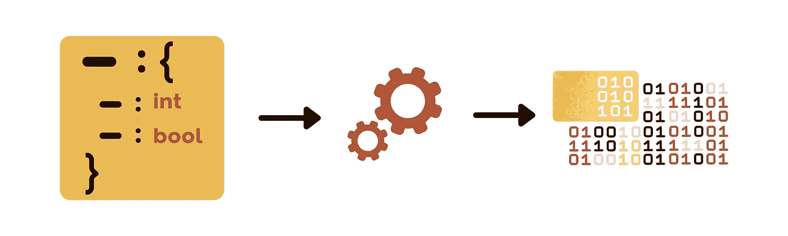
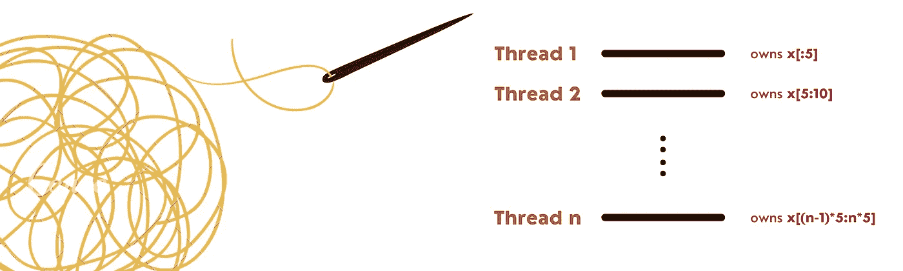

# 过度设计 Rust 中的应用程序

> 原文：<https://medium.com/codex/over-engineering-an-application-in-rust-f01d1b7980?source=collection_archive---------3----------------------->

## 以下是我学到的，以及为什么你也应该这么做。

我最近开始在工作中自动化一项任务，这项任务需要大量样板代码和手动格式化。我的解决方案是获取一个 JSON 文件，其中包含生成结果文本文件所需的参数和属性。

看起来很简单，对吧？简单的 python 脚本或笔记本可能是实现这一结果的最简单方式。但是我采取了不同的方法。相反，我创建了一个用(等一下)… rust 编写的多线程命令行工具。一种我没有经验的语言。我从这个练习中学到了什么，为什么我认为你应该尝试类似的东西？

## 🤖铁锈很漂亮，但很粗糙

我以写 Python 和 JavaScript 为生。它们以简单、高级、可移植和非常动态而闻名。在学校学习和练习 C++之后，我开始怀念静态编译语言的“严格”本质。

因此，我决定开始学习 Rust，并利用这种新语言的宣传。我选择学习 Rust 而不是 GO 或其他同类产品的一些原因是:

💨**静态编译**，因此速度极快，专为性能而设计。

🖥它是一种**低级系统编程语言**。因此，它迫使你在构建任何东西之前习惯于考虑数据结构、内存和应用程序架构。

可以用这种语言构建的✅应用范围— **从游戏和 web 服务器**到使用 **web assembly (WASM)** 引导 web 应用。

太好了，所有这些听起来都不错。只是有个问题。Rust 因其陡峭的学习曲线而臭名昭著。经过一门课程、一本书和几个小时的阅读 rust 文档，我仍然会被编译器困扰。但总的来说，Rust 是一种设计非常优雅的语言，一旦你掌握了它，它会非常直观。

## 🏃🏽测试驱动开发(TDD)

TDD 是一个让我纠结的概念。一方面，当它工作时，它允许解决方案设计的快速迭代。另一方面，当问题陈述变化太快时，它也变得非常繁琐。这意味着测试用例也会发生变化，导致工作量加倍。

在这个项目中，我采用了一种**混合方法**，看起来效果很好。对于有具体结果的功能，我首先开发测试。与此同时，对于其他更不稳定的函数来说，测试来得更晚。

在 rust 中编写单元测试的惯用方式是将它们放在与源代码相同的文件中。这非常令人耳目一新，并提升了 TDD，因为**更少的上下文切换**和**更易访问**。

## 🧵并发

现在我知道您在想什么，为什么您需要多线程来处理一个简单的 JSON 文件，并使用一些逻辑将它写入一个文本文件？但是听我说完。

来自非计算机科学背景的我，并发似乎一直是编程的巅峰。它还提供了重温和学习线程管理、消息传递、内存共享等的机会。

但在后台，我也听到程序员在喊分段错误、内存泄漏和竞争条件的微弱噪音。无论如何，我决定学习 rust 标榜的“无畏并发”。在此过程中，我在并行化应用时遇到了以下挑战:

⁉️:我应该并行化应用程序的哪一部分？主线程应该负责读写字符串对象吗？

⁉️:从 JSON 文件中读取数据后，如何分割数据？

⁉️:我如何处理去串行化的输入数据？我是使用互斥体在不同的线程之间共享它，还是分解它并将其视为不可变的？

这些问题让我重新思考这个程序是如何构建的，也凸显了数据不变性的重要性。最后，我选择的路线是让主线程进行读写。然后，读取的数据被反序列化为 struct 对象的向量，并分布在每个线程中。每个线程处理完对象后，都会返回一个字符串，然后将它们发送给主线程。一旦接收到所有数据，主线程最终聚集字符串并将其写入文件。

简单…没有？

## 为什么你应该做类似的练习？

所以你可能会再次问，为什么我要为一个相对简单的问题构思一个如此复杂的解决方案？这么说吧，通过这个练习，我获得了以下副作用:

✅对用 rust 编写惯用代码更加得心应手了。

✅阅读其他更有经验的开发人员编写的代码，同时寻找问题的解决方案。

✅尝试了多线程和消息传递。

有时候采取更艰难的方式来解决问题是有好处的😉

# 想要连接吗？

感谢您阅读我的文章。你也可以在 [LinkedIn](https://www.linkedin.com/in/mukkundsunjii/) 上找到我，在 [Github](https://github.com/mukkund1996) 上找到我的工作。