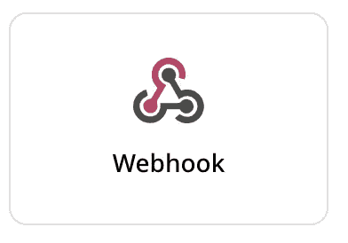
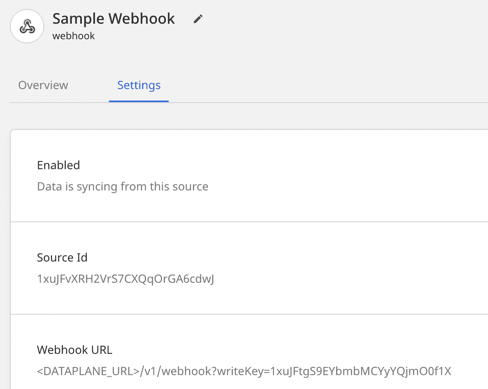
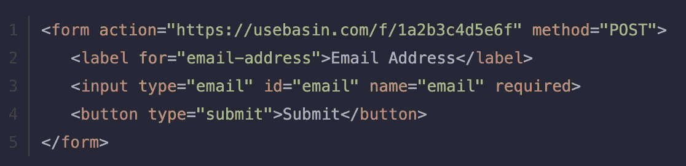
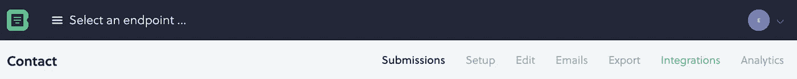
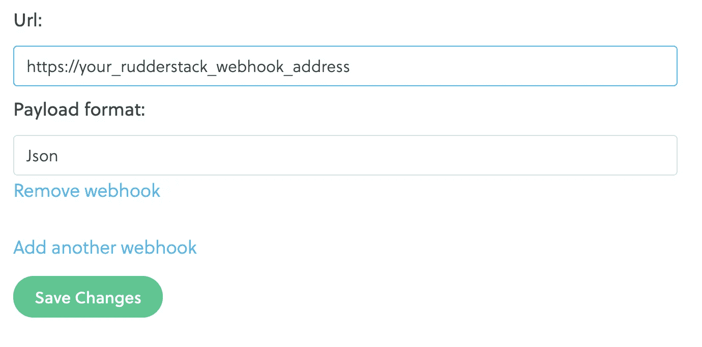
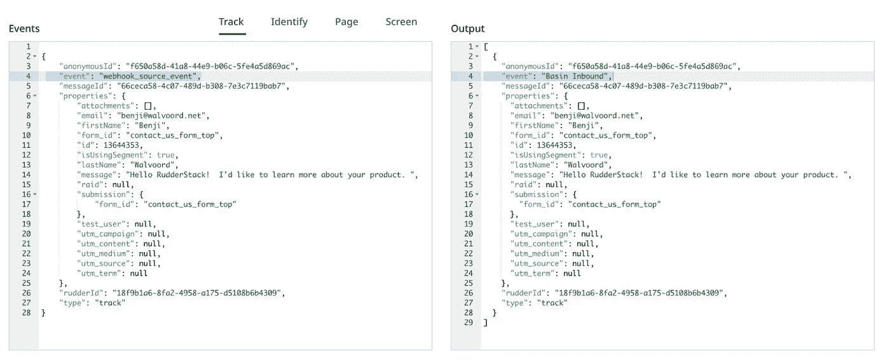

# 用 Webhooks 克服客户端表单跟踪的局限性

> 原文：<https://medium.com/codex/overcoming-the-limitations-of-client-side-form-tracking-with-webhooks-1e5081e3e032?source=collection_archive---------12----------------------->


上周，我们强调了如何使用我们的 [Webhook 源](https://docs.rudderstack.com/stream-sources/webhook-source)为 Salesforce 传输事件。在关于如何在 RudderStack 中使用 Webhook 源代码的系列文章的第 2 部分中，我们将带您了解如何将网站的表单数据提交给 RudderStack，而不会受到客户端脚本阻塞工具的影响。

# 你为什么需要这个？

您网站上的用户运行浏览器扩展或其他第三方工具来阻止客户端 JavaScript 启动的情况并不少见。在这些场景中，通过 RudderStack Track 和 Identify 调用发送的表单客户端数据可能会被阻塞(以及您正在收集的任何其他客户端数据)。对于作为静态文档部署的现代 [JAMStack](https://jamstack.org/) 网站，或者使用 Marketo 或 HubSpot 等第三方嵌入表单的网站，这尤其具有挑战性。

作为数据工程师，我们的部分工作是确保关键数据在任何情况下的交付，因此当涉及到营销网站上的销售线索表单时，问题可能会给营销和销售带来重大痛苦。

使用 RudderStack 的数据工程师利用一个简单的过程来确保即使客户端数据被阻塞，关键事件也能通过。在这个例子中，我们将使用 Basin、表单端点和 RudderStack webhooks。

当表单数据提交到 Basin 时，它使用标准的 http get 或 post 协议作为编码的 html 进行传递，因此不容易受到客户端拦截器的影响。一旦接收到，Basin 会立即将表单的全部内容以及一些额外的元数据转发给 RudderStack 中的 webhook 源。RudderStack 然后可以将这些提交路由到一些下游工具，如 Customer.io、Salesforce、Slack 和 Snowflake。

# 关键数据有冗余是好事

客户端跟踪非常有效，所以有些人可能会说，对于大多数网站访问者来说，额外的管道是不必要的。然而，对于关键数据来说，冗余是好的——对于许多公司来说，营销线索是业务的命脉。此外，工具的易于实现性和成本使得确保没有线索从缝隙中溜走变得不需要动脑筋。

下面是创建该数据流的分步指南。

# 步骤 1:创建你的 Webhook 源和目的地

查看 [RudderStack 文档](https://docs.rudderstack.com/stream-sources/webhook-source)了解细节，但这很简单，只需在 RudderStack 中创建一个新源并选择 Event Streams 下的 Webhook 选项。



命名后，您可以在“设置”选项卡上找到您的 webhook 的特定 URL:



数据面板 URL 可以在主连接页面的顶部找到。

一旦你有了你的 webhook 的 URL，记录下来，因为你需要在接下来的几个步骤中在 Basin 设置中设置它。

当连接 webhook 的下游目的地时，重要的是要考虑您将从各种来源接收什么类型的有效载荷。正如我们提到的，Webhooks 没有过滤器，你收到的数据在转发到你的目的地之前可能不是正确的格式。用户转换是一个很好的工具，可以过滤不必要的事件，并将有效负载修改为每个特定目的地的正确格式。

# 步骤 2:设置你的盆地形式

您可以按照 [Basin 文档](https://www.usebasin.com/docs/setup/getting-started)中的这些步骤来创建一个帐户并创建您的第一个端点。您的端点将生成一个 URL，您希望将它粘贴到您网站的 HTML 表单的操作命令中。您的表单将如下所示:



# 第 3 步:创建盆地网钩

创建并配置了 Basin 端点以接收提交的表单数据后，下一步是配置 Basin 将提交的表单数据转发到新的 RudderStack Webhook 源。从顶部菜单中，选择集成选项:



滚动到屏幕底部，输入步骤 1 中 RudderStack Webhook 源代码的 URL，并将其粘贴到 URL 窗口中。选择 JSON 作为有效负载格式:



单击保存更改按钮，您就可以开始接收事件了。

# 步骤 4:用户转换

既然您已经准备好开始通过我们的 Webhook 接收事件，您可能会发现创建一个用户转换来提高有效负载的质量是非常有用的。这些包括将事件类型从跟踪调用(所有 webhook 源事件都是跟踪调用)更改为识别调用和/或将事件名称重命名为其他名称，因为所有 webhook 事件都以通用的“webhook 事件”事件名称传递

## 将有效负载更改为识别呼叫

您可以调用入站事件的元数据，根据 webhook 的源 id 过滤或转换事件。

```
export async function transformEvent(event, metadata) {

        // Use the Data Governance API to get the Source ID

        if (metadata(event).sourceId == 'Your Source ID') {
            event.type = 'identify';
            let traits = {
                email: event.properties.email,
                firstName: event.properties.firstName,
                lastName: event.properties.lastName,
                description: event.properties.message
            }
            if (event.properties.company) { traits.company = event.properties.company }
            if (event.properties.jobTitle) { traits.title = event.properties.jobTitle }
            traits = Object.assign(traits, leadSources(event.properties.form_id))
            event.context = { traits: traits};
            delete event.properties;
            return event;
        }

    return;
}
```

## 更新事件。Webhook 源的名称

默认情况下，通过 webhook 源接收的所有事件都是跟踪调用，并且都具有相同的名称“WEBHOOK_SOURCE_EVENT”。如果您只有一个 webhook 源，这是没问题的，但是如果您有多个，所有的事件都将被插入到数据仓库的同一个 webhook_source_event 表中。这可能会令人困惑，尤其是如果源没有区分的有效负载。

我们可以使用与上面的 identify 调用类似的解决方案，只是基于硬编码的映射来重命名事件，但是我们决定创建一个 RudderStack 转换库来调用数据治理 API，我们可以从该 API 映射事件元数据中的源 id，以找到重命名事件的源名称。

在本例中，我们创建了一个库操作来调用数据治理 API 本身。在您开始之前，我们鼓励您查看我们的[数据治理 API 文档。](https://docs.rudderstack.com/data-governance/rudderstack-data-governance-api)

**调用数据治理 API:**

```
export async function getSourceName(encodedWorkspaceToken, sourceId) { const resp = await fetch(
      'https://api.rudderlabs.com/workspaceConfig',
      { headers: { Authorization: `Basic ${encodedWorkspaceToken}Og==` } }
  )

  const sourceDisplayName = resp.sources.find(source => source.id === sourceId).name

  return sourceDisplayName
}
```

随着库的创建，我们现在可以创建我们的转换或者将它添加到一个现有的转换中。

您将需要检索 Rudderstack 实例的工作空间令牌，该令牌可以在主连接屏幕上找到。它还需要被编码为 Base64 加密(你可以用第二个库来做这件事，但是因为在这种情况下它是静态的，你可以使用像 https://www.base64encode.net/[这样的网站来编码它。)](https://www.base64encode.net/)

```
import { getSourceName } from 'getSourceDisplayName'
import { base64 } from 'base64'export async function transformEvent(event, metadata) {
  // Enter your base64 encrypted workspace token here below
  const WORKSPACE_TOKEN = 'YOUR WORKSPACE TOKEN'

  // Get the id of the source that you want the display name of
  const SOURCE_ID = metadata(event).sourceId 

  const SOURCE_NAME = await getSourceName(base64(WORKSPACE_TOKEN), SOURCE_ID)

  event.event = SOURCE_NAME

  return event;
}
```

您可以看到，在几个步骤中，我们已经检索了上面创建的 Webhook 示例的源名称。如果您确实想将所有 webhook 事件发送到仓库中的同一个表，但是需要一种方法来区分它们，那么这也可以作为一个属性来传递。



# Webhook 解决方案的替代方案

是的，还有其他方法可以解决客户端脚本被阻塞的问题。最直接的方法是托管您自己的数据层，并从您自己的防火墙后面调用 sdk。另一种选择是通过 CloudFlare worker 来代理请求，正如 obstructive Analytics 最近的帖子[中所概述的，用 66 行代码证明 RudderStack 广告拦截器。](https://www.obsessiveanalytics.com/blog/making-rudder-stack-ad-blocker-proof-in-66-lines-of-code)

这里真正的要点是 RudderStack 专注于交付支持工程师的灵活产品。要了解 RudderStack 如何支持您的数据堆栈，请查看我们的[视频库](https://rudderstack.com/video-library/)，或[免费注册](https://app.rudderlabs.com/signup?type=freetrial)立即试驾该产品。

本帖最初发布于:
[https://rudder stack . com/blog/overrising-the-limits-of-client-side-form-tracking-with-web hooks](https://rudderstack.com/blog/overcoming-the-limitations-of-client-side-form-tracking-with-webhooks)