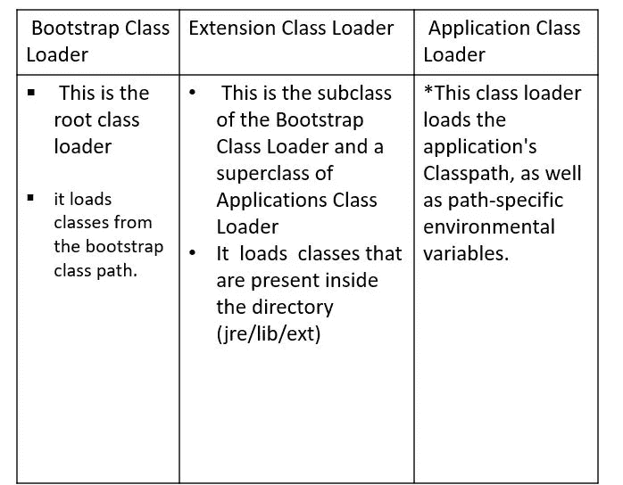
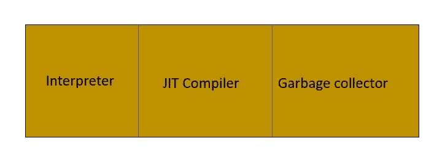

# Java 虚拟机概述

> 原文：<https://medium.com/codex/overview-of-java-virtual-machine-491358c9ba12?source=collection_archive---------9----------------------->

你知道 JVM (Java 虚拟机)吗？让我们简单了解一下 JVM。

虚拟机分为两部分。它们是基于系统的虚拟机和基于应用程序的虚拟机。基于应用的虚拟机意味着您不需要任何硬件设备。但是你可能有软件来帮助运行另一个程序的平台。基于应用的虚拟机称为基于进程的虚拟机。

JVM 是一个基于应用程序的虚拟机。JVM 是不存在的现实。JVM 是一个完整的规范，它说明应该如何做。当我们下载 JRE 时，JVM 附带了 JRE。它部署了所有可以创建 JVM 的代码。JVM 也负责字节码到机器码的转换。

每次运行 Java 应用程序时，都会创建一个 JVM 实例。它负责字节码到机器码的转换过程。如果您执行多个 Java 程序，它将为每个 Java 程序创建一个 JVM 实例。

那么，JVM 实例是什么时候创建的呢？当 JVM 实例启动时，会创建一个非守护线程。JVM 实例也可能以两种方式死亡。

1.  如果没有运行非守护进程线程
2.  2.应用程序本身调用了系统 exit()方法。

现在我们学习 JVM 的架构。它在 JVM 中有 3 个组件。他们是

1.  类装入器
2.  运行时内存/数据区
3.  执行引擎。

**JVM 架构**

现在我们可以逐一了解这三个组件。

## 1.类别载入器-

*   类加载器执行 3 个主要任务。它们是加载、链接和初始化。现在我们可以逐一识别它们。

## 装货

在加载过程之前，类加载器读取一个应该被加载的类的以下内容。完全限定名、变量信息、直接父级，检查它是类、接口还是枚举。在读取上述项目后，将类加载到内存区域。有 3 个类装入器，如下所示。

## 连接

这个过程可以分为三个主要部分。

1.  验证-

VM 可以确定执行是否安全。为此，JVM 提供了一个字节码验证器。它研究编译器、格式和结构。如果其中任何一个被破坏，字节码验证器将抛出一个验证器异常。否则，如果是通过，下一阶段就是准备。

2.准备-

在这一阶段，对于所有静态变量，将根据数据类型分配内存并赋予默认值。

3.分辨率-

JVM 用直接链接代替了符号链接

## 初始化

该过程将把实际值赋给先前在链接过程的准备步骤中被赋予默认值的变量。此外，如果存在任何静态块，它们将被执行。
JVM 要求实现在使用每个类之前执行初始化。

积极使用一个类，

1.使用新的关键字。

2.调用静态方法。

3.为静态字段赋值。

4.如果一个类是初始类(使用 main()方法的类)。

5.使用反射 API

6.从当前类初始化子类。

有四种方法可以初始化一个类:使用 new 关键字——这将引导类完成初始化过程；
利用 clone()函数——从父对象(源对象)收集信息。
这将使用反射 API (getInstance())完成初始化过程；).
利用木卫一。ObjectInputStream()；—这会将所有非瞬态变量的初始值设置为 InputStream 的值。

## 2.运行时内存/数据区-

该存储区分为 5 类。它们是方法区、堆、Java 堆栈、Pc 寄存器和负方法堆栈。当我们加载类时，

*   方法区存储了所有的类信息(像类型信息)。
*   所有的对象都来到堆区。
*   堆栈区域存储所有局部变量、方法调用和程序的部分结果(非本机方法)。将为每个线程创建一个运行时堆栈。“堆栈框架”是一个堆栈区域块，用于保存方法调用的局部变量。因此，在方法调用完成后，框架被移除(POP)。因为这是一个堆栈，所以结构是后进先出的。
*   pc 寄存器保存下一次执行的信息。
*   当本地方法访问这个区域时，它保存本地信息/方法。

每个虚拟机都执行方法区域和堆。但是另外 3 个执行每个线程。

## 3.执行引擎

JVM 的执行引擎是其最重要的组件。这将 Java 字节码转换成机器码，然后可以在内存中加载和执行。

执行引擎由三部分组成。

1-口译员-

解释器读取字节码指令并顺序执行它们。
2- JIT 编译器-

执行引擎使用解释器来逐行执行字节码，JIT 编译器在发现重复代码时使用。然后，JIT 编译器将所有字节码编译成本机代码。

3-垃圾收集器-

这将检查堆区域中任何未被引用的对象，并销毁它们以释放内存。因此，它为更多的项目腾出了空间。

## 参考

[1]K .迪内什，*Youtube.com*，2022 年。【在线】。可用:[https://www.youtube.com/watch?v=GzFdNzLB7iI.](https://www.youtube.com/watch?v=GzFdNzLB7iI.)【访问时间:2022 年 6 月 10 日】。