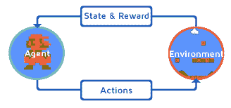
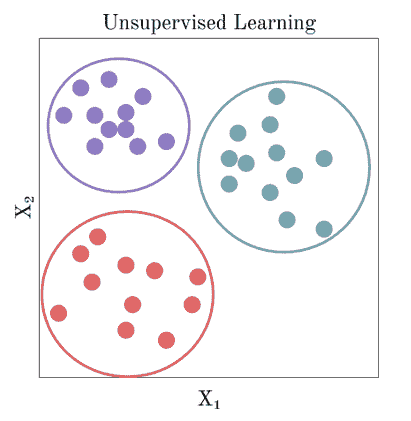
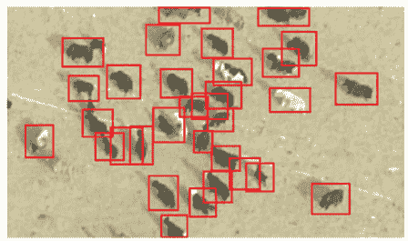
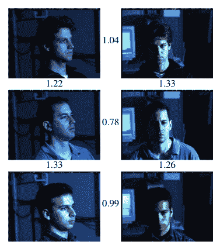

# 浅谈机器学习

> 原文：<https://medium.com/codex/overview-of-machine-learning-fe16f6fb017c?source=collection_archive---------9----------------------->

日本东京的胡椒机器人。

大多数人认为机器学习是机器人将主宰世界，计算机在棋盘游戏中赢了人，[机器人管家](https://www.businessinsider.com/samsung-bot-handy-robot-butler-pours-wine-does-laundry-2021-1)。然而，机器学习可以比这更简单，也可以用于数千种不同的任务。就我个人而言，我对机器学习的第一次体验是在 2019 年我在一家创业公司实习期间，我制作了一个可以仅使用 RGB 图像自动计数昆虫的系统。

我不知道你第一次听说机器学习是什么时候，但可能没有超过十年，然而，机器学习不是一个年轻的方法。首先，机器学习不是魔术，这背后有数学，当然，如果我们不建立一个定义良好的数学模型，我们的计算机就无法学习。

机器学习有着悠久的历史，当我们查看它的时间轴时，我们可以看到著名的[贝叶斯定理](https://plato.stanford.edu/entries/bayes-theorem/)可以追溯到 1763 年。玩西洋双陆棋的电脑和 IBM 深蓝赢得国际象棋世界冠军卡斯帕罗夫分别始于 1992 年和 1997 年。

机器人用物理棋盘与人类下棋。

计算能力和可用数据已经增加，并且开发了许多应用程序，例如，语音识别、面部识别、推荐系统、无人驾驶汽车。在接下来的章节中，我们将看到机器学习的定义，以及当我们使用人工智能构建解决方案时，它的类型和面临的挑战。

# **什么是机器学习？**

你可以找到很多关于机器学习的定义，但其中有一个是我最喜欢的:

“如果一个计算机程序在 *T* 任务中的性能(由 *P* 测量)随着经验 *E* 而提高，则称该计算机程序从关于某类任务 *T* 和性能测量 *P* 的经验 *E* 中学习。”

汤姆·米切尔

想象一个执行任务的机器人，你可以评价它的表现。如果这个机器人能够随着经验的积累取得更好的表现，我们可以说这就是机器学习。这个案例可以讨论强化学习，认为机器人是一个需要在给定环境中执行一些任务的代理，每个动作都会产生一个奖励，我们将使用这个奖励来更新代理的策略，以便它可以随着时间的推移获得尽可能大的奖励。

强化学习可以用于很多应用，包括让计算机玩视频游戏，像超级马里奥兄弟。有时我们比机器更好，但在其他情况下，我们可以被超越。如果你对这样的话题感兴趣我推荐这篇论文 [*通过深度强化学习的人级控制*](https://www.nature.com/articles/nature14236) 。

图示强化学习过程的图像。来源:自由代码营。

如果我们希望建立一个系统来检测电子邮件垃圾邮件呢？如果我们只是决定创建许多条件语句，如 If 和 else，也许我们将需要数百或数千个简单的条件，可能基于电子邮件标题或内容中的字符/字符串。除了这个问题，我们如何更新我们的系统？每一个新的垃圾邮件都会导致更多的条件语句，所以这不是一个好主意，你同意吗？手动更新很无聊，随着时间的推移，趋势是有越来越多的语句。

一种解决方案是使用自动更新的系统，因此机器学习可以成为一种选择！首先，我们需要给我们的电子邮件贴标签，这将花费很多时间，但这是必要的，因为我们将使用监督学习。在每封电子邮件收到分类后，我们就有了数据(经验)，我们能够选择一种机器学习算法来解决这个问题。这样，如果我们有新的垃圾邮件，我们可以添加到数据和更新我们的算法。现在我们的电子邮件可以自动检查垃圾邮件。

一旦建立的机器学习模型可以显示我们无法感知的相关性和特征，机器学习也可以用来帮助人们理解数据。每当我们需要处理复杂的问题时，如果我们有足够的数据量，并且机器学习算法能够取得良好的性能，我们总是会选择人工智能解决方案。

# 机器学习的类型

在这一部分，我们将讨论机器学习的类型。根据问题的不同，我们会有不同类型的机器学习。这里我们看到了监督学习、非监督学习和强化学习。

## 无监督学习

这种学习包括在给定的数据集中创建聚类。假设你有 N 个样本，有 K 个特征(如果我们在谈论人的结构，这些特征可能是身高和体重)。一旦我们收集了数据，就可以用价值特征来代表每个样本。想象一下，我们有消费者，每个人都有很多特征，比如他们买什么，他们付多少钱，他们去商店多少次。如果我们可以找到具有相似特征的消费者群体，并尝试将新消费者与这些群体中的一个对应起来，那么我们将会很有趣，这样我们就可以制定一种特定的方法，使报价更有趣。

上面您可以看到三个聚类，其中每个聚类在聚类内部的样本中必须具有高度的同质性，在任何其他聚类之间必须具有高度的异质性。幸运的是，每个样本只有两个特征 X1 和 X2，但是如果我们有三个以上的特征，我们就不能绘制一个图表来说明这些聚类。K-means 是一种著名的简单的无监督学习算法。K-表示我们的聚类基于原型，其中样本属于最近的聚类原型。

## 监督学习

这是最常见的机器学习类型。我第一次接触机器学习是使用有监督的方法。那样的话，我们需要给每个样品贴上标签。机器需要使用标记的数据进行学习，每个新的输入都将收到基于这种监督方法的预测。在 2019 年和 2020 年，我使用这种类型的机器学习工作。在 2019 年，我可以开发自己的昆虫计数系统，其中我使用图像处理技术来找到图像中的昆虫，并从它们的轮廓中提取特征，我创建了一个具有轮廓特征和各自标签的表格，在我们的情况下:昆虫的数量。之后我应用随机森林对昆虫数量进行分类。该系统非常简单，可以在 Raspberry Pi Zero 中运行。不幸的是，我不能与我创建的轮廓或表格共享图像，但您可以从下面的图像中获得一些想法。

来源:“使用完全卷积网络在航空图像中检测牲畜”。

2020 年，我开始研究人脸识别。我第一次接触这个问题是在 2019 年，在我大学的一个课题的最后一个项目中。在这里我们可以找到一些我在计算机视觉领域做的有趣的项目。最初，我使用 python 中的 face_recognition 库。然而，我需要一些更强大的方法在野外做到这一点，所以我只是从谷歌转移到 FaceNet([FaceNet:人脸识别和聚类的统一嵌入](https://arxiv.org/pdf/1503.03832.pdf))。基本上，我们从一张人脸图像中提取 128 个特征并对它们进行分类，想象我们有成千上万的人脸，也就是特征向量，如果我们希望识别你，我们只需对这些向量取欧氏距离，并将其分类为最近的向量。通常，我们对同一个人有不止一个向量，所以使用 KNN 并取这 k 个最近邻居中最频繁的人是个好主意。

该图展示了 Google 开发的人脸识别过程中的光照和姿态不变性。

## 强化学习

这种学习方式真的很有趣，与之前提到的其他学习方式不同。现在你需要在一个给定的环境中有一个代理人，每个行为都会得到奖励，所以好的行为会得到积极的奖励，坏的行为会受到惩罚或消极的奖励。我第一次接触强化学习是在今年 5 月。我开始阅读一本名为《强化学习:萨顿和巴尔托的导论》的书。在本书中，我们将学习强化学习的基本原理和基本技术。强化学习越来越重要，每年我们都有越来越多的技术。一些方法如 PPO，DDPG，A2C 取得了惊人的效果。一个有趣的应用是设计游戏关卡，我推荐这篇精彩的论文:[PCGRL——通过强化学习的程序化内容生成](https://arxiv.org/pdf/2001.09212.pdf)。

左图是初始级别，右图显示代理使用强化学习生成的级别。

# **应用机器学习的挑战**

当我们需要处理机器学习时，我们有两个主要问题:数据问题和算法拟合问题。关于数据问题，我们有低数量的数据，非代表性的数据，收集的数据不好，离群值，共线性。如果你有坏的数据，你将有一个坏的机器学习模型，因为“垃圾进来，垃圾出去”。因此，花费大量时间处理数据，试图理解和获取价值是很常见的。这个过程被称为探索性数据分析，也许这是你的管道中最重要的部分。

关于算法问题，我们有过拟合和欠拟合。当您的系统在训练数据方面相当不错，但泛化能力很差时，就会出现过度拟合。降低模型复杂性是解决这个问题的一种方法，代表性数据也很有帮助。欠拟合是一种即使在训练数据中也表现不佳的模型，增加复杂度或选择更合适的算法可以解决这个问题。

# **测试和评估**

当你建立一个机器学习模型时，有 3 个数据集是很重要的:训练、验证和测试。训练数据用于拟合您的模型，验证将有助于微调您可以使用网格搜索或随机搜索等方法的位置。测试数据是您检查模型对训练数据集中的数据的概括程度的地方。测试数据必须仅用于最终管道，如果您使用测试数据来调整超参数，您将面临数据泄漏等问题。非常推荐这本书:[机器学习向往](https://itbook.store/books/1001590486081)。吴恩达谈到了重要的话题，这份材料让我敞开了心扉，真正是训练、验证和测试数据。我还想说，如果你有一个小数据集，可能你会使用交叉验证方法，如 K-fold。在训练和验证中分割数据只是处理验证的一种方式，你可以探索更多。

# 额外部分

如果你想了解更多关于机器学习的知识，我强烈推荐来自 [Kaggle](https://www.kaggle.com/learn) 的迷你课程。在那里你会发现很多材料，你能够比你想象的更快地理解重要的话题！