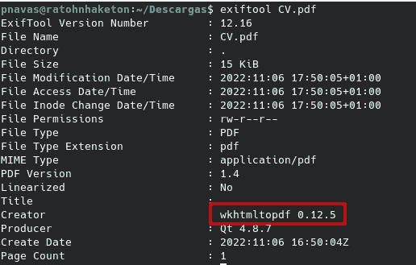

# P4 CTF: Cvg3n3rat0r

> 原文：<https://medium.com/codex/p4-ctf-cvg3n3rat0r-b687558978f3?source=collection_archive---------17----------------------->


这是我为 p4 CTF 的 Cvg3n3rat0r 网络开发挑战撰写的文章。在这个挑战中，我们需要检查一个 CV 生成器应用程序，寻找允许我们读取/flag.txt 文件的漏洞。


首先，我们访问他们给我们的 URL，我们看到唯一的功能是 HTML 到 PDF 的解析器。这种类型的系统通常在文件包含的管理方面存在问题。第一步是发现哪个库负责解析我们的输入。有了这些信息，我们应该能够知道语法以及库是否有一些已知的漏洞。


我们可以尝试用两种方法找出版本:通过引起错误(格式错误或未关闭的标签，大的或空的文件，等等。)或者通过查看它是否在元数据中留下任何允许我们识别库的信息。我们将生成一个 PDF 文件，并使用 ExifTool 实用程序来检查元数据泄漏。

```
exiftool CV.pdf
```

从 ExifTool 的输出中，我们可以看到一个 Creator 属性，它告诉我们它正在使用 0.12.5 版本中的 wkhtmltopdf。



在 Google 上快速搜索我们现有的库版本，会返回几篇文章，解释如何通过滥用该功能来获得文件包含。


回顾这些帖子，我们看到了下面的有效负载，它允许我们读取/etc/passwd 文件。


如果我们尝试在我们找到的解析器中使用它，我们将获得一个 PDF 文件，其中包含执行应用程序的系统的/etc/passwd 文件的内容。文件包含已实现，但我们仍需读取标志。


文件包含已实现，但我们仍需读取标志。我们只需要稍微修改一下有效载荷，就可以读取“flag.txt”文件了。

```
<script>
    x=new XMLHttpRequest;
    x.onload=function(){  
    document.write(this.responseText)
};
    x.open("GET","file:///flag.txt");
    x.send();
</script>
```

现在，如果我们提交新的有效载荷，我们可以下载 pdf 文件来读取旗帜。


**GG！**

我希望你喜欢我的文章，并发现我的内容有用。下一篇文章再见。