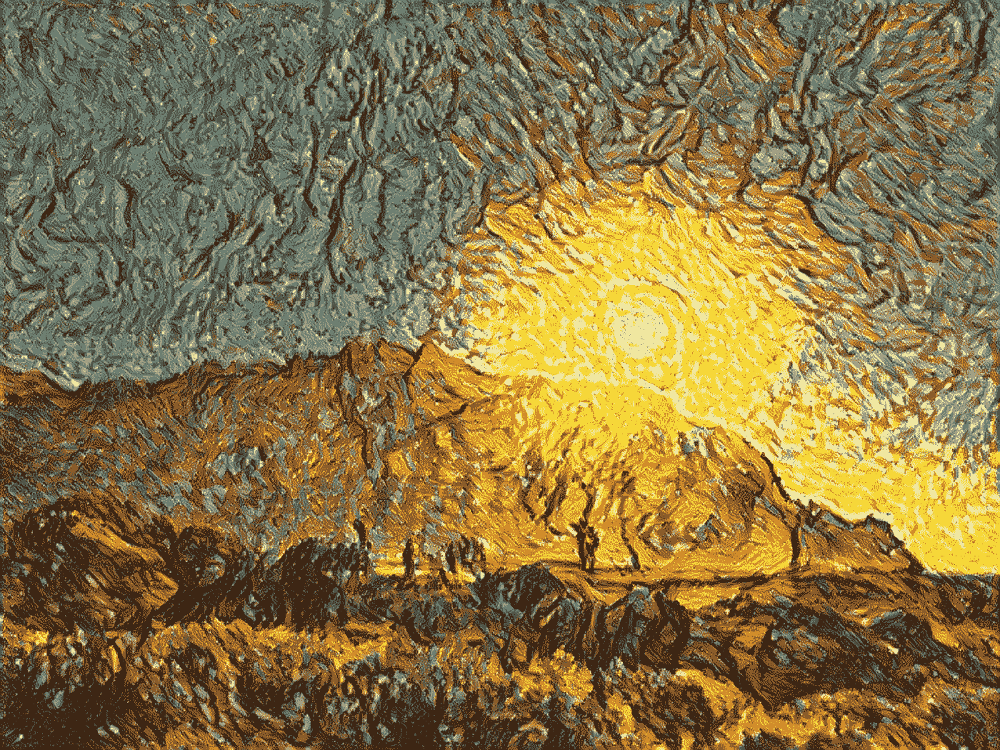
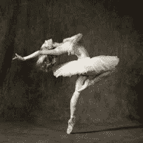
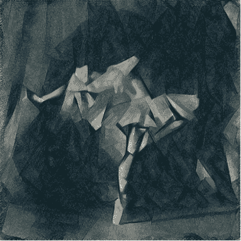
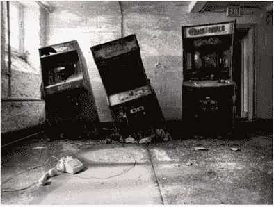
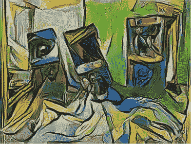
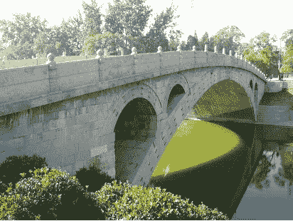
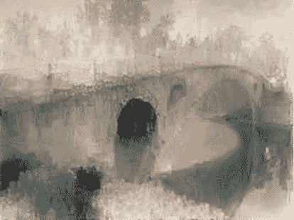
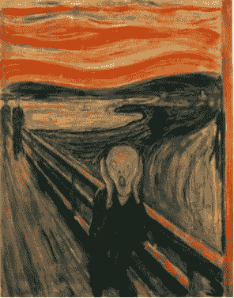
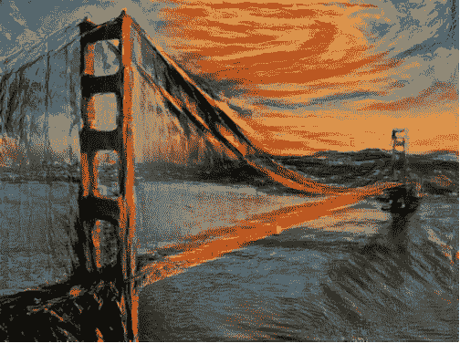

# 用人工智能技术用电脑绘画

> 原文：<https://medium.com/codex/painting-with-computers-using-ai-techniques-31f219e6f5be?source=collection_archive---------16----------------------->

梵高之后的特内里费北岸

我喜欢画画。我最喜欢的材料是丙烯酸树脂。我喜欢你在画布上移动颜料直到奇迹发生的方式。稍后会详细介绍。

我喜欢编程。十五年来，我沉迷于电脑游戏，我们为 PC 制作了许多那个黄金时代的获奖飞行模拟人生。

将绘画和编程结合在一起对我来说是一件很自然的事情，我一直在使用一种叫做神经风格转移(NST)的技术。

使用 NST，您可以拍摄一幅图像，通常是一张照片，并对其施加一种新的风格，通常是一位著名艺术家的风格。它是由 [Gatys 和其他人](https://en.wikipedia.org/wiki/Neural_style_transfer)在 2017 年左右出名的，并且有许多改进，主要是围绕更快地完成工作。

在本文中，我提供了一些 NST 运行的例子。顶部的图像是特内里费岛北海岸的日落，具有梵高的风格。其他图像是小样本，需要一台强大的 12GB 图形处理机器几分钟才能生成。但是更大的图片，比如 600 平方毫米，需要几个小时才能完成，这还是我去年在大西洋彼岸的亚马逊上租到的最大的机器！

毕加索风格的芭蕾舞演员

# 是艺术吗？艺术家是谁？

简单地说，我认为这是艺术，我就是艺术家。不是电脑。有一天，电脑会成为艺术家，但不是现在。它们是艺术家的工具，就像画笔和刀子一样。

现在，让电脑看起来像艺术家是可能的，但这是假的。他们只是在假装。你可能不同意，这没关系。这取决于你对艺术的理解。如果你同意我的观点，我想你会同意计算机还不是艺术家。

对我来说，一件艺术品是创作过程的结果，人们欣赏它的情感冲击，也许还有它的美*。所以，自然美不是艺术，因为它不是创造过程的结果。好吧，反正我不这么认为。如果一台计算机可以启动一个创造性的过程来传递一件美丽或有情感冲击的东西，那么它就可以被称为艺术家。*

这将会发生。毕竟，正如布赖恩·格林在 2021 年的播客中所说，“计算机是像我们一样的粒子的集合”。我不太确定粒子部分，但我理解他的观点。

然而，至关重要的是，计算机目前还不能启动一个创造性的过程。他们没有内在自我或自知之明。那里没有任何东西可以让事情进行下去。程序员可以在一定程度上模拟它，但程序员不能赋予计算机生命！

这将会发生。当它这样做时，计算机可能不会产生人类因其美感和情感影响而珍视的艺术。真的，它应该创造出能感动它和它的电脑伙伴的艺术。其他任何事情都会奴役它，不是吗？所以实际上，当艺术被定义为人类觉得美丽或产生情感反应的东西时，计算机可能永远不会产生艺术。电脑艺术是给电脑的。这是非常奇特的，也许是深刻的。但是为什么一台有创造力的电脑不应该像我们一样带着情感包袱呢？

三个废弃的街机模仿毕加索

# NST:绘画过程

目前，电脑可以成为艺术家探索创造力的工具。

有了颜料、画笔、刀子和画布，我有了自己想要制作的东西的想法，并在画布上探索它。它并不总是有效，但你知道它什么时候有效。艺术家开始知道什么适合他们，结果他们发展出一种风格。

我期望有经验的艺术家*探索*比我少。但我认为每个人都是从这个试错过程开始的。在计算机世界里，我们称之为一个迭代和互动的过程:你通过在计算机上进行尝试来开发一个问题的解决方案，计算机给你即时的反馈。

这种迭代和交互的方法是使用计算机的最有效和最令人满意的方法。人类做自己擅长的事情，计算机做自己擅长的事情。

人类提供数据而计算机做所有工作的选择可能是危险的，肯定是不令人满意的，并且对使用该过程的人没有提供学习或发展。

我们知道，使用机器学习会给社会带来巨大的好处，例如在医疗诊断领域。但是这些系统容易受到丑陋偏见的影响。让我们找到让人类参与进来的方法。设计互动的系统，而不是让人类变得多余。

NST 使用深度学习技术，尽管它不是机器学习的真正例子，但它是迭代和交互过程的一个很好的例子。

从一张图片开始，比如说一张照片，在那里你可以从美丽或情感冲击的角度看到某种强大事物的本质。一些可以交流，联系，分享感觉，或者讲故事的东西。给电脑输入不同的风格，包括你自己的风格，试图放大你看到的本质。然后调整许多变量去制作图片，再试一次。整个循环可能只需要几分钟。

艺术是人类的情感反应。这就是我先前说的“奇迹发生了”的意思。当我画画的时候，我有一个关于我想要创作什么的想法，但是很难用语言表达出来。所以我移动我的颜料，直到这个想法出现。NST 也是如此。

特纳之后的中国古桥

# NST:计算机过程

在过去的几年里，被称为机器学习的人工智能分支取得了巨大的进步。大部分的发展都是在所谓的深度学习上。

计算机中的深度学习结构是多层人工神经网络。人工神经网络试图通过模仿人脑的工作方式来识别潜在的关系。

深度学习利用了通用逼近定理，该定理指出，给定任何连续函数，无论它有多复杂，总是有可能找到一个人工神经网络(ANN)，可以将该函数逼近到你想要的水平。这里有一个很棒的解释[。](https://www.youtube.com/watch?v=Ijqkc7OLenI)

这意味着，或多或少，总有一组包含大量变量的方程适合您的数据。但是你必须找到这些变量的值。计算机通过猜测，看看猜测有多好，修改猜测并再次尝试来实现这一点。这个过程被称为训练，可能涉及数千次迭代。它并不总是有效，但是只要有一点经验，就有可能把事情安排好，使计算机收敛到一个有用的解决方案。例如，有了一组猫和狗的照片，你可以训练一个网络来告诉你以前看不见的照片是猫还是狗。事实上，这年头，CNN 太好了，它能告诉你它是什么狗或猫。

因此，要解决一个问题，你需要大量的数据。该过程包括将您的数据分成三部分。使用第一部分来训练网络以找到基本关系。使用第二部分数据来查看人工神经网络对潜在关系的学习程度。调整人工神经网络并重复。当你认为你有一个好的模型时，使用第三组数据来测试这个模型。使用测试数据可以确保您的解决方案是通用的，而不是特定于培训数据的。这整个过程被称为机器学习，在这个过程中，你用你的数据训练网络。

使用 NST，我们不会做这些事情。但我确实使用了一种称为卷积神经网络(CNN)的人工神经网络，但我不训练网络。我使用的 CNN 已经预先训练了成千上万的图片。这个网络很深，在许多层面上拥有图像的表现。它能够识别构成图像的形状、线条和颜色，网络不同层次的数据给我们不同的信息。

正如我所说，用 NST 的基本版本，我不训练 CNN。相反，我使用训练有素的 CNN 来优化最终图像。从一组随机的像素开始，通过迭代地越来越接近最优解来获得最终图像。这有点模糊，但是想象一下，在我们的最终图像中，每个像素都是最接近初始照片和风格图像的。

这个过程中还有一个技巧。Gatys 发现，使用 Gram 矩阵而不是像素来优化样式会产生很好的效果。为什么？这很复杂，我还没有看到一个好的解释。然而，当我制作一些 Gram 矩阵的例子时，我看到了它们是如何善于概括一个图像，从而概括一种风格的。

如果您想了解这个过程的更多细节，可以阅读大量的中型文章，Github 上也有示例代码。

这里的要点是，我使用基本的像素优化过程，而不是 CNN 实际训练的更快的过程。我使用这种基本的方法，因为它给了我更多的控制，这样我就可以创作出我想要的艺术，而不是电脑限制我的东西。但是有一个缺点，那就是计算机内存和速度。

假设我们想要以 300 dpi 的杂志质量产生 20 平方英寸的图像。我们需要处理 3600 万像素。有三个颜色通道(红色、绿色和蓝色)，因此大约有 1 亿个数据点。我们必须对数据使用浮点运算，这样就有近 10 亿字节或 10 亿字节(GB)来存储图片。对于这些像素中的每一个，神经网络将具有许多层信息，比如说 30 层。我们达到了 30GB，然后我们有了中间数据。为了优化，也就是做下一个猜测，我们测量梯度就像高中数学一样。每个点都有许多相关的梯度，所以你可以看到内存是如何被吃掉的。在大西洋的这一边，我能从亚马逊租到的最大的电脑是 96GB，我有一个问题。

我确实尝试过用更少的字节存储我使用的数字(降低数字的精度)，但那不起作用。

我打算尝试超精密技术，让电脑拍摄一张图像，并通过猜测额外的像素来放大图像。是的，它为此使用了机器学习。

所有这些都阻碍了我想做的事情。我之前说过，NST 的人倾向于使用著名艺术家的风格。我想尝试混合风格，尝试不同的画笔工作，并使用一些发明的风格来捕捉和分享我在源图像中看到的。移动颜料，看看魔法出现了。

尖叫风格的金门大桥