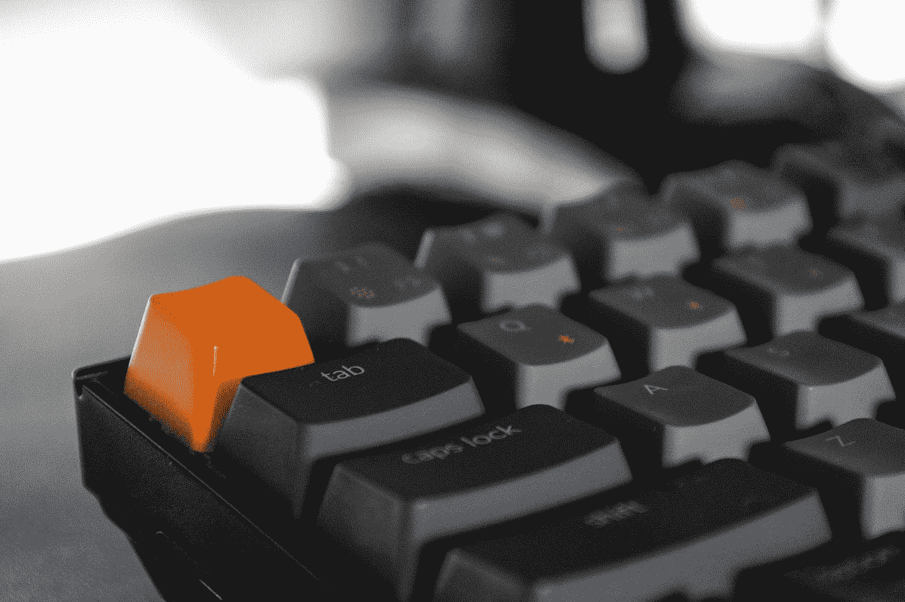

# 将 Keychron k2v2 键盘与 M1 Macbook Air 配对

> 原文：<https://medium.com/codex/pairing-the-keychron-k2v2-keyboard-with-the-m1-macbook-air-27dbc9243e0?source=collection_archive---------3----------------------->

## 初步印象和第一天的回顾

埃迪·皮波卡斯在 [Unsplash](https://unsplash.com?utm_source=medium&utm_medium=referral) 上的照片

我最近写了我将如何[升级我的工作空间](/codex/the-best-keyboard-for-writers-efd83accf11)。升级的一部分是新键盘；也就是[键时 K2V2](https://amzn.to/3nn5KFp) 机械键盘。(**不是**热插拔版本。回过头来看，这是我的疏忽。)这个键盘昨天到的。我已经拆箱配对了…